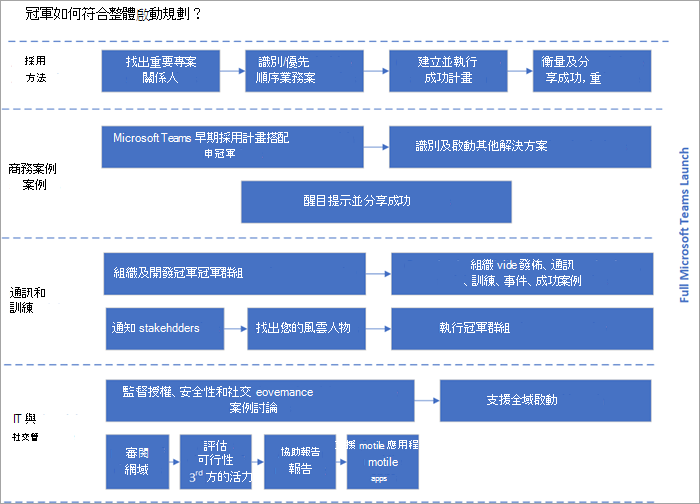

# 建立您的冠軍計畫Microsoft Teams

宣傳員對於提升貴組織認知度、採用度與教育程度至關重要。 "冠軍"是一位主要以協助他人為動力的人，對新技術有興趣的人 (特別Teams) 協助其他員工配合您的最佳做法使用。 根據貴組織的規模，您可能將這個角色做為該人員角色的正式部分，但員工通常會因為協助他人的核心動力而自行承擔此角色。

冠軍會以多種方式配合您的整體啟動規劃，如下所示。

冠軍應：

- 接受正式訓練，以提升其知識深度和深度
- 受到鼓勵並有權引導、教導及訓練其同儕
- 保持一致且正面的強化，確認其努力的影響
- 有明確的執行計畫

使用我們的 [冠軍計劃指南](https://aka.ms/M365Champions) 在貴組織中建立此計畫。 我們針對這個社群的最佳作法是：

- 加入 [冠軍計畫](https://aka.ms/O365Champions)。 請確定至少，"冠軍計畫"的 (以及可能所有的公司) 都是計畫的成員。 這項免費的每月社群通話會提供寶貴的資訊，以執行您自己的計畫，並Teams其他Microsoft 365或Office 365服務。 程式資料可以在您自己的內部程式中重複使用。

- 使用團隊團隊：您的支援者應該使用您為團隊設定的團隊進行所有計劃通訊、意見回饋，以及尋找資源。  在這麼做時，他們將會逐漸熟悉產品及其優點。

- 定期召開每月會議：定期召開每月會議，促進您社群的熱忱與團結。 這些可以是個人會議和虛擬會議的組合，但一致性是擁有一個欣欣向榮的領軍者社群的關鍵。

    > [!TIP]
    > 若要協助建立議程，請排定公用社群通話後一周的會議。 

- 清楚瞭解計畫需求：某些支援計畫的專案會要求成員參加每月會議、為支援的使用者群組保留工作時間，並為新使用者提供訓練。 無論您的需求如何，請確定支援者清楚瞭解如何成功參與計畫。

- 明顯獎勵您的冠軍：您的冠軍會提供您專案進度和潛在誤區的重要深入見解。 經常獎勵他們參與。 小手勢會大有説明，而且員工通常不會尋求金錢收益，而是感謝對貢獻的肯定。 尋找適合且有趣的方式來感謝您的社群。 

- 及早且經常訓練冠軍：您的計畫會啟動，而每月的會議可用來在支援者社群中建立技能。 使用這些機會讓他們上臺、進行初始訓練、鼓勵他們參加我們的課程，並確保他們準備好在試驗階段中為員工提供支援。  

 下一 [步：完成管理快速入門](teams-adoption-governance-quick-start.md)

