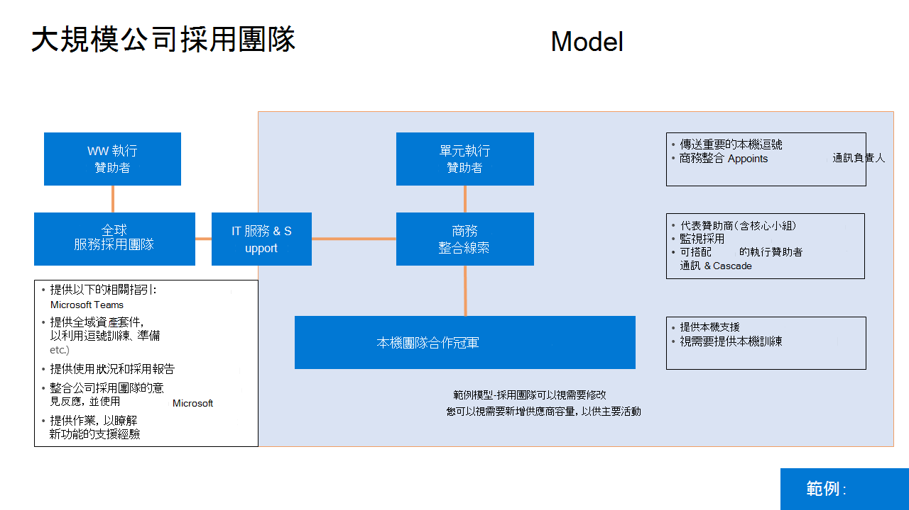

# 為採用方案定義結果Microsoft Teams成功

針對您現代化的每一個商務案例或服務，定義業務的成功外觀至關重要。 當您在前一個階段對應初始案例時，您就會收集這些資訊。 當您準備規模執行時，您必須重新檢查並展開這些重要的成功準則。
  
以下是針對這些準則進行比對的建議策略。 此步驟有許多有效的方法。 您可以遵循我們的指南，或遵循您可能正在合作之 Microsoft 合作夥伴的指南。 無論您選擇哪種方法，請確認服務的技術實現和貴組織的整體目標都支援您的業務成果。
  
有四種類別的結果可以優先處理業務。 它們相互關聯，並形成個別員工將體驗的現代化和數位轉換基礎。  

每個類別的結果範例為：

- **組織**
   - 文化轉換
   - 員工保留
   - 人才取得
   - 社交互動
   - 操作敏捷 

- **文化**
   - 員工情緒
   - 員工建議
   - 客戶意見
   - 創新措施 (例如，想法論壇貢獻、hackathons、產品創新) 

- **有形**
   - 客戶經驗會影響 (服務速度、減少服務事件、客戶推薦/會員計畫參與) 
   - 成本節省
   - 營收產生
   - 資料安全性
   - 程式簡化
   - 舊版系統的停用
   
- **個人**
   - 使用想要的工具
   - 員工士氣
   - 員工生產力
   - 員工互動
   - 構想產生
 
一般而言，您應該想一想這些匯總的度量單位，以這種方式為貴公司建立變更商：

## 選取服務啟用策略

Teams變革性技術，因此視貴組織的規模和現有技術不同，您可能會採取不同的方法。 請考慮以下策略：

| Teams第一個 | Teams核心 | Teams大 | Skype並排 | 移轉 |
|------------ | ---------- | ------------ | ------------------ | --------- |
| 在雲端部署中Teams | 在潛在客戶中啟用共同Teams | 所有員工Teams全組織團隊 | 啟用Teams商務用 Skype | 將使用者從 商務用 Skype 遷移到 Teams |
| - 適用于新的或低使用量Microsoft 365或Office 365客戶  - 在客戶特定Teams潛在客戶  - 強調整合使用者體驗，以及加速Microsoft 365或Office 365  - 一起進行規劃工作量啟用，以避免連續執行 | - 啟用Teams線上OneDrive SharePoint功能  - 建立公司內部網路，以與 Microsoft Stream 共用新聞資源和視訊 **共同改善**：  Teams SharePoint Yammer Planner PowerApps |- 對於少於 5000 個座位的客戶 (限制)  - 與一個團隊進行跨組織共同合作 - 自動化一般 (休假要求、員工問卷、主管參與)  |- 使用Teams核心策略來加速共同合作 - 根據所需的大小和功能集來強調會議案例指引 - 使用商務用 Skype通話、互通性和混合式案例 - 使用公用藍圖進行功能規劃。 |- 為客戶建立Teams策略商務用 Skype規劃從目標移轉 - 附加至功能發行排程 - 建議包含並排和Teams核心來輕鬆轉換

以下是我們針對大多數客戶組織的建議。 不過，也有例外。 若要取得此處未涵蓋之任何案例的指引，請在我們的推動採用社群中提出問題，或FastTrack小組或 Microsoft 合作夥伴網路。

- **選擇 Teams First 或 Teams核心**：大部分組織都有 Microsoft 技術的現有投資。 您可能一次啟用多個工作負載，例如Exchange Online、商務用 OneDrive或SharePoint。 在這些情況下，選取 Teams或 Teams核心是明智的選擇。 它可讓使用者習慣增強的Teams。 您的共同合作專案小組可以規劃推出其他功能，以及成功所需的訓練和支援。 

- 選擇 **Teams** 大：在新的 Microsoft 365 或 Office 365 客戶組織中，通常最好採用 Teams Go Big 方法，將多次學習新技術所造成的變更疲勞降到最低。 您可以針對核心共同合作和會議、SharePoint、OneDrive、Planner 和其他工作負載啟用 Teams，並允許員工在 Teams 部署中瞭解這些工作負載，以取得最大的效益。 

    Teams Go Big 也是 1，000 名員工以下組織想要簡化員工溝通與互動的首選啟用策略。 使用全組織小組可以將人員彙集在一起，以在任何裝置上查看一般工作與計畫。 

- **選擇並** 排：針對使用 商務用 Skype 進行音訊會議、支援會議室裝置或雲端語音功能的組織，我們建議您並排執行 Teams 和 Skype，讓員工熟悉核心共同合作功能，同時規劃從 商務用 Skype 移商務用 Skype 方便您公司使用的時間。 請注意，並排執行這兩個用戶端可能會讓使用者對要使用哪一個工具產生混淆，因此我們建議您在採用期間保持此階段的時間短。 

- **選擇移** 轉到：從商務用 Skype移轉到Teams從技術角度而言，有其他元件，但使用者採用過程的元件與使用大型Teams相同。 此外，您將要教育人員瞭解會議Teams和介面、新的永久聊天行為，以及體驗中與 商務用 Skype 不同的其他元素。

針對每個啟用策略，必須與您技術準備小組密切合作，確保您的環境能夠提供出色的員工體驗。 

 決策：選取最適合支援您企業成果的啟用策略Microsoft Teams且您的技術執行小組可以啟用。 這是 IT 領導者、計畫管理領導者和使用者採用專家之間的共同決策。 這個決策通常要由執行關係人決定，而主管專案關係人是組織中Microsoft Teams或共同服務的最終成功擁有者。

最佳做法：啟用策略可適用于專案或部門實做排程的一個給定階段。 使用主要角色及其需求來選取專案。 與技術執行小組密切合作，確保您的使用者獲得高品質的體驗。  

## 與專案關係人互動

溝通和管理期望是成功變更專案的關鍵元素。 定期向專案關係人及貴組織的其他人傳達您的整體願景，以及您邁向該目標的進度，這一點非常重要。 

 決策：根據公司文化，決定與專案關係人溝通的節奏與方法。 將通訊目標鎖定在貴組織的各個互動和興趣層級。 

選項：若要建立專案相關資訊的持續性知識庫，請考慮在通訊網站上使用SharePoint頁面。 您的新 (文件庫SharePoint與規劃小組相關聯的網站頁面) 公開，以便所有感興趣的人共用。

## 展開您的執行小組

在大型組織中，您應該嘗試在廣泛的啟用階段中加入許多不同的角色。 這可能包括其他商務贊助者、IT 支援人員、您的支援者社群中的其他成員，以及在某些情況下正式的變更管理或訓練人員。 下圖顯示大型採用小組，允許職責分開。

在較小的組織中，其中一或多個角色可能由單一人員執行，但所需的技能保持不變。  技術、溝通及訓練技能對於成功的變更專案非常重要。 

## 展開您的管理與資訊管理原則

一旦選取啟用策略之後，就可以重新檢查和縮放在階段 1 中所做出之管理決策。 從管理快速入門重新檢查決策 1 到 6，以配合將使用這些原則的企業使用者Teams。 

| 團隊層級 | 範圍/用途 | 標準成員資格 | 時間 |
|----------- | ------------- | ------------------- | -------- |
|第 1 層 | 部門或業務單位的授權小組 | 通常僅限於此部門/單位的正式成員 | 只要部門存在，例如 IT 部門、人力資源 (行銷部門，就一直存在) |
| 第 2 層 | Project較小的小組、服務小組或計畫小組 |  通常跨組織且可能包含來賓 | 只要處理該專案或服務 |
| 第 3 層 | 時間點專案 | 具有個別範圍的小型緊密結合團隊;可能包含來賓 | 與核心交付專案相關的短週期 |

小組層級配置和管理最佳做法範例：

|團隊層級 | 神秘建立？ | Lavels 與保留 | 考量 |
| --------- | ------------ | -------------------- | -------------- |
| 第 1 層 - 除法 | IT 或支援該群組正確命名 | 已採用標準保留原則及 1 年續約原則的機密性 | 想像一下，就像保留功能變數名稱一樣。 您想要控制部門團隊的命名與包含內容。  在新增其他使用者之前先設計團隊。|
| 層級 2 - Project/服務 | Project擁有者或冠軍 | 根據內容來保密或高度機密。 可能有保留原則。 6 個月的續約。 | 在建立之前，請思考超出您處理之專案或服務的邊界。 將力與另一個團隊結合會比較合理嗎？ 盡力將個別使用者在處理同一個專案或服務時必須流覽的團隊數量降到最低。|
| 第 3 層 – 小型的點播專案小組 | 組織中任何人 | 具有標準保留和 6 個月續約的一般標籤。 可能包含命名慣例 (首碼/尾碼) | 自助需求小組。 無摩擦的置備。 這些協助小型專案小組順暢地共同合作與通訊，以立即從公司提供的服務獲得價值。 |

## 簡化商務互動

推動數位轉換和使用在 Microsoft Teams不可或缺的一部分，就是與業務單位合作，以瞭解他們的需求、商機和困難。 雖然與傳統 IT 與商務交談類似，但您應該將焦點放在所需的內容上。 在進入技術需求之前先聽取意見。 在許多情況下，Teams功能將會符合貴組織的需求。   

最佳做法：在您考慮開發自訂解決方案之前，請確定貴組織已完全使用 Microsoft 365 或 Office 365。 自訂解決方案開發一向會為 IT 和支援部門帶來長期成本。
 
請執行下列步驟，簡化與業務單位的工作。  請確認在大型的多國公司中，此程式可能會在您第一次大規模部署公司之後Microsoft Teams：

1. 在與主管互動之前，先與業務單位內的重要影響者開會，以取得深入見解和一致性。
2. 瞭解他們目前適用于電子郵件、 (、SharePoint、Yammer及其他產品等常見案例) 。
3. 從小開始選取可隨著縮放而產生高影響、低/中難度的情境，
4. 使用業務單位知識收集意見意見，並開發支援轉場的領軍者，
5. 設定每月檢查點以討論進度，並優先處理其他專案的待處理專案。

 下 [一步：優化意見回饋與報告](teams-adoption-optimize-feedback-and-reporting.md)
