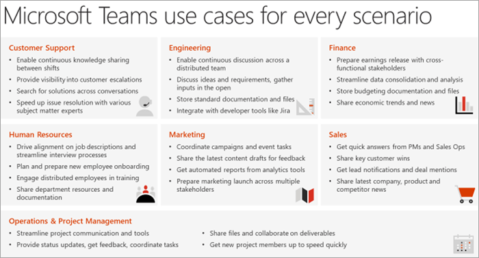

# 定義 Microsoft 團隊的使用案例

請確定您已瞭解將會在您的實現的此階段範圍中的商務專案（案例）。 看看這個範例案例清單，這些案例是先期採用者程式的絕佳候選方案。 您可以從簡易的 wins 開始，例如：

- 個人生產力
- 現代專案管理
- 新式會議

要考慮的其他案例包括：

- 員工參與與通訊
- 更快速地將行銷活動推向市場
- 提高銷售效率並增加收入
- 精簡業務考評

您可以將此案例看作是一種累加的處理方式，透過這項新的工作方式來建立更基本的案例，以建立熱忱、熟練性和可信度。 然後移至更 ambitious 的影響區域。 隨著 Microsoft 團隊對您的業務同事的影響，我們將會建立更多與發展的相關專案。 對於許多客戶來說，當他們收到此程式後，我們會發現該業務專案關係人在瞭解他們的同事從 Microsoft 團隊取得價值之後的做法。

## 採訪業務關係人

若要確認選取這些早期專案，我們建議直接使用您在此程式中先前所辨識的專案關係人來召開會議。 您目前的目標是聆聽並瞭解其業務的其他相關資訊。 請考慮下列問題來驅動交談：

- 貴組織的一些挑戰或與共同作業相關的痛點為何？
- 貴組織想要改善哪些區域？
- 團隊可以支援哪些組織的戰略方案或目前的轉換專案？
- 貴組織與其他人相比，哪些通訊與共同作業的方法通常會更符合您的能力？
- 起草、散佈及共用資訊的程式為何？

## 地圖並排定商務案例的優先順序

若要確定您擁有商務案例的正確資訊，請考慮使用下列格式，從員工完成工作與流程的公司擁有者的觀點來記錄方案。 需要使用這兩個角度來手工建立成功的路徑。

在對一或多個商務專案關係人講話之後，您可以根據影響與難點來排定案例的優先順序。 （您的案例可能除了上述所建議的案例之外。）針對您的實驗階段適當的候選人，可能會有較高的影響及中等難度。 這可確保您的專案不會受到範圍蔓延或技術問題影響，您就可以顯示工作的價值。 圖範例如下所示。

> [!Note]
> 我們總是渴望瞭解我們的客戶如何以新的創新方式使用團隊。 在 [駕駛採納研討論壇] 中與我們分享您的 #TeamsStories。 在您的文章中加入 [井號] **#TeamsStories** 。 我們一直都對您在組織中使用團隊的方式感興趣。

的圖示： [內[建先行的](teams-adoption-onboard-early-adopters.md)使用中] 和 [收集意見反應]。
