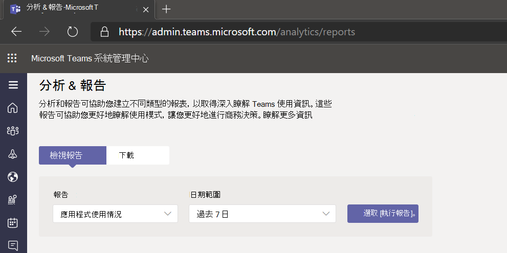
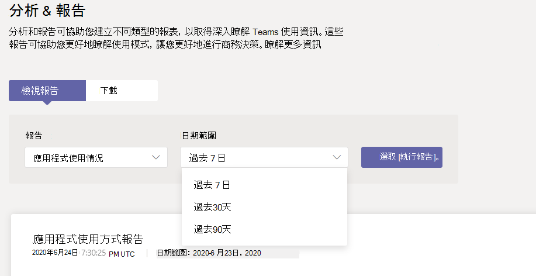
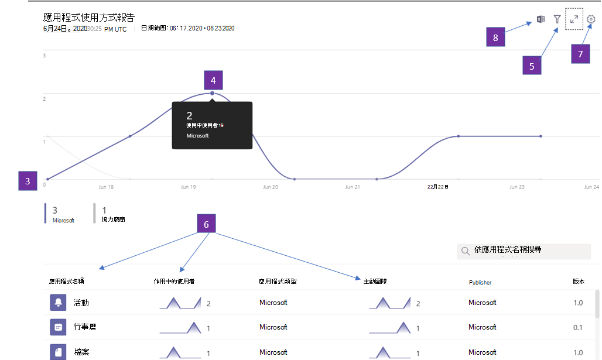
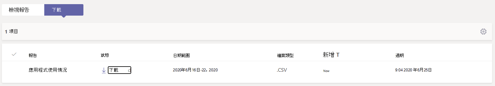
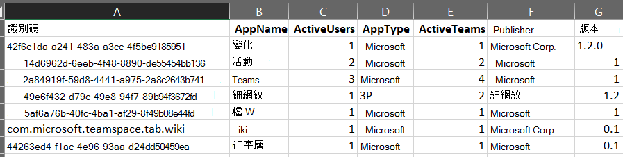

# Microsoft Teams App 使用方式報告Microsoft Teams app usage report

Microsoft Teams 系統管理中心的 Teams 應用程式使用方式報告會提供使用者在 Teams 中使用哪些應用程式的資訊。The Teams app usage report in the Microsoft Teams admin center provides you with information about which apps users are using in Teams.  

## 查看應用程式使用量報告View the App Usage report

1.  在系統管理中心的左側流覽位置，按一下 <https://admin.teams.microsoft.com> **[分析&報告** \> **使用方式報告**。In the left navigation of the admin center at <https://admin.teams.microsoft.com>, click **Analytics & reports** \> **Usage reports**. 在顯示 **報表的顯示** 方式中 **，選取在** 報表下的 **應用程式使用量**。On the **View reports** tab, under **Report**, select **Apps Usage**.

     :::image type="content" source="media/app-usage-report1.png" alt-text="使用方式報告功能表項目的螢幕擷取畫面":::

2.  在 **[日期範圍** 中，選取範圍，然後按一下 [ **執行報表**。Under **Date range**, select a range, and then click **Run report**.

      :::image type="content" source="media/app-usage-report2.png" alt-text="應用程式使用量報告的螢幕擷取畫面":::

## 解讀報表Interpret the report

|標注Callout |說明Description  |
|--------|-------------|
|**1****1**   |您可以針對過去 7、30 或 90 天內的趨勢來查看 Teams 應用程式使用量報告。The Teams Apps usage report can be viewed for trends over the last 7, 30 or 90 days. |
|**2****2**   |每個報表都有產生報表的日期。Each report has a date for when the report was generated. 報告通常會反映出從應用程式開啟起 24 小時的延遲。The reports usually reflect a 24-hour latency from the time an app was opened.   |
|**3****3**    | <ul><li>圖表上的 X 軸是特定報表的選取日期範圍。The X axis on the charts is the selected date range for the specific report.</li><li>Y 軸是將游標暫停于圖表中之日期的使用者數目，這些使用者已開啟應用程式至少一次，如此一來，就視為使用中使用者，並計入滑鼠暫停時看到的總數量。The Y axis is the number of users who for the given day hovered over in chart, those users have opened an app at least once and by doing so are considered an Active User and accrue towards the total seen on mouse hover over.</li></ul>|
|**4****4**   |將游標停留在代表給定日期之應用程式使用量的點上，以查看該 App 在該日期的總使用中使用者數目。Hover over the dot representing an Apps Usage on a given date to see the number of instances of that App’s Total Active Users on that given date.  |
|**5****5**   |所有應用程式都會包含在內，但選擇篩選圖示，即可使用其他篩選。All Apps will be included but by choosing the Filter icon, additional filters are available.  |
|**6****6**   |表格提供使用中使用者和團隊的 App 名稱明細。The table gives you a breakdown of active users and teams by App name. <ul><li>**應用程式名稱** 是 Teams 中所使用的應用程式的顯示名稱。**App name** is the display name of the app used in Teams.</li><li>**使用中** 使用者是在指定的時段內至少開啟應用程式一次的使用者數目。**Active users** is the number of users who opened the app at least once during the specified time period.</li><li>**應用程式類型** 是「Microsoft」或「協力廠商」的靜態值。**App type** is a static value of either “Microsoft” or “Third Party”.</li><li>**使用中的** 團隊是團隊中至少有一個成員在指定的時段內開啟應用程式的團隊數目。**Active teams** is the number of teams who have opened the App by at least one member of the team and during the specified time periods.</li><li>**Publisher** 是 App 的軟體發行者。**Publisher** is the software publisher of the app.</li><li>**版本** 是應用程式發行者所提供 App 的軟體版本。**Version** is the software version of the app, from the app publisher.</li></ul><b> 注意：</b> 目前，只有頻道中使用的應用程式會計算使用中使用者和使用中團隊。<b> Note :</b> Currently, 'Active users' and 'Active teams' are calculated for apps used in channels only.     

   螢幕擷取畫面 **| |7 |**  選取 **編輯欄** 以新增或移除表格中的欄。  | |**7**  |Select **Edit columns** to add or remove columns in the table.    螢幕擷取畫面 **| |8 |**  您可以將報表匯出為 CSV 檔案，進行離線分析。  | |**8**  |You can export the report to a CSV file for offline analysis. 按一下 **[匯出至 Excel，** 再按一下 [下載資料標籤上，下載時下載報表已就緒。Click **Export to Excel**, and then on the **Downloads** tab, click **Download** to download the report when it's ready.  **9 |**   當您在 Excel 中查看報表時，也會看到代表應用程式識別碼的 **識別碼** 欄。  | |**9**   |When you view the report in Excel, you'll also see an **Id** column, which represents the app ID. 團隊識別碼通常是一個 Alphanumer 字串。A team ID is typically an alphanumeric string. 如果 **識別碼** 欄顯示為 \**\n*{，這表示使用者要求刪除其資訊。If the **Id** column shows as \*\*\n\*\*\*\*, this means that a user requested their information to be deleted.   |  |

## 相關主題Related topics

- [Teams 分析和報告Teams analytics and reporting](teams-reporting-reference.md)