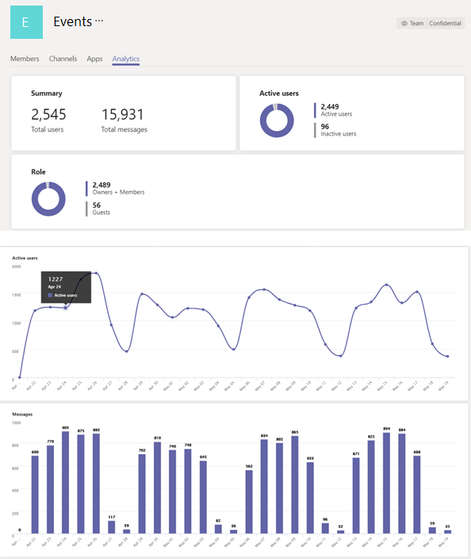

# 檢視 Teams 中的跨小組和每一小組分析

在 Microsoft 團隊中，使用者可以查看他們是其成員或擁有者的小組分析。 此資訊可讓使用者瞭解其小組中的使用模式與活動。 他們可以看到資料，例如每個小組中的作用中使用者、來賓和訊息。

跨團隊分析可讓使用者大致瞭解在單一清單視圖中，他們是其成員或擁有者的所有團隊的使用資料。 這包括 [作用中使用者] 與 [郵件計數]，以及小組活動的趨勢線。  

針對每個團隊分析，可為使用者提供更詳細的特定團隊使用資料檢視。 這包含適用于作用中使用者和郵件計數的時態圖表，以及使用者類型和活動趨勢的更深細目。

## 針對您是其成員或擁有者的所有團隊，查看分析

1. 在團隊中，在小組清單底部的 [**加入或建立團隊**] 旁，按一下 [**管理團隊**]。
2. 在 [**分析**] 索引標籤上，選取要顯示您是其成員或擁有者之所有團隊之使用方式資料的日期範圍。

    

    |選項 |說明  |
    |--------|-------------|
    |**名稱**   |團隊名稱。 |
    |**作用中的使用者**   |團隊中的作用中使用者數與團隊活動在指定時段內的趨勢線。 我們定義 
    |**人員**   |團隊在指定時段內的人員總數。 這包括團隊擁有者、團隊成員和來賓。|
    |**限制**   |小組中的來賓人數，在指定的時段內。 |
    |**錯誤資訊**   |在指定的時段內，在小組聊天中張貼的唯一訊息數。 |
    |**類型**   |團隊是私人小組或公開團隊。|

## 針對您是成員或擁有者的小組，查看分析

1. 在 [團隊] 中，移至您想要的小組，按一下 [**更多選項] （...）**，然後按一下 [**管理團隊**]。  
2. 在 [**分析**] 索引標籤上，選取要顯示該小組之使用方式資料的日期範圍。  

    

    |選項 |說明  |
    |--------|-------------|
    |**摘要**   |團隊活動摘要，包括下列專案：<ul><li>小組中的使用者總數</li> <li> 在小組聊天中張貼的唯一郵件總數 </li> </ul> |
    |**作用中的使用者**   |團隊中的作用中及非作用中使用者數目。|
    |**角色**   |小組中的使用者數（依角色），包括團隊擁有者、團隊成員和來賓。|
    |[作用中的**使用者**] 圖表  |小組依日期的作用中使用者數目。 將游標停留在指定日期上的點上，即可查看該日期的作用中使用者數目。|
    |**訊息**圖  |依日期在小組聊天中張貼的唯一訊息數。 將游標停留在指定日期上的點上，即可查看在該日期張貼的唯一郵件數。|
    
> [!NOTE]
> 我們會將作用中的使用者定義為使用者在桌面用戶端、行動用戶端和 web 用戶端執行有意的動作。 有意採取的動作包括啟動聊天、撥打電話、共用檔案、在團隊內編輯檔、參與會議等。我們抽出了諸如自動啟動、將畫面最小化或關閉 app 等被動動作。 我們也會在單一使用者識別碼中重複消除所有的動作。

## 相關主題

- [團隊分析和報告](teams-reporting-reference.md)
