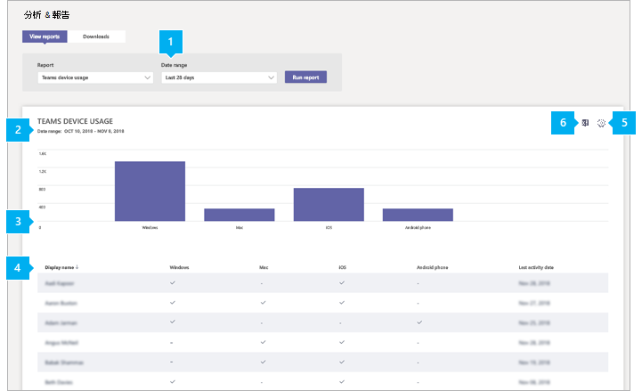

# Microsoft Teams裝置使用方式報告

系統Teams管理中心中的 Microsoft Teams裝置使用方式報告會提供使用者如何連接到Teams。 您可以使用報表查看整個組織使用的裝置，包括Teams行動裝置使用多少裝置。  

## 查看裝置使用方式報告

1. 在系統管理中心的左側導Microsoft Teams，按一下 [**分析&報告**  >  **使用方式報告**。 On the **View reports** tab, under **Report**, select **Teams device usage**.
2. 在 **[日期範圍**」 下，選取範圍，然後按一下 [ **執行報表**> 。

    

## 解譯報表

|標注 |描述  |
|--------|-------------|
|**1**   |您可以Teams裝置使用方式報告，查看過去 7 天或 30 天內的趨勢。  |
|**2**   |每個報表都有產生報表的日期。 報告通常會反映啟用時間 24 小時的延遲。 |
|**3**   |<ul><li>圖表上的 X 座標軸代表用來 (Windows、Mac、Linux、iOS、Android ******電話、web**) 等裝置Teams。     </li><li>Y 軸是所選時段內使用裝置的使用者數目。</li> </ul>將游標停留在代表裝置的長條上，以查看使用裝置連接到Teams。|
|**4**   |下表提供使用者裝置使用量的明細。 <ul><li>**使用者** 名稱是使用者的顯示名稱。 您可以按一下顯示名稱，以前往系統管理中心中的使用者Microsoft Teams頁面。 </li><li>**Windows，** 如果使用者在電腦桌面用戶端Teams，系統Windows選取該選項。</li><li>**如果使用者在 macOS** 電腦上使用 Teams桌面用戶端，會選取 Mac。 </li> <li>**如果使用者** 在 Linux 電腦上使用Teams桌面用戶端，會選取 Linux。 </li> <li>**如果使用者在 iOS** 行動用戶端上Teams iOS，即會選取 iOS。</li><li>**如果使用者在 Android** 行動用戶端上Teams Android 手機已選取。 <li><li>**如果使用者** 在 Web 用戶端上Teams已選取 Web。 <li>**上次活動** 是使用者參與 (活動) UTC 的最後一Teams日期。</li> </ul> 請注意，如果 Azure AD 中不再有使用者帳戶，使用者名稱會顯示為 「--」于表格中。   若要在表格中查看您想要的資訊，請務必新增欄至資料表。 |
|**5**   |選取 **編輯欄** 以新增或移除表格中的欄。 |
|**6**   |您可以將報表匯出至 CSV 檔案，進行離線分析。 按一下 **[匯出Excel，** 然後在 [下載>選項卡上，按一下[下載以在報表準備就緒時下載報表。  |

## 將使用者特定資料匿名

若要將裝置使用方式報告中Teams匿名，您必須是全域系統管理員。 這會隱藏可辨識的資訊，例如報表及其匯出中的顯示名稱、電子郵件和 AAD 識別碼。

1. 在 Microsoft 365 系統管理中心中，前往 設定 \> **組織** 設定，然後選擇在服務 **選項卡** 下，選擇報表 。 
    
2. 選取 **報表**，然後選擇顯示 **匿名識別碼**。 此設定會同時適用于系統管理中心Microsoft 365 系統管理中心使用方式Teams報表。
  
3. 選取 **儲存變更**。

## 相關主題

- [Teams 分析與報告](teams-reporting-reference.md)
