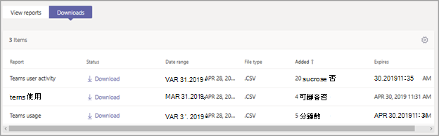

# Microsoft 團隊裝置使用量報告Microsoft Teams device usage report

Microsoft 團隊系統管理中心的 [小組裝置使用量] 報告可提供使用者連線至團隊之方式的相關資訊。The Teams device usage report in the Microsoft Teams admin center provides you with information about how users connect to Teams. 您可以使用報告來查看貴組織所使用的裝置, 包括在行動裝置上使用的小組數。You can use the report to see the devices that are used across your organization, including how many use Teams from their mobile devices when on-the-go.  

## 查看報表View the report

1. 在 Microsoft [團隊管理中心] 的左導覽中, 按一下 [**分析] & 報表**], 然後在 [**報表**] 底下, 選取 [**團隊裝置使用方式**]。In the left navigation of the Microsoft Teams admin center, click **Analytics & reports**, and then under **Report**, select **Teams device usage**.
2. 在 [**日期範圍**] 底下, 選取一個範圍, 然後按一下 [**執行報表**]。Under **Date range**, select a range, and then click **Run report**.

    小組系統![管理中心的 [小組裝置使用方式] 報告螢幕擷取畫面 (含標注])小組系統(../media/teams-reports-device-usage-with-callouts.png "管理中心的 [小組裝置使用方式] 報告螢幕擷取畫面 (含標注"))

## 解讀報表Interpret the report

|圖說文字Callout |說明Description  |
|--------|-------------|
|**sr-1****1**   |您可以在過去7天或28天的趨勢中查看小組裝置使用方式報告。The Teams device usage report can be viewed for trends over the last 7 days or 28 days.  |
|**pplx-2****2**   |每個報告都有產生報告的日期。Each report has a date for when the report was generated. 報告通常會反映來自啟用時間的24到48小時延遲時間。The reports usually reflect a 24 to 48 hour latency from time of activity. |
|**3****3**   |<ul><li>圖表上的 X 軸代表用來連接至團隊的不同裝置 (**Windows**、 **Mac**、 **iOS**、 **Android 手機**)。The X axis on the chart represents the different devices (**Windows**, **Mac**, **iOS**, **Android Phone**) used to connect to Teams. </li><li>Y 軸是在所選時間範圍內使用裝置的使用者數目。The Y axis is the number of users using the device over the selected time period.</li> </ul>將游標暫留在代表裝置的列上, 即可查看使用裝置連接至團隊的使用者數目。Hover over the bar representing a device to see the number of users using the device to connect to Teams.|
|**4****4**   |此表格可讓您細分使用者的裝置使用量。The table gives you a breakdown of device usage by user. <ul><li>[**顯示名稱**] 是使用者的顯示名稱。**Display name** is the display name of the user. 您可以按一下顯示名稱, 移至 Microsoft 團隊系統管理中心的 [使用者設定] 頁面。You can click the display name to go to the user's setting page in the Microsoft Teams admin center. </li><li>如果使用者是在 Windows 電腦上的小組桌面用戶端中使用中, 則會選取 [ **Windows** ]。**Windows** is selected if the user was active in the Teams desktop client on a Windows-based computer.</li><li>如果使用者在 macOS 電腦上的小組桌面用戶端中處於作用中, 則會選取**Mac** 。**Mac** is selected if the user was active in the Teams desktop client on a macOS computer. </li> <li>如果使用者在 iOS 的 [小組行動用戶端] 上是作用中的, 就會選取**ios** 。**iOS** is selected if the user was active on the Teams mobile client for iOS.</li><li>如果使用者在 Android 版團隊行動用戶端上是作用中的, 則會選取 [ **android 手機**]。**Android phone** is selected if the user was active on the Teams mobile client for Android. <li>[**上一個活動**] 是使用者參與團隊活動的最後一個日期 (UTC)。**Last activity** is the last date (UTC) that the user participated in a Teams activity.</li> </ul> 請注意, 如果使用者帳戶已不存在於 Azure AD 中, 則使用者名稱會在資料表中顯示為 "--"。Note that if a user account no longer exists in Azure AD, the user name is displayed as "--" in the table.   若要在表格中查看您想要的資訊, 請務必將資料行新增至資料表。To see the information that you want in the table, make sure to add the columns to the table. |
|**500****5**   |選取 [**編輯欄**] 以新增或移除表格中的欄。Select **Edit columns** to add or remove columns in the table. |
|**6****6**   |您可以將報表匯出為 CSV 檔案, 以便進行離線分析。You can export the report to a CSV file for offline analysis. 按一下 [**匯出至 Excel**], 然後在 [**下載**] 索引標籤上, 按一下 [**下載**] 以在準備好時下載報告。Click **Export to Excel**, and then on the **Downloads** tab, click **Download** to download the report when it's ready.  ![[下載] 索引標籤上顯示匯出報表的螢幕擷取畫面](../media/teams-reports-export-to-csv.png)|

## 相關主題Related topics

- [團隊分析和報告Teams analytics and reporting](teams-reporting-reference.md)