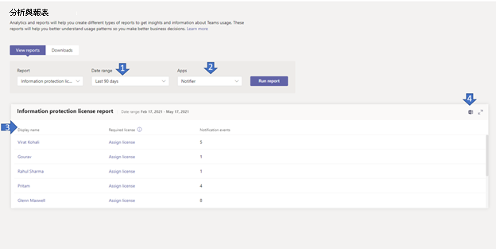

# Microsoft Teams資訊保護授權報告

Teams 資訊保護授權報告提供訂閱變更通知事件以聆聽租使用者層級 (即 /teams/getAllMessage 或 /chats/getAllMessages) 之通知事件的深入資訊。 只有在使用者擁有所需授權時，才成功送出與郵件對應的 [變更通知](/graph/teams-licenses)。  您可以查看特定使用者觸發的變更通知數。

## 查看資訊保護授權報告

您必須是 Teams 服務系統管理員才能進行這些變更。 請參閱[使用 Teams 系統管理員角色來管理 Teams](../using-admin-roles.md)，以了解取得系統管理員角色和權限。

1. 在系統管理中心的左側導Microsoft Teams，選取分析&**報告**  >  **使用方式報告**。 On the **View reports** tab, under **Report**, select **Information Protection License**.
2. 在 **日期範圍下**，選取範圍。
3. 在 **應用程式下**，選取應用程式，然後選取執行 **報表**。

    

## 解譯報表

|標注 |描述  |
|--------|-------------|
|**1**   |您可以針對過去 7 天、30 天或 90 天內的趨勢來查看資訊保護授權報告。 |
|**2**   |應用程式名稱會顯示所有已訂閱以變更過去 n 天內郵件通知事件的應用程式清單，如日期範圍中選取的。 |
|**3**   |下表提供所選 App 每個使用者的使用狀況明細。<ul><li>**顯示名稱** 是使用者的顯示名稱。 選取顯示名稱，以前往系統管理中心中的使用者詳細Microsoft Teams頁面。</li><li>**如果使用者擁有** 此處定義之一的所需授權，[]， (授權) https://docs.microsoft.com/en-us/graph/teams-licenses 為 yes。 如果使用者沒有所需的授權，系統會顯示指派授權連結，連結會流覽至 Microsoft 系統管理中心 (使用者活動使用者>使用者名稱  >  ****) 。</li><li>**授權保護事件** 是針對該使用者建立、更新或刪除的郵件，將唯一變更通知事件數寄到應用程式。</li></ul> |
|**4**   |將報表匯出為 CSV 檔案，進行離線分析。 選取 **匯出至Excel**，然後選取下載 **選項卡**。選取 **下載** 以在報表準備就緒時下載報表。 |
|**5**   |將報表匯出為 CSV 檔案，進行離線分析。 選取 **匯出至Excel**，然後選取下載 **選項卡**。選取 **下載** 以在報表準備就緒時下載報表。 當您在 Excel中查看報表時，也會看到一個 **識別碼** 和電子郵件欄，代表使用者的使用者識別碼和電子郵件地址。 |

## 將使用者特定資料匿名

若要將使用者活動報告中Teams匿名，您必須是全域系統管理員。 這會隱藏可辨識的資訊，例如報表及其匯出中的顯示名稱、電子郵件和 Azure AD 識別碼。

1. 在 Microsoft 365 系統管理中心中，前往 設定 \> **組織** 設定，然後選擇在服務選項卡下的報表 。 
    
2. 選取 **報表**，然後選擇顯示 **匿名識別碼**。 此設定會同時適用于系統管理中心Microsoft 365 系統管理中心使用方式Teams報告。
  
3. 選取 **儲存變更**。
