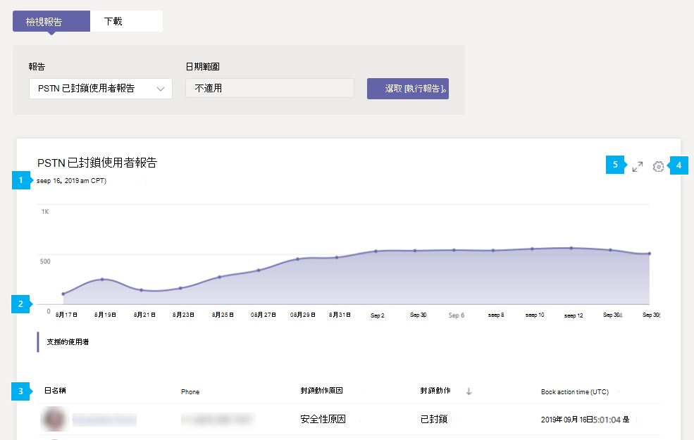

# Microsoft 團隊 PSTN 封鎖的使用者報告

Microsoft 團隊系統管理中心的 PSTN 封鎖的使用者報告會顯示您組織中被封鎖在團隊中進行 PSTN 通話的使用者。 您可以查看每個封鎖使用者的詳細資訊，包括其指派的電話號碼，以及他們被封鎖撥打的原因。

## 查看報表

在 Microsoft [團隊管理中心] 的左導覽中，按一下 [**分析] & 報告** > **使用方式報告**。 在 [**查看報表**] 索引標籤的 [**報表**] 底下，選取 [ **PSTN 封鎖的使用者**]，然後按一下 [**執行報表**]。

## 解讀報表

|圖說文字 |說明  |
|--------|-------------|
|**1**   |每個報告都有產生的日期。 報告通常會反映來自啟用時間的24到48小時延遲時間。 |
|**2**   |X 軸是日期。 Y 軸是使用者數目。  將游標停留在指定日期上的點上，即可查看該日期封鎖的使用者數目。 |
|**3**   |下表提供封鎖撥打 PSTN 通話的所有使用者明細。  它會顯示已指派電話系統或音訊會議的所有使用者，並提供每個使用者的詳細資訊。 <ul><li>[**顯示名稱**] 是使用者的顯示名稱。 您可以按一下顯示名稱，移至 Microsoft 團隊系統管理中心的 [使用者設定] 頁面。 </li> <li>[**電話**] 是指派給使用者的號碼。</li> <li>**封鎖的原因**是封鎖使用者進行通話的原因。</li><li>**封鎖的動作**會告知您使用者是否已被封鎖或解除封鎖，無法在小組中進行 PSTN 通話。</li> <li>**封鎖時間**是封鎖使用者撥打電話的日期和時間（UTC）。</li></li> </ul>若要在表格中查看您想要的資訊，請務必將資料行新增至資料表。 |
|**4**   |選取 [**編輯欄**] 以新增或移除表格中的欄。|
|**500**   |選取 [**全螢幕**]，以全螢幕模式查看報告。|

## 相關主題

- [團隊分析和報告](teams-reporting-reference.md)