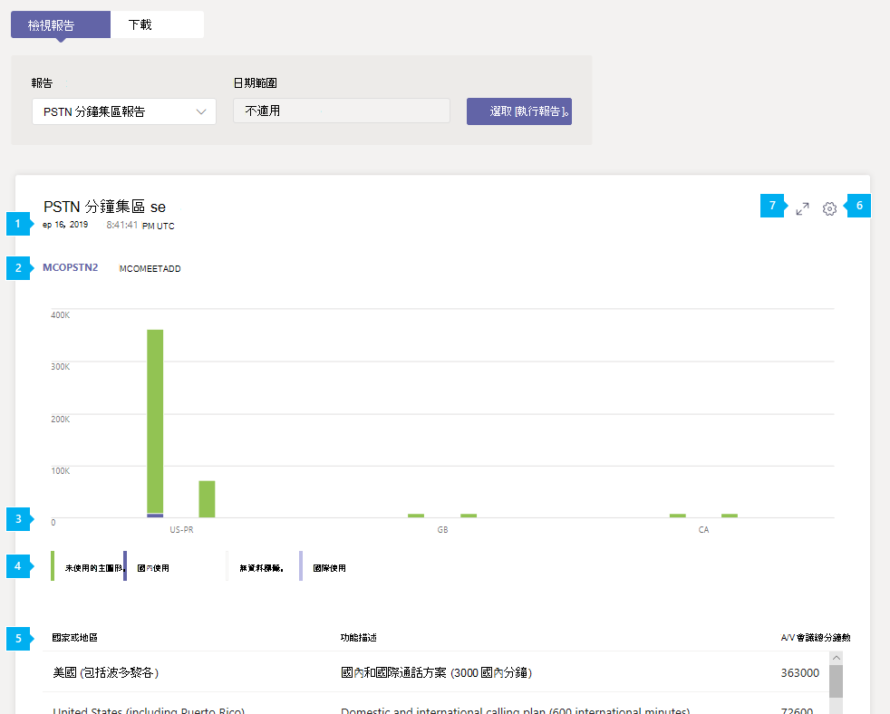

# Microsoft Teams PSTN 分鐘集區報表

Microsoft Teams 系統管理中心的 Teams PSTN 分鐘集區報告會顯示當月耗用的分鐘數，讓您概略瞭解組織中的音訊會議和通話活動。 您可以查看活動明細，包括用於通話的授權、可用的總分鐘數、使用分鐘數，以及依位置的授權使用量。

## 檢視 PSTN 分鐘集區報表

在 Microsoft Teams 系統管理中心的左側導覽中，按一下 **[分析&報告**  >  **使用方式報告。** 在 [ **檢視報表]** 索引標籤的 [ **報** 表] 底下，選取 **[PSTN 分鐘與簡訊 (預覽) 集區**]，然後按一下 [ **執行報表]**。

## 解讀報表

|標注 |描述  |
|--------|-------------|
|**1**   |每個報告都有產生報告的日期。 報告通常會反映啟用時間的 24 到 48 小時延遲。 |
|**2**   |按一下功能 (授權) 以檢視該功能的活動。 |
|**3**   |X 軸是國家或地區。 Y 軸為分鐘數。  將游標停留在圖表上的橫條上，即可查看該使用位置的活動。  |
|**4**   |您可以按一下圖例中的專案，篩選圖表上顯示的內容。 例如，按一下 [ **未使用**]、 **[國內使用者**]、 **[無資料**] 或 [國際]， **以** 查看每個使用者的相關資訊。 |
|**5**   |表格提供您根據功能與使用位置的分鐘集區明細。 <ul><li>**國家或地區** 是使用位置。 </li><li>**功能描述** 是通話所用授權的描述。  您可能會在這份報告中看到的功能描述包括： <ul><li>國內及國際通話方案 (1200 分鐘國內通話) </li><li>國內及國際通話方案 (3000 分鐘國內通話) </li><li>國內及國際通話方案 (600 分鐘國際通話) </li></ul></li> <li>**總分鐘** 數是當月可用的總分鐘數。</li><li>**使用的分鐘** 數是每個月使用的分鐘數</li> <li>**可用** 分鐘數是指當月剩餘的分鐘數。</li><li>**功能** 是通話所用的授權。 您可能會看到的授權包括：<ul><li>**MCOPSTN1** - 國內通話方案 (3000 分鐘 /1200 分鐘歐盟方案) </li><li>**MCOPSTN2** - 國際通話方案</li><li>**MCOPSTN5** - 國內通話方案 (120 分鐘通話方案) </li><li>**MCOPSTN6** - 國內通話方案 (240 分鐘通話方案) </li><li>**MCOMEETADD** - 音訊會議</li></ul></li> </ul> 若要在資料表中查看您要的資訊，請務必將欄新增至資料表。|
|**6**   |選取 **[編輯欄]** 以新增或移除表格中的欄。|
|**7**   |選取 **[全螢幕** ] 以全螢幕模式檢視報表。|

## 相關主題

- [Teams 分析與報告](teams-reporting-reference.md)
