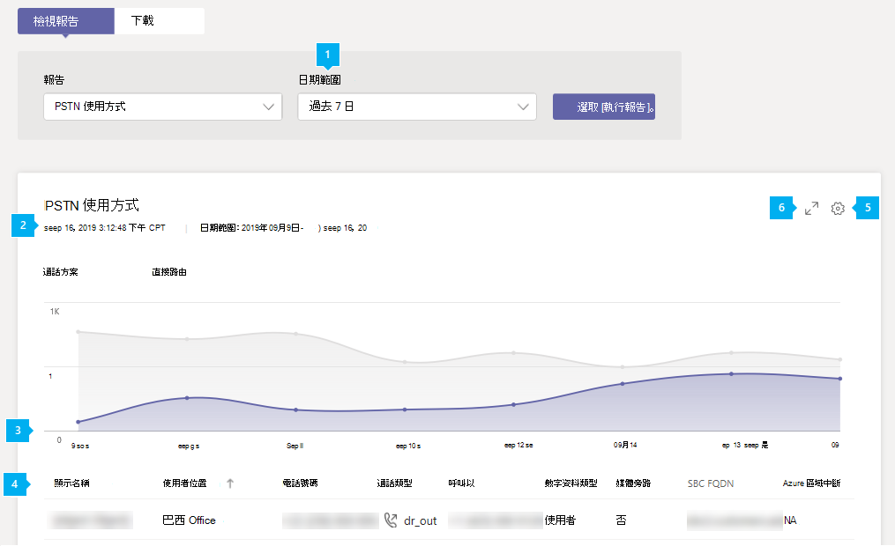

# Microsoft TeamsPSTN 使用方式報告

Microsoft Teams系統管理Teams PSTN (公用交換電話網絡) 使用方式報告提供您組織中通話和音訊會議活動概觀。 如果您使用 Microsoft 做為電話電信業者，您可以查看通話方案的詳細通話活動;如果您使用自己的電話電信業者，也可以查看直接路由的詳細通話活動。

[ **通話方案>** 選項卡會顯示資訊，包括使用者在傳入和外接 PSTN 通話中花費的分鐘數，以及這些通話的成本。 直接 **路由選項卡** 會顯示包括 SIP 位址和通話開始時間和結束時間在內的資訊。 使用此報告中的資訊，深入瞭解貴組織的 PSTN 使用方式，並説明您調查、規劃及做出商務決策。

> [!NOTE]
> 如果您有 Telstra 或 Softbank 通話方案，將不會在 PSTN 使用方式報告中看到任何通話詳細資料記錄。 如需報告需求，請聯絡 Telstra 或 Softbank。 

## 查看 PSTN 使用方式報告

1. 在系統管理中心的左側導Microsoft Teams，按一下 [**分析&報告**  >  **使用方式報告**。 在 [ **查看報表>** 選項卡的 [ **報表> 下**，選取 **[PSTN 使用方式報告>**。
2. 在 **日期範圍** 下，選取預先定義的 7 或 28 天範圍，或設定自訂範圍，然後選取執行 **報表**。

## 解譯報表

### 通話方案

|標注 |描述  |
|--------|-------------|
|**1**   |您可以針對過去 7 天、28 天或您設定之自訂日期範圍的趨勢來查看報表 |
|**2**   |每個報表都有產生日期。 報告通常會反映啟用時間起 24 到 48 小時的延遲。 |
|**3**   |X 軸是特定報表的選取日期範圍。 Y 軸是所選時段的通話總數。  將游標停留在給定日期的點上方，以查看該日期的總通話。  |
|**4**   |表格提供您每個通話的 PSTN 使用量明細。 <ul><li>**UTC (時間戳記)** 是通話開始的時間。</li><li>**顯示名稱** 是使用者的顯示名稱。 您可以按一下顯示名稱，前往系統管理中心中的使用者Microsoft Teams頁面。</li><li>**使用者** 名稱是使用者的登錄名稱。</li><li>**電話號碼** 是接聽來電的號碼或撥出電話的號碼。</li><li>**通話類型** 是通話是 PSTN 外寄或輸入通話，以及通話類型，例如使用者撥打的通話或音訊會議。 您可能會看到的通話類型包括：  **Teams使用者通話類型**<ul><li>**user_in** - 使用者收到傳入 PSTN 通話。</li><li>**user_out** - 使用者撥打了外寄 PSTN 通話</li><li>**user_out_conf** - 使用者在通話中新增兩個或多個 PSTN 參與者，例如三方電話會議</li><li>**user_out_transfer** - 使用者將通話轉接到 PSTN 號碼</li><li>**user_out_forwarding** - 使用者將通話轉往 PSTN 號碼</li><li>**conf_in** - 音訊會議橋接器的輸入通話</li><li>**conf_out** - 音訊會議橋接器的外線通話，通常可新增 PSTN 號碼至會議</li></ul> **Teams Bot 的通話類型**<ul><li>**ucap_in** - 自動Teams或通話佇列等內Teams PSTN 通話</li><li>**ucap_out** - 來自自動Teams或通話佇列等的外Teams PSTN 通話</li></ul> <li>**已撥入** 號碼。</li><li>**撥號至國家/地區** 的國家/地區。</li><li>**從呼叫** 是撥打該電話的號碼。</li><li>**從國家/地區** 是撥打來電的省/市或地區。</li><li>**費用** 是向您的帳戶收取的通話金額或費用。 </li><li>**貨幣** 是用來計算通話成本的貨幣類型。 </li><li>**持續時間** 是通話已連接多久。</li><li>國內 **/國際** 會依據使用者的位置 (國家/地區) 或 (國家/地區) 內撥打國內電話。</li><li>**通話識別碼** 是通話的通話識別碼。 這是撥打 Microsoft 支援服務時，您可以使用的通話識別碼。</li><li>**號碼類型** 是使用者的電話號碼類型，例如免付費號碼的服務。 </li><li>**國家/地區是** 使用位置。 </li> <li>**會議 ID** 是音訊會議的會議 ID。 </li><li>**功能** 是通話所使用的授權。 您可能會看到下列授權類型：<ul><li>**MCOEV 或 MCOEV_VIRTUALUSER 或 MCOEV_VIRTUALUSER_GOV** - 語音應用程式，例如自動語音語音或通話佇列</li><li>**FREECALL** - 如果發生技術問題，讓我們無法為通話定價，通話會免費提供，而且會顯示此功能</li><li>**MCOPSTN1** - 國內通話方案 (3000 分鐘美國 / 1200 分鐘的歐盟方案) </li><li>**MCOPSTN2** - 國際通話方案</li><li>**MCOPSTN5** - 國內通話方案 (120 分鐘的通話方案) </li><li>**MCOPSTN6** - 國內通話方案 (240 分鐘的通話方案) </li><li>**MCOPSTN8** - 每個使用者的國內通話方案 120 分鐘 (不會像其他通話方案一樣跨使用者進行) </li><li>**MCOPSTN9** - 國際通話方案</li><li>**MCOPSTNCAP** - 公用區域電話</li><li>**MCOPSTNPP** - Communications Credits</li><li>**MCOMEETADD** - 音訊會議</li><li>**MCOMEETADD_DIALOUT_US** - 音訊會議美國和加拿大撥出方案</li><li>**MCOMEETADD_CN_GLOBAL** - 非中國使用者的音訊會議</li><li>**MCOMEETADD_TATA** - Tata Communications Connections</li><li>**MCOMEETACPEA** - 音訊會議按分鐘付費 </li><li>**MCOMEETACPEA_GOV** - 政府的音訊會議按分鐘付費</li></ul></li></ul> 若要在表格中查看您想要的資訊，請務必新增欄至資料表。|
|**5**   |選取 **編輯欄** 以新增或移除表格中的欄。 |
|**6**   |選取 **篩選** 以根據使用者名稱或通話類型篩選報表 |
|**7**   |選取 **全螢幕** 以全螢幕模式來查看報表。 |
|**8**   |您可以將報表匯出為 CSV 檔案，進行離線分析。 按一下 **[匯出Excel，** 然後在 [下載>選項卡上，按一下[下載以在報表準備就緒時下載報表。|

### 直接路由

|標注 |描述  |
|--------|-------------|
|**1**   |您可以針對過去 7 天或 28 天的趨勢來查看報表。 |
|**2**   |每個報表都有產生日期。 報告通常會反映啟用時間起 24 到 48 小時的延遲。 |
|**3**   |X 軸是特定報表的選取日期範圍。 Y 軸是所選時段的通話總數。 將游標停留在給定日期的點上方，以查看該日期的總通話。  |
|**4**   |表格提供您每個通話的 PSTN 使用量明細。 <ul><li>**UTC (時間戳記)** 是通話開始的時間。</li><li>**顯示名稱** 是使用者的顯示名稱。 您可以按一下顯示名稱，前往系統管理中心中的使用者Microsoft Teams頁面。 名稱也可以是 Bot 的名稱，例如通話佇列或雲端自動助理。 </li><li>**SIP 位址** 是使用者或接收或撥打來電的 Bot 的 SIP 位址。</li><li>**來電號碼** 是撥打該電話的使用者或 Bot 號碼。 </li><li>**通話者號碼** 是接到來電的使用者或 Bot 號碼。 在傳入來電給Teams使用者時，Teams使用者撥打的外Teams就會是 PSTN 使用者。 </li><li>**通話類型** 是通話是 PSTN 外寄或輸入通話，以及通話類型，例如使用者撥打的通話或音訊會議。 您可能會看到的通話類型包括：  **Teams使用者通話類型**<ul><li>**dr_in** - 使用者收到傳入 PSTN 通話</li><li>**dr_out** - 使用者撥打了外寄 PSTN 通話</li><li>**dr_out_user_conf** - 使用者在通話中新增 PSTN 參與者</li><li>**user_out_transfer** - 使用者將通話轉接到 PSTN 號碼</li><li>**dr_out_user_forwarding** - 使用者將通話轉往 PSTN 號碼</li><li>**dr_out_user_transfer** - 使用者將通話轉接到 PSTN 號碼</li><li>**dr_emergency_out** - 使用者撥打緊急電話</li></ul> **Teams Bot 的通話類型**<ul><li>**dr_in_ucap** - 自動Teams或通話佇列等傳入 PSTN 通話</li><li>**dr_out_ucap** - 從自動Teams或通話佇列等自動Teams的外發 PSTN 通話</li></ul> <li>**呼叫者** 是接到來電的使用者號碼。</li><li>開始時間 **(UTC)** 是 SIP Proxy 在外寄通話 (Teams/Bot 上從 SBC 收到最後答案 (SIP 訊息 "200 確定") 給 PSTN 使用者) 的時間，或是 SIP Proxy 將邀請傳送至 Teams 後端內輸入呼叫 (PSTN 使用者至 Teams/Bot) 之後。 </li><li>邀請 **時間 (UTC)** 是初始邀請從 Teams 使用者或 Bot 通話傳送至 SBC 的外寄通話，或是在從 SBC 直接路由的 SIP Proxy 元件在 Teams 或 bot 通話的輸入通話中收到的時間。</li><li>**UTC (的)** 時間是通話失敗的時間。 僅適用于失敗的通話。 最終 SIP 程式碼、最終 Microsoft 子代碼和最終 SIP 片語提供通話失敗的原因，並有助於進行疑難排解。 </li><li>**UTC (結束時間)** 通話結束時間， (通話成功) 。</li><li>**持續時間** 是通話已連接多久。</li><li>**號碼類型** 是使用者的電話號碼類型，例如免付費號碼的服務。 </li><li>**媒體旁** 路會指出是否已啟用媒體旁路的主幹。 </li> <li>**SBC FQDN** 是會話邊界控制器和 SBC (FQDN) 的 (功能變數名稱) 。 </li><li>**Azure 媒體區域** 是在非旁路通話中做為媒體路徑的資料中心。 </li><li>**訊號的 Azure 區域** 是資料中心，用於旁路和非旁路通話的訊號。 </li><li>**事件種類** 是通話的事件種類。 您會看到成功的通話和嘗試失敗的通話。 </li><li>**最終 SIP 程式** 代碼是通話結束時使用的代碼。</li><li>**最終 Microsoft 副程式** 代碼是指出已發生特定動作的代碼。</li><li>**最終 SIP 詞** 組是 SIP 程式碼和 Microsoft 子代碼的描述。</li><li>**關聯識別碼** 是通話的唯一識別碼，您可以在撥打 Microsoft 支援服務時使用。</li><li>**共用關聯識別碼** 只會顯示在可下載的 CSV 檔案中，且不存在於入口網站中。 共用的關聯識別碼至少存在於兩個相關的通話中。 請參閱下方的詳細描述。</li></ul> 若要在表格中查看您想要的資訊，請務必新增欄至資料表。|
|**5**   |選取 **編輯欄** 以新增或移除表格中的欄。 |
|**6**   |選取 **全螢幕** 以全螢幕模式來查看報表。 |
|**7**   |選取 **匯出Excel，** 以逗號分隔的檔案 (CSV) 離線分析，或使用它做為帳單系統的輸入。 |

#### 來電/通話者欄位考慮事項

視通話方向不同，來電者或通話者名稱可以包含非 E164 號碼。

這些欄位可以來自客戶 SBC () 。 SBC 可以傳送三種格式至直接路由：E.164 號碼、非 E.164 數位和字串。

- E.164 電話號碼，從擁有 E.164 號碼的使用者，到也擁有 E.164 號碼的使用者。 
- 從非 E.164 號碼撥打。 協力廠商 PBX 與直接路由相互連結的使用者會打電話給Teams使用者。 在這種情況下，來電號碼可能是任何非 E.164 號碼，例如 +1001。 
- 垃圾郵件寄件者會撥打電話，而且不會顯示號碼，只會顯示名稱，例如「國稅服務」。 此字串會顯示在報告中。

#### 關於共用關聯識別碼

共用關聯識別碼僅存在於您下載Excel匯出的檔案中，表示兩個或多個通話是相關的。 下列說明不同的案例，以及共用關聯識別碼出現時間。

1.    PSTN User 1 在 Teams 用戶端上稱為 Teams User 1 的 PSTN 端點上，通話類型 Dr_In，相關識別碼 57f28917-42k5-4c0c-9433-79734873f2ac，沒有共用的關聯識別碼。
2.    TeamspstN 端點上的 Teams 用戶端上的使用者 1 稱為 PSTN User 1，通話類型 Dr_Out 2c12b8ca-62eb-4c48-b68d-e451f518ff4，沒有共用的關聯識別碼。
3.    PSTN User 1 位於 PSTN 端點上，Teams用戶端上的使用者 Teams 2， 通話類型 Dr_In f45e9a25-9f94-46e7-a457-84f5940efde9，共用關聯識別碼 f45e9a25-9f94-46e7-a457-84f5940efde9。
4.    具有相關識別碼 「f45e9a25-9f94-46e7-a457-84f5940efde9」的現有通話 3。 PSTN 使用者 1 與使用者 2 Teams通話中。 Teams使用者 2 將視 (或) 轉接Teams PSTN 使用者， 通話類型 Dr_Out_User_Transfer 45a1da7c-9e97-481a-8a05-3fe19a9a77e0，共用關聯識別碼 f45e9a25-9f94-46e7-a457-84f5940efde9。

## 匯出報表
按一下 **[匯出Excel，** 然後在 [下載>選項卡上，按一下[下載以在報表準備就緒時下載報表。 匯出程式可能需要幾秒鐘到幾分鐘才能完成，視資料量而不同。

這會匯出所有使用者的資料，並可讓您執行簡單的排序和篩選，以便進一步分析。 匯出的檔案包含線上報告中沒有的其他欄位。 這些可用於疑難排解和自動化工作流程。

 您會收到名為「通話 **.匯出」的 zip 檔案。 `[identifier]`.zip，** 識別碼是匯出的唯一識別碼，可用來進行疑難排解。

如果您同時擁有通話方案與直接路由，匯出的檔案可能包含這兩種產品的資料。 PSTN 使用方式報告檔案將會有檔案名 "**PSTN.通話。 `[UTC date]`.csv**" 和 Direct Routing "**DirectRouting.calls。 `[UTC date]`.csv"。**

 除了 PSTN 和直接路由檔案之外，該檔案還包含 [parameters.js **檔案**，以及選取的匯出時間範圍和功能。

匯出的檔案採用逗號分隔值 (CSV) 格式，符合 [RFC 4180](https://tools.ietf.org/html/rfc4180) 標準。 檔案可以在任何符合Excel編輯器中開啟，而不需要任何轉換。

CSV 的第一列包含欄名。 所有日期都是 UTC 和 [ISO 8601](https://en.wikipedia.org/wiki/ISO_8601) 格式。

### 匯出的 PSTN 使用方式報告

 除非特定國家/地區法規禁止保留資料 12 個月，否則您最多可以從目前日期匯出資料一年。

> [!div class="has-no-wrap"]  
> | # | 名稱 | [資料類型 (SQL Server) ](/sql/t-sql/data-types/data-types-transact-sql) | 描述 |
> | :-: | :-: | :-: |:------------------- |
> | 0 | UsageId | `uniqueidentifier` | 唯一通話識別碼 |
> | 1 | 通話識別碼 | `nvarchar(64)` | 通話識別碼。 不保證是唯一的 |
> | 2 | 會議 ID | `nvarchar(64)` | 音訊會議的識別碼 |
> | 3 | 使用者位置 | `nvarchar(2)` | 使用者的國家/地區代碼 [，ISO 3166-1 Alpha-2](https://en.wikipedia.org/wiki/ISO_3166-1_alpha-2) |
> | 4 | AAD ObjectId | `uniqueidentifier` | 在 Azure Active Directory 中Azure Active Directory。  此及其他使用者資訊在 bot 通話類型中為 null/empty， (ucap_in ucap_out)  |
> | 5 | Upn | `nvarchar(128)` | UserPrincipalName (在) 中Azure Active Directory。 這通常與使用者的 SIP 位址相同，而且可以與使用者的電子郵件地址相同 |
> | 6 | 使用者顯示名稱 | `nvarchar(128)` | 顯示使用者名稱 |
> | 7 | 來電顯示 | `nvarchar(128)` | 接聽來電的號碼或撥出電話的號碼。 [E.164](https://en.wikipedia.org/wiki/E.164) 格式 |
> | 8 | 通話類型 | `nvarchar(32)` | 通話是 PSTN 外寄或輸入通話，以及通話類型，例如使用者撥打的通話或音訊會議 |
> | 9 | 數位類型 | `nvarchar(16)` | 使用者的電話號碼類型，例如免付費號碼的服務 |
> | 10 | 國內/國際 | `nvarchar(16)` | 通話是國內通話 (國家/地區) 或 (國家/地區外) 根據使用者的位置進行撥打 |
> | 11 | 已撥入目的地 | `nvarchar(64)` | 已撥入的國家/地區 |
> | 12 | 目的地號碼 | `nvarchar(32)` | 以 [E.164 格式](https://en.wikipedia.org/wiki/E.164) 撥打的號碼 |
> | 13 | 開始時間 | `datetimeoffset` | 通話開始時間 |
> | 14 | 結束時間 | `datetimeoffset` | 通話結束時間 |
> | 15 | 持續時間秒數 | `int` | 通話已連接多久 |
> | 16 | 連線費用 | `numeric(16, 2)` | 連線費用價格 |
> | 17 | 負責 | `numeric(16, 2)` | 向您的帳戶收取的金額或通話費用 |
> | 18 | 貨幣 | `nvarchar(3)` | 用來計算 ISO [4217 (通話費用的貨幣](https://en.wikipedia.org/wiki/ISO_4217))  |
> | 19 | 功能 | `nvarchar(32)` | 通話所使用的授權 |

### 匯出的直接路由使用方式報告

除非特定國家/地區法規禁止保留該期間的資料，否則 (從目前日期起) 150 天內，您最多可以匯出五個月的資料。

> [!div class="has-no-wrap"]  
> | # | 名稱 | [資料類型 (SQL Server) ](/sql/t-sql/data-types/data-types-transact-sql) | 描述 |
> | :-: | :-: | :-: |:------------------- |
> | 0 | CorrelationId | `uniqueidentifier` | 唯一通話識別碼 |
> | 1 | SIP 位址 | `nvarchar(128)` | 撥打或接收通話的使用者或 Bot 位址。 請注意，這其實是 UserPrincipalName (UPN，請) 名稱Azure Active Directory，通常與 SIP 位址相同 |
> | 2 | 顯示名稱 | `nvarchar(128)` | 使用者或通話機器人的名稱 (例如通話佇列或自動) 自動Microsoft 365 系統管理中心 |
> | 3 | 使用者國家/地區 | `nvarchar(2)` | 使用者的國家/地區代碼 [，ISO 3166-1 Alpha-2](https://en.wikipedia.org/wiki/ISO_3166-1_alpha-2) |
> | 4 | 邀請時間 | `datetimeoffset` | 當初始邀請從 Teams 使用者或 Bot 通話傳送至 SBC，或從 SBC 直接路由的 SIP Proxy 元件在輸入到 Teams 或 bot 通話時收到 |
> | 5 | 開始時間 | `datetimeoffset` | SIP Proxy 從外寄 (Teams/Bot 上的 SBC 收到最後答案 (SIP 訊息 "200 確定") 給 PSTN 使用者) 的時間，或 SIP Proxy 在輸入通話 (PSTN 使用者將邀請傳送至 Teams 後端的下一個躍點至 Teams/Bot) 的時間。 如果通話失敗或未接聽，這等於邀請或失敗時間 |
> | 6 | 失敗時間 | `datetimeoffset` | 只有未完全 (通話失敗) 存在 |
> | 7 | 結束時間 | `datetimeoffset` | 只有成功撥打 (電話) 存在。 通話結束時間 |
> | 8 | 持續時間 (秒)  | `int` | 通話持續時間 |
> | 9 | 成功 | `nvarchar(3)` | 是/否。 成功或嘗試 |
> | 10 | 來電 | `nvarchar(32)` | 撥打此電話的使用者或 Bot 號碼。 在輸入到小組使用者通話時，它會是 PSTN 使用者，從 Teams 使用者撥打時，就會成為Teams號碼 |
> | 12 | 通話者號碼 | `nvarchar(32)` | 收到通話的使用者或 Bot 號碼。 在輸入到小組使用者通話時，它會是Teams使用者，從Teams使用者呼叫時，它會是 PSTN 使用者 |
> | 13 | 通話類型 | `nvarchar(32)` | 通話類型和方向 |
> | 14 | Azure 媒體區域 | `nvarchar(8)` | 用於非旁路通話中媒體路徑的資料中心 |
> | 15 | 用於訊號的 Azure 區域 | `nvarchar(8)` | 用於對旁路和非旁路通話進行訊號的資料中心 |
> | 16 | 最終 SIP 程式碼 | `int` | 結束通話的代碼 [，RFC 3261](https://tools.ietf.org/html/rfc3261) |
> | 17 | 最終 Microsoft 子代碼 | `int` | 除了 SIP 代碼之外，Microsoft 還擁有自己的子代碼，指出特定問題 |
> | 18 | 最終 SIP 片語 | `nvarchar(256)` | SIP 程式碼和 Microsoft 子代碼的描述 |
> | 19 | SBC FQDN | `nvarchar(64)` | 會話邊界控制器的完全合格的功能變數名稱 |
> | 20 | 媒體旁路 | `nvarchar(3)` | 是/否。 指出中繼是否已啟用媒體旁路 |
> | 21 | 共用關聯識別碼 | `uniqueidentifier` | 表示兩個或多個通話是相關的 |

## 相關主題

- [Teams 分析與報告](teams-reporting-reference.md)