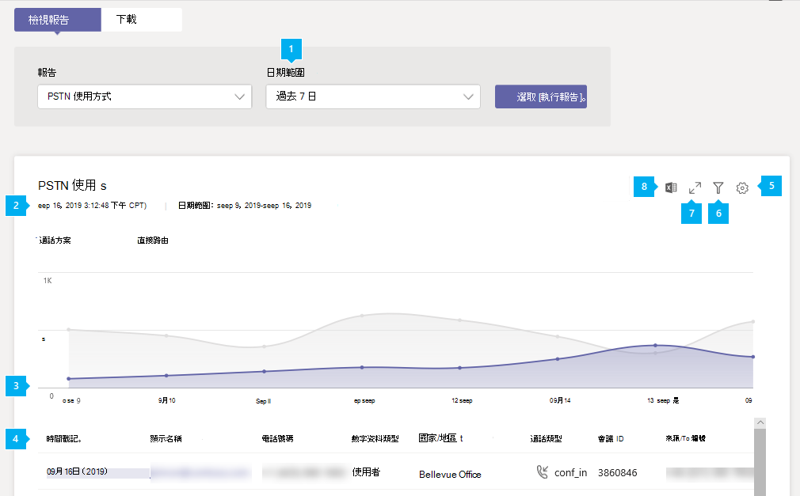

# Microsoft 團隊 PSTN 使用方式報告

Microsoft [團隊管理中心] 中的 [團隊 PSTN 使用方式] 報告可讓您在組織中進行通話和音訊會議活動的概覽。 如果您使用自己的電話運營商，您可以查看通話方案的詳細通話活動（如果您使用的是電話語音運營商），以及直接路由。

[**通話方案**] 索引標籤會顯示資訊，包括使用者在輸入和輸出 PSTN 通話中所花費的分鐘數，以及這些通話的成本。 [**直接路由**] 索引標籤會顯示您的資訊，包括 SIP 位址及呼叫開始和結束時間。 使用此報告中的資訊，深入瞭解貴組織中的 PSTN 使用量，並協助您調查、規劃及做出業務決策。

## 查看報表

1. 在 Microsoft [團隊管理中心] 的左導覽中，按一下 [**分析] & 報告** > **使用方式報告**。 在 [**查看報表**] 索引標籤的 [**報表**] 底下，選取 [ **PSTN 使用方式報告**]。
2. 在 [**日期範圍**] 底下，選取7或28天的預先定義範圍，或設定自訂範圍，然後選取 [**執行報表**]。

## 解讀報表

### 通話方案

|圖說文字 |描述  |
|--------|-------------|
|**1**   |您可以在過去7天、28天或您設定的自訂日期範圍中查看趨勢 |
|**2**   |每個報告都有產生的日期。 報告通常會反映來自啟用時間的24到48小時延遲時間。 |
|**3**   |X 軸是特定報表的已選取日期範圍。 Y 軸是在所選時段內的通話總數目。  將游標暫留在指定日期上的點上，即可查看該日期的總通話情況。  |
|**4**   |下表提供每個通話的 PSTN 使用量細分。 <ul><li>[**時間戳記（UTC）** ] 是呼叫開始的時間。</li><li>[**顯示名稱**] 是使用者的顯示名稱。 您可以按一下顯示名稱，移至 Microsoft 團隊系統管理中心的 [使用者設定] 頁面。</li><li>[**使用者名**] 是使用者的登入名稱。</li><li>[**電話號碼**] 是已接收撥入通話通話或撥出通話電話號碼的號碼。</li><li>**呼叫類型**：撥打電話為 PSTN 輸出或撥入通話，以及撥打電話類型（例如使用者或音訊會議發出的通話）。 您可能會看到的呼叫類型包括：  **團隊使用者通話類型**<ul><li>**user_in** -使用者收到輸入 PSTN 通話。</li><li>**user_out** -使用者設定出站 PSTN 通話</li><li>**user_out_conf** -使用者將兩個或多個 PSTN 參與者加入通話中，例如三向電話會議</li><li>**user_out_transfer** -使用者將來電轉接至 PSTN 號碼</li><li>**user_out_forwarding** -使用者將呼叫轉寄至 PSTN 號碼</li><li>**conf_in** -音訊會議橋接器的入站通話</li><li>**conf_out** -從音訊會議橋接的出站通話通常是將 PSTN 號碼新增到會議中</li></ul> **團隊機器人呼叫類型**<ul><li>**ucap_in** -對團隊 bot 的入站 PSTN 呼叫（例如自動語音應答或通話佇列）</li><li>**ucap_out** -來自團隊 bot （例如自動語音應答或通話佇列）的出站 PSTN 呼叫</li></ul> <li>**呼叫為**撥打的號碼。</li><li>[**國家或地區**] 是已撥的國家或地區。</li><li>[**寄件者**] 是撥打電話的號碼。</li><li>[**從國家或地區**] 是撥打通話位置的國家或地區。</li><li>[**收取費用**] 是支付給您帳戶之通話的金額或成本。 </li><li>**貨幣**是用來計算通話成本的貨幣類型。 </li><li>[**持續時間**] 是通話的連線時間。</li><li>**國內/國際**是根據使用者的位置，告訴您通話是國內（在國家或地區內）還是國際（位於國家或地區外）。</li><li>[**通話 id** ] 是通話的通話 id。 它是呼叫 Microsoft 支援時可以使用之通話的識別碼。</li><li>[ **Number type** ] 是使用者的電話號碼類型，例如免付費電話號碼的服務。 </li><li>[**國家或地區**] 是使用位置。 </li> <li>[**會議 id** ] 是音訊會議的會議 id。 </li><li>**功能**是通話使用的授權。 您可能會看到的授權類型包括：<ul><li>**MCOPSTNPP** -通訊點數</li><li>**MCOPSTN1** -國內通話方案（3000美元/1200 分歐盟方案）</li><li>**MCOPSTN2** -國際通話方案</li><li>**MCOPSTN5** -國內通話方案（120最小通話方案）</li><li>**MCOPSTN6** -國內通話方案（240最小通話方案）</li><li>**MCOMEETADD** -音訊會議</li><li>**MCOMEETACPEA** -每分鐘付款音訊會議</li></ul></li></ul> 若要在表格中查看您想要的資訊，請務必將資料行新增至資料表。|
|**500**   |選取 [**編輯欄**] 以新增或移除表格中的欄。 |
|**6**   |選取 [**篩選**]，依使用者名稱或通話類型篩選報表 |
|**utf-7**   |選取 [**全螢幕**]，以全螢幕模式查看報告。 |
|**型**   |您可以將報表匯出為 CSV 檔案，以便進行離線分析。 按一下 [**匯出至 Excel**]，然後在 [**下載**] 索引標籤上，按一下 [**下載**] 以在準備好時下載報告。|

### 直接路由

![系統管理中心 [直接路由 PSTN 使用狀況報告] 報告的螢幕擷取畫面](../media/teams-reports-pstn-usage-direct-routing-with-callouts.png "在 Microsoft 團隊系統管理中心使用編號標注直接路由 PSTN 使用方式報告的螢幕擷取畫面")

|圖說文字 |描述  |
|--------|-------------|
|**1**   |您可以在過去7天或28天的趨勢中查看報告。 |
|**2**   |每個報告都有產生的日期。 報告通常會反映來自啟用時間的24到48小時延遲時間。 |
|**3**   |X 軸是特定報表的已選取日期範圍。 Y 軸是在所選時段內的通話總數目。 將游標暫留在指定日期上的點上，即可查看該日期的總通話情況。  |
|**4**   |下表提供每個通話的 PSTN 使用量細分。 <ul><li>[**時間戳記（UTC）** ] 是呼叫開始的時間。</li><li>[**顯示名稱**] 是使用者的顯示名稱。 您可以按一下顯示名稱，移至 Microsoft 團隊系統管理中心的 [使用者設定] 頁面。 名稱也可以是 bot 的名稱，例如通話佇列或雲端自動語音應答。 </li><li>[ **Sip 位址**] 是指接收或撥打電話之使用者或 BOT 的 sip 位址。</li><li>**來電者號碼**是撥打通話的使用者號碼或 bot。 </li><li>[**被呼叫者號碼**] 是指已接聽通話的使用者號碼或 bot。 針對團隊使用者的撥入通話會成為團隊使用者，在來自團隊使用者的出站通話中，它會是 PSTN 使用者。 </li><li>**呼叫類型**：撥打電話為 PSTN 輸出或撥入通話，以及撥打電話類型（例如使用者或音訊會議發出的通話）。 您可能會看到的呼叫類型包括：  **團隊使用者通話類型**<ul><li>**dr_in** -使用者收到輸入 PSTN 通話</li><li>**dr_out** -使用者設定出站 PSTN 通話</li><li>**dr_out_user_conf** -使用者將 PSTN 參與者新增到通話中</li><li>**user_out_transfer** -使用者將來電轉接至 PSTN 號碼</li><li>**dr_out_user_forwarding** -使用者將呼叫轉寄至 PSTN 號碼</li><li>**dr_out_user_transfer** -使用者將來電轉接至 PSTN 號碼</li><li>**dr_emergency_out** -使用者進行緊急通話</li></ul> **團隊機器人呼叫類型**<ul><li>**dr_in_ucap** -對團隊 bot （例如自動語音應答或通話佇列）的入站 PSTN 呼叫</li><li>**dr_out_ucap** -來自團隊 bot （例如自動語音應答或通話佇列）的出站 PSTN 呼叫</li></ul> <li>[**呼叫**者] 是接聽通話的使用者號碼。</li><li>[**開始時間] （UTC）** 是 SIP proxy 在撥出通話（團隊/BOT 到 PSTN 使用者）上從 SBC 收到最終答案（sip 訊息 "200 OK"）的時間，或者在 sip Proxy 將邀請傳送至小組中的下一個躍點之後，在撥入呼叫（PSTN 使用者為團隊/Bot）。 </li><li>[**邀請時間（UTC）** ] 是在來自團隊使用者或 bot 呼叫給 SBC 的撥出通話中傳送初始邀請的時間，或透過來自 SBC 直接路由的 SIP Proxy 元件呼叫給小組或 bot 撥入呼叫。</li><li>**失敗時間（UTC）** 是呼叫失敗的時間。 僅限失敗的通話。 最終 SIP 程式碼、最終的 Microsoft 子代碼及最終 SIP 片語，提供通話失敗的原因，以及協助疑難排解。 </li><li>**[結束時間（UTC）** ] 是通話結束的時間（僅適用于成功的呼叫）。</li><li>[**持續時間**] 是通話的連線時間。</li><li>[ **Number type** ] 是使用者的電話號碼類型，例如免付費電話號碼的服務。 </li><li>[**媒體旁路**] 表示主幹是否已啟用媒體旁路功能。 </li> <li>**SBC FQDN**是會話邊界控制器（SBC）的完整功能變數名稱（FQDN）。 </li><li>**媒體的 Azure 區域**是在非旁路通話中作為媒體路徑使用的資料中心。 </li><li>[發**信號的 Azure 地區**] 是用來針對旁路與非旁路通話進行信號的資料中心。 </li><li>**事件種類**是通話的事件種類。 您將會看到成功呼叫成功，並嘗試失敗的通話。 </li><li>**最終 SIP 代碼**是通話結束的程式碼。</li><li>**最終的 Microsoft 子代碼**是指示發生的特定動作的程式碼。</li><li>**最終 sip 片語**是 sip 代碼與 Microsoft 子代碼的描述。</li><li>[**相關性 ID** ] 是呼叫 Microsoft 支援時可以使用之通話的唯一識別碼。</li><li>**共用的相關識別碼**只會顯示在可下載的 CSV 檔案中，且不存在於入口網站中。 共用的相關 ID 至少存在於兩個相互關聯的通話中。 請參閱下方的詳細描述。</li></ul> 若要在表格中查看您想要的資訊，請務必將資料行新增至資料表。|
|**500**   |選取 [**編輯欄**] 以新增或移除表格中的欄。 |
|**6**   |選取 [**全螢幕**]，以全螢幕模式查看報告。 |
|**utf-7**   |選取 [**匯出至 Excel** ]，以逗號分隔的檔案（CSV）下載資料以進行離線分析，或將它作為帳單系統的輸入。 |

#### 來電者/被叫方的欄位考慮

根據呼叫方向，來電者或叫用方程式名稱可以包含非 E164 的號碼。

這些欄位可以來自客戶 SBC。 SBC 可以傳送至直接路由的格式有三種： E. 164 個數字、非 E. 164 個數字和字串。

- 如果使用者使用的是 e. 164 號碼的使用者，則會有164個電話號碼。 
- 從非 E. 164 號碼撥打電話。 使用直接佈線的協力廠商 PBX 相互連接的使用者，就能呼叫小組使用者。 在這種情況下，來電者號碼可以是任何非 E. 164 個數字，例如 + 1001。 
- 垃圾郵件者來電，不會顯示數位，只是名稱，例如「內部收入服務」。 這個字串將會顯示在報表中。

#### 關於共用的相關識別碼

共用的相關識別碼只會存在於您下載的匯出 Excel 檔案中，並指出兩個或多個通話是相關的。 下列說明不同的案例，以及共用的相關識別碼存在時。

1.  Pstn 使用者1在團隊用戶端上名為「團隊使用者1」的 PSTN 端點上，通話類型 Dr_In，相關識別碼 57f28917-42k5-4c0c-9433-79734873f2ac，無共用的關聯 ID。
2.  小組使用者1在 PSTN 端點上稱為 PSTN 使用者1的團隊用戶端上，呼叫 type Dr_Out 2c12b8ca-62eb-4c48-b68d-e451f518ff4，無共用的相關識別碼。
3.  PSTN 使用者1在團隊用戶端上稱為團隊使用者2，呼叫類型 Dr_In f45e9a25-9f94-46e7-a457-84f5940efde9，共用相關識別碼 f45e9a25-9f94-46e7-a457-84f5940efde9。
4.  現有的呼叫3，相關 ID 為 "f45e9a25-9f94-46e7-a457-84f5940efde9"。 在與團隊使用者2通話中的 PSTN 使用者1。 團隊使用者2已傳送（盲人或顧問式）對團隊或 PSTN 使用者的呼叫、呼叫類型 Dr_Out_User_Transfer 45a1da7c-9e97-481a-8a05-3fe19a9a77e0、共用的相關識別碼 f45e9a25-9f94-46e7-a457-84f5940efde9。

## 匯出報表
按一下 [**匯出至 Excel**]，然後在 [**下載**] 索引標籤上，按一下 [**下載**] 以在準備好時下載報告。 匯出程式可能需要幾秒鐘到數分鐘的時間，才能完成，視資料數量而定。

這會匯出所有使用者的資料，並可讓您進行簡單的排序與篩選，以進行進一步分析。 匯出的檔案包含無法在線上報表中使用的其他欄位。 這些都可以用來進行疑難排解和自動化工作流程。

 您會收到名為「**通話. 匯出`[identifier]`」的 zip 檔案。zip**"，且識別碼是匯出的唯一識別碼，可以用來進行疑難排解。

如果您同時擁有通話方案和直接路由，匯出的檔案可能會包含這兩個產品的資料。 PSTN 使用狀況報告檔案將會有檔案名 "**PSTN.`[UTC date]`。csv**"與直接路由"**DirectRouting`[UTC date]`。csv**"。

 除了 PSTN 和直接路由檔案之外，封存還包含檔案 "**parameters. json**"，以及所選取的匯出時間範圍和功能。

匯出的檔案採用逗號分隔值（CSV）格式，符合[RFC 4180](https://tools.ietf.org/html/rfc4180)標準。 您可以在 Excel 或任何其他符合標準的編輯者中開啟檔案，而不需要任何轉換。

CSV 的第一列包含資料行名稱。 所有日期都是 UTC，且是[ISO 8601](https://en.wikipedia.org/wiki/ISO_8601)格式。

### 已匯出的 PSTN 使用狀況報告

 除非國家/地區專用的規章禁止將資料保留12個月，否則您可以從目前日期開始匯出一年的資料。

| # | 名稱 | [資料類型（SQL Server）](https://docs.microsoft.com/sql/t-sql/data-types/data-types-transact-sql) | 描述 |
| :-: | :-: | :-: |:------------------- |
| 0 | UsageId | `uniqueidentifier` | 唯一的呼叫識別碼 |
| 1 | 通話 ID | `nvarchar(64)` | [通話識別碼]。 不保證唯一 |
| pplx-2 | 會議 ID | `nvarchar(64)` | 音訊會議的識別碼 |
| 3 | 使用者位置 | `nvarchar(2)` | 使用者的國家/地區代碼， [ISO 3166-1 Alpha-2](https://en.wikipedia.org/wiki/ISO_3166-1_alpha-2) |
| 4 | AAD ObjectId | `uniqueidentifier` | 在 Azure Active Directory 中呼叫使用者的 ID。  在 bot 呼叫類型（ucap_in、ucap_out）中，此和其他使用者資訊將會是 null/空。 |
| 500 | UPN | `nvarchar(128)` | Azure Active Directory 中的 UserPrincipalName （登入名稱）。 這通常與使用者的 SIP 位址相同，而且可以與使用者的電子郵件地址相同 |
| 6 | 使用者顯示名稱 | `nvarchar(128)` | 使用者的顯示名稱 |
| utf-7 | 來電顯示 | `nvarchar(128)` | 已接收撥入通話通話或撥出通話電話號碼的號碼。 [E. 164](https://en.wikipedia.org/wiki/E.164)格式 |
| 型 | 通話類型 | `nvarchar(32)` | 通話是 PSTN 輸出或撥入通話，以及撥打電話類型（例如使用者或音訊會議發出的通話） |
| 9 | 數位類型 | `nvarchar(16)` | 使用者的電話號碼類型，例如免付費電話號碼的服務 |
| 第 | 國內/國際 | `nvarchar(16)` | 通話是國內（在國家或地區內）或國際（在國家或地區外），根據使用者的位置來決定 |
| 11 | 已撥號目的地 | `nvarchar(64)` | 已撥打國家或地區 |
| 之間 | 目的地編號 | `nvarchar(32)` | 以[164](https://en.wikipedia.org/wiki/E.164)格式撥打的號碼 |
| 合 | 開始時間 | `datetimeoffset` | 呼叫開始時間 |
| 4 | 結束時間 | `datetimeoffset` | 通話結束時間 |
| 工資 | 持續時間秒 | `int` | 通話的連線時間 |
| 位 | 連線費用 | `numeric(16, 2)` | 連接費價格 |
| 11x17 | 收費 | `numeric(16, 2)` | 支付給帳戶所需通話的金額或成本 |
| 滿 | 貨幣 | `nvarchar(3)` | 用來計算通話成本的貨幣類型（[ISO 4217](https://en.wikipedia.org/wiki/ISO_4217)） |
| 合 | 功能 | `nvarchar(32)` | 通話所用的授權 |

### 已匯出直接路由使用方式報告

除非國家/地區專用的規章禁止保留該期間的資料，否則您最多可以將資料從目前日期匯出到五個月（150天）。

| # | 名稱 | [資料類型（SQL Server）](https://docs.microsoft.com/sql/t-sql/data-types/data-types-transact-sql) | 描述 |
| :-: | :-: | :-: |:------------------- |
| 0 | Id | `uniqueidentifier` | 唯一的呼叫識別碼 |
| 1 | SIP 位址 | `nvarchar(128)` | 撥打或接聽電話的使用者或 bot 的位址。 請注意，這實際上是 Azure Active Directory 中的實際 UserPrincipalName （UPN，登入名稱），通常與 SIP 位址相同 |
| pplx-2 | 顯示名稱 | `nvarchar(128)` | 在 Office 365 入口網站中設定的使用者名稱或通話 bot （例如通話佇列或自動語音應答） |
| 3 | 使用者所在國家/地區 | `nvarchar(2)` | 使用者的國家/地區代碼， [ISO 3166-1 Alpha-2](https://en.wikipedia.org/wiki/ISO_3166-1_alpha-2) |
| 4 | 邀請時間 | `datetimeoffset` | 當初始邀請是從團隊使用者或 bot 呼叫到 SBC，或從 SBC 直接路由的 SIP Proxy 元件呼叫給團隊或 bot 撥入時 |
| 500 | 開始時間 | `datetimeoffset` | SIP proxy 收到最終的答案（SIP 訊息 "200 OK"）的時間，即從輸出的 SBC （團隊/Bot 到 PSTN 使用者），或 SIP Proxy 在撥入呼叫（PSTN 使用者至團隊/Bot）之後，將邀請傳送至團隊後端的下一個躍點。 對於失敗與未接聽的通話，這可以等於邀請或失敗時間 |
| 6 | 失敗時間 | `datetimeoffset` | 僅存在失敗（未完全建立）通話 |
| utf-7 | 結束時間 | `datetimeoffset` | 只適用于成功（完全建立的）通話。 通話結束的時間 |
| 型 | Duration （秒） | `int` | 通話持續時間 |
| 9 | 成功案例 | `nvarchar(3)` | [是/否]。 成功或嘗試 |
| 第 | 來電者號碼 | `nvarchar(32)` | 撥打電話之使用者或 bot 的號碼。 在輸入時，如果是 PSTN 使用者，就會將它設為「團隊」使用者電話的外部使用者電話號碼。 |
| 之間 | 被呼叫者號碼 | `nvarchar(32)` | 接收通話之使用者或 bot 的號碼。 在 [輸入至小組使用者] 呼叫它將是 [小組] 使用者，在 [由小組使用者通話的出站] 中，它將是 PSTN 使用者 |
| 合 | 通話類型 | `nvarchar(32)` | 通話類型和方向 |
| 4 | 媒體的 Azure 區域 | `nvarchar(8)` | 在非旁路通話中用於媒體路徑的資料中心 |
| 工資 | Azure 地區以進行信號 | `nvarchar(8)` | 針對旁路與非旁路通話的信號所用的資料中心 |
| 位 | 最終 SIP 代碼 | `int` | 通話結束的程式碼， [RFC 3261](https://tools.ietf.org/html/rfc3261) |
| 11x17 | 最終的 Microsoft 子代碼 | `int` | 除了 SIP 代碼之外，Microsoft 還提供指示特定問題的子代碼 |
| 滿 | 最終 SIP 片語 | `nvarchar(256)` | SIP 代碼與 Microsoft 子代碼的描述 |
| 合 | SBC FQDN | `nvarchar(64)` | 會話邊界控制器的完整功能變數名稱 |
| 20 | 媒體旁路 | `nvarchar(3)` | [是/否]。 指出是否已針對媒體旁路啟用主幹 |
| 日前 | 共用的相關識別碼 | `uniqueidentifier` | 表示兩個或多個通話是相關的 |

## 相關主題

- [團隊分析和報告](teams-reporting-reference.md)
