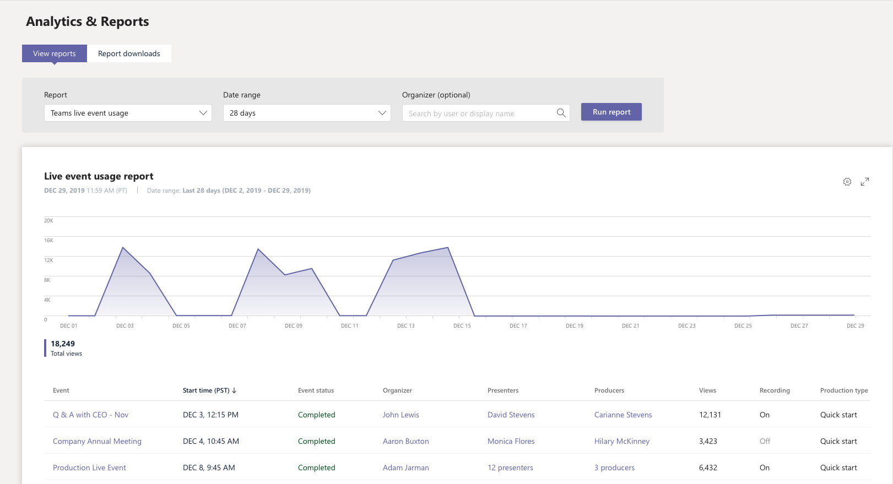

# Microsoft 團隊即時事件使用量報告Microsoft Teams live event usage report

Microsoft 團隊系統管理中心的 [小組即時事件使用量] 報告會顯示您組織中的即時事件的活動概覽。The Teams live event usage report in the Microsoft Teams admin center shows you the activity overview for live events held in your organization. 您可以查看使用方式資訊, 包括事件狀態、開始時間、視圖, 以及每個事件的生產類型。You can view usage information, including event status, start time, views, and production type for each event. 您可以深入瞭解使用狀況趨勢, 並查看貴組織的排程、提出及產生即時事件。You can gain insight into usage trends and see who in your organization schedules, presents, and produces live events. 

![Microsoft 團隊系統管理中心的 [小組即時事件使用量] 報告螢幕擷取畫面]系統(../media/teams-live-event-usage-report.png "管理中心 [團隊使用方式] 報表的螢幕擷取畫面")

## 查看報表View the report

1. 在 Microsoft [團隊管理中心] 的左導覽中, 按一下 [**分析] & 報表**], 然後在 [**報表**] 底下, 選取 [**團隊即時事件使用量**]。In the left navigation of the Microsoft Teams admin center, click **Analytics & reports**, and then under **Report**, select **Teams live event usage**.
2. 在 [**日期範圍**] 底下, 選取預先定義的範圍或設定自訂範圍。Under **Date range**, select a predefined range or set a custom range. 您可以將範圍設定為在目前日期之前或之後的六個月內顯示資料。You can set a range to show  data up to a year, six months before and after the current date.
3. 可選在 [**召集人**] 底下, 您可以選擇只顯示由特定使用者組織的即時事件。(Optional) Under **Organizer**, you can choose to show only live events organized by a specific user.
4. 按一下 [**執行報表**]。Click **Run report**.  

## 解讀報表Interpret the report

![Microsoft 團隊系統管理中心的 [小組即時事件使用量] 報告螢幕擷取畫面](../media/teams-live-event-usage-report-with-callouts.png "具有編號標注之系統管理中心的 [小組] 即時事件使用方式報告螢幕擷取畫面")

|圖說文字Callout |說明Description  |
|--------|-------------|
|**sr-1****1**   |您可以在過去7天、28天或您所設定的自訂日期範圍中, 查看 [團隊即時事件] 報表的趨勢。The Teams live event report can be viewed for trends over the last 7 days, 28 days, or a custom date range that you set. |
|**pplx-2****2**   |每個報告都有產生的日期。Each report has a date for when it was generated. 當頁面重新整理時, 報告會反映接近的即時活動。The report reflects near real time activity when the page is refreshed. |
|**3****3**   |<ul><li>圖表上的 X 軸是報表所選取的日期範圍。The X axis on the chart is the selected date range for the report.</li> <li> Y 軸是總計的視圖數。The Y axis is the total view count.</li> </ul>將游標停留在指定日期上的點上, 即可查看該日期上所有即時事件的視圖數。Hover over the dot on a given date to see the number of views across all live events on that date.|
|**4****4**   |下表提供每個即時事件的細目分類。The table gives you a breakdown of each live event. <ul><li>**事件**是即時事件的顯示名稱。**Event** is the display name of the live event. 按一下事件名稱, 取得事件的[詳細資料](#view-event-details)。Click the the event name to [get more details](#view-event-details) about the event. </li> <li>[**開始時間**] 指的是事件的開始日期和時間。**Start Time** refers to the start date and time of the event.</li> <li>**事件狀態**顯示事件是否已發生。**Event Status** shows whether the event has taken place.  </li><li>[**召集人**] 是事件召集人的名稱。**Organizer** is the name of the event organizer.</li> <li>**演示**者是事件簡報者的名稱。**Presenters** are the names of the  event presenters.</li><li>**發生器**是事件發生器的名稱。**Producers** are the names of the event producers.</li><li>[**視圖**] 是唯一的視圖數。**Views** is the number of unique views.</li><li>[**錄製**] 會顯示 [錄製] 設定為 [開啟] 或 [關閉]。**Recording** shows whether the recording setting is on or off.</li><li>[**生產類型**] 會顯示事件是在團隊中產生, 還是由外部應用程式或裝置產生。**Production Type** shows whether the event is produced in Teams or by an external application or device.</li></li> </ul>請注意, 如果使用者帳戶已不存在於 Azure AD 中, 則使用者名稱會在資料表中顯示為 "--"。Note that if a user account no longer exists in Azure AD, the user name is displayed as "--" in the table.   若要在表格中查看您想要的資訊, 請務必將資料行新增至資料表。To see the information that you want in the table, make sure to add the columns to the table. |
|**500****5**   |選取 [**編輯欄**] 以新增或移除表格中的欄。Select **Edit columns** to add or remove columns in the table.|

## 查看事件詳細資料View event details

[即時事件詳細資料] 頁面提供即時事件的詳細資料摘要, 並列出與事件相關聯的所有檔案, 包括記錄及錄製。The live event details page gives you a summary of the details of a live event and lists all the files, including transcripts and recordings, associated with the event. 按一下檔案名以查看或下載檔案。Click a file name to view or download the file.

如果您的組織已啟用[Hive](https://www.hivestreaming.com/partners/integration-partners/microsoft/) ECDN 或[Kollective](https://kollective.com) eCDN, 您可以按一下 [合作夥伴報告] 連結來取得其他出席者分析。If your organization is enabled for [Hive](https://www.hivestreaming.com/partners/integration-partners/microsoft/) eCDN or [Kollective](https://kollective.com) eCDN, you can get additional attendee analytics by clicking the partner report link.

## 相關主題Related topics
- [團隊分析和報告Teams analytics and reporting](teams-reporting-reference.md)
- [什麼是團隊即時活動？What are Teams live events?](../teams-live-events/what-are-teams-live-events.md)