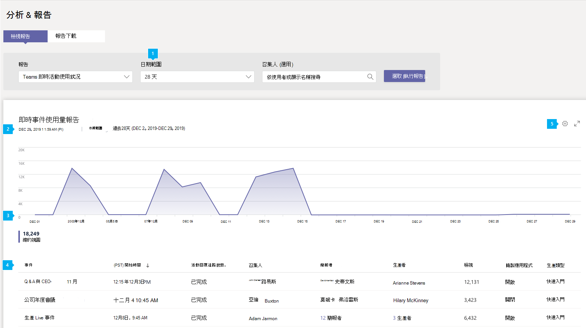

# Microsoft Teams活動使用方式報告Microsoft Teams live event usage report

系統Teams系統管理中心中的即時Microsoft Teams報告會顯示貴組織中即時活動的活動概觀。The Teams live event usage report in the Microsoft Teams admin center shows you the activity overview for live events held in your organization. 您可以針對每個事件查看使用方式資訊，包括事件狀態、開始時間、視圖及生產類型。You can view usage information, including event status, start time, views, and production type for each event. 您可以深入瞭解使用趨勢，並查看貴組織中誰排程、進行展示，以及製作即時活動。You can gain insight into usage trends and see who in your organization schedules, presents, and produces live events.

## 查看即時活動使用方式報告View the live event usage report

1. 在系統管理中心的左側導Microsoft Teams，按一下 [**分析&報告**  >  **使用方式報告**。In the left navigation of the Microsoft Teams admin center, click **Analytics & reports** > **Usage reports**. On the **View reports** tab, under **Report**, select **Teams live event usage**.On the **View reports** tab, under **Report**, select **Teams live event usage**.
2. 在 **日期範圍** 下，選取預先定義的範圍或設定自訂範圍。Under **Date range**, select a predefined range or set a custom range. 您可以將範圍設定為最多顯示一年、目前日期之前和之後六個月的資料。You can set a range to show  data up to a year, six months before and after the current date.
3.  (選) 在召集人 **下，您可以選擇** 只顯示由特定使用者組織的即時活動。(Optional) Under **Organizer**, you can choose to show only live events organized by a specific user.
4. 按一下 **[執行報表**> 。Click **Run report**.  

    

## 解譯報表Interpret the report

|標注Callout |描述Description  |
|--------|-------------|
|**1****1**   |您可以Teams即時附隨報告，查看過去 7 天、28 天的趨勢，或您設定自訂的日期範圍。The Teams live event report can be viewed for trends over the last 7 days, 28 days, or a custom date range that you set. |
|**2****2**   |每個報表都有產生日期。Each report has a date for when it was generated. 報表會反映頁面重新更新時接近即時的活動。The report reflects near real time activity when the page is refreshed. |
|**3****3**   |<ul><li>圖表上的 X 軸是報表的選取日期範圍。The X axis on the chart is the selected date range for the report.</li> <li> Y 軸是總的視圖計數。The Y axis is the total view count.</li> </ul>將游標停留在給定日期的點上方，以查看該日期所有即時事件的觀看次數。Hover over the dot on a given date to see the number of views across all live events on that date.|
|**4****4**   |表格會提供每個即時活動的明細。The table gives you a breakdown of each live event. <ul><li>**事件** 是即時事件的顯示名稱。**Event** is the display name of the live event. 按一下事件名稱 [以取得活動](#view-event-details) 的詳細資訊。Click the the event name to [get more details](#view-event-details) about the event. </li> <li>**開始時間** 是指事件的開始日期和時間。**Start Time** refers to the start date and time of the event.</li> <li>**事件狀態** 會顯示事件是否已發生。**Event Status** shows whether the event has taken place.  </li><li>**召集人** 是活動召集人的名稱。**Organizer** is the name of the event organizer.</li> <li>**簡報者** 是活動簡報者的名稱。**Presenters** are the names of the  event presenters.</li><li>**製作** 人是活動製作人的名稱。**Producers** are the names of the event producers.</li><li>**視圖** 是活動完成之後的唯一視圖數目。**Views** is the number of unique views after the event is completed .</li><li>**錄製** 會顯示錄製設定是已啟用或關閉。**Recording** shows whether the recording setting is on or off.</li><li>**生產類型** 會顯示事件是以 Teams或外部應用程式或裝置產生。**Production Type** shows whether the event is produced in Teams or by an external application or device.</li></li> </ul>請注意，如果 Azure AD 中不再有使用者帳戶，使用者名稱會顯示為 「--」于表格中。Note that if a user account no longer exists in Azure AD, the user name is displayed as "--" in the table.   若要在表格中查看您想要的資訊，請務必新增欄至資料表。To see the information that you want in the table, make sure to add the columns to the table. |
|**5****5**   |選取 **編輯欄** 以新增或移除表格中的欄。Select **Edit columns** to add or remove columns in the table.|

## 注釋Notes
顯示最多 100 個符合目前報告準則的即時事件。Showing up to 100 live events that match the current report criteria. 若要查看更多即時活動，請應用日期篩選來縮減清單大小。To see more live events, apply date filters to reduce the list size.

## 查看活動詳細資料View event details

即時活動詳細資料頁面提供即時活動詳細資料摘要，並列出與活動相關的所有檔案，包括文字記錄與錄製。The live event details page gives you a summary of the details of a live event and lists all the files, including transcripts and recordings, associated with the event. 按一下檔案名以查看或下載檔案。Click a file name to view or download the file.

如果貴組織已啟用 [Hive](https://www.hivestreaming.com/partners/integration-partners/microsoft/) eCDN 或 [Kollective](https://kollective.com) eCDN，您可以按一下合作夥伴報告連結，取得其他出席者分析。If your organization is enabled for [Hive](https://www.hivestreaming.com/partners/integration-partners/microsoft/) eCDN or [Kollective](https://kollective.com) eCDN, you can get additional attendee analytics by clicking the partner report link.

## 相關主題Related topics

- [Teams分析與報告Teams analytics and reporting](teams-reporting-reference.md)
- [什麼是 Teams 即時活動？What are Teams live events?](../teams-live-events/what-are-teams-live-events.md)
