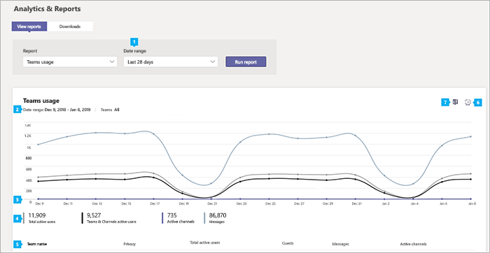

# Microsoft 團隊使用量報告Microsoft Teams usage report

Microsoft 團隊系統管理中心中的 [團隊使用量] 報告可讓您大致瞭解團隊中的使用狀況活動, 包括作用中使用者和頻道的數量, 讓您可以快速查看貴組織中的使用者數是使用團隊進行通訊, 以及整合.The Teams usage report in the Microsoft Teams admin center gives you an overview of the usage activity in Teams, including the number of active users and channels, so you can quickly see how many users across your organization are using Teams to communicate and collaborate. 您可以查看小組的使用方式資訊, 包括每個小組中的作用中使用者數與頻道、來賓和訊息。You can view usage information for  teams, including the number of active users and channels, guests, and messages in each team.

系統![管理中心 [團隊使用方式] 報表的螢幕擷取畫面](../media/teams-reports-teams-usage.png "Microsoft 團隊系統管理中心 [團隊使用方式] 報表的螢幕擷取畫面")

## 查看報表View the report

1.In [Microsoft 團隊系統管理中心] 的左側導覽中, 按一下 [**分析] & 報表**], 然後在 [**報表**] 底下, 選取 [**團隊使用方式**]。1.In the Microsoft Teams admin center, in the left navigation, click **Analytics & reports**, and then under **Report**, select **Teams usage**.
2. 在 [**日期範圍**] 底下, 選取一個範圍, 然後按一下 [**執行報表**]。Under **Date range**, select a range, and then click **Run report**.

## 解讀報表Interpret the report

系統![管理中心 [團隊使用方式] 報表的螢幕擷取畫面](../media/teams-reports-teams-usage-with-callouts.png "[Microsoft 團隊系統管理中心] 中的 [團隊使用方式] 報告螢幕擷取畫面 (含編號標注"))

|圖說文字Callout |說明Description  |
|--------|-------------|
|**sr-1****1**   |您可以針對過去7天或28天的趨勢, 查看 [團隊使用狀況] 活動報告。The Teams usage activity report can be viewed for trends over the last 7 days or 28 days. |
|**pplx-2****2**   |每個報告都有產生此報告的日期。Each report has a date for when this report was generated. 報告通常會反映來自啟用時間的24到48小時延遲時間。The reports usually reflect a 24 to 48 hour latency from time of activity. |
|**3****3**   |<ul><li>圖表上的 X 軸是報表所選取的日期範圍。The X axis on the chart is the selected date range for the report.</li> <li> Y 軸是作用中專案或活動的計數。The Y axis is the count of active items or activity.</li> </ul>將游標暫留在代表指定日期的專案或活動點上, 即可查看該專案或該日期的活動實例數。Hover over the dot representing an item or activity on a given date to see the number of instances of that item or activity on that given date.|
|**4****4**   |您可以按一下圖例中的專案, 篩選您在圖表上看到的內容。You can filter what you see on the chart by clicking an item in the legend. 例如, 按一下 [**總**作用中的使用者]、[**團隊] & [頻道**作用中的使用者]、[作用中**通道**] 或 [**郵件**], 只會看到與每個資訊相關For example, click  **Total active users**, **Teams & Channels active users**,  **Active channels**, or **Messages** to see only the info related to each one. 變更此選取範圍不會變更表格中的資訊。Changing this selection doesn’t change the information in the table. |
|**500****5**   |此表格提供依團隊進行的使用方式細分。The table gives you a breakdown of usage by team. <ul><li>[**團隊名稱**] 是團隊的顯示名稱。**Team name** is the display name of the team. 您可以按一下團隊名稱, 移至 Microsoft 團隊系統管理中心的小組 [設定] 頁面。You can click the team name to go to the team's settings page in the Microsoft Teams admin center. </li> <li>**隱私權**指的是私人小組或公用小組。**Privacy** refers to whether the team is a private team or public team.</li> <li>[作用中的**使用者**] 是團隊中在指定時段內作用中的使用者數目。**Active users** is the number of active users in the team in the specified time period.</li><li>[**來賓**] 是團隊中指定時間內的來賓人數。**Guests** is the number of guests in the team in the specified time period.</li> </li> </ul>請注意, 如果使用者帳戶已不存在於 Azure AD 中, 則使用者名稱會在資料表中顯示為 "--"。Note that if a user account no longer exists in Azure AD, the user name is displayed as "--" in the table.   若要在表格中查看您想要的資訊, 請務必將資料行新增至資料表。To see the information that you want in the table, make sure to add the columns to the table. |
|**6****6**   |選取 [**編輯欄**] 以新增或移除表格中的欄。Select **Edit columns** to add or remove columns in the table.|
|**utf-7****7**   |您可以將報表匯出為 CSV 檔案, 以便進行離線分析。You can export the report to a CSV file for offline analysis. 按一下 [**匯出至 Excel**], 然後在 [**下載**] 索引標籤上, 按一下 [**下載**] 以在準備好時下載報告。Click **Export to Excel**, and then on the **Downloads** tab, click **Download** to download the report when it's ready. ![[下載] 索引標籤的螢幕擷取畫面, 顯示已匯出的報告供下載](../media/teams-reports-export-to-csv.png)|

## 相關主題Related topics
- [團隊分析和報告Teams analytics and reporting](teams-reporting-reference.md)
