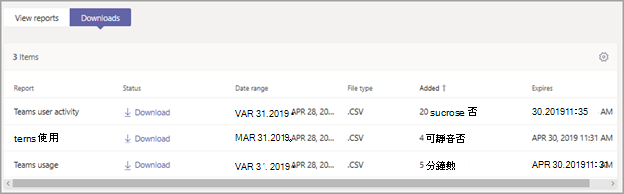

# Microsoft Teams使用方式報告

Teams 系統管理中心中的 Microsoft Teams Teams 使用方式報告提供 Teams 中的使用活動概觀，包括使用中使用者和頻道的數量，讓您快速查看組織中有多少使用者使用 Teams 進行通訊和共同作業。 您可以查看團隊的使用資訊，包括每個團隊中的使用中使用者和頻道數目、來賓和訊息。

## 查看使用方式報告

1. 在系統管理中心的左側導Microsoft Teams，按一下 [分析&**報告**  >  **使用方式報告**。 On the **View reports** tab, under **Report**, select **Teams usage**.
2. 在 **[日期範圍**」 下，選取範圍，然後按一下 [ **執行報表**> 。

    

## 解譯報表

|標注 |描述  |
|--------|-------------|
|**1**   |您可以Teams使用方式活動報告，查看過去 7 天、30 天或 90 天內的趨勢。 |
|**2**   |每個報表都有產生此報表的日期。 報告通常會反映啟用時間起 24 到 48 小時的延遲。 |
|**3**   |<ul><li>圖表上的 X 軸是報表的選取日期範圍。</li> <li> Y 軸是活動專案或活動的計數。</li> </ul>將游標停留在代表某個日期上某個專案或活動的點上，以查看該日期上該專案或活動的實例數目。|
|**4**   |您可以按一下圖例中的專案來篩選圖表上看到的專案。 例如，按一下 **[** 活動使用者總數Teams &頻道活動使用者、使用中頻道或訊息，只查看每個使用者的相關資訊。 變更此選取範圍不會變更表格中的資訊。 |
|**5**   |表格提供您團隊使用方式的明細。 <ul><li>**團隊名稱** 是團隊的顯示名稱。 您可以按一下團隊名稱，前往系統管理中心中的小組Microsoft Teams頁面。 </li> <li>**隱私權** 是指團隊是私人團隊還是公開團隊。</li> <li>**活動使用者** 是團隊中指定時段內的活動使用者數目。</li><li>**來賓** 是團隊中指定時段的來賓人數。</li> <li>**活動通道** 是指定時段內至少有一個使用中使用者的頻道數目。</li> <li>**張貼訊息** 是指定時段內頻道中所有張貼郵件的數量。</li> <li>**回復郵件** 是指定時段內頻道中所有回復郵件的個數。</li> <li>**已組織會議** 是使用者在指定的時段內組織的排定和臨時會議數目。 </li><li>**緊急郵件** 是指定時段內所有緊急郵件的編號。</li><li>**回應** 是指定時段內對郵件的所有反應數目。</li><li>**提及** 是指定時段內訊息中所有提及次數的個數。</li><li>**頻道訊息** 是團隊使用者在指定的時段內，在小組聊天中張貼的唯一訊息數目。</li> </li> </ul>請注意，如果 Azure AD 中不再有使用者帳戶，使用者名稱會顯示為 「--」于表格中。   若要在表格中查看您想要的資訊，請務必新增欄至資料表。 |
|**6**   |選取 **編輯欄** 以新增或移除表格中的欄。|
|**7**   |您可以將報表匯出至 CSV 檔案，進行離線分析。 按一下 **[匯出** Excel，然後在 [下載>選項卡上，按一下[下載以在報表準備就緒時下載報表。  |
|**8** |圖表中的時間系列資料點會顯示在租使用者處匯總的不同使用量度量|
|**9** |表格式資料代表每個小組匯總的不同使用量度量|

[!INCLUDE [teams-reports-definitions](../includes/teams-reports-definitions.md)]

## 相關主題

- [Teams 分析與報告](teams-reporting-reference.md)
