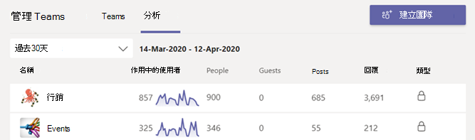
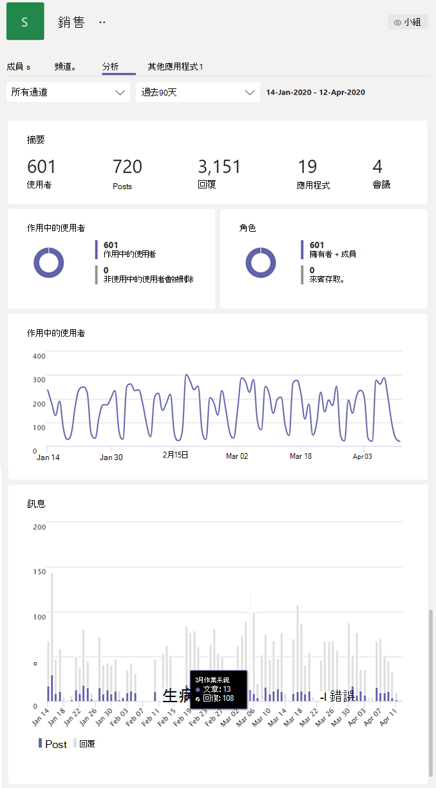
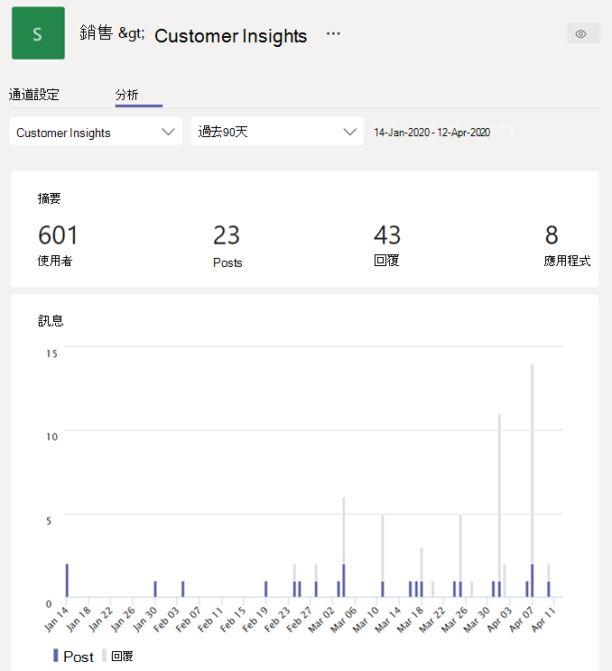

# 在 Teams

在 Microsoft Teams中，使用者可以查看他們參與的團隊和頻道分析。 這項資訊可讓使用者深入瞭解團隊的使用模式和活動。 使用者可以從三個層級查看活動使用者數目、文章、回復等資料。

- **跨團隊分析** 可讓使用者在單一清單視圖中全面概觀其成員或擁有者之所有團隊的使用狀況資料。
- **每個小組分析** 可讓使用者更精細地查看，顯示特定團隊的使用狀況資料。
- **每個通道分析** 可讓使用者更精細地查看，顯示特定頻道的使用狀況資料。

使用者可以篩選這些任何一個視圖，以查看指定時段的資料。

## 查看跨小組分析

1. 在 Teams中，按一下團隊清單底部的 [加入或建立團隊的旁邊，按一下 **[管理團隊>**。
2. 按一下 [ **分析>** 選項卡。
3. 選取日期範圍以顯示您為成員或擁有者之所有團隊的使用狀況資料。

    

    |項目 |描述  |
    |--------|-------------|
    |**名稱**   |團隊名稱。 |
    |**使用中使用者**   |在指定的時段內，團隊中的使用中使用者數目和團隊活動的趨勢線。
    |**人員**   |在指定的時段內，團隊中的人員總數。 這包括團隊擁有者、小組成員和來賓。|
    |**來賓**   |在指定的時段內，團隊中的來賓人數。 |
    |**職位**   |在指定的時段內，在小組聊天中張貼的新訊息數目。 |
    |**答覆**   |在指定的時段內，小組聊天中的回復數目。 |
    |**類型**   |團隊是私人團隊還是公開團隊。|

## 查看每個小組的分析

1. 在 Teams中，前往您想要的團隊，按一下 [更多選項 **(...) ，** 然後按一下 [**管理團隊**> 。
2. 按一下 [ **分析>** 選項卡。
4. 選取日期範圍以顯示團隊的使用狀況資料。  

    

    |項目 |描述  |
    |--------|-------------|
    |**摘要**   |團隊活動摘要，包括下列專案：<ul><li>**使用者**：指定時段的使用者總數。 這包括團隊擁有者、小組成員和來賓。</li> <li>**文章**：在指定的時段內，在小組聊天中張貼的新訊息數目。</li><li>**回復：** 在指定的時段內，小組聊天中的回復數目。</li> <li>**應用程式**：新加入團隊的應用程式數目。</li><li>**會議**：Teams團隊層級組織的會議數目。</li> </ul> |
    |**使用中使用者**   |使用中及非使用中使用者的數量。|
    |**作用**   |按角色顯示的使用者數目，包括團隊擁有者、小組成員和來賓。|
    |**使用中使用者** 圖表  |每日使用中次數。 將游標停留在給定日期上的點，以查看該日期上的使用中使用者數目。|
    |**訊息** 圖表  |根據日期在小組聊天中張貼的郵件總數。 將游標停留在給定日期的點上，以查看該日期張貼的新文章和回復數目。|

> [!TIP]
> 您也可以按一下跨小組分析視圖中的清單中的團隊，來查看每個小組 [的分析](#view-cross-team-analytics)。

## 查看每頻道分析

1. 在 Teams中，前往您想要的頻道，按一下 [更多選項 **(...) ，** 然後按一下 [**管理頻道**> 。
2. 按一下 [ **分析>** 選項卡。
3. 選取日期範圍以顯示頻道的使用狀況資料。  

    

    |項目 |描述  |
    |--------|-------------|
    |**摘要**   |頻道活動摘要，包括下列專案：<ul><li>**使用者**：指定時段的使用者總數。 這包括團隊擁有者、小組成員和來賓。</li> <li>**文章**：指定時段內張貼至頻道的新郵件數目。</li><li>**回復**：頻道中指定時段內回復的數量。</li> <li>**應用程式**：新加入頻道的應用程式數目。</li> </ul> |
    |**訊息** 圖表  |根據日期張貼至頻道聊天的郵件總數。 將游標停留在給定日期的點上，以查看該日期張貼的新文章和回復數目。|

> [!TIP]
> 您也可以在每團隊分析視圖的下拉式清單方塊中選取頻道，來查看每個頻道 [的分析](#view-per-team-analytics)。
    
> [!NOTE]
> 我們將作用中使用者定義為在桌面用戶端、行動用戶端和 Web 用戶端中執行刻意動作的使用者。 刻意採取動作的範例包括開始聊天、撥打電話、共用檔案、在團隊中編輯檔、參與會議等等。 我們會排除被動式動作，例如自動啟動、最小化螢幕，或關閉應用程式。 我們也會取消對單一使用者識別碼的所有動作進行解說。

## 相關主題

- [為小組查看分析](https://support.office.com/article/view-analytics-for-your-teams-5b8ad4b1-af34-4217-aff4-cd11a820b56b)
- [Teams 分析與報告](teams-reporting-reference.md)