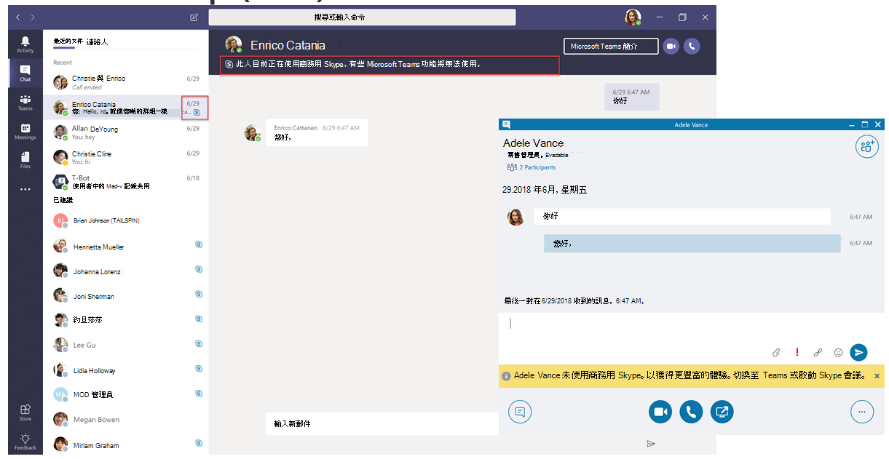

# 瞭解 Microsoft 團隊及商務用 Skype 的共存與互通性Understand Microsoft Teams and Skype for Business coexistence and interoperability

本文是您在升級歷程的專案定義階段的一部分，您可以在建立贊助聯盟及專案小組，並定義專案的範圍、目標及願景之後，完成這個活動。This article is part of the Project Definition stage of your upgrade journey, an activity you complete after you create a sponsorship coalition and project team and define the scope, goals, and vision for your project. 繼續之前，請確認您已完成下列活動：Before proceeding, confirm that you've completed the following activities:

- [已登記您的專案干係人Enlisted your project stakeholders](upgrade-enlist-stakeholders.md)
- [已定義您的專案範圍Defined your project scope](https://aka.ms/SkypetoTeams-Scope)

如果貴組織是使用商務用 Skype，且您開始將團隊與商務用 skype 搭配使用，或是您開始升級至小組，請務必瞭解這兩個應用程式是如何共存、何時以及其交互操作方式，以及如何從商務用 Skype 升級至團隊的最終升級。If your organization uses Skype for Business today and you are starting to use Teams alongside Skype for Business—or you are starting to upgrade to Teams—it's important to understand how the two applications coexist, when and how they interoperate, and how to manage users' migration all the way to their eventual upgrade from Skype for Business to Teams.

> [!Tip]
> 請觀看下列會話，瞭解[共存與互通性](https://aka.ms/teams-upgrade-coexistence-interop)。Watch the following session to learn about [Coexistence and Interoperability](https://aka.ms/teams-upgrade-coexistence-interop).
>
> 此外，您還可以加入即時、互動式討論會，我們將會分享指導方針、最佳做法，以及專為開始升級規劃與實施的資源。Additionally, you can join us for live, interactive workshops in which we'll share guidance, best practices, and resources designed to kick start upgrade planning and implementation.
>
> 首先加入[升級會話方案](https://aka.ms/SkypeToTeamsPlanning)，以開始使用。Join the [Plan your upgrade](https://aka.ms/SkypeToTeamsPlanning) session first to get started.

## 團隊與商務用 Skype 的共存Coexistence of Teams and Skype for Business

除了共同作業功能之外，小組還提供聊天、通話和會議功能。In addition to collaboration capabilities, Teams delivers chat, calling, and meeting capabilities. 視您選擇部署團隊的方式而定，這些功能可能會與商務用 Skype 針對特定使用者所提供的功能重迭。Depending on how you choose to deploy Teams, these capabilities may overlap with the capabilities delivered by Skype for Business for a given user. 預設模式是在商務用 Skype 中使用功能重迭來執行團隊;不過，使用者可以指派幾種共存模式（也稱為升級模式），以確保這些功能不會與該使用者重疊（在這種情況下，小組與商務用 Skype 之間提供互通性）。The default mode is to run Teams alongside Skype for Business with the capabilities overlap; however, a user can be assigned one of several coexistence modes (also known as upgrade modes) that were designed to ensure that these capabilities don't overlap for that user (in which case interoperability between Teams and Skype for Business is available). 例如，如果您的商務用 Skype 伺服器內部部署資產有複雜的企業語音部署，但想要讓您的使用者儘快享有新式會議，您可能會想要先以備用路徑來評估[會議](meetings-first.md)。For example, if you have significant Skype for Business Server on-premises assets with a complex Enterprise Voice deployment but want your users to enjoy modern meetings as quickly as possible, you might want to evaluate [Meetings First](meetings-first.md) as an alternative path.

我們建議您查看下列共存模式，以協助判斷哪個路徑適合您的組織。We recommend that you review the following coexistence modes to help determine which path is right for your organization.

> [!Important]
> 提供新的技術，或變更您現有、熟悉的商務用 Skype 環境，同時為使用者帶來巨大的新商業效益。Introducing new technology or making changes to your existing, familiar Skype for Business environment, while delivering great new business benefits, can be disruptive for users. 在執行本文中所述的任何變更之前，請花時間來評估使用者準備狀況，並實施通訊與訓練方案。Take time to assess user readiness and implement a communication and training plan before you implement any of the changes outlined in this article. 此外，我們強烈建議您在組織中執行您的方案之前，先在選取的使用者群組中進行測試。In addition, we strongly encourage you to pilot your plan with a selected group of users before implementing it across your organization.

### 孤島模式Islands mode

根據預設，使用者可以在商務用 Skype 中執行團隊做為兩個獨立的解決方案，以提供類似及重迭的功能，例如目前狀態、聊天、通話及會議。By default, users can run Teams alongside Skype for Business as two separate solutions that deliver similar and overlapping capabilities such as presence, chat, calling, and meetings. 團隊使用者也可以利用新的共同作業功能（例如團隊和頻道）、在 Office 365 中存取檔案，以及應用程式。Teams users also can take advantage of new collaboration capabilities such as teams and channels, access to files in Office 365, and applications.

在此共存模式（稱為**孤島**）中，每個用戶端應用程式都是以個別的孤島運作。In this coexistence mode, called **Islands**, each of the client applications operates as a separate island. 商務用 skype 會與商務用 Skype 進行交談，而團隊則會與團隊進行交談。Skype for Business talks to Skype for Business, and Teams talks to Teams. 使用者應該隨時執行這兩個用戶端，而且可以在啟動通訊的用戶端中以本機方式進行通訊。Users are expected to run both clients at all times and can communicate natively in the client from which the communication was initiated. 如此一來，就不需要在**孤島**模式中進行互通性。As such, there's no need for interoperability in **Islands** mode.

若要避免令人混淆或 regressed 的商務用 Skype 體驗、外部（同盟）通訊、PSTN 語音服務及語音應用程式、Office 整合、USB 裝置的 HID 控制項，以及其他幾個整合，都繼續由商務用 Skype 來處理，且不能在使用**孤島**模式的小組中取得。To avoid a confusing or regressed Skype for Business experience, external (federated) communications, PSTN voice services and voice applications, Office integration, HID controls for USB devices, and several other integrations continue to be handled by Skype for Business and are not available in Teams in **Islands** mode. 在**孤島**模式中，在小組中不支援手機系統;在此模式中，只有企業語音用戶端是商務用 Skype。Phone System is not supported in Teams in **Islands** mode; in this mode, the only Enterprise Voice client is Skype for Business.

> [!Important]
> 在**孤島**模式中，來自同盟使用者（組織外部人員）的所有訊息和呼叫都會傳送到商務用 Skype。In **Islands** mode, all messages and calls from federated users (people outside your organization) are delivered to Skype for Business. 升級至 [**僅限團隊**] 模式之後，組織外的所有訊息和呼叫都會傳送給小組。After upgrading to **Teams Only** mode, all messages and calls from outside your organization are delivered to Teams.

> [!Tip]
> 商務用 Skype Online 客戶建議的路徑是從預設的**孤島**模式開始，將組織中的 [推動團隊採用] 飽和度，然後快速移至 [**僅限團隊**] 模式。Skype for Business Online customers recommended path is to start with the default **Islands** mode, drive Teams adoption saturation in the organization, and then move to **Teams Only** mode rapidly. 在內部部署與混合式客戶（尤其是複雜的客戶）中，您可以從使用團隊共同作業模式將**商務用 skype**部署為起點而不是**孤島**模式，並在組織準備好要採用團隊時，在**商務用 skype 中使用**團隊共同作業與會議模式（也就是會議優先）和 [**僅限小組**]。On premises and hybrid customers, especially complex ones, might benefit from deploying the **Skype for Business with Teams Collaboration** mode as a starting point rather than **Islands** mode, and progress from there to **Skype for Business with Teams Collaboration and Meetings** mode (that is, Meetings First), if appropriate, and to **Teams Only** mode when the organization is ready to adopt Teams.

### 僅商務用 SkypeSkype for Business only

在此共存模式中，使用者會保持在商務用 Skype （而非小組）中，以進行聊天、會議和通話功能，而且不會將小組用於小組和頻道。In this coexistence mode, users remain in Skype for Business—not Teams—for chat, meeting, and calling capabilities, and they don't use Teams for teams and channels. 此模式目前可供使用。不過，在目前的實施中，使用者不會自動關閉團隊和頻道。This mode is available today; however, in the current implementation, teams and channels are not automatically turned off for the user. 您可以使用應用程式許可權原則來隱藏小組和頻道，以達到此目的。This can be achieved by using the App Permissions policy to hide teams and channels.

您可以在開始受管理的小組部署之前使用這個模式，避免使用者開始使用「建立準備就緒」等小組，或作為在商務用 Skype 使用者的小組會議中啟用驗證參與的方式（前提是使用者擁有團隊的授權）。This mode can be used prior to starting a managed deployment of Teams to prevent users from starting to use Teams ahead of having built readiness, or as a way to enable authenticated participation in Teams meetings for Skype for Business users, provided the users are licensed for Teams.

### 僅限團隊Teams Only

> [!IMPORTANT]
> 如果您在將使用者移至 [僅 Teams]\*\*\*\* 模式之後解除安裝商務用 Skype 用戶端，則 Outlook 和其他 Office應用程式中的目前狀態將會停止運作。If you uninstall the Skype for Business client after you move a user to **Teams Only** mode, presence stops working in Outlook and other Office apps. 目前狀態在 Teams 中可正常運作。Presence works fine in Teams. 解決辦法：若要在 Outlook (和其他 Office 應用程式) 中查看目前狀態，則必須安裝商務用 Skype，即使您在 [僅 Teams]\*\*\*\* 模式中執行 Teams 亦然。Workaround: To see presence in Outlook (and other Office apps), Skype for Business must be installed, even if you're running Teams in **Teams Only** mode. Microsoft 已發現此問題，正在努力解決中。Microsoft is aware of this problem and is working on a fix.

**團隊只有**使用者（也稱為已*升級*的使用者）可以存取團隊中的所有功能。A **Teams Only** user (also called an *upgraded* user) has access to all the capabilities in Teams. 他們可能會保留商務用 Skype 用戶端，以在已由未升級的使用者或外部合作夥伴組織的商務用 Skype 上加入會議。They may retain the Skype for Business client to join meetings on Skype for Business that have been organized by non-upgraded users or external parties. 已升級的使用者可以使用小組與商務用 Skype 之間的互通性功能，繼續與組織中的其他使用者進行通訊（前提是這些商務用 Skype 使用者不是以**孤島**模式提供）。An upgraded user can continue to communicate with other users in the organization who are still using Skype for Business by using the interoperability capabilities between Teams and Skype for Business (provided these Skype for Business users are not in **Islands** mode). 不過，升級後的使用者無法啟動商務用 Skype 聊天、通話或會議。However, an upgraded user can't initiate a Skype for Business chat, call, or meeting.

只要您的組織準備好讓部分或所有使用者使用團隊作為其唯一的通訊與共同作業工具，您就可以將這些使用者升級至 [**僅限團隊**] 模式。As soon as your organization is ready for some or all users to use Teams as their only communications and collaboration tool, you can upgrade those users to **Teams Only** mode. 如果您是從**孤島**模式升級，我們建議您先將團隊在整個組織中採納，然後再開始升級程式。If you are upgrading from **Islands** mode, we advise that you first saturate Teams adoption throughout your organization before beginning the upgrade process. 這可避免由於**孤島**模式無法提供互通性而造成的通訊案例中斷。This avoids broken communication scenarios due to **Islands** mode not providing interoperability.

若要進一步考慮移至 [**僅限團隊**] 模式，請參閱[僅限團隊模式考慮](teams-only-mode-considerations.md)。For additional considerations about moving to **Teams Only** mode, see [Teams Only mode considerations](teams-only-mode-considerations.md).

### 商務用 Skype 與團隊共同作業Skype for Business with Teams Collaboration

您可以使用此模式在您的環境中引入小組，在您繼續利用商務用 Skype 中的現有投資。Use this mode to introduce Teams in your environment while you continue to leverage your existing investment in Skype for Business. 在此模式中，您可以讓商務用 Skype 保持不變的狀態，以進行聊天、通話和會議功能，並新增小組共同作業功能（團隊和頻道）、在 Office 365 中存取檔案，以及應用程式。In this mode, you leave Skype for Business unchanged for chat, calling, and meeting capabilities, and you add Teams collaboration capabilities—teams and channels, access to files in Office 365, and applications. 團隊通訊功能（私人聊天、通話及排程會議）預設會在此模式中關閉。Teams communications capabilities—private chat, calling, and scheduling meetings—are off by default in this mode.

在內部部署或混合使用商務用 Skype 伺服器起點的組織，如果他們想要為其使用者提供互通性與可預見性，以及將其升級至小組所需的預期時程表（而不是以**孤島**模式來依賴採用飽和），請考慮使用這**種模式。**Organizations with a starting point of Skype for Business Server on premises or hybrid should consider this mode as an alternative to **Islands** mode if they want to give their users interoperability and predictability for their communications, as well as having a predictable timeline for their upgrade to Teams (as opposed to relying on adoption saturation in **Islands** mode).

### 商務用 Skype 與團隊共同作業與會議（也稱為會議）Skype for Business with Teams Collaboration and Meetings, also known as Meetings First

在您的組織中，您可以使用此共存模式，以加速團隊會議功能的可用性，除了其共同作業功能之外，還能讓您的使用者充分利用優質的團隊會議體驗-品質、革新性、翻譯或背景模糊等最佳的使用者體驗，包括行動裝置和瀏覽器。Use this coexistence mode to accelerate the availability of Teams meeting capabilities in your organization, in addition to its collaboration capabilities, enabling your users to take advantage of the superior Teams meetings experience-great quality, innovative capabilities such as transcription and translation or background blurring, and superior user experience across all platforms, including mobile devices and browsers.

在此模式中，您也可以在小組和頻道交談中使用小組，使用者將會使用團隊來排程及召開會議。Along with using Teams for teams and channels–based conversations in this mode, users will use Teams to schedule and conduct their meetings. 私人聊天和通話會保留在商務用 Skype 中。Private chat and calling remain on Skype for Business. 團隊和商務用 Skype 的好處，在這兩個應用程式中，都有一個「更好搭配」功能的範圍，例如目前狀態調解、自動保留/unhold，以及 HID 裝置支援。Teams and Skype for Business benefit from a range of "better together" capabilities, such as presence reconciliation, automatic hold/unhold, and HID device support across both applications. 請注意，如果您需要使用應用程式許可權原則，可以隱藏團隊和頻道。Note that it is possible to hide teams and channels if desired using the App Permissions policy.

此共存模式對於使用商務用 Skype 內部部署的組織而言，可能需要一些時間才能升級至小組，且想要儘快從優質團隊會議中獲益。This coexistence mode is especially useful for organizations with Skype for Business on-premises deployments with Enterprise Voice, who are likely to take some time to upgrade to Teams and want to benefit from the superior Teams meetings as soon as possible.

> [!Note]
> 當您在任何共存模式（除了**孤島**、團隊和商務用 Skype）中部署時，可進行[交互操作](#interoperability-of-teams-and-skype-for-business)，讓使用者與他人互動並相互通話，並確保您的通訊在您的整個組織期間都能在您的小組中持續流動。When deployed in any coexistence mode except **Islands**, Teams and Skype for Business can [interoperate](#interoperability-of-teams-and-skype-for-business), enabling users to chat with and call one another, and ensuring that communications remain fluid across your organization during your upgrade journey to Teams. 共存模式控制互通性。Coexistence modes govern interoperability. 接收器的共存模式決定是否可使用互通性。The coexistence mode of the receiver determines whether interoperability will be available. 例如，如果收件者處於只能在一位用戶端（假設、團隊）中提供聊天的模式，則在發起者使用其他用戶端（在此案例中為商務用 Skype）開始聊天時，通常會提供聊天互通性。For example, if the receiver is in a mode in which chat is only available in one client (say, Teams), chat interoperability will generally be available in case the initiator uses the other client (in this case, Skype for Business) to start the chat. 另一方面，如果收件者處於兩個用戶端（孤島模式）中都有聊天功能的模式，就不會對聊天提供互通性。On the other hand, if the receiver is in the mode in which chat is available in both clients (Islands mode), interoperability won't be available for the chat. 該訊息將由接收器在發起者開始聊天的同一個用戶端中接收。The message will be received by the receiver in the same client in which the initiator started the chat. 因此，在**孤島**模式中適當的通訊需要團隊採用飽和功能;也就是說，所有使用者都積極使用及監視兩個用戶端。Therefore, proper communication in **Islands** mode requires Teams adoption saturation; that is, all users actively using and monitoring both clients.

> [!TIP]
> 若要協助根據您想要在小組中啟用的功能，在商務用 Skype 仍在使用中時，找出建議的升級模式，請利用[Skype 與團隊升級嚮導](https://aka.ms/SkypeToTeamsWizard)。To help identify the recommended upgrade mode based on the capabilities you want to enable in Teams while Skype for Business is still in use, leverage the [Skype to Teams Upgrade Wizard](https://aka.ms/SkypeToTeamsWizard).

如需共存模式、先決條件及管理的詳細資訊，請參閱與商務用 Skype 搭配使用團隊以及[設定您的共存與升級設定](https://aka.ms/SkypeToTeams-SetCoexistence)[的組織的遷移與互通性指導](https://aka.ms/SkypeToTeams-Interop)方針。For more details about coexistence modes, prerequisites, and management, see [Migration and interoperability guidance for organizations using Teams together with Skype for Business](https://aka.ms/SkypeToTeams-Interop) and [Setting your coexistence and upgrade settings](https://aka.ms/SkypeToTeams-SetCoexistence).

| | | |
|---|---|---|
||決策點Decision point|<ul><li>最符合貴組織和使用者需求的共存模式是哪一種？Which coexistence mode(s) best fit your organization's and users' needs?</li></ul>|
||後續步驟Next step|<ul><li>選擇升級歷程的最佳方式。Choose the best approach for your upgrade journey.</li></ul>|

## 團隊與商務用 Skype 的互通性Interoperability of Teams and Skype for Business

互通性是同一個組織中的小組與商務用 Skype 使用者在小組和商務用 Skype 間溝通的能力。Interoperability is the ability for Teams and Skype for Business users in the same organization to communicate across Teams and Skype for Business.

互通性是由收件者的共存模式（也稱為升級模式）所控制。Interoperability is governed by the coexistence mode (also known as upgrade mode) of the receiver. 當接收器處於**孤島**模式時，沒有互通性。There is no interoperability when the receiver is in **Islands** mode.

### 原生互通性與互通性升級Native interop and interop escalation

互通性體驗有兩種類型：原生和互通性升級。There are two types of interop experiences: native and interop escalation.

- _原生交互操作_體驗會出現在使用者目前正在使用的用戶端中。A _native interop_ experience occurs in the client that the user is currently using. 一位使用者會在商務用 Skype 用戶端中，另一個則在團隊中。One user will be in the Skype for Business client, the other in Teams. 原生交互操作體驗不會將它們引導給另一個用戶端來進行通訊，使用者就能在他們目前使用的用戶端中進行交談。A native interop experience won't take them to another client to communicate, the users will be able to conduct their conversation in the client they're currently using. 原生交互操作體驗是一對一的聊天與通話。The native interop experiences are one-to-one chat and calling.
- _互通性升級_體驗代表，在協助使用者執行高級動作（例如共用其桌面）時，用戶端可協助您建立使用者可以加入的會議，以便在該會議中繼續進行體驗。An _interop escalation_ experience means that as part of helping users perform an advanced action (such as sharing their desktop), the client facilitates the creation of a meeting which users can join to continue the experience in that meeting. 該會議是在動作發起者的平臺上建立。The meeting is created on the platform of the initiator of the action. 不在該平臺的使用者會收到會議加入連結。The user or users who aren't on that platform receive a meeting join link. 當他們按一下此連結時，會將它們加入至相容用戶端（瀏覽器、web 應用程式或完整用戶端中的會議，視設定而定）。As they click this link, they are joined to the meeting in a compatible client (browser, web app, or full client, depending on configuration). 商務用 Skype 的互通性升級需要最近的用戶端。Interop escalation from Skype for Business requires a recent client. 來自團隊的互通性升級現已推出。Interop escalation from Teams is now available. 兩者都支援在租使用者中進行互通性體驗，以及聯盟通訊交叉租使用者。Both are supported in interoperability experiences in-tenant, and for federated communication cross-tenants.

### 原生交互操作體驗Native interop experiences

根據指派給使用者的共存模式（如先前所述），提供下列原生交互操作體驗：Depending on the coexistence modes assigned to users (as previously described), the following native interop experiences are available:

商務用 Skype 使用者可以與團隊使用者進行一對一聊天，反之亦然。Skype for Business users can chat one-on-one with Teams users, and vice versa. 互通性聊天需要經過一個交互操作閘道，這是團隊雲端服務的一部分（因此只有線上存在）。An interop chat needs to go through an interop gateway that's part of Teams cloud services (and therefore only exists online). 交互操作聊天是純文字：不支援 rtf 和圖釋。Interop chats are plain text: rich text and emoticons aren't supported. 小組和商務用 Skype 中的使用者會收到交談是互通性交談的通知。Users in Teams and in Skype for Business are notified that the conversation is an interop conversation.

<!---->

商務用 Skype 使用者可以對團隊使用者進行一對一語音與視頻通話，反之亦然。Skype for Business users can make one-on-one voice and video calls to Teams users, and vice versa.

<!---->

> [!Important]
> 在內部部署商務用 Skype 的交互操作體驗中，您需要在內部部署環境中使用 Office 365 商務用 Skype 的混合模式。Interop experiences with an on-premises deployment of Skype for Business require that the on-premises environment is in hybrid mode with Office 365 Skype for Business. 如需詳細資訊，請參閱[遷移和互通性指導](https://aka.ms/SkypeToTeams-Interop)方針。For details, see [Migration and interoperability guidance](https://aka.ms/SkypeToTeams-Interop).

在已指派下列其中一個共存模式的使用者中，也可以使用這些交互操作體驗：**商務用 skype 與團隊**共同作業、**商務用 skype 與團隊**共同作業、會議、**商務用 skype**或**僅限團隊**。These interop experiences are available to and between users who have one of the following coexistence modes assigned: **Skype for Business with Teams Collaboration**, **Skype for Business with Teams Collaboration and meetings**, **Skype for Business Only**, or **Teams Only**. 在**孤島**模式中，沒有使用者互通性。There is no interoperability to users in **Islands** mode.

### 原生交互操作體驗限制Native interop experience limitations

因為通訊協定和技術有差異，所以無法在本機支援所有功能。Because of the difference in protocols and technology, it is not possible to support all capabilities natively. 具體說來，不提供下列功能：Specifically, the following capabilities are not available:

- [小組] 或 [商務用 Skype] 不支援 Markdown、rtf 及完整的圖釋集。Markdown, rich text, and the full emoticon set aren't supported either from Teams or Skype for Business. 不支援 [團隊聊天] 中 [撰寫] 方塊的其他原生功能。Other native features of the compose box in Teams chats aren't supported.
- 團隊與商務用 Skype 之間的螢幕共用（桌面或應用程式共用）不會受到本機支援。Screen sharing (desktop or app sharing) between Teams and Skype for Business isn't supported natively. 不過，它是透過互通性升級來支援。However, it is supported through interop escalation.
- 小組中的群組聊天（多方交談）只能包含使用團隊的參與者。Group chats (multiple-party conversations) in Teams can only include participants who are using Teams.
- 商務用 Skype 中的多方 IM 交談（群組聊天），只能包含使用商務用 Skype 的參與者。Multiple-party IM conversations (group chats) in Skype for Business can only include participants who are using Skype for Business. 不過，商務用 Skype 提供對多方的互通性升級。However, interop escalation to multiple-party is available from Skype for Business.
- 不支援進行對等語音或視頻通話，以進行與團隊和商務用 Skype 使用者有關的多方通話。Escalating an ongoing peer-to-peer voice or video call to a multiple-party call involving both Teams and Skype for Business users isn't supported.
- [群組聊天] 中的兩方聊天或檔案附件（從團隊到商務用 Skype，反之亦然）不受支援的檔案傳輸。File transfer for two-party chats, or file attachment in group chats, from Teams to Skype for Business—and vice versa—aren't supported.
- 商務用 Skype 持久聊天沒有互通性。There is no interoperability with Skype for Business Persistent Chat.

針對所有這些限制式（除了永久聊天之外），一種可能的因應措施是讓一位使用者開始會議並邀請其他使用者加入會議。For all these limitations (except for Persistent Chat), one possible workaround is for one user to start a meeting and invite the other user to join it.

此解決方法是互通性升級的基礎。This workaround is the basis for interop escalation. 特別是，不會在本機中實現螢幕共用和升級，但它們是透過互通性升級來支援。In particular, screen sharing and escalation to multiparty are not achievable natively but they are supported via interop escalation.

### 互通性升級體驗Interop escalation experiences

互通性升級所包含的原始交互操作功能與會議的受管理升級有關。Interop escalation consists in supplementing the native interop capabilities with managed escalations to meetings. 無論他們有哪些客戶，會議都能提供豐富的體驗供任何人使用。Meetings offer rich experiences available to anyone, regardless of which client they have.

當團隊使用者觸發互通性升級時，就會建立小組會議。When interop escalation is triggered by the Teams user, a Teams meeting is created. 當商務用 Skype 使用者觸發時，就會建立商務用 Skype 會議。When it is triggered by the Skype for Business user, a Skype for Business meeting is created. 在這兩種情況下，建立的會議都是 [**立即開會**] 會議，不會反映在使用者的行事曆中。In both cases, the meeting created is a **Meet now** meeting, which is not reflected on the user's calendar.
 
對方會透過按一下該連結，透過交互操作聊天與連接來接收會議加入連結。The other party receives the meeting join link through interop chat and joins by clicking that link. 如果商務用 Skype 使用者擁有小群組帳戶，且受到團隊使用者的邀請，他們將會加入經過驗證的會議。If the Skype for Business user has a Teams account and is invited by the Teams user, they will join the meeting authenticated. 否則，它們會以匿名參與者的身分加入。Otherwise, they will join as an anonymous participant. 相反地，小組使用者幾乎總是有商務用 Skype 帳戶和商務用 Skype 用戶端，他們可以用來將商務用 skype 會議加入為已驗證的參與者，但他們也可能以匿名參與者的身分加入，例如使用 Skype 會議應用程式。Conversely, Teams users almost always have a Skype for Business account and a Skype for Business client they can use to join a Skype for Business meeting as an authenticated participant, but they might also join as an anonymous participant, for example using the Skype Meeting App.

當雙方加入會議之後，他們就可以在會議中執行任何支援的活動，例如桌面或內容共用、檔案共用或傳送、新增其他參與者等。Once the parties have joined the meeting, they can conduct any activity supported in meetings, such as desktop or content sharing, file sharing or transfer, adding other participants, and so on.

#### 從商務用 Skype 進行互通性升級Interop escalation from Skype for Business

從商務用 Skype 的互通性和互通性升級已在2019年7月的每月 C2R 組建中更新。Interop and interop escalation from Skype for Business was updated in the July 2019 build of monthly C2R. 先前，商務用 Skype 並未預先意識到遠端方使用的是小組。Previously, Skype for Business did not have advance awareness that the remote party was using Teams. 它只會從建立會話之後收到的信號 surmised。It only surmised that from the signaling received after a session was established.

當 [寄件者] 指示回應來自 [互通性閘道] （或透過） [interop] 閘道時，它會顯示黃色的 [橫條圖] （橫幅），指出其他人不是使用商務用 Skype。When the signaling indicated that the response came from (or through) the interop gateway, it would display the yellow business bar (banner) indicating the other party was not using Skype for Business. 隨著服務的演變，這會產生誤報，在商務用 Skype 使用者連線至雲端語音信箱服務或其他雲端語音服務時，會看到該業務列，而不是**僅限**實際的小組使用者。With the evolution of our service, this resulted in false positives where Skype for Business users would see the business bar when they were connected to the Cloud Voicemail Service or other cloud voice services, rather than to an actual **Teams Only** user.
 
若要避免這些誤報，目前狀態服務現在會在其他參與方為**小組只有**實際使用者的情況下，通知商務用 Skype 用戶端。To prevent these false positives, the presence service is now informing the Skype for Business client when the other party is a **Teams Only** actual user. 這可讓商務用 Skype 知道它需要在已建立互通性交談的情況下建立，並將交談視窗專門提供給互通性。This allows Skype for Business to be aware that it needs to create an interop conversation ahead of it having been created, and the conversation window to be specific to interop.

![使用商務用 Skype 使用者建立交互操作交談的 [小組] 訊息螢幕擷取畫面](media/teams-and-skypeforbusiness-coexistence-and-interop-create-conversation-with-skype-user.png)

如果商務用 Skype 使用者想要共用桌面，例如，他們會收到會議，並引導您完成步驟。If the Skype for Business user wants to share their desktop for example, they are informed that we will start a meeting and guided through the steps.

![[小組] 訊息的螢幕擷取畫面，以與團隊使用者開始會議](media/teams-and-skypeforbusiness-coexistence-and-interop-start-meeting-with-teams-user.png)

同時，小組使用者會收到包含會議連結的傳入聊天訊息，並引導您加入會議。Meanwhile, the Teams user receives an incoming chat message with the link to the meeting and are guided to join.

此升級至商務用 Skype 會議適用于租使用者互通性和跨租使用者的同盟通話和聊天。This escalation to a Skype for Business meeting is available for both in-tenant interop and cross-tenant federated calls and chats. 此選項預設為開啟狀態，且系統管理員沒有提供任何設定。It is on by default and there is no setting the admin has to provision.

#### 來自團隊的互通性升級Interop escalation from Teams

當小組使用者在包含商務用 Skype 使用者或跨租使用者互通性同盟執行緒中的內提供者交互操作執行緒中選取 [桌面共用] 按鈕時，就可以使用來自團隊的互通性升級至團隊會議。Interop escalation from Teams to a Teams meeting is now available when the Teams user selects the desktop sharing button in an in-tenant interop thread with a Skype for Business user or in a cross-tenant interop federation thread. 從1:1 聊天交談或從1:1 通話支援互通性升級。Interop escalation is supported from a 1:1 chat conversation or from a 1:1 call.

Windows 版小組桌面用戶端、Mac 版小組桌面用戶端及支援內容共用的瀏覽器上的小組網頁用戶端（在與任何商務用 Skype 用戶端版本進行通訊時）都支援這項功能。The capability is supported in the Teams desktop client for Windows, in the Teams desktop client for Mac, and in the Teams web client on browsers where content sharing is supported, while in communication with any Skype for Business client version.

在互通性的執行緒中，以及在同盟互通性的執行緒中，小組使用者現在有了控制項（按鈕）來開始內容共用。In interoperability threads, and in federation interoperability threads, the Teams user now has the controls (button) to start content sharing. 當團隊使用者選取按鈕時，系統會顯示一個額外的功能表，通知他們共用內容，他們必須啟動團隊會議。When the Teams user selects the button, they are presented with an additional menu that informs them that to share content, they will need to start a Teams meeting.

如果使用者是在通話中，功能表也會警告他們在團隊和商務用 Skype 之間的目前通話將在他們加入團隊會議時終止。If the users were in a call, the menu also warns them that their current call between Teams and Skype for Business will be terminated as they are put into a Teams meeting. 如果他們如此選擇，就可以在接受前提醒商務用 Skype 使用者。If they so choose, they can warn the Skype for Business user prior to accepting.

![[小組] 訊息的螢幕擷取畫面，可與商務用 Skype 使用者共用會議](media/teams-and-skypeforbusiness-coexistence-and-interop-share-meeting-with-skype-user.png)

一旦接受，就會將它們放在團隊會議中;他們必須從會議中的共用紙盒開始分享。Upon acceptance, they are put in the Teams meeting; they must start sharing from the sharing tray in the meeting.
 
同時，商務用 Skype 使用者會收到與會議連結的傳入聊天訊息，並引導您加入會議。Meanwhile, the Skype for Business user receives an incoming chat message with the link to the meeting and are guided to join.

在租使用者互通性和跨租使用者的共同通話和聊天中，都有提供團隊會議的這項升級。This escalation to a Teams meeting is available for both in-tenant interop and cross-tenant federated calls and chats. 此選項預設為開啟狀態，且系統管理員沒有提供任何設定。It is on by default and there is no setting the admin has to provision. 不過，如果系統管理員已設定``-AllowPrivateMeetNow`` ``CsTeamsMeetingPolicy``為``$false``，就會關閉該使用者。However, it is turned off for the user if the admin sets ``-AllowPrivateMeetNow`` in ``CsTeamsMeetingPolicy`` to ``$false``.

在您複習本文之後，請參閱[選擇您的升級歷程](upgrade-and-coexistence-of-skypeforbusiness-and-teams.md)、[移植與互通性指導](https://aka.ms/SkypeToTeams-Interop)方針、[與商務用 Skype 共存](coexistence-chat-calls-presence.md)，以及[設定您的共存與升級設定](https://aka.ms/SkypeToTeams-SetCoexistence)以取得詳細資料。After you review this article, see [Choose your upgrade journey](upgrade-and-coexistence-of-skypeforbusiness-and-teams.md), [Migration and interoperability guidance](https://aka.ms/SkypeToTeams-Interop), [Coexistence with Skype for Business](coexistence-chat-calls-presence.md), and [Setting your coexistence and upgrade settings](https://aka.ms/SkypeToTeams-SetCoexistence) for implementation details.

## 相關連結Related Links

[影片：管理 SfB 與團隊之間的共存與互通性Video: Manage Coexistence and Interoperability between SfB and Teams](https://www.youtube.com/watch?v=wEc9u4S3GIA&list=PLaSOUojkSiGnKuE30ckcjnDVkMNqDv0Vl&index=11)
