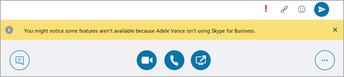
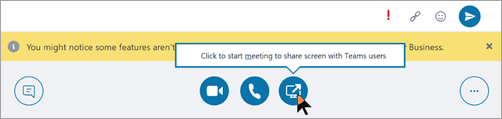
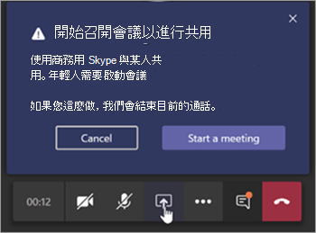

# 瞭解Microsoft Teams商務用 Skype及互通性

本文是升級Project定義階段的一部分。 建立贊助同盟和專案小組，並定義專案的範圍、目標及計畫之後，完成。 繼續進行之前，請確認您已完成下列活動：

- [已招募專案專案關係人](upgrade-enlist-stakeholders.md)
- [已定義專案範圍](./upgrade-define-project-scope.md)

如果貴組織今天使用 商務用 Skype，而且您開始在 商務用 Skype 旁邊使用 Teams，或者您開始升級至 Teams，則瞭解這兩個應用程式如何並存、何時及如何交互操作，以及如何管理使用者的移移，以從 商務用 Skype 升級至 Teams 非常重要。

> [!Tip]
> 觀看下列會話以瞭解 [共存和互通性](https://aka.ms/teams-upgrade-coexistence-interop)。
>
> 此外，您可以與我們一起參與即時互動式研討會，我們會在這裡分享指導、最佳做法和資源，以啟動升級規劃與實作。
>
> 首先 [加入規劃升級](./upgrade-workshops-landing-page.yml) 會話以開始使用。

## 共同Teams商務用 Skype概觀

下列各節說明當您決定升級至 Teams 時可用的共存模式，以及每個模式提供的功能。 此外，我們描述 (用戶端上的使用者與 Skype Teams 用戶端上的使用者之間發生的互通性) 交互操作) ，以及交交互操作會受到所選共存模式的影響。

 Teams提供共同功能、聊天、通話和會議功能。 視您選擇部署Teams，這些功能可能會與使用者商務用 Skype的功能重迭。 預設模式是同時執行Teams功能商務用 Skype功能重迭。 不過，您可以為使用者指派數種共存模式之一 (也稱為升級模式) ，其設計目的是確保這些功能不會與該使用者 (重迭，在這種情況下 Teams 和 商務用 Skype 之間的互通性可供) 使用。 例如，如果您擁有商務用 Skype Server部署複雜的內部部署企業語音，但希望使用者能儘快享受新式會議，您可能會想要將會議第一次評估為替代路徑。 

建議您查看下列共存模式，協助判斷適合貴組織的路徑。

> [!Important]
> 2021 年 7 月 31 日 商務用 Skype Online 停用後，共存模式會繼續存在，但僅適用于內部部署 商務用 Skype Server 的組織。 在停用之前，內部部署中的使用者可以指派 TeamsOnly 外的任何模式。 不過，在商務用 Skype Online 之後，雲端使用者只能是 TeamsOnly。

### 群島模式

根據預設，使用者可以同時Teams，商務用 Skype兩種提供類似和重迭功能的解決方案。 這些功能包括目前狀態、聊天、通話和會議。 Teams使用者也可以利用新的共同合作功能，例如團隊和頻道、存取 Microsoft 365 或 Office 365 中的檔案，以及應用程式。

在這個稱為 Islands 的共存 **模式中，每個** 用戶端應用程式會以個別島嶼的方式運作。 商務用 Skype交談商務用 Skype，Teams交談Teams。 使用者預期會一併執行這兩個用戶端，而且可以在啟動通訊的用戶端中原生通訊。 因此，在群島模式中不需要 **互通性** 。

為了避免造成混淆或倒退商務用 Skype，商務用 Skype會處理下列在群島模式中未處理的 **Teams整合：**

- 外部 (為) 通訊。
- PSTN 語音服務和語音應用程式，Office整合。
- USB 裝置用 HID 控制項。
- 其他幾個整合。  

電話系統群島模式中，Teams不支援 **此** 功能。 **群島** 模式不支援企業語音用戶端商務用 Skype。

> [!Important]
> 在 **群島** 模式中，來自貴組織外部 (使用者的所有) 訊息和商務用 Skype。 升級到 **僅Teams模式** 之後，組織外部的所有郵件和通話會傳送到Teams。

> [!Tip]
> 商務用 Skype線上客戶建議的路徑是從預設 **群島** 模式開始，Teams採用飽和度，然後快速移至Teams **模式**。 內部部署和混合式客戶 ，尤其是複雜的客戶，可能會受益于以 **Teams** 共同合作模式作為起點部署 商務用 Skype **商務用 Skype，** 而非島嶼模式，以及使用 Teams 共同合作與會議模式 (即會議第一次) ，以及組織準備好採用 Teams 時，使用 **Teams** Only 模式。

### Teams只

只有 **Teams使用者** (升級的使用者) 使用者才能存取 Teams。  他們可以保留商務用 Skype用戶端，商務用 Skype未升級的使用者或外部方所組織的會議。 升級的使用者可以使用 Teams 和 商務用 Skype (之間的互通性功能，繼續與組織中仍在使用 商務用 Skype 的其他使用者通訊，但 商務用 Skype 使用者不在群島模式) 。  不過，升級的使用者無法啟動商務用 Skype、通話或會議。

一旦貴組織準備好讓部分或所有使用者使用 Teams做為他們唯一的通訊和共同Teams **模式**。 如果您是從群島模式升級，建議您在開始升級程式之前，先Teams整個組織採用。 這項採用可避免因 **Islands** 模式無法提供互通性而中斷通訊案例。

在Teams **模式** 時，Teams是 SIP/Tel 通訊協定的預設應用程式。 使用者連絡人卡片中用於Outlook或聊天的連結將由Teams。

若要進一步考慮如何移Teams **模式**，請參閱 [Teams模式考慮](teams-only-mode-considerations.md)。

### 僅商務用 Skype

在此共存模式中，使用者會維持商務用 Skype而非 Teams，以用於聊天、會議及通話功能，而且不會使用 Teams 團隊和頻道的 Teams。 此模式今天提供;不過，在目前的實現中，使用者不會自動關閉團隊和頻道。 您可以使用應用程式設定策略來隱藏團隊和檔案，以達成此目的。

此模式可在開始系統管理部署之前Teams，以防止使用者開始在Teams準備就緒之前使用。 此模式也可以為使用者啟用已驗證Teams參與商務用 Skype，但使用者必須獲得授權才能Teams。

### 商務用 Skype共同Teams

使用此模式在Teams仲介紹您的投資，同時繼續使用現有的投資商務用 Skype。 保留商務用 Skype聊天、通話和會議功能不變。 新增Teams共同功能：

- Teams頻道。
- 存取檔案或Microsoft 365 Office 365。
- 應用。 Teams通訊功能 -私人聊天、通話和排程會議。

Teams此模式中，私人聊天、通話和排程會議預設為關閉。

如果組織想要為使用者提供通訊的互通性和可預測性，以及有可預測的時程表來升級至 Teams (，而不是仰賴群島模式) 中的採用飽和度，則以 商務用 Skype Server 為起點的組織，應考慮以此模式取代群島模式。 

### 商務用 Skype共同Teams會議 ，也稱為會議第一

使用此共存模式可加速Teams會議與共同合作功能的可用性。 共存模式可讓您的使用者充分利用會議Teams體驗：

- 品質很好。
- 文字翻譯和翻譯。
- 背景模糊。
- 跨所有平臺的使用者體驗，包括行動裝置和瀏覽器。

除了在此模式中Teams團隊和頻道式交談時，使用者也會使用 Teams來排程及主持會議。 私人聊天和通話商務用 Skype。 Teams，商務用 Skype一系列「共同改善」功能，例如目前狀態對帳、自動保留/取消保留，以及這兩種應用程式中的 HID 裝置支援，都大有好處。 如果需要，可以使用應用程式設定政策隱藏團隊和頻道。

此共存模式對於使用 商務用 Skype 部署的組織企業語音。 這些組織可能需要一些時間升級至Teams並想要儘快從Teams會議中獲益。

> [!TIP]
> 若要根據您想要在 Teams 中啟用的功能來協助識別建議的升級模式，商務用 Skype 仍在使用中，請利用 Skype Teams[精靈](https://aka.ms/SkypeToTeamsWizard)。

有關共存模式、先決條件及管理的資訊，請參閱將 Teams 與 商務用 Skype 一起使用的組織移移及互通性指南，[以及](./migration-interop-guidance-for-teams-with-skype.md)設定您的共存和升級[設定](./setting-your-coexistence-and-upgrade-settings.md)。

|決策點圖示 |圖示定義 |描述 |
|---|---|---|
||決策點|<ul><li>哪一種共存 () 最適合貴組織及使用者的需求？</li></ul>|
||後續步驟|<ul><li>選擇升級旅程的最佳方法。</li></ul>|

### Teams和商務用 Skype

互通性是讓同一Teams商務用 Skype使用者在整個組織中Teams商務用 Skype。

互通性受並存模式 (，也稱為) 模式。 當接收者位於群島模式時，沒有 **互通性** 。

> [!Note]
> 當部署在群島以外的任何共存模式中時，Teams 和 商務用 Skype 可以交互操作，讓使用者可以彼此聊天和通話，並確保在升級至 Teams 期間，整個組織的通訊保持流暢。 共存模式可規範互通性。 收受者共存模式會決定是否提供互通性。 例如，如果接收者是在一個用戶端中僅提供聊天的模式中 (例如 Teams) ，當啟動器使用另一個用戶端 (在此案例中，商務用 Skype) 啟動聊天時，一般會提供聊天互通性。 另一方面，如果接收者是在兩個用戶端或群島模式 (聊天) ，則聊天將無法提供互通性。 該訊息會由啟動者開始聊天的同一個用戶端中的接收者接收。 因此，在 **群島** 模式中正確通訊Teams採用飽和度;也就是說，所有使用者都主動使用並監控這兩個用戶端。

> [!Note]
> **若要擁有最新的共存體驗，用戶端版本必須是使用者部署通道中Office用戶端。**

#### 原生交互操作和交互操作升級

有兩種類型的交互操作體驗：原生和交互操作升級。

- 使用者 _目前使用的_ 用戶端會發生原生交互操作體驗。 其中一個使用者會商務用 Skype用戶端，另一個使用者則Teams。 原生交互操作體驗不會將它們帶到另一個用戶端進行通訊。 使用者將可以在他們目前使用的用戶端中進行交談。 原生交互操作體驗是一對一聊天和通話。
- 互 _操作升級_ 體驗表示，在協助使用者執行進一步動作 (例如共用桌面) 時，用戶端可協助建立一個使用者可以加入的會議，以繼續該會議的體驗。 會議是在動作的啟動者平臺上建立。 不在該平臺上的使用者會收到會議加入連結。 當他們按一下此連結時，會以相容的用戶端 (瀏覽器、Web App 或完整用戶端加入會議，視組) 。 來自用戶端的商務用 Skype升級需要最近的用戶端。 現在可以從 Teams進行交互操作升級。 兩者均支援租使用者中的互通性體驗，以及適用于跨租使用者之聯合通訊。

#### 原生交互操作體驗

視指派給使用者的共存模式 (如先前所述) ，可以使用下列原生交互操作體驗：

商務用 Skype使用者可以與使用者進行一對一Teams聊天，反之亦然。 交互操作聊天必須經過交互操作閘道，此閘道屬於雲端Teams的一 (因此僅存在於線上) 。 交互操作聊天是純文字：不支援豐富的文字和圖釋。 系統Teams和商務用 Skype中的使用者會收到交談是交互操作交談的通知。

<!---->

商務用 Skype使用者可以進行一對一語音和視Teams通話，Teams使用者也可以這麼做。

<!---->

> [!Important]
> 內部部署中的內部部署體驗商務用 Skype內部部署環境必須採用混合式模式，Microsoft 365或Office 365 商務用 Skype。 有關詳細資料，請參閱 [移移和互通性指南](./migration-interop-guidance-for-teams-with-skype.md)。

這些交互操作體驗可供指派下列其中一種共存模式的使用者使用，並可在使用者之間使用 **：商務用 Skype** 與 Teams 共同合作 **、商務用 Skype** Teams 共同合作與會議、商務用 Skype Only 或 **Teams Only**。 在群島模式中，使用者 **沒有互通性** 。

#### 原生交互操作體驗限制

由於通訊協定與技術的差異，因此無法原生支援所有功能。 具體來說，下列功能無法提供：

- 系統不支援標記、豐富文字和完整的圖釋Teams或商務用 Skype。 不支援聊天中撰寫方塊Teams原生功能。
- 系統 (不支援) 桌面或應用程式Teams商務用 Skype螢幕共用功能。 不過，透過交互操作升級支援。
- 群組聊天 (多人) 交談Teams只能包含使用Teams。
- 群組聊天中的 (IM 交談) 群組商務用 Skype只能包含使用商務用 Skype。 不過，可從多個使用者之間向多商務用 Skype。
- 不支援將進行中的對等語音或視音訊通話升級為涉及Teams商務用 Skype通話。
- 不支援雙向聊天的檔案傳輸，或群組聊天中的檔案附件，從 Teams 到 商務用 Skype ，反之亦然。
- 與永久聊天沒有商務用 Skype互通性。

針對除永久 (聊天) 之外的所有限制，其中一個可能的解決方法是讓一個使用者啟動會議並邀請其他使用者加入會議。

此解決方法是交互操作升級的基礎。 特別是，螢幕畫面分享和向多方升級無法原生地達成，但透過交互操作升級支援。

#### 交互操作升級體驗

交互操作升級包括以受管理的升級至會議來補充原生交互操作功能。 會議提供豐富的體驗給任何人，無論他們擁有哪一個用戶端。

當使用者觸發交互操作升級Teams，即會Teams會議。 當由使用者觸發商務用 Skype，即會商務用 Skype會議。 在這兩種情況下，所建立的會議都是一個現在開會的會議，不會反映在使用者的日曆上。

另一方會按一下該連結，透過交互操作聊天和加入來接收會議加入連結。 如果使用者商務用 Skype帳戶，Teams使用者邀請Teams，他們將加入已驗證的會議。 否則，他們將以匿名參與者的方式加入。 相反地，Teams使用者幾乎一定都有 商務用 Skype 帳戶和 商務用 Skype 用戶端，他們可以使用他們以驗證的參與者身份加入 商務用 Skype 會議，但他們也可以以匿名參與者的方式加入，例如使用 Skype 會議 App。

當參與者加入會議後，他們可以進行會議支援的任何活動，例如桌面或內容共用、檔案共用或傳輸、新增其他參與者等等。

#### 從 商務用 Skype

在每月 C2R 商務用 Skype 2019 年 7 月建立中，更新了來自 商務用 Skype 的交互操作和交互操作升級。 之前，商務用 Skype沒有事先知道遠端派對正在使用Teams。 它只會從會話建立之後收到的訊號中猜測。

當訊號指出回應來自 (或透過) 交互操作閘道時，它會顯示黃色商務橫條 (橫幅) 表示另一方並未使用 商務用 Skype。 隨著我們服務的演進，這導致誤認為 商務用 Skype 使用者在連接到 雲端語音信箱 服務或其他雲端語音服務時，會看到商務資料廣告，而不是實際 Teams **使用者**。

為了防止這些誤誤，目前狀態服務現在會通知商務用 Skype當另一方是實際使用者Teams **用戶端**。 這商務用 Skype，使用者必須先建立交互操作交談，然後讓交談視窗成為交互操作專用視窗。

例如商務用 Skype使用者想要共用桌面，系統就會通知他們我們將開始會議，並引導他們完成步驟。

同時，Teams收到包含會議連結的傳入聊天訊息，並引導他們加入。

此升級為 商務用 Skype會議適用于租使用者內部交互操作和跨租使用者聯盟通話和聊天。 系統預設為已啟用，且系統管理員沒有設定必須進行設定。

#### 從 Teams

當 Teams 使用者與 商務用 Skype 使用者或跨租使用者交互操作聯盟執行緒中選取桌面共用按鈕時，現在可以使用從 Teams 到 Teams 會議之間的交互操作升級。 1：1 聊天交談或 1：1 通話支援交互操作升級。

這項功能支援 Teams 桌面用戶端的 Windows、Mac 版 Teams 桌面用戶端，以及支援內容共用之瀏覽器上的 Teams Web 用戶端，以及任何 商務用 Skype 用戶端版本的通訊。

在互通性執行緒和聯Teams互通性執行緒中，使用者現在 (按鈕) 開始內容共用。 當使用者Teams按鈕時，系統就會顯示一個額外的功能表，告知他們若要共用內容，他們必須Teams會議。

如果使用者在通話中，功能表也會警告他們，他們在 Teams 和 商務用 Skype 之間的目前通話會隨著他們加入Teams會議而終止。 如果他們選擇，他們可以在接受商務用 Skype警告使用者。

接受後，這些會議會Teams會議;他們必須從會議中的共用區開始共用。

同時，商務用 Skype收到包含會議連結的傳入聊天訊息，並引導他們加入。

此升級為 Teams會議適用于租使用者內部交互操作和跨租使用者聯盟通話和聊天。 系統預設為已啟用，且系統管理員沒有設定必須進行設定。 不過，如果系統管理員將 設定為 ，則使用者會 ``-AllowPrivateMeetNow`` 關閉 ``CsTeamsMeetingPolicy`` 此設定 ``$false`` 。

在您閱讀本文之後，請參閱選擇您的升級歷程、移移和互通性指南、與商務用 Skype 共存，以及設定您的共存和升級設定以查看詳細資料。  我們也建議您觀看下列影片：[影片：管理 SfB](https://www.youtube.com/watch?v=wEc9u4S3GIA&list=PLaSOUojkSiGnKuE30ckcjnDVkMNqDv0Vl&index=11)和 Teams

## 共同Teams商務用 Skype的技術詳細資料

下列各節摘要說明在同一組織中同時執行 Teams 用戶端商務用 Skype用戶端時，無論使用何種模式和升級方法，都可能會遇到的行為：

- [會議](#meetings)
- [互 操作 性](#interoperability)
- [交互操作與原生交談對話對話](#interop-versus-native-conversation-threads)
- [目前狀態](#presence)
- [同盟](#federation)
- [連絡人](#contacts)

### 會議

無論使用者使用何種模式，無論會議是在會議或會議商務用 Skype都能Teams。  不過，使用者必須使用符合會議類型的對應用戶端加入會議：

- 如果會議是Teams，所有參與者 (TeamsOnly、Islands 或 商務用 Skype 使用者) 使用 Teams 用戶端加入會議。 如果未Teams，使用者嘗試加入會議時，會導向至網路。

- 如果會議是商務用 Skype，所有參與者 (TeamsOnly、Islands 或 商務用 Skype 使用者) 使用 商務用 Skype 用戶端加入會議。 如果未商務用 Skype用戶端，使用者會透過會議應用程式導向Skype加入。

組織會議時，排定的會議類型是根據召集人的模式所決定，如下表所示：

| 召集人模式    |      行為 |
| :------------------ | :---------------- |
| TeamsOnly， SfbWithTeamsCollabAndMeetings |    所有排定在 Teams。 商務用 Skype中無法使用Outlook。 | 
| SfbWithTeamsCollab， SfbOnly   | 所有排定在 商務用 Skype 的會議。 Teams中無法使用Outlook。 | 
| 離島 | 根據預設，會議可以排程在 商務用 Skype 或 Teams。 這兩個附加元件可在 Outlook。 不過，您可以選擇性地要求群島中的使用者一直排程 Teams 中的會議，將 TeamsMeetingPolicy 實例指派給 PreferredMeetingProviderForIslandsMode=Teams。| 

### 互 操作 性

如[上文所述](#interoperability-of-teams-and-skype-for-business)，Teams和商務用 Skype互通性Teams在某些情況下支援商務用 Skype交交互操作。 交互操作通訊是指使用者與商務用 Skype之間的聊天Teams通話。  只有兩個使用者之間才能進行交互操作通訊;不支援多方聊天/通話或新增其他使用者。

當下列各為 True 時，會建立兩個使用者之間的交互操作聊天或通話：

- 一個使用者正在使用Teams，另一個使用者正在使用商務用 Skype。

- 初始通訊的收件者模式為 NOT Islands (否則如果兩個使用者位於同一個組織) 通訊會位於同一個用戶端。 在聯盟情況下，傳送使用者正在使用Teams，且收件者不在 TeamsOnly 模式中。 

- 使用者Teams NOT 也有內部商務用 Skype帳戶。

在交互操作通訊中，聊天只是純文字。 此外，在交互操作聊天本身中無法共用檔案和 *螢幕畫面*。 不過，在交互操作交談中，使用者可以從交互操作聊天中建立點播會議，輕鬆達成檔案和/或螢幕共用，如下所述：

- 如果使用者Teams共用其螢幕畫面，系統會自動建立 Teams 會議，而且該會議的邀請連結會商務用 Skype使用者的用戶端。 按一下連結後，商務用 Skype使用者就會開啟Teams並加入會議。 這兩個使用者現在都Teams會議，並可以共用。

- 如果 商務用 Skype 使用者從 2018 或更新之後使用用戶端，並嘗試共用任何內容，系統會自動建立隨用 商務用 Skype 會議，且該會議的邀請連結會送到 Teams 使用者的用戶端。 按一下連結後，Teams使用者就會嘗試加入商務用 Skype會議。 如果Teams已安裝商務用 Skype用戶端，系統就會開啟該用戶端，系統就會提示使用者 (如果尚未) 。  如果使用者Teams安裝用戶端商務用 Skype，系統會提示使用者使用 Web 版本。 這兩個使用者一旦登錄，即會商務用 Skype會議，並可以共用。

### 交互操作與原生交談對話對話

由於交互操作通訊不支援原生 Teams 交談的所有功能，Teams 用戶端會針對 Teams 對-Teams 和 Teams 對-商務用 Skype 通訊維護個別的交談執行緒。 這些交談在使用者介面中的呈現方式會有所不同：Interop 執行緒可以與一般原生Teams區分：：

- 缺少適用于豐富文字、檔案/螢幕共用的控制項，無法新增使用者。
- 對目標使用者圖示的修改，顯示 商務用 Skype。

這些差異會顯示在下列螢幕擷取畫面中：

使用 User G3 Teams進行Teams的原生交談

具有相同使用者 G3 測試的交互操作交談

建立交談對話後，其類型永遠不會變更。 建立之後，Teams中的交互操作執行緒會一直路由至目標使用者商務用 Skype用戶端。 原生執行緒會一直路由至目標使用者Teams用戶端。  如果收件者使用者的模式變更，該使用者現有的 Teams 對話將不再運作，該聊天上會顯示一則記事，並包含連結以開始新的原生交談，如下列螢幕擷取畫面所示。

### 目前狀態

使用者目前狀態取決於使用者透過用戶端在服務中的活動。 隨後會發佈目前狀態，讓其他使用者看到。  商務用 Skype和Teams是具有個別用戶端的個別服務，因此每個服務都有使用者自己的目前狀態。   線上和線上的目前狀態服務Teams同步商務用 Skype同步處理。  這可讓一個服務根據需要，從另一個服務發佈使用者目前狀態。 

目前狀態發佈行為是根據使用者的模式。 有三種基本案例：

- 如果使用者位於 TeamsOnly 模式中，則所有其他使用者Teams該使用者的目前狀態，無論該使用者使用哪一個用戶端。

- 如果使用者位於任一商務用 Skype模式中，則所有其他使用者商務用 Skype該使用者的目前狀態，無論該使用者使用哪一個用戶端。

- 如果使用者是在群島模式中，商務用 Skype 和 Teams 中發佈的目前狀態是獨立的，因此向同一組織內的使用者顯示目前狀態取決於其他使用者的用戶端。 由於聯屬島嶼模式使用者的流量位於 商務用 Skype，因此聯盟組織的使用者會看到該使用者的目前狀態商務用 Skype。

例如，假設使用者 A 位於群島模式。 如果使用者 A 在 Teams 中為使用中，但並未登錄 商務用 Skype，其他使用者會看到使用者 A 從 Teams 用戶端為使用中狀態，但在 商務用 Skype 用戶端中，他們會看到使用者 A 離線。 這是由設計所設計，因為如果使用者沒有執行用戶端，就無法與使用者 A 聯繫。 

### 同盟

使用 Teams 連線到其他使用者商務用 Skype使用者Teams使用者必須連線到 商務用 Skype。 TeamsUpgradePolicy 會管理傳入的聯盟聊天和通話的路由。 聯合路由行為與同租使用者案例相同，但群島模式除外。 當收件者進入群島模式時：

- 如果收件者位於Teams租使用者商務用 Skype，則從 商務用 Skype 開始聊天和通話。
- 如果收件者位於同一個租使用者Teams，Teams來自該地的聊天和通話。
- 從 商務用 Skype 啟動的聊天和商務用 Skype。

聯盟聊天可以是原生執行緒或交互操作執行緒。 請參閱 [Interop 與原生交談對話對話](#interop-versus-native-conversation-threads)。

- 如果收件者與寄件者都同時在 TeamsOnly 升級模式中，交談會提供原生聊天體驗，其中包含所有豐富的訊息和通話功能。 若要深入瞭解，請參閱在 (中) [使用者的外部Teams體驗](native-chat-for-external-users.md)。 

- 如果其中一個交談參與者不在 TeamsOnly 升級模式中，交談會保留純文字訊息的交互操作體驗。 使用者介面會以類似同租使用者交互操作執行緒的方式公開聯合聊天，只是有一則附注指出使用者是外部使用者。

有關詳細資料，請參閱[在](manage-external-access.md)Microsoft Teams 中管理外部使用者Microsoft Teams和原生聊天體驗 (在) [中](native-chat-for-external-users.md)Teams。

### 連絡人

Teams和商務用 Skype都有個別的連絡人清單。 這表示在一個系統中新增、移除及修改連絡人時，不會同步處理至另一個系統。 不過，當兩商務用 Skype Teams一個事件發生時，系統會自動將來自 商務用 Skype 的連絡人複製到其他連絡人： 

- 對於任何商務用 Skype線上使用者，第一次登入 Teams，來自 商務用 Skype 的連絡人會複製到 Teams。  此行為不適用於在 商務用 Skype Server 中擁有內部部署帳戶商務用 Skype Server。  

- 使用者透過指派 TeamsUpgradePolicy 或 Move-CsUser -MoveToTeams) 升級至 TeamsOnly (之後，下次使用者登入 Teams 時，商務用 Skype 中的現有連絡人將會與 Teams 中的現有連絡人合併。 無論使用者從內部部署或線上移至 TeamsOnly，都會發生此行為。 

在這兩種情況下，將連絡人從 商務用 Skype移Teams是非同步，因此可能需要幾分鐘，連絡人才能出現在 Teams。 上述兩個事件會觸發複製。  

### 相關連結

[適用于與應用程式一起使用Teams的移商務用 Skype](migration-interop-guidance-for-teams-with-skype.md) 

[設定商務用 Skype Server或Microsoft 365之間的Office 365](/SkypeForBusiness/hybrid/configure-hybrid-connectivity)

[在內部部署和雲端之間移動使用者](/SkypeForBusiness/hybrid/move-users-between-on-premises-and-cloud)

[設定您的共存和升級設定](setting-your-coexistence-and-upgrade-settings.md)

[Grant-CsTeamsUpgradePolicy](/powershell/module/skype/grant-csteamsupgradepolicy?view=skype-ps)

[使用會議移 (MMS) ](/skypeforbusiness/audio-conferencing-in-office-365/setting-up-the-meeting-migration-service-mms)
