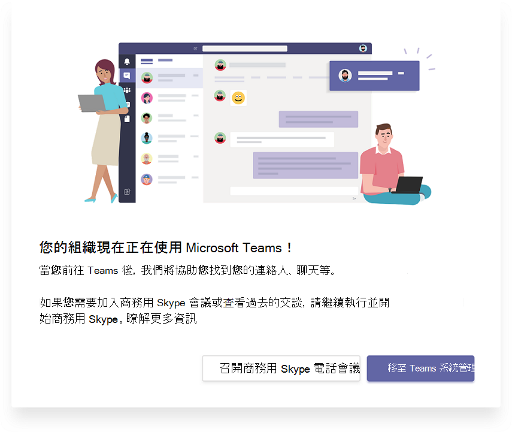

# 瞭解 Microsoft Teams 和商務用 Skype 共存與互通性

本文是升級過程中專案定義階段的一部分。 建立贊助同盟和專案小組，並定義專案的範圍、目標及計畫後，請完成。 繼續進行之前，請確認您已完成下列活動：

- [已招募專案專案關係人](upgrade-enlist-stakeholders.md)
- [已定義專案範圍](./upgrade-define-project-scope.md)

如果貴組織今天使用商務用 Skype，而且您開始在商務用 Skype 旁邊使用 Teams，或者您開始升級至 Teams，瞭解這兩個應用程式如何並存、何時以及如何交互操作，以及如何管理使用者從商務用 Skype 升級至 Teams 的最終升級，這一點非常重要。

> [!Tip]
> 觀看下列會話以瞭解 [共存和互通性](https://aka.ms/teams-upgrade-coexistence-interop)。
>
> 此外，您可以與我們一起參與即時互動式研討會，我們會在這裡分享指導、最佳做法和資源，以啟動升級規劃與實作。
>
> 首先 [加入規劃升級](./upgrade-workshops-landing-page.yml) 會話以開始使用。

## Teams 與商務用 Skype 概觀的共存

下列各節說明當您決定升級至 Teams 時可用的共存模式，以及每個模式提供的功能。 此外，我們描述 Skype-for-Business 用戶端 (使用者與 Teams 用戶端上的使用者之間發生的互通性) 交互操作，以及交交互操作會受到所選共存模式的影響。

 Teams 提供共同合作功能、聊天、通話和會議功能。 視您選擇部署 Teams 的方式不同，這些功能可能會與商務用 Skype 為給定使用者提供的功能重迭。 預設模式是在功能重迭的商務用 Skype 旁邊執行 Teams。 不過，您可以為使用者指派多個共存模式之一 (也稱為升級模式) ，這些模式是為了確保這些功能不會與該使用者重迭 (在這種情況下，Teams 和商務用 Skype 之間的互通性可供) 使用。 例如，如果您有重要的商務用 Skype Server 內部部署資產，且部署複雜的企業語音，但希望使用者能儘快享受新式會議，您可能會想要將會議第一次評估為替代路徑。

建議您查看下列共存模式，協助判斷適合貴組織的路徑。

> [!Important]
> 引進新技術或對現有熟悉的商務用 Skype 環境進行變更，同時提供出色的新商務權益，可能會干擾使用者。 在您執行本文所述的任何變更之前，請花一些時間評估使用者準備狀態並實行通訊和訓練計畫。 此外，我們強烈建議您先與選取的使用者群組試驗您的計畫，然後再在整個組織中執行。

### 群島模式

根據預設，使用者可以將 Teams 與商務用 Skype 一起執行，做為兩個獨立的解決方案，提供類似且重迭的功能。 這些功能包括目前狀態、聊天、通話和會議。 Teams 使用者也可以利用新的共同合作功能，例如團隊和頻道、存取 Microsoft 365 或 Office 365 中的檔案，以及應用程式。

在這個稱為 Islands 的共存 **模式中，每個** 用戶端應用程式會以個別島嶼的方式運作。 商務用 Skype 會與商務用 Skype 交談，Teams 則與 Teams 進行交談。 使用者預期會一併執行這兩個用戶端，而且可以在啟動通訊的用戶端中原生通訊。 因此，在群島模式中不需要 **互通性** 。

為了避免造成混淆或倒退的商務用 Skype 體驗，商務用 Skype 會處理下列在 Teams **Islands** 模式中未處理的整合：

- 外部 (為) 通訊。
- PSTN 語音服務和語音應用程式、Office 整合。
- USB 裝置用 HID 控制項。
- 其他幾個整合。  

Teams 在群島模式中不支援 **電話** 系統。 **群島** 模式不支援企業語音用戶端是商務用 Skype。

> [!Important]
> 在 **群島** 模式中，來自貴組織外部 (使用者的所有訊息和) 會傳送到商務用 Skype。 升級至 **Teams Only** 模式之後，組織外部的所有訊息和通話會傳送到 Teams。

> [!Tip]
> 商務用 Skype Online 客戶的建議路徑是，從預設 **群島** 模式開始，推動組織中 Teams 採用飽和度，然後快速移至 **Teams Only** 模式。 內部部署和混合式客戶 ，尤其是複雜的客戶，可能會受益于將商務用 Skype 與 **Teams** 共同合作模式部署為起點，而非島嶼模式，以及從該模式以 Teams 共同合作與會議模式 (即會議第一次) ，以及組織準備好採用 **Teams** 時，進入 Teams Only 模式。

### 僅 Teams

只有 **Teams** 使用者 (升級的使用者) 擁有Teams 中所有功能的存取權限。 他們可以保留商務用 Skype 用戶端，以加入由未升級使用者或外部方所組織的商務用 Skype 會議。 升級後的使用者可以繼續使用 Teams 與商務用 Skype 之間的互通性功能，繼續與組織中仍在使用商務用 Skype 的其他使用者通訊 (只要商務用 Skype 使用者不在群島模式) 。  不過，升級的使用者無法啟動商務用 Skype 聊天、通話或會議。

一旦貴組織準備好讓部分或所有使用者使用 Teams 做為他們唯一的通訊和共同合作工具，請升級這些使用者至 **Teams Only** 模式。 如果您是從群島模式升級，我們建議您先將 Teams 採用時間飽和，然後再開始升級程式。 這項採用可避免因 **Islands** 模式無法提供互通性而中斷通訊案例。

在 Teams **僅模式中** 時，Teams 是 SIP/Tel 通訊協定的預設應用程式。 在 Outlook 中，使用者連絡人卡片中用於通話或聊天的連結將由 Teams 處理。

若要進一步考慮如何移至 **Teams Only** 模式，請參閱 Teams [Only 模式考慮](teams-only-mode-considerations.md)。

### 僅商務用 Skype

在此共存模式中，使用者會保留在商務用 Skype 中，而非 Teams 中，以用於聊天、會議及通話功能，而且不會將 Teams 用於團隊和頻道。 此模式今天提供;不過，在目前的實現中，使用者不會自動關閉團隊和頻道。 您可以使用應用程式設定策略來隱藏團隊和檔案，以達成此目的。

此模式可在啟動 Teams 的受管理部署之前使用，以防止使用者在已建立就緒狀態之前開始使用 Teams。 此模式也是一種啟用已驗證參與商務用 Skype 使用者的 Teams 會議的方式，但使用者必須獲得 Teams 授權。

### 商務用 Skype 與 Teams 共同合作

使用此模式在繼續使用商務用 Skype 的現有投資的同時，在環境中引進 Teams。 保留商務用 Skype 的聊天、通話和會議功能不變。 新增 Teams 共同合作功能：

- 團隊和頻道。
- 存取 Microsoft 365 或 Office 365 中的檔案。
- 應用。 Teams 通訊功能 —私人聊天、通話和排程會議。

在此模式中，團隊私人聊天、通話和排程會議預設為關閉。

以內部部署或混合式商務用 Skype Server 為起點的組織，如果要為使用者提供通訊的互通性和可預測性，以及擁有可預測的升級至 Teams (的時程表，而不是仰賴群島模式) 中的採用飽和度，則應考慮以此模式取代群島模式。 

### 商務用 Skype 與 Teams 共同合作與會議 ，又稱為會議第一

使用此共存模式可加速貴組織中 Teams 會議與共同合作功能的可用性。 共存模式可讓您的使用者利用出色的 Teams 會議體驗：

- 品質很好。
- 文字翻譯和翻譯。
- 背景模糊。
- 跨所有平臺的使用者體驗，包括行動裝置和瀏覽器。

除了在此模式中使用 Teams 進行團隊和頻道型交談，使用者也會使用 Teams 來排程及主持會議。 私人聊天和通話會保留在商務用 Skype 上。 Teams 和商務用 Skype 受益于一系列「共同改善」功能，例如目前狀態對帳、自動保留/取消保留，以及跨兩個應用程式的 HID 裝置支援。 如果需要，可以使用應用程式設定政策隱藏團隊和頻道。

這個共存模式對於使用企業語音進行商務用 Skype 內部部署的組織特別有用。 這些組織可能需要一些時間升級至 Teams，並想要儘快受益于優秀的 Teams 會議。

> [!TIP]
> 若要在商務用 Skype 仍在使用中時，根據您想要在 Teams 中啟用的功能，協助識別建議的升級模式，請使用 [Skype 至 Teams 升級精靈](https://aka.ms/SkypeToTeamsWizard)。

有關共存模式、先決條件及管理等詳細資訊，請參閱使用 Teams 與商務用 [Skype](./migration-interop-guidance-for-teams-with-skype.md) 的組織移移及互通性指南，以及設定 [您的共存](./setting-your-coexistence-and-upgrade-settings.md)與升級設定。

|決策點圖示 |圖示定義 |說明 |
|---|---|---|
||決策點|<ul><li>哪一種共存 () 最適合貴組織及使用者的需求？</li></ul>|
||後續步驟|<ul><li>選擇升級旅程的最佳方法。</li></ul>|

### Teams 與商務用 Skype 的互通性

互通性是同一組織中 Teams 和商務用 Skype 使用者跨 Teams 和商務用 Skype 進行溝通的能力。

互通性受並存模式 (，也稱為) 模式。 當接收者位於群島模式時，沒有 **互通性** 。

> [!Note]
> 當部署在群島以外的任何共存模式中時，Teams 和商務用 Skype可以交互操作，讓使用者可以彼此聊天和通話，並確保在升級 Teams 期間，整個組織通訊保持流暢。 共存模式可規範互通性。 收受者共存模式會決定是否提供互通性。 例如，如果接收者是在一個用戶端中只能使用聊天的模式中 (例如 Teams) ，當啟動器使用另一個用戶端 (在此案例中，商務用 Skype) 啟動聊天時，一般會提供聊天互通性。 另一方面，如果接收者是在兩個用戶端或群島模式 (聊天) ，則聊天將無法提供互通性。 在啟動聊天的同一個用戶端中，接收者會收到訊息。 因此，在群島模式中 **進行適當的** 通訊需要 Teams 採用飽和度;也就是說，所有使用者都主動使用並監控這兩個用戶端。

> [!Note]
> **若要擁有最新的共存體驗，用戶端版本必須是使用者 Office 部署通道中的最新可用用戶端。**

#### 原生交互操作和交互操作升級

有兩種類型的交互操作體驗：原生和交互操作升級。

- 使用者 _目前使用的_ 用戶端會發生原生交互操作體驗。 其中一個使用者會使用商務用 Skype 用戶端，另一個使用者則位在 Teams 中。 原生交互操作體驗不會將它們帶到另一個用戶端進行通訊。 使用者將可以在他們目前使用的用戶端中進行交談。 原生交互操作體驗是一對一聊天和通話。
- 互 _操作升級_ 體驗表示，在協助使用者執行進一步動作 (例如共用桌面) 時，用戶端可協助建立一個使用者可以加入的會議，以繼續該會議的體驗。 會議是在動作的啟動者平臺上建立。 不在該平臺上的使用者會收到會議加入連結。 當他們按一下此連結時，會以相容的用戶端 (瀏覽器、Web App 或完整用戶端加入會議，視) 。 商務用 Skype 的交互操作升級需要最近的用戶端。 Teams 的交互操作升級現已提供。 兩者均支援租使用者中的互通性體驗，以及適用于跨租使用者之聯合通訊。

#### 原生交互操作體驗

視指派給使用者的共存模式 (如先前所述) ，可以使用下列原生交互操作體驗：

商務用 Skype 使用者可以與 Teams 使用者進行一對一聊天，反之亦然。 交互操作聊天必須經過一個交互操作閘道，該閘道屬於 Teams 雲端服務的一部分 (因此僅存在於線上) 。 交互操作聊天是純文字：不支援豐富的文字和圖釋。 Teams 和商務用 Skype 中的使用者會收到交談為交互操作交談的通知。

<!---->

商務用 Skype 使用者可以對 Teams 使用者進行一對一語音和視音訊通話，而 Teams 使用者也可以這麼做。

<!---->

> [!Important]
> 內部部署商務用 Skype 的交互操作體驗需要內部部署環境與 Microsoft 365 或 Office 365 商務用 Skype 採用混合模式。 有關詳細資料，請參閱 [移移和互通性指南](./migration-interop-guidance-for-teams-with-skype.md)。

這些交互操作體驗可供已指派下列其中一種共存模式的使用者使用，也可以與使用者之間使用：商務用 Skype 與 **Teams 共同** 合作、商務用 Skype 與 **Teams** 共同合作與會議、商務用 **Skype** 或 Teams **Only。** 在群島模式中，使用者 **沒有互通性** 。

#### 原生交互操作體驗限制

由於通訊協定與技術的差異，因此無法原生支援所有功能。 具體來說，下列功能無法提供：

- Teams 或商務用 Skype 不支援標記、豐富的文字和完整的圖釋集。 Teams 聊天中撰寫方塊的其他原生功能不受支援。
- 在 Teams (商務用 Skype 之間) 桌面或應用程式共用功能不支援螢幕共用功能。 不過，透過交互操作升級支援。
- Teams 中 (多人交談) 群組聊天只能包含使用 Teams 的參與者。
- 商務用 Skype (群組聊天中的) IM 交談只能包含使用商務用 Skype 的參與者。 不過，商務用 Skype 提供多方交互操作升級功能。
- 不支援將進行中的對等語音或視音訊通話升級為涉及 Teams 和商務用 Skype 使用者的多方通話。
- 不支援雙向聊天的檔案傳輸，或群組聊天中的檔案附件，從 Teams 移轉至商務用 Skype，反之亦然。
- 商務用 Skype 永久聊天沒有互通性。

針對除永久 (聊天) 之外的所有限制，其中一個可能的解決方法是讓一個使用者啟動會議並邀請其他使用者加入會議。

此解決方法是交互操作升級的基礎。 特別是，螢幕畫面分享和向多方升級無法原生地達成，但透過交互操作升級支援。

#### 交互操作升級體驗

交互操作升級包括以受管理的升級至會議來補充原生交互操作功能。 會議提供豐富的體驗給任何人，無論他們擁有哪一個用戶端。

當 Teams 使用者觸發交互操作升級時，即會建立 Teams 會議。 當商務用 Skype 使用者觸發時，即會建立商務用 Skype 會議。 在這兩種情況下，所建立的會議都是一個現在開會的會議，不會反映在使用者的日曆上。

另一方會按一下該連結，透過交互操作聊天和加入來接收會議加入連結。 如果商務用 Skype 使用者擁有 Teams 帳戶，且受到 Teams 使用者邀請，他們將加入已驗證的會議。 否則，他們將以匿名參與者的方式加入。 相反地，Teams 使用者幾乎一定都有商務用 Skype 帳戶和商務用 Skype 用戶端，他們可以使用以驗證參與者身份加入商務用 Skype 會議，但他們也可能以匿名參與者的方式加入，例如使用 Skype 會議 App。

當參與者加入會議後，他們可以進行會議支援的任何活動，例如桌面或內容共用、檔案共用或傳輸、新增其他參與者等等。

#### 商務用 Skype 的交互操作升級

商務用 Skype 的交互操作和交互操作升級在每月 C2R 的 2019 年 7 月建立中更新。 之前，商務用 Skype 並未事先知道遠端派對正在使用 Teams。 它只會從會話建立之後收到的訊號中猜測。

當訊號指出回應來自 (或透過) 交互操作閘道時，它會顯示黃色商務橫條 (橫幅) 表示另一方並未使用商務用 Skype。 隨著我們服務的演進，這導致誤誤，當商務用 Skype 使用者連接到雲端語音信箱服務或其他雲端語音服務時，會看到商務廣告，而非實際的 **Teams Only** 使用者。

為了防止這些誤誤，當另一方是 Teams Only 實際使用者時，目前狀態服務現在會通知商務用 Skype **用戶端。** 這可讓商務用 Skype 在建立前先建立交互操作交談，而交談視窗則要特別用於交互操作。

例如，如果商務用 Skype 使用者想要共用桌面，會通知他們我們將開始會議，並引導他們完成步驟。

同時，Teams 使用者會收到包含會議連結的傳入聊天訊息，並引導您加入。

此升級為商務用 Skype 會議適用于租使用者內部交互操作和跨租使用者聯盟通話和聊天。 系統預設為已啟用，且系統管理員沒有設定必須進行設定。

#### Teams 的交互操作升級

當 Teams 使用者與商務用 Skype 使用者或在跨租使用者間聯盟執行緒中選取租使用者間交互操作執行緒中的桌面共用按鈕時，現在可以從 Teams 向 Teams 會議進行交互操作升級。 1：1 聊天交談或 1：1 通話支援交互操作升級。

此功能支援 Windows 版 Teams 桌面用戶端、Mac 版 Teams 桌面用戶端，以及支援內容共用之瀏覽器上的 Teams Web 用戶端，同時可與任何商務用 Skype 用戶端版本通訊。

在互通性執行緒和聯合互通性執行緒中，Teams 使用者現在擁有開始 (按鈕) 開始共用內容。 當 Teams 使用者選取按鈕時，系統就會顯示另一個功能表，告知他們若要共用內容，他們必須啟動 Teams 會議。

如果使用者在通話中，功能表也會警告他們，他們目前在 Teams 和商務用 Skype 之間的通話在加入 Teams 會議時將會終止。 如果他們選擇，他們可以在接受之前先警告商務用 Skype 使用者。

接受之後，這些人員會進入 Teams 會議;他們必須從會議中的共用區開始共用。

同時，商務用 Skype 使用者會收到包含會議連結的傳入聊天訊息，並引導您加入。

此升級為 Teams 會議適用于租使用者內部交互操作和跨租使用者聯盟通話和聊天。 系統預設為已啟用，且系統管理員沒有設定必須進行設定。 不過，如果系統管理員將 設定為 ，則使用者會 ``-AllowPrivateMeetNow`` 關閉 ``CsTeamsMeetingPolicy`` 此設定 ``$false`` 。

在您閱讀本文之後，請參閱選擇您的升級歷程、移移和互通性[指南](./migration-interop-guidance-for-teams-with-skype.md)、與[商務](coexistence-chat-calls-presence.md)用 Skype 共存，以及設定您的共存與升級設定以瞭解詳細資料。 我們也建議使用下列影片：[影片：管理 SfB](https://www.youtube.com/watch?v=wEc9u4S3GIA&list=PLaSOUojkSiGnKuE30ckcjnDVkMNqDv0Vl&index=11)和 Teams 之間的共存和互通性

## Teams 與商務用 Skype 共存的技術詳細資料

下列各節摘要說明在同一組織中同時執行 Teams 和商務用 Skype 用戶端時可能遇到的行為，無論使用何種模式和升級方法：

- [會議](#meetings)
- [互 操作 性](#interoperability)
- [交互操作與原生交談對話對話](#interop-versus-native-conversation-threads)
- [目前狀態](#presence)
- [同盟](#federation)
- [連絡人](#contacts)

### 會議

無論使用者使用何種模式，無論是商務用 Skype 或 Teams，都能隨時加入受邀參加的任何類型的會議。  不過，使用者必須使用符合會議類型的對應用戶端加入會議：

- 如果會議是 Teams 會議，所有參與者 (TeamsOnly、Islands 或商務用 Skype 使用者) 使用 Teams 用戶端加入會議。 如果未安裝 Teams，使用者會嘗試加入會議時導向至網路。

- 如果會議是商務用 Skype 會議，則所有參與者 (無論是 TeamsOnly、Islands 或商務用 Skype 使用者) 請使用商務用 Skype 用戶端加入會議。 如果尚未安裝商務用 Skype 用戶端，使用者會透過 Skype 會議應用程式導向網路加入。

組織會議時，排定的會議類型是根據召集人的模式所決定，如下表所示：

| 召集人模式    |      行為 |
| :------------------ | :---------------- |
| TeamsOnly， SfbWithTeamsCollabAndMeetings |    在 Teams 中排程的所有會議。 Outlook 中無法供應商務用 Skype 附加元件。 | 
| SfbWithTeamsCollab， SfbOnly   | 在商務用 Skype 中排程的所有會議。 Outlook 中無法提供 Teams 附加元件。 | 
| Islands | 根據預設，會議可以在商務用 Skype 或 Teams 中排程。 這兩個附加元件都可在 Outlook 中使用。 不過，您可以選擇性地要求群島中的使用者一直排程 Teams 中的會議，將 TeamsMeetingPolicy 實例指派給 PreferredMeetingProviderForIslandsMode=Teams。| 

### 互 操作 性

如上述 Teams 和商務用 [Skype](#interoperability-of-teams-and-skype-for-business)的互通性所述，Teams 支援在某些情況下與商務用 Skype 進行交互操作。 交互操作通訊是指商務用 Skype 使用者與 Teams 使用者之間的聊天或通話。  只有兩個使用者之間才能進行交互操作通訊;不支援多方聊天/通話或新增其他使用者。

當下列各為 True 時，會建立兩個使用者之間的交互操作聊天或通話：

- 其中一個使用者正在使用 Teams，另一個使用者則使用商務用 Skype。

- 初始通訊的收件者模式為 NOT Islands (否則如果兩個使用者位於同一個組織) 通訊會位於同一個用戶端。 在聯盟情況下，傳送使用者使用的是 Teams，且收件者不在 TeamsOnly 模式中。 

- Teams 使用者沒有內部部署商務用 Skype 帳戶。

在交互操作通訊中，聊天只是純文字。 此外，在交互操作聊天本身中，無法共用檔案 *和螢幕畫面*。 不過，在交互操作交談中，使用者可以在交互操作聊天中建立點播會議，輕鬆達成檔案和/或螢幕共用，如下所述：

- 如果 Teams 使用者嘗試共用其螢幕畫面，系統會自動建立一個點播 Teams 會議，而且該會議的邀請連結會送到商務用 Skype 使用者的用戶端。 按一下連結後，商務用 Skype 使用者將開啟 Teams 並加入會議。 這兩個使用者現在都參與 Teams 會議，並可以根據需要共用。

- 如果商務用 Skype 使用者從 2018 或更新之後使用用戶端，並嘗試共用任何內容，系統會自動建立隨用商務用 Skype 會議，且該會議的邀請連結會寄給 Teams 使用者的用戶端。 按一下連結後，Teams 使用者將嘗試加入商務用 Skype 會議。 如果 Teams 使用者已安裝商務用 Skype 用戶端，它會開啟，且系統提示使用者 (如果尚未) 。  如果 Teams 使用者未安裝商務用 Skype 用戶端，系統會提示使用者使用 Web 版本。 兩個使用者一旦登錄，即會參與商務用 Skype 會議，並可以共用。

### 交互操作與原生交談對話對話

由於交互操作通訊不支援原生 Teams 交談的所有功能，因此 Teams 用戶端會維護 Teams 對 Teams 和 Teams-to-Skype 商務用 Skype 通訊的個別交談執行緒。 這些交談在使用者介面中的呈現方式不同：Interop 執行緒可以與一般原生 Teams 執行緒區別：：

- 缺少豐富的文字、檔案/螢幕共用控制項，無法新增使用者。
- 對目標使用者圖示的修改，顯示商務用 Skype 的 「S」。

這些差異會顯示在下列螢幕擷取畫面中：

使用使用者 G3 測試進行原生 Teams 對 Teams 交談

具有相同使用者 G3 測試的交互操作交談

建立交談對話後，其類型永遠不會變更。 建立之後，Teams 中的交互操作執行緒一定會路由至目標使用者的商務用 Skype 用戶端。 原生執行緒一定會路由至目標使用者的 Teams 用戶端。  如果收件者使用者的模式變更，該使用者的現有 Teams 對話將不再運作，該聊天上會顯示一則記事，並包含連結以開始新的原生交談，如下列螢幕擷取畫面所示。

### 目前狀態

使用者目前狀態取決於使用者透過用戶端在服務中的活動。 隨後會發佈目前狀態，讓其他使用者看到。  商務用 Skype 和 Teams 是具有個別用戶端的個別服務，因此每個服務都有使用者自己的目前狀態。   Teams 和商務用 Skype Online 中的目前狀態服務之間也有同步處理。  這可讓一個服務根據需要，從另一個服務發佈使用者目前狀態。 

目前狀態發佈行為是根據使用者的模式。 有三種基本案例：

- 如果使用者位於 TeamsOnly 模式，則無論該使用者使用哪個用戶端，所有其他使用者都會看到該使用者的 Teams 目前狀態。

- 如果使用者位於任何商務用 Skype 模式中，所有其他使用者都會看到該使用者的商務用 Skype 目前狀態，無論該使用者使用哪一個用戶端。

- 如果使用者是在群島模式中，在商務用 Skype 和 Teams 中發佈的目前狀態是獨立的，因此向同一組織的使用者顯示目前狀態取決於其他使用者的用戶端。 由於聯合流量到群島模式使用者的流量會位於商務用 Skype 中，因此聯盟組織的使用者會看到該使用者的目前狀態。

例如，假設使用者 A 位於群島模式。 如果使用者 A 在 Teams 中為使用中狀態，但並未登錄商務用 Skype，其他使用者會看到使用者 A 從 Teams 用戶端處於使用中狀態，但在他們的商務用 Skype 用戶端中，他們會看到使用者 A 離線。 這是由設計所設計，因為如果使用者沒有執行用戶端，就無法與使用者 A 聯繫。 

### 同盟

使用商務用 Skype 從 Teams 到其他使用者的聯盟需要 Teams 使用者在商務用 Skype 中連線。 TeamsUpgradePolicy 會管理傳入的聯盟聊天和通話的路由。 聯合路由行為與同租使用者案例相同，但群島模式除外。 當收件者進入群島模式時：

- 如果收件者是聯邦租使用者，則從 Teams 發起的聊天和通話會位於商務用 Skype 中。
- 如果收件者位於同一租使用者中，則從 Teams 發起的聊天和通話會位於 Teams 中。
- 從商務用 Skype 啟動的聊天和通話一直位於商務用 Skype 中。

聯盟聊天可以是原生對話或交互操作執行緒。 請參閱 [Interop 與原生交談對話對話](#interop-versus-native-conversation-threads)。

- 如果收件者與寄件者同時在 TeamsOnly 升級模式中，交談會提供原生聊天體驗，其中包含所有豐富的訊息和通話功能。 若要深入瞭解，請閱讀 [Teams](native-chat-for-external-users.md)中 (使用者) 原生聊天體驗。 

- 如果任一交談參與者不在 TeamsOnly 升級模式中，交談會保留純文字訊息的交互操作體驗。 使用者介面會以類似同租使用者交互操作執行緒的方式公開聯合聊天，只是有一則附注指出使用者是外部使用者。

有關詳細資料，請參閱 [管理 Microsoft Teams](manage-external-access.md) 中的外部存取，以及 Teams 中 ([使用者) 原生聊天體驗](native-chat-for-external-users.md)。

### 連絡人

Teams 和商務用 Skype 有個別的連絡人清單。 這表示在一個系統中新增、移除及修改連絡人時，不會同步處理至另一個系統。 不過，當發生兩個特定事件之一時，商務用 Skype 的連絡人會自動複製到 Teams： 

- 對於任何商務用 Skype Online 使用者，第一次登入 Teams 時，商務用 Skype 的連絡人會複製到 Teams。  此行為不適用於在商務用 Skype Server 中使用內部部署帳戶的使用者。  

- 使用者透過指派 TeamsUpgradePolicy 或透過 Move-CsUser -MoveToTeams) 升級至 TeamsOnly (之後，下次使用者登入 Teams 時，商務用 Skype 的現有連絡人將會與 Teams 中現有的連絡人合併。 無論使用者的商務用 Skype 帳戶位於內部部署或線上，都會發生此行為。 

在這兩種情況下，從商務用 Skype 將連絡人移轉至 Teams 是非同步，因此可能需要幾分鐘，連絡人才能出現在 Teams 中。 上述兩個事件會觸發複製。  

### 相關連結

[使用 Teams 與商務用 Skype 的組織移移和互通性指南](migration-interop-guidance-for-teams-with-skype.md) 

[設定商務用 Skype Server 與 Microsoft 365 或 Office 365 之間的混合式連接](/SkypeForBusiness/hybrid/configure-hybrid-connectivity)

[在內部部署和雲端之間移動使用者](/SkypeForBusiness/hybrid/move-users-between-on-premises-and-cloud)

[設定您的共存和升級設定](setting-your-coexistence-and-upgrade-settings.md)

[Grant-CsTeamsUpgradePolicy](/powershell/module/skype/grant-csteamsupgradepolicy?view=skype-ps)

[使用會議移 (MMS) ](/skypeforbusiness/audio-conferencing-in-office-365/setting-up-the-meeting-migration-service-mms)