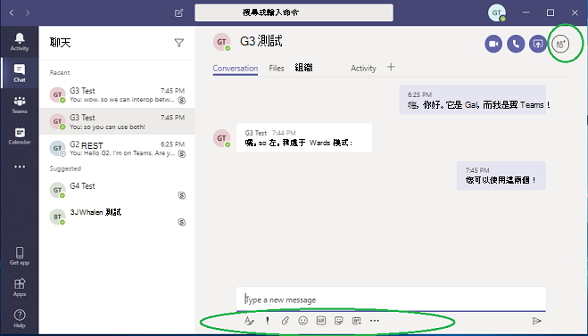

# 瞭解 Microsoft Teams 和商務用 Skype 共存與互通性Understand Microsoft Teams and Skype for Business coexistence and interoperability

本文是升級過程中專案定義階段的一部分。This article is part of the Project Definition stage of your upgrade journey. 建立贊助贊助小組和專案小組，並定義專案的範圍、目標及計畫之後，就完成。Complete after you create a sponsorship coalition and project team and define the scope, goals, and plan for your project. 繼續進行之前，請確認您已完成下列活動：Before proceeding, confirm that you've completed the following activities:

- [已招募專案專案關係人Enlisted your project stakeholders](upgrade-enlist-stakeholders.md)
- [已定義您的專案範圍Defined your project scope](https://aka.ms/SkypetoTeams-Scope)

如果貴組織今天使用商務用 Skype，而您正開始將 Teams 與商務用 Skype 同時使用，或者您正開始升級至 Teams，瞭解這兩個應用程式如何並存、何時及如何交互操作，以及如何管理使用者的移移，一路從商務用 Skype 升級至 Teams，這一點非常重要。If your organization uses Skype for Business today and you are starting to use Teams alongside Skype for Business—or you are starting to upgrade to Teams—it's important to understand how the two applications coexist, when and how they interoperate, and how to manage your users' migration all the way to their eventual upgrade from Skype for Business to Teams.

> [!Tip]
> 觀看下列會話以瞭解 [共存和互通性](https://aka.ms/teams-upgrade-coexistence-interop)。Watch the following session to learn about [Coexistence and Interoperability](https://aka.ms/teams-upgrade-coexistence-interop).
>
> 此外，您可以與我們一起參與即時互動式研討會，我們會在這裡分享指導、最佳做法和資源，這些工作旨在開始規劃及實作升級。Additionally, you can join us for live, interactive workshops in which we'll share guidance, best practices, and resources designed to kick start upgrade planning and implementation.
>
> 首先 [加入規劃升級](https://aka.ms/SkypeToTeamsPlanning) 會話以開始使用。Join the [Plan your upgrade](https://aka.ms/SkypeToTeamsPlanning) session first to get started.

## Teams 和商務用 Skype 的共存概觀Coexistence of Teams and Skype for Business overview

下列各節說明當您決定升級 Teams 時可用的共存模式，以及每個模式提供的功能。The following sections describe the coexistence modes that are available when you decide to upgrades to Teams, and the capabilities each mode offers. 此外，我們描述在商務用 Skype 用戶端與 Teams 用戶端使用者之間 (交互操作) 的互通性，以及所選共存模式對交互操作的影響。In addition, we describe the interoperability (interop) that occurs between users on Skype-for-Business clients and users on Teams clients, and how interop is affected by the chosen coexistence mode.

 Teams 提供共同合作功能、聊天、通話和會議功能。Teams delivers collaboration capabilities, chat, calling, and meeting capabilities. 視您選擇部署 Teams 的方式不同，這些功能可能會與商務用 Skype 為使用者提供的功能重迭。Depending on how you choose to deploy Teams, these capabilities might overlap with the capabilities delivered by Skype for Business for a given user. 預設模式是同時使用功能重迭的商務用 Skype 來執行 Teams。The default mode is to run Teams alongside Skype for Business with the capabilities overlap. 不過，使用者可以被指派幾個共存模式之一 (也稱為升級模式) ，其設計目的是確保這些功能不會與該使用者重迭 (在這種情況下，可以使用 Teams 和商務用 Skype 之間的互通性) 。However, a user can be assigned one of several coexistence modes (also known as upgrade modes) that were designed to ensure that these capabilities don't overlap for that user (in which case interoperability between Teams and Skype for Business is available). 例如，如果您的商務用 Skype Server 內部部署具有複雜的企業語音部署，但希望使用者儘快享受新式會議，您可能會想要評估會議為替代路徑。 For example, if you have significant Skype for Business Server on-premises assets with a complex Enterprise Voice deployment, but want your users to enjoy modern meetings as quickly as possible, you might want to evaluate [Meetings First](meetings-first.md) as an alternative path.

建議您查看下列共存模式，協助判斷適合貴組織的路徑。We recommend that you review the following coexistence modes to help determine which path is right for your organization.

> [!Important]
> 引進新的技術或變更您現有、熟悉的商務用 Skype 環境，同時提供全新的商業優點，可能會干擾使用者。Introducing new technology or making changes to your existing, familiar Skype for Business environment, while delivering great new business benefits, can be disruptive for users. 在您執行本文所述的任何變更之前，請花一些時間評估使用者的備戰能力，並實行通訊和訓練計畫。Take time to assess user readiness and implement a communication and training plan before you implement any of the changes outlined in this article. 此外，我們強烈建議您先與選取的使用者群組試驗您的計畫，再在整個組織中執行。In addition, we strongly encourage you to pilot your plan with a selected group of users before implementing it across your organization.

### 群島模式Islands mode

根據預設，使用者可以將 Teams 與商務用 Skype 同時執行，做為提供類似和重迭功能的兩種獨立解決方案。By default, users can run Teams alongside Skype for Business as two separate solutions that deliver similar and overlapping capabilities. 這些功能包括目前狀態、聊天、通話和會議。The capabilities include presence, chat, calling, and meetings. Teams 使用者也可以利用新的共同合作功能，例如團隊和頻道、存取 Microsoft 365 或 Office 365 中的檔案，以及應用程式。Teams users also can take advantage of new collaboration capabilities such as teams and channels, access to files in Microsoft 365 or Office 365, and applications.

在這個稱為群島的共存模式中，每個用戶端應用程式會以個別的島嶼方式運作。In this coexistence mode, called **Islands**, each of the client applications operates as a separate island. 商務用 Skype 與商務用 Skype 交談，Teams 與 Teams 交談。Skype for Business talks to Skype for Business, and Teams talks to Teams. 使用者預期會一併執行這兩個用戶端，而且可以在開始進行通訊的用戶端內進行原生通訊。Users are expected to run both clients at all times and can communicate natively in the client from which the communication was started. 因此，在群島模式中 **不需要互通性。**As such, there's no need for interoperability in **Islands** mode.

為了避免造成混淆或倒退的商務用 Skype 體驗，商務用 Skype 會處理下列在 Teams **Islands** 模式中未處理的整合：To avoid a confusing or regressed Skype for Business experience, the Skype for Business handles the following integrations that aren't handled in Teams **Islands** mode:

- 外部 (的) 通訊。External (federated) communications.
- PSTN 語音服務與語音應用程式、Office 整合。PSTN voice services and voice applications, Office integration.
- USB 裝置用 HID 控制項。HID controls for USB devices.
- 數個其他整合。Several other integrations.  

在群島模式中，Teams 不支援 **電話** 系統。Phone System isn't supported in Teams in **Islands** mode. **群島** 模式不支援企業語音用戶端是商務用 Skype。**Islands** mode doesn't support Enterprise Voice client is Skype for Business.

> [!Important]
> 在 **群島** 模式中，所有來自貴組織外部 (使用者的訊息和通話) 傳送到商務用 Skype。In **Islands** mode, all messages and calls from federated users (people outside your organization) are delivered to Skype for Business. 升級到 Teams **模式** 後，組織外部的所有訊息和通話會傳送至 Teams。After upgrading to **Teams Only** mode, all messages and calls from outside your organization are delivered to Teams.

> [!Tip]
> 商務用 Skype Online 客戶建議的路徑是，從預設 **群島** 模式開始、推動 Teams 在組織中採用飽和度，然後快速移至 **Teams 僅** 模式。Skype for Business Online customers recommended path is to start with the default **Islands** mode, drive Teams adoption saturation in the organization, and then move to **Teams Only** mode rapidly. 內部部署和混合式客戶 ，尤其是複雜的客戶，可能從部署商務用 Skype 與 **Teams** 共同合作模式做為起點，而不是以群島模式為起點，從該模式進入商務用 Skype 與 **Teams** 共同合作與會議模式 (即會議第一) ，以及當組織準備好採用 Teams 時，則採用 **Teams** 模式。On premises and hybrid customers, especially complex ones, might benefit from deploying the **Skype for Business with Teams Collaboration** mode as a starting point rather than **Islands** mode, and progress from there to **Skype for Business with Teams Collaboration and Meetings** mode (that is, Meetings First), if appropriate, and to **Teams Only** mode when the organization is ready to adopt Teams.

### 僅 TeamsTeams Only

Teams **使用者** (*升級的使用者* ，) Teams 中所有功能的存取權限。A **Teams Only** user (also called an *upgraded* user) has access to all the capabilities in Teams. 他們可以保留商務用 Skype 用戶端，以加入由未升級的使用者或外部方所組織的商務用 Skype 會議。They may retain the Skype for Business client to join meetings on Skype for Business that have been organized by non-upgraded users or external parties. 升級的使用者可以使用 Teams 和商務用 Skype (之間的互通性功能，繼續與組織中仍在使用商務用 Skype 的其他使用者通訊 (但商務用 Skype 使用者不處於 **群島** 模式) 。An upgraded user can continue to communicate with other users in the organization who are still using Skype for Business by using the interoperability capabilities between Teams and Skype for Business (provided the Skype for Business users are not in **Islands** mode). 不過，升級的使用者無法啟動商務用 Skype 聊天、通話或會議。However, an upgraded user can't initiate a Skype for Business chat, call, or meeting.

當貴組織準備好讓部分或所有使用者使用 Teams 作為他們唯一的通訊和共同處理工具時，請將這些使用者升級至 **Teams 僅模式** 。As soon as your organization is ready for some or all users to use Teams as their only communications and collaboration tool, upgrade those users to **Teams Only** mode. 如果您是從群島模式升級，建議您在開始升級程式之前，先將 Teams 的採用時間飽和至整個組織。If you're upgrading from **Islands** mode, we advise that you first saturate Teams adoption throughout your organization before beginning the upgrade process. 這項採用可避免因群島模式未提供互通性而中斷通訊案例。This adoption avoids broken communication scenarios due to **Islands** mode not providing interoperability.

在 Teams **模式** 時，Teams 是 SIP/Tel 通訊協定的預設應用程式。When in **Teams Only** mode, Teams is the default app for the SIP/Tel protocol. Teams 會處理 Outlook 中使用者連絡人卡片中用於通話或聊天的連結。Links in a user's contact card in Outlook for calling or chat will be handled by Teams.

有關移往 **Teams** 模式的額外考慮，請參閱 [Teams 僅模式考慮](teams-only-mode-considerations.md)。For extra considerations about moving to **Teams Only** mode, see [Teams Only mode considerations](teams-only-mode-considerations.md).

### 僅商務用 SkypeSkype for Business only

在這個共存模式中，使用者會保留在商務用 Skype 中，而非 Teams 中，以用於聊天、會議及通話功能，而且不會將 Teams 用於團隊和頻道。In this coexistence mode, users remain in Skype for Business—not Teams—for chat, meeting, and calling capabilities, and they don't use Teams for teams and channels. 此模式目前提供;不過，在目前的執行中，使用者不會自動關閉團隊和頻道。This mode is available today; however, in the current implementation, teams and channels are not automatically turned off for the user. 若要達成此目標，可以使用應用程式設定政策來隱藏團隊和檔案。This can be achieved by using the App Setup policy to hide teams and files.

在開始 Teams 受管理部署之前，可以使用此模式，以防止使用者先開始使用 Teams，再進行內建的備修。This mode can be used prior to starting a managed deployment of Teams to prevent users from starting to use Teams ahead of having built readiness. 此模式也是一種啟用已驗證參與商務用 Skype 使用者的 Teams 會議的方式，但使用者必須獲得 Teams 授權。This mode is also a way to enable authenticated participation in Teams meetings for Skype for Business users, provided the users are licensed for Teams.

### 使用 Teams 共同處理商務用 SkypeSkype for Business with Teams Collaboration

使用此模式在繼續使用商務用 Skype 的現有投資的同時，在環境中引進 Teams。Use this mode to introduce Teams in your environment while you continue to use your existing investment in Skype for Business. 讓商務用 Skype 在聊天、通話和會議功能上維持不變。Leave Skype for Business unchanged for chat, calling, and meeting capabilities. 新增 Teams 共同合作功能：Add Teams collaboration capabilities:

- 團隊和頻道。Teams and channels.
- 存取 Microsoft 365 或 Office 365 中的檔案。Access to files in Microsoft 365 or Office 365.
- 應用。Applications. Teams 通訊功能—私人聊天、通話和排程會議。Teams communications capabilities—private chat, calling, and scheduling meetings.

在此模式中，Teams 私人聊天、通話和排程會議預設為關閉。Teams private chat, calling, and scheduling meetings are off by default in this mode.

從內部部署或混合式商務用 Skype Server 開始著手的組織，若想讓使用者在通訊方面具備互通性和可預測性，以及擁有可預測的升級到 Teams (的時程表，而非仰賴在群島模式) 中的採用飽和度，則應考慮此模式作為群島模式的替代模式。 Organizations with a starting point of Skype for Business Server on premises or hybrid should consider this mode as an alternative to **Islands** mode if they want to give their users interoperability and predictability for their communications, as well as having a predictable timeline for their upgrade to Teams (as opposed to relying on adoption saturation in **Islands** mode).

### 商務用 Skype 與 Teams 共同合作與會議，也稱為會議第一Skype for Business with Teams Collaboration and Meetings, also known as Meetings First

使用此共存模式可加速組織中 Teams 會議與共同合作功能的可用性。Use this coexistence mode to accelerate the availability of Teams meeting and collaboration capabilities in your organization. 共存模式可讓您的使用者利用超強的 Teams 會議體驗：The coexistence mode lets your users take advantage of the superior Teams meetings experience:

- 品質好。Great quality.
- 文字抄寫和翻譯。Transcription and translation.
- 背景模糊。Background blurring.
- 跨所有平臺的優質使用者體驗，包括行動裝置和瀏覽器。Superior user experience across all platforms, including mobile devices and browsers.

除了在此模式中使用 Teams 進行團隊和頻道型交談，使用者將使用 Teams 排程和召開會議。Along with using Teams for teams and channels–based conversations in this mode, users will use Teams to schedule and conduct their meetings. 私人聊天和通話會保留在商務用 Skype 上。Private chat and calling remain on Skype for Business. Teams 和商務用 Skype 受益于各種「一起改善」功能，例如目前狀態對帳、自動保留/取消保留，以及跨兩個應用程式的 HID 裝置支援。Teams and Skype for Business benefit from a range of "better together" capabilities, such as presence reconciliation, automatic hold/unhold, and HID device support across both applications. 如果需要，可以隱藏團隊和頻道，使用應用程式設定政策。It's possible to hide teams and channels, if desired, using the App Setup policy.

這個共存模式對於使用企業語音進行商務用 Skype 內部部署的組織特別有用。This coexistence mode is especially useful for organizations with Skype for Business on-premises deployments with Enterprise Voice. 這些組織可能需要一些時間升級至 Teams，並想要儘快受益于高超的 Teams 會議。These organizations are likely to take some time to upgrade to Teams and want to benefit from the superior Teams meetings as soon as possible.

> [!TIP]
> 若要在商務用 Skype 仍在使用中時，根據您想要在 Teams 中啟用的功能，協助識別建議的升級模式，請使用 [Skype 到 Teams](https://aka.ms/SkypeToTeamsWizard)升級精靈。To help identify the recommended upgrade mode based on the capabilities you want to enable in Teams while Skype for Business is still in use, leverage the [Skype to Teams Upgrade Wizard](https://aka.ms/SkypeToTeamsWizard).

有關共存模式、先決條件及管理等詳細資訊，請參閱使用 Teams 與商務用 [Skype](https://aka.ms/SkypeToTeams-Interop) 的組織移移和互通性指南，以及設定 [您的共存與升級設定](https://aka.ms/SkypeToTeams-SetCoexistence)。For more information about coexistence modes, prerequisites, and management, see [Migration and interoperability guidance for organizations using Teams together with Skype for Business](https://aka.ms/SkypeToTeams-Interop) and [Setting your coexistence and upgrade settings](https://aka.ms/SkypeToTeams-SetCoexistence).

|決策點圖示Decision point icon |圖示定義Icon definition |說明Description |
|---|---|---|
||決策點Decision point|<ul><li>哪一種 () 最適合貴組織及使用者的需求？Which coexistence mode(s) best fit your organization's and users' needs?</li></ul>|
||後續步驟Next step|<ul><li>選擇升級過程的最佳方式。Choose the best approach for your upgrade journey.</li></ul>|

### Teams 和商務用 Skype 的互通性Interoperability of Teams and Skype for Business

互通性是同一個組織中 Teams 和商務用 Skype 使用者跨 Teams 和商務用 Skype 進行通訊的能力。Interoperability is the ability for Teams and Skype for Business users in the same organization to communicate across Teams and Skype for Business.

互通性是由共存模式 (，也稱為收) 的升級模式。Interoperability is governed by the coexistence mode (also known as upgrade mode) of the receiver. 當接收者位於群島模式時，沒有 **互通性** 。There is no interoperability when the receiver is in **Islands** mode.

> [!Note]
> 當部署在群島以外的任何共存模式中時，Teams 和商務用 Skype可以交互操作，讓使用者可以彼此聊天和通話，並確保在升級 Teams 過程中，整個組織的通訊保持流暢。When deployed in any coexistence mode except **Islands**, Teams and Skype for Business can [interoperate](#interoperability-of-teams-and-skype-for-business), enabling users to chat with and call one another, and ensuring that communications remain fluid across your organization during your upgrade journey to Teams. 共存模式可規範互通性。Coexistence modes govern interoperability. 收受者共存模式會決定是否提供互通性。The coexistence mode of the receiver determines whether interoperability will be available. 例如，如果接收者是在一個用戶端中僅提供聊天的模式中 (例如 Teams) ，當啟動程式使用另一個用戶端 (在此案例中，商務用 Skype) 啟動聊天時，一般會提供聊天互通性。For example, if the receiver is in a mode in which chat is only available in one client (say, Teams), chat interoperability will generally be available in case the initiator uses the other client (in this case, Skype for Business) to start the chat. 另一方面，如果收受者是在兩個用戶端 (Islands 模式) 中均提供聊天的模式，則聊天將無法提供互通性。On the other hand, if the receiver is in the mode in which chat is available in both clients (Islands mode), interoperability won't be available for the chat. 在啟動器開始聊天的同一個用戶端中，接收者將會收到訊息。The message will be received by the receiver in the same client in which the initiator started the chat. 因此，在群島模式中進行 **適當的** 通訊需要 Teams 採用飽和度;也就是說，所有使用者都是主動使用及監控這兩個用戶端。Therefore, proper communication in **Islands** mode requires Teams adoption saturation; that is, all users actively using and monitoring both clients.

> [!Note]
> **若要擁有最新的共存體驗，用戶端版本必須是使用者 Office 部署通道中的最新可用用戶端。****To have the latest coexistence experience, the client version must be the latest available client in the user’s Office deployment channel.**

#### 原生交互操作和交互操作升級Native interop and interop escalation

有兩種類型的交互操作體驗：原生和交互操作升級。There are two types of interop experiences: native and interop escalation.

- 使用者 _目前_ 使用的用戶端會發生原生的交互操作體驗。A _native interop_ experience occurs in the client that the user is currently using. 其中一個使用者會使用商務用 Skype 用戶端，另一個使用者則位在 Teams 中。One user will be in the Skype for Business client, the other in Teams. 原生的交互操作體驗不會帶他們到另一個用戶端進行通訊。A native interop experience won't take them to another client to communicate. 使用者將能夠在他們目前使用的用戶端中進行交談。The users will be able to conduct their conversation in the client they're currently using. 原生的交互操作體驗是一對一聊天和通話。The native interop experiences are one-to-one chat and calling.
- 相互 _升級_ 體驗表示，做為協助使用者執行進一步動作 (例如共用桌面) 的一部分，用戶端可協助建立一個使用者可以加入的會議，以在會議中繼續體驗。An _interop escalation_ experience means that as part of helping users perform an advanced action (such as sharing their desktop), the client facilitates the creation of a meeting which users can join to continue the experience in that meeting. 會議是在動作啟動者平臺上建立。The meeting is created on the platform of the initiator of the action. 不在該平臺的使用者會收到會議加入連結。The user or users who aren't on that platform receive a meeting join link. 當他們按一下這個連結時，他們會在相容的用戶端 (瀏覽器、Web App 或完整用戶端加入會議，視組) 。As they click this link, they are joined to the meeting in a compatible client (browser, web app, or full client, depending on configuration). 商務用 Skype 的相互升級需要最近使用的客戶。Interop escalation from Skype for Business requires a recent client. Teams 的相互升級現已提供。Interop escalation from Teams is now available. 兩者在租使用者中的互通性體驗以及跨租使用者之間的聯合通訊都受到支援。Both are supported in interoperability experiences in-tenant, and for federated communication cross-tenants.

#### 原生交互操作體驗Native interop experiences

根據先前所述指派給使用者的共存模式 (，) 提供下列原生交互操作體驗：Depending on the coexistence modes assigned to users (as previously described), the following native interop experiences are available:

商務用 Skype 使用者可以與 Teams 使用者進行一對一交談，反之亦然。Skype for Business users can chat one-on-one with Teams users, and vice versa. 交互操作聊天需要透過 Teams 雲端服務所建立之一部分的交互操作閘道 (因此僅存在線上) 。An interop chat needs to go through an interop gateway that's part of Teams cloud services (and therefore only exists online). 交互操作聊天是純文字：不支援豐富的文字和圖釋。Interop chats are plain text: rich text and emoticons aren't supported. Teams 和商務用 Skype 中的使用者會收到交談是交互操作交談的通知。Users in Teams and in Skype for Business are notified that the conversation is an interop conversation.

<!---->

商務用 Skype 使用者可以對 Teams 使用者進行一對一語音和視音訊通話，而 Teams 使用者也可以這麼做。Skype for Business users can make one-on-one voice and video calls to Teams users, and Teams users can do the same.

<!---->

> [!Important]
> 內部部署商務用 Skype 的交互操作體驗需要內部部署環境與 Microsoft 365 或 Office 365 商務用 Skype 採用混合模式。Interop experiences with an on-premises deployment of Skype for Business require that the on-premises environment is in hybrid mode with Microsoft 365 or Office 365 Skype for Business. 有關詳細資料，請參閱 [移移和互通性指南](https://aka.ms/SkypeToTeams-Interop)。For details, see [Migration and interoperability guidance](https://aka.ms/SkypeToTeams-Interop).

這些交互操作體驗可供指派下列其中一種共存模式的使用者之間使用：商務用 **Skype with Teams 共同** 合作、商務用 Skype with Teams 共同合作和 **會議**、商務用 **Skype** 或 **Teams。**These interop experiences are available to and between users who have one of the following coexistence modes assigned: **Skype for Business with Teams Collaboration**, **Skype for Business with Teams Collaboration and meetings**, **Skype for Business Only**, or **Teams Only**. 在群島模式中，使用者 **之間沒有互通性** 。There is no interoperability to users in **Islands** mode.

#### 原生交互操作體驗限制Native interop experience limitations

由於通訊協定與技術的差異，因此無法原生支援所有功能。Because of the difference in protocols and technology, it is not possible to support all capabilities natively. 具體來說，下列功能無法提供：Specifically, the following capabilities are not available:

- Teams 或商務用 Skype 不支援 Markdown、豐富文字和完整的圖釋集。Markdown, rich text, and the full emoticon set aren't supported either from Teams or Skype for Business. 不支援 Teams 聊天中撰寫方塊的其他原生功能。Other native features of the compose box in Teams chats aren't supported.
- 在 Teams (商務用 Skype 之間) 桌面或應用程式的螢幕畫面分享功能不受原生支援。Screen sharing (desktop or app sharing) between Teams and Skype for Business isn't supported natively. 不過，透過相互升級支援。However, it is supported through interop escalation.
- 群組聊天 (Teams 中的) 交談只能包含使用 Teams 的參與者。Group chats (multiple-party conversations) in Teams can only include participants who are using Teams.
- 商務用 Skype (群組聊天) 方 IM 交談只能包含使用商務用 Skype 的參與者。Multiple-party IM conversations (group chats) in Skype for Business can only include participants who are using Skype for Business. 不過，商務用 Skype 提供多方服務升級功能。However, interop escalation to multiple-party is available from Skype for Business.
- 不支援將進行中的對等語音或視音訊通話升級為涉及 Teams 和商務用 Skype 使用者的多方通話。Escalating an ongoing peer-to-peer voice or video call to a multiple-party call involving both Teams and Skype for Business users isn't supported.
- 不支援雙方聊天的檔案傳輸，或群組聊天中的檔案附件，從 Teams 傳輸至商務用 Skype，反之亦然。File transfer for two-party chats, or file attachment in group chats, from Teams to Skype for Business—and vice versa—aren't supported.
- 商務用 Skype 的持續性聊天沒有互通性。There is no interoperability with Skype for Business Persistent Chat.

針對這些限制 (長聊天) ，其中一個可能的解決方法是讓一個使用者啟動會議並邀請其他使用者加入會議。For all these limitations (except for Persistent Chat), one possible workaround is for one user to start a meeting and invite the other user to join it.

此解決方法是相互升級的基礎。This workaround is the basis for interop escalation. 特別是，螢幕畫面分享和向多方升級無法原生地達成，但會透過相互升級支援。In particular, screen sharing and escalation to multiparty are not achievable natively but they are supported via interop escalation.

#### 相互升級體驗Interop escalation experiences

交互操作升級包含以受管理的升級至會議來補充原生交互操作功能。Interop escalation consists in supplementing the native interop capabilities with managed escalations to meetings. 會議提供豐富的體驗給任何人，無論他們擁有哪一個用戶端。Meetings offer rich experiences available to anyone, regardless of which client they have.

當 Teams 使用者觸發交互操作升級時，即會建立 Teams 會議。When interop escalation is triggered by the Teams user, a Teams meeting is created. 當商務用 Skype 使用者觸發會議時，即會建立商務用 Skype 會議。When it is triggered by the Skype for Business user, a Skype for Business meeting is created. 在這兩種情況下，所建立的會議都是一場即開會的會議，不會反映在使用者的日曆上。In both cases, the meeting created is a **Meet now** meeting, which is not reflected on the user's calendar.

另一方會透過交互操作聊天收到會議加入連結，然後按一下該連結即可加入。The other party receives the meeting join link through interop chat and joins by clicking that link. 如果商務用 Skype 使用者有 Teams 帳戶，且由 Teams 使用者邀請，他們將加入已驗證的會議。If the Skype for Business user has a Teams account and is invited by the Teams user, they will join the meeting authenticated. 否則，他們將以匿名參與者的加入。Otherwise, they will join as an anonymous participant. 相反地，Teams 使用者幾乎一定都有商務用 Skype 帳戶和商務用 Skype 用戶端，他們可以使用經驗證的參與者加入商務用 Skype 會議，但他們也可能以匿名參與者的名加入，例如使用 Skype 會議應用程式。Conversely, Teams users almost always have a Skype for Business account and a Skype for Business client they can use to join a Skype for Business meeting as an authenticated participant, but they might also join as an anonymous participant, for example using the Skype Meeting App.

當各方加入會議後，他們可以進行會議支援的任何活動，例如桌面或內容共用、檔案共用或傳輸、新增其他參與者等等。Once the parties have joined the meeting, they can conduct any activity supported in meetings, such as desktop or content sharing, file sharing or transfer, adding other participants, and so on.

#### 商務用 Skype 的相互升級Interop escalation from Skype for Business

在 2019 年 7 月每月 C2R 的建立中更新了商務用 Skype 的交互操作和交互操作升級。Interop and interop escalation from Skype for Business was updated in the July 2019 build of monthly C2R. 之前，商務用 Skype 並未事先知道遠端派對正在使用 Teams。Previously, Skype for Business did not have advance awareness that the remote party was using Teams. 它只能從會話建立後收到的訊號中猜測。It only surmised that from the signaling received after a session was established.

當訊號指出回應來自 (或透過) 交互操作閘道時，它會顯示黃色商業橫條 (橫幅) 表示另一方並未使用商務用 Skype。When the signaling indicated that the response came from (or through) the interop gateway, it would display the yellow business bar (banner) indicating the other party was not using Skype for Business. 隨著我們的服務變革，這導致誤認為商務用 Skype 使用者在連接至雲端語音信箱服務或其他雲端語音服務時，會看到商務用 Skype 的商務欄，而不是實際只有 **Teams 的使用者** 。With the evolution of our service, this resulted in false positives where Skype for Business users would see the business bar when they were connected to the Cloud Voicemail Service or other cloud voice services, rather than to an actual **Teams Only** user.

為了避免這些誤誤，當另一方是 Teams 實際使用者時，目前狀態服務現在會通知商務用Skype 用戶端。To prevent these false positives, the presence service is now informing the Skype for Business client when the other party is a **Teams Only** actual user. 這可讓商務用 Skype 在建立前先建立交互操作交談，而且交談視窗必須特別針對交互操作進行。This allows Skype for Business to be aware that it needs to create an interop conversation ahead of it having been created, and the conversation window to be specific to interop.

例如，如果商務用 Skype 使用者想要共用桌面，會通知他們我們將開始會議，並引導您完成這些步驟。If the Skype for Business user wants to share their desktop for example, they are informed that we will start a meeting and guided through the steps.

同時，Teams 使用者會收到包含會議連結的傳入聊天訊息，並引導您加入。Meanwhile, the Teams user receives an incoming chat message with the link to the meeting and are guided to join.

這種升級為商務用 Skype 會議，適用于租使用者間交互操作和跨租使用者聯盟通話和聊天。This escalation to a Skype for Business meeting is available for both in-tenant interop and cross-tenant federated calls and chats. 此設定預設為啟用，且系統管理員無需進行任何設定。It is on by default and there is no setting the admin has to provision.

#### Teams 的相互升級Interop escalation from Teams

Teams 使用者現在可在租使用者間交互操作對話中選取桌面共用按鈕時，從 Teams 升級至 Teams 會議，或是跨租使用者交互操作聯盟執行緒。Interop escalation from Teams to a Teams meeting is now available when the Teams user selects the desktop sharing button in an in-tenant interop thread with a Skype for Business user or in a cross-tenant interop federation thread. 1 對 1 聊天交談或 1 對 1 通話支援交互操作升級。Interop escalation is supported from a 1:1 chat conversation or from a 1:1 call.

此功能支援 Windows 版 Teams 桌面用戶端、Mac 版 Teams 桌面用戶端，以及支援內容共用的瀏覽器上的 Teams Web 用戶端，同時可與商務用 Skype 用戶端版本進行通訊。The capability is supported in the Teams desktop client for Windows, in the Teams desktop client for Mac, and in the Teams web client on browsers where content sharing is supported, while in communication with any Skype for Business client version.

在互通性執行緒和聯合互通性執行緒中，Teams 使用者現在擁有 (按鈕) 開始內容共用。In interoperability threads, and in federation interoperability threads, the Teams user now has the controls (button) to start content sharing. 當 Teams 使用者選取按鈕時，他們看到一個額外的功能表，通知他們若要共用內容，他們需要啟動 Teams 會議。When the Teams user selects the button, they are presented with an additional menu that informs them that to share content, they will need to start a Teams meeting.

如果使用者在通話中，功能表也會警告使用者，當他們進入 Teams 會議時，他們目前在 Teams 和商務用 Skype 之間的通話將會終止。If the users were in a call, the menu also warns them that their current call between Teams and Skype for Business will be terminated as they are put into a Teams meeting. 如果他們選擇的話，可以在接受之前警告商務用 Skype 使用者。If they choose, they can warn the Skype for Business user prior to accepting.

接受之後，這些會議會進入 Teams 會議;他們必須從會議中的共用系統系統開始共用。Upon acceptance, they are put in the Teams meeting; they must start sharing from the sharing tray in the meeting.

同時，商務用 Skype 使用者會收到包含會議連結的傳入聊天訊息，並引導您加入。Meanwhile, the Skype for Business user receives an incoming chat message with the link to the meeting and are guided to join.

此 Teams 會議升級為租使用者間交互操作和跨租使用者聯盟通話和聊天。This escalation to a Teams meeting is available for both in-tenant interop and cross-tenant federated calls and chats. 此設定預設為啟用，且系統管理員無需進行任何設定。It is on by default and there is no setting the admin has to provision. 不過，如果系統管理員設定為 .，則使用者已關閉 ``-AllowPrivateMeetNow`` ``CsTeamsMeetingPolicy`` ``$false`` 此設定。However, it is turned off for the user if the admin sets ``-AllowPrivateMeetNow`` in ``CsTeamsMeetingPolicy`` to ``$false``.

在您閱讀本文之後，請參閱選擇您的升級旅程、移移和互通性[指引](https://aka.ms/SkypeToTeams-Interop)、與商務用[Skype](coexistence-chat-calls-presence.md)共存，以及設定您的共存和[升級](https://aka.ms/SkypeToTeams-SetCoexistence)設定來瞭解詳細資料。After you review this article, see [Choose your upgrade journey](upgrade-and-coexistence-of-skypeforbusiness-and-teams.md), [Migration and interoperability guidance](https://aka.ms/SkypeToTeams-Interop), [Coexistence with Skype for Business](coexistence-chat-calls-presence.md), and [Setting your coexistence and upgrade settings](https://aka.ms/SkypeToTeams-SetCoexistence) for implementation details. 我們也建議使用下列影片：[影片：管理 SfB](https://www.youtube.com/watch?v=wEc9u4S3GIA&list=PLaSOUojkSiGnKuE30ckcjnDVkMNqDv0Vl&index=11)和 Teams 之間的共存和互通性We also recommend the following video: [Video: Manage Coexistence and Interoperability between SfB and Teams](https://www.youtube.com/watch?v=wEc9u4S3GIA&list=PLaSOUojkSiGnKuE30ckcjnDVkMNqDv0Vl&index=11)

## Teams 和商務用 Skype 共存的技術詳細資料Technical details of Teams and Skype for Business coexistence

下列各節摘要在同一組織中同時執行 Teams 和商務用 Skype 用戶端時可能遇到的行為，不論使用何種模式和升級方法：The following sections summarize behavior that may be experienced when running both Teams and Skype for Business clients in the same organization, regardless of what mode and what upgrade method is used:

- [會議Meetings](#meetings)
- [互 操作 性Interoperability](#interoperability)
- [Teams 交談對話-Interop 與原生對話Teams conversation threads-Interop versus native threads](#teams-conversations---interop-versus-native-threads)
- [目前狀態Presence](#presence)
- [同盟Federation](#federation)
- [連絡人Contacts](#contacts)

### 會議Meetings

無論使用者以何種模式，都能隨時加入他們受邀參與的任何類型會議，無論是商務用 Skype 或 Teams。Regardless of their mode, users can always join any type of meeting they are invited to, whether it is Skype for Business or Teams.  不過，使用者必須使用符合會議類型的對應用戶端加入會議：However, users must join the meeting with a corresponding client that matches the meeting type:

- 如果會議是 Teams 會議，所有參與者 (TeamsOnly、Islands 或商務用 Skype 使用者，) 使用 Teams 用戶端加入會議。If the meeting is a Teams meeting, all participants (whether they are TeamsOnly, Islands, or Skype for Business users) use the Teams client to join the meeting. 如果未安裝 Teams，使用者嘗試加入會議時，會導向至網路。If Teams is not installed, the user will be directed to the web, upon attempting to join a meeting.

- 如果會議是商務用 Skype 會議，則所有參與者 (無論是 TeamsOnly、Islands 或商務用 Skype 使用者) 請使用商務用 Skype 用戶端加入會議。If the meeting is a Skype for Business meeting, all participants (whether they are TeamsOnly, Islands, or Skype for Business users) use the Skype for Business client to join the meeting. 如果尚未安裝商務用 Skype 用戶端，使用者會透過 Skype 會議應用程式被導向至網路以加入。If the Skype for Business client is not installed, the user will be directed to the web to join via the Skype Meeting App.

組織會議時，排程的會議類型是根據召集人的模式，如下表所示：When organizing meetings, the meeting type that gets scheduled is based on the mode of the organizer, as shown in the following table:

| 召集人模式Mode of organizer    |      行為Behavior |
| :------------------ | :---------------- |
| TeamsOnly、SfbWithTeamsCollabAndMeetingsTeamsOnly, SfbWithTeamsCollabAndMeetings |    在 Teams 中排程的所有會議。All meetings scheduled in Teams. Outlook 中未供應商務用 Skype 附加元件。Skype for Business add-in is not available in Outlook. | 
| SfbWithTeamsCollab， SfbOnlySfbWithTeamsCollab, SfbOnly   | 在商務用 Skype 中排程的所有會議。All meetings scheduled in Skype for Business. Teams 外掛程式在 Outlook 中無法使用。Teams add-in is not available in Outlook. | 
| 離島Islands | 根據預設，會議可以在商務用 Skype 或 Teams 中排程。By default, meetings can be scheduled in either Skype for Business or Teams. 這兩個附加元件在 Outlook 中都可用。Both add-ins are available in Outlook. 不過，您可以選擇性地要求群島中的使用者一直在 Teams 中排程會議，方法為他們指派一個使用 PreferredMeetingProviderForislandsMode=Teams 的 TeamsMeetingPolicy 實例。However, you can optionally require that users in Islands always schedule meetings in Teams by assigning them an instance of TeamsMeetingPolicy with the PreferredMeetingProviderForIslandsMode=Teams.| 

### 互 操作 性Interoperability

如上述 Teams 和商務用 [Skype](#interoperability-of-teams-and-skype-for-business)的互通性所述，Teams 支援在某些情況下與商務用 Skype 進行互動。As described above in [Interoperability of Teams and Skype for Business](#interoperability-of-teams-and-skype-for-business), Teams supports interop with Skype for Business in certain scenarios. 交互操作通訊是指商務用 Skype 使用者與 Teams 使用者之間的聊天或通話。Interop communication refers to a chat or call between a Skype for Business user and a Teams user.  只有兩個使用者之間才能進行交互操作通訊;不支援多方聊天/通話或新增其他使用者。Interop communication is only possible between two users; multi-party chat/calling or adding additional users is not supported.

當下列各為 True 時，會建立兩個使用者之間的交互操作聊天或通話：An interop chat or call between two users is created when each of the following are true:

- 一個使用者正在使用 Teams，另一個使用者則使用商務用 Skype。One user is using Teams and the other is using Skype for Business.

- 初始通訊的收件者模式為 NOT Islands (否則如果兩個使用者都在同一個組織中，該通訊會位於同一個用戶端) 。The mode of the recipient of the initial communication is NOT Islands (otherwise the communication would land in the same client) if both users are in the same organization. 在聯盟情況下，傳送使用者使用的是 Teams，而收件者不是在 TeamsOnly 模式。In federated scenarios, the sending user is using Teams, and the recipient is not in TeamsOnly mode. 

- Teams 使用者沒有內部部署商務用 Skype 帳戶。The Teams user does NOT also have a Skype for Business account homed on-premises.

在交互操作通訊中，聊天為純文字。Within the interop communication, chat is plain-text only. 此外，在交互操作聊天本身中無法共用檔案 *和螢幕畫面*。In addition, file sharing and screen sharing are not possible *in the interop chat itself*. 不過，在交互操作交談中的使用者，只要在交互操作聊天中建立會議，就可以輕鬆達成檔案和/或螢幕畫面共用，如下所述：However, users in an interop conversation can easily achieve file and/or screen sharing by creating an on-demand meeting, from within the interop chat, as described below:

- 如果 Teams 使用者嘗試共用其螢幕畫面，系統會自動建立一個 Teams 邀請會議，然後該會議的邀請連結會送到商務用 Skype 使用者的用戶端。If the Teams user attempts to share their screen, an on-demand Teams meeting is automatically created and an invite link to that meeting is sent to the Skype for Business user’s client. 按一下連結後，商務用 Skype 使用者就會開啟 Teams 並加入會議。Upon clicking the link, the Skype for Business user will open Teams and join the meeting. 這兩個使用者現在都參與 Teams 會議，而且可以根據需要共用。Both users are now in a Teams meeting and can share as needed.

- 如果商務用 Skype 使用者使用的是 2018 或更新的用戶端，並嘗試共用任何內容，系統會自動建立商務用 Skype 會議，並且會向 Teams 使用者的用戶端發送該會議的邀請連結。If the Skype for Business user is using a client from 2018 or later and attempts to share any content, an on-demand Skype for Business meeting is automatically created and an invite link to that meeting is sent to the Teams user’s client. 按一下連結後，Teams 使用者將嘗試加入商務用 Skype 會議。Upon clicking the link, the Teams user will attempt to join the Skype for Business meeting. 如果 Teams 使用者已安裝商務用 Skype 用戶端，系統會開啟該用戶端，並提示使用者 (尚未) 。If the Teams user has the Skype for Business client installed, it will open and the user is prompted to sign in (if not already signed in).  如果 Teams 使用者未安裝商務用 Skype 用戶端，系統會提示使用者使用網頁版。If the Teams user does not have the Skype for Business client installed, the user will be prompted to use the web version. 兩個使用者一旦都一旦簽署後，即會參與商務用 Skype 會議，並可以根據需要共用。Once both users are signed in, they are in a Skype for Business meeting and can share as needed.

### Teams 交談對話 - 交互操作與原生對話Teams conversation threads - Interop versus native threads

由於交互操作通訊並不支援原生 Teams 交談的所有功能，因此 Teams 用戶端會針對 Teams-to-Teams 和 Teams-to-Skype 商務用通訊維護個別的交談對話。Because interop communications do not support all the features of native Teams conversation, the Teams client maintains separate conversation threads for Teams-to-Teams and Teams-to-Skype for Business communication. 這些交談在使用者介面中的呈現方式不同：Interop 執行緒可以與一般原生 Teams 執行緒區別：：These conversations are rendered differently in the user interface: Interop threads can be differentiated from a regular native Teams thread by:

- 對豐富的文字、檔案/螢幕畫面分享沒有控制，無法新增使用者。Lack of controls for rich text, file/screen sharing, inability to add users.
- 對目標使用者的圖示進行修改，顯示商務用 Skype 的 「S」。A modification to the target user’s icon, showing an “S” for Skype for Business.

這些差異會顯示在下列螢幕擷取畫面中：These differences are shown in the following screenshots:

使用使用者 G3 測試進行原生 Teams 對 Teams 交談A native Teams-to-Teams conversation with User G3 Test

使用相同使用者 G3 測試的交互操作交談An interop conversation with the same User G3 Test

交談對話建立後，其類型永遠不會變更。Once a conversation thread is created, its type never changes. 建立之後，Teams 中的交互操作執行緒一定會路由到目標使用者的商務用 Skype 用戶端。Once created, an interop thread in Teams will always route to the target user’s Skype for Business client. 原生執行緒一定會路由至目標使用者的 Teams 用戶端。A native thread will always route to the target user’s Teams client.  如果收件者使用者的模式變更，該使用者的現有 Teams 對話將不再運作，該聊天上會顯示記事，並包含開始新原生交談的連結，如下列螢幕擷取畫面所示。If a recipient user’s mode changes, existing Teams threads to that user will no longer function and a note will be displayed on that chat with a link to start a new native conversation as shown in the following screenshot.

### 目前狀態Presence

使用者目前狀態是根據使用者透過用戶端在服務中的活動。Presence for a given user is based on the user’s activity in the service via the client. 接著會發佈目前狀態，讓其他使用者看到。The presence is then published for other users to see.  商務用 Skype 和 Teams 是具有個別用戶端的個別服務，因此每一項服務都有使用者自己的目前狀態。Skype for Business and Teams are separate services with separate clients, so each service has its own presence state for a user.   Teams 和商務用 Skype Online 中的目前狀態服務也有同步處理。There is also synchronization between the presence services in Teams and in Skype for Business Online.  這可讓一個服務可能于需要時發佈來自另一個服務之使用者的目前狀態。This allows one service to potentially publish the presence of the user from the other service if needed. 

目前狀態發佈行為是根據使用者的模式。Presence publishing behavior is based on the user’s mode. 有三種基本案例：There are three basic cases:

- 如果使用者使用 TeamsOnly 模式，無論該使用者使用哪個用戶端，所有其他使用者都會看到該使用者的 Teams 目前狀態。If a user is in TeamsOnly mode, all other users see Teams presence for that user, regardless of which client they use.

- 如果使用者在任何商務用 Skype 模式中，所有其他使用者都會看到該使用者的商務用 Skype 目前狀態，無論該使用者使用哪個用戶端。If a user is in any of the Skype for Business modes, all other users see Skype for Business presence for that user, regardless of which client they use.

- 如果使用者是在群島模式，在商務用 Skype 和 Teams 中發佈的目前狀態是獨立的，因此向同一組織的使用者顯示目前狀態取決於其他使用者的用戶端。If a user is in Islands mode, presence published in Skype for Business and Teams are independent, so the presence shown to users within the same organization will depend on the client of the other user. 由於以群島模式使用者為聯盟流量的群島使用者位於商務用 Skype 中，因此，在聯盟組織中使用者會看到該使用者的目前狀態，其狀態取決於他們的商務用 Skype 活動。Users in federated organizations will see presence of that user based on their Skype for Business activity, since federated traffic to an Islands mode user lands in Skype for Business.

例如，假設使用者 A 為群島模式。For example, Assume User A is in Islands mode. 如果使用者 A 在 Teams 中為使用中狀態，但並未使用商務用 Skype，其他使用者會看到使用者 A 從 Teams 用戶端處於使用中狀態，但在商務用 Skype 用戶端中，會看到使用者 A 處於離線狀態。If User A is active in Teams but is not signed in to Skype for Business, other users would see User A as active from their Teams client, but in their Skype for Business client they would see User A as offline. 這是根據設計，因為如果沒有執行用戶端，就無法與使用者 A 聯繫。This is by design, since User A cannot be reached if they are not running the client. 

### 同盟Federation

使用商務用 Skype 將 Teams 與其他使用者進行連線時，Teams 使用者必須連線到商務用 Skype。Federation from Teams to another user using Skype for Business requires the Teams user to be homed online in Skype for Business. TeamsUpgradePolicy 會控制內聯聊天和通話的路由。TeamsUpgradePolicy governs routing for incoming federated chats and calls. 除了在群島模式中，聯合路由行為與同一租使用者案例相同。Federated routing behavior is the same as for same-tenant scenarios, except in Islands mode. 當收件者位於群島模式時：When recipients are in Islands mode:

- 如果收件者位於聯盟租使用者中，則從 Teams 啟動的聊天和通話會位於商務用 Skype 中。Chats and calls initiated from Teams land in Skype for Business if the recipient is in a federated tenant.
- 如果收件者位於相同的租使用者中，則從 Teams 啟動的聊天和通話會位於 Teams 中。Chats and calls initiated from Teams land in Teams if the recipient is in the same tenant.
- 從商務用 Skype 啟動的聊天和通話一直位於商務用 Skype 中。Chats and calls initiated from Skype for Business always land in Skype for Business.

聯盟聊天可以是原生對話或交互操作對話。A federated chat can either be a native thread or an interop thread. 請參閱 [Teams 交談---對原生對話](#teams-conversations---interop-versus-native-threads)。See [Teams Conversations ---interop-versus-native-threads](#teams-conversations---interop-versus-native-threads).

- 如果收件者與寄件者都同時在 TeamsOnly 升級模式中，交談就會是包含所有豐富訊息和通話功能的原生聊天體驗。If the receiver and sender are both in TeamsOnly upgrade mode, the conversation will be a native chat experience which includes all the rich messaging and calling capabilities. 若要深入瞭解，請閱讀 Teams 中外部 [ (的原生) 聊天體驗](native-chat-for-external-users.md)。To learn more, read [Native chat experience for external (federated) users in Teams](native-chat-for-external-users.md). 

- 如果任一交談參與者未處於 TeamsOnly 升級模式，交談會維持純文字訊息的交互操作體驗。If either of the conversation participants is NOT in TeamsOnly upgrade mode, the conversation remains an interop experience with text-only messages. 使用者介面會以類似相同租使用者交互操作執行緒的方式公開聯合聊天，只是有附注指出使用者是外部使用者。The user interface exposes federated chats in a similar manner to same-tenant interop threads, except there is a note indicating the user is external.

詳情請參閱在 Teams 中管理 [Microsoft Teams](manage-external-access.md) 中的外部存取和外部 ([的原生) 體驗](native-chat-for-external-users.md)。For more details, see [Manage external access in Microsoft Teams](manage-external-access.md) and [Native chat experience for external (federated) users in Teams](native-chat-for-external-users.md).

### 連絡人Contacts

Teams 和商務用 Skype 有個別的連絡人清單。Teams and Skype for Business have separate lists of contacts. 這表示在一個系統中新增、移除和修改的連絡人不會同步處理至另一個系統。This means that contact additions, removal, and modifications made in one system are not synchronized to the other system. 不過，當發生兩種特定事件之一時，商務用 Skype 的連絡人會自動複製到 Teams：However, contacts from Skype for Business are automatically copied over to Teams when either of two specific events occur: 

- 對於任何商務用 Skype Online 使用者，他們第一次登入 Teams 時，會從商務用 Skype 將連絡人複製到 Teams。For any Skype for Business Online user, the first time they log onto Teams, contacts from Skype for Business will be copied over to Teams.  在商務用 Skype Server 中擁有內部部署帳戶的使用者無法執行此行為。This behavior is not available for users with an on-premises account in Skype for Business Server.  

- 使用者升級至 TeamsOnly (後，無論是透過指派 TeamsUpgradePolicy 或透過 Move-CsUser -MoveToTeams) ，下次使用者登入 Teams 時，商務用 Skype 中的現有連絡人將會與 Teams 中現有的連絡人合併。After a user is upgraded to TeamsOnly (either via assigning TeamsUpgradePolicy or via Move-CsUser -MoveToTeams), the next time a user logs into Teams, existing contacts in Skype for Business will be merged with existing contacts already in Teams. 不論使用者的商務用 Skype 帳戶位於內部部署或線上，都會發生此行為。This behavior happens whether the user’s Skype for Business Account is homed on-premises or online. 

在這兩種情況下，將連絡人從商務用 Skype 移轉至 Teams 是非同步，因此連絡人可能需要幾分鐘的時間，才能出現在 Teams 中。In both cases, the transfer of contacts from Skype for Business to Teams is asynchronous so it may be a few minutes before contacts appear in Teams. 上述兩個事件會觸發複製。The two events above are what trigger the copy.  

### 相關連結Related links

[適用于將 Teams 與商務用 Skype 一起使用的組織之移移和互通性指南Migration and interoperability guidance for organizations using Teams together with Skype for Business](migration-interop-guidance-for-teams-with-skype.md) 

[設定商務用 Skype Server 與 Microsoft 365 或 Office 365 之間的混合式連接Configure hybrid connectivity between Skype for Business Server and Microsoft 365 or Office 365](https://docs.microsoft.com/SkypeForBusiness/hybrid/configure-hybrid-connectivity)

[在內部部署和雲端之間移動使用者Move users between on-premises and cloud](https://docs.microsoft.com/SkypeForBusiness/hybrid/move-users-between-on-premises-and-cloud)

[設定您的共存和升級設定Setting your coexistence and upgrade settings](setting-your-coexistence-and-upgrade-settings.md)

[Grant-CsTeamsUpgradePolicyGrant-CsTeamsUpgradePolicy](https://docs.microsoft.com/powershell/module/skype/grant-csteamsupgradepolicy?view=skype-ps)

[使用會議移 (MMS) Using the Meeting Migration Service (MMS)](https://docs.microsoft.com/skypeforbusiness/audio-conferencing-in-office-365/setting-up-the-meeting-migration-service-mms)
