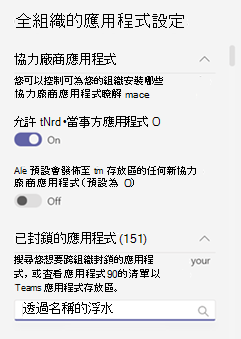

# 在 Microsoft Teams 中管理應用程式權限原則

身為系統管理員，您可以使用應用程式權限原則來控制組織中 Microsoft Teams 使用者可使用的應用程式。 您可以允許或封鎖所有應用程式，或是由 Microsoft、第三方和您的組織發行的特定應用程式。 當您封鎖應用程式時，擁有原則的使用者將無法從 Teams 應用程式商店安裝該應用程式。 您必須是全域系統管理員或 Teams 服務系統管理員，才能管理這些原則。

您可以在 Microsoft Teams 系統管理中心管理應用程式權限原則。 您可以使用全域 (全組織預設值) 原則，或建立並指派自訂原則。 除非您建立並指派自訂原則，否則組織中的使用者將會自動取得全域原則。 編輯或指派原則之後，變更可能需要幾個小時的時間才會生效。

> [!NOTE]
> 全組織應用程式設定會覆寫全域原則與您建立並指派給使用者的任何自訂原則。

如果您的組織已採用 Teams，您在 Microsoft 365 系統管理中心的 [全租用戶設定 **]** 中所設定的應用程式設定，會反映在 [管理應用程式 []](manage-apps.md) 頁面的全組織設定。 如果您是 Teams 的新使用者，且是剛開始使用，依預設，會在全域原則中允許所有應用程式。 這包括由 Microsoft、第三方和您的組織所發佈的應用程式。

比方說，假設您想要針對組織中的人力資源小組，封鎖所有第三方應用程式並允許來自 Microsoft 的特定應用程式。 首先，您會移至 [管理應用程式[]](manage-apps.md) 頁面，並確認您想要針對人力資源小組允許的應用程式會於組織層級允許。 然後，建立名為「人力資源應用程式權限原則」的自訂原則，將它設定為封鎖並允許您需要的應用程式，然後將它指派給人力資源小組的使用者。

> [!NOTE]
> 如果您已在 Microsoft 365 政府社群雲端 High (GCCH) 和美國商務部 (DoD) 環境中部署Teams，請參閱[管理Microsoft 365政府版的全組織應用程式設定](#manage-org-wide-app-settings-for-microsoft-365-government)，以深入瞭解 GCCH 和 DoD 專屬的協力廠商應用程式設定。

## 建立自訂應用程式權限原則

如果您想要控制組織中不同使用者群組可用的應用程式，請建立並指派一或多個自訂應用程式權限原則。 您可以根據應用程式是否由 Microsoft、第三方或您的組織發佈，來建立並指派個別的自訂原則。 務必知道，建立自訂原則之後，如果已在全組織應用程式設定中停用第三方應用程式，就無法變更該自訂原則。

1. 登入[Teams系統管理中心](https://admin.teams.microsoft.com/dashboard)
1. 在左側面板中，移至 **Teams** **appsPermission**  >  原則。
1. 選取 [新增 **]**。
    
1. 輸入原則的名稱和描述。
1. 在 [Microsoft 應用程式 **]**、[第三方應用程式 **]** 和 [自訂應用程式 **]** 下，選取下列其中一項：

    - **允許所有應用程式**
    - **允許特定的應用程式並封鎖所有其他的**
    - **封鎖特定的應用程式並允許所有其他的**
    - **封鎖所有應用程式**

1. 如果您選取 [允許特定的應用程式並封鎖所有其他的 **]**，請新增您要允許的應用程式：

    1. 選取 [允許應用程式 **]**。
    1. 搜尋您要允許的應用程式，然後按一下 [新增 **]**。 搜尋結果會篩選至應用程式發行者 (**Microsoft 應用程式**、**第三方應用程式** 或 **自訂應用程式**)。
    1. 選取應用程式清單後，請按一下 [允許 **]**。

1. 同樣地，如果您選取 **[封鎖特定應用程式] 並允許所有其他** 應用程式，請搜尋並新增您要封鎖的應用程式，然後選取 [ **封鎖]**。
1. 選取 [儲存 **]**。

## 編輯應用程式權限原則

您可以使用Teams系統管理中心來編輯原則，包括您建立的全域原則和自訂原則。

1. 在Microsoft Teams系統管理中心的左窗格中，移至 **Teams** **appPermission**  >  原則。
1. 按一下原則名稱左側來選取原則，然後選取 [編輯 **]**。
1. 從此處，進行您需要的變更。 您可以根據應用程式發行者來管理設定，並根據允許/封鎖設定來新增和移除應用程式。
1. 選取 [儲存 **]**。

## 將自訂應用程式權限原則指派給使用者

[!INCLUDE [assign-policy](includes/assign-policy.md)]

## 管理 Microsoft 365 政府版的全組織應用程式設定  

在Microsoft 365政府 - GCC、GCCH 和 DoD 部署Teams，預設會封鎖所有協力廠商應用程式。 在 GCCH 和 DOD 雲端中，無法使用協力廠商應用程式。 此外，在 GCC 中，您會在 Microsoft Teams 系統管理中心的應用程式許可權原則頁面上看到下列有關管理協力廠商應用程式的注意事項。

:::image type="content" source="media/app-permission-policies-gcc.png" alt-text="GCCH 和 DoD 中應用程式許可權原則的螢幕擷取畫面。":::

使用全組織應用程式設定來控制使用者是否可以安裝第三方應用程式。 全組織應用程式設定會控管所有使用者的行為，並覆寫指派給使用者的任何其他應用程式權限原則。 您可以使用這些原則來控制惡意或有問題的應用程式。

1. 在 [權限原則 **]** 頁面上，選取 [全組織應用程式設定 **]**。 然後您就可以在面板中設定您要的設定。

    

1. 在 [第三方應用程式 **]** 下，關閉或開啟這些設定，以控制對第三方應用程式的存取權：

    - **允許第三方應用程式**：這會控制使用者是否可以使用第三方應用程式。 如果您關閉此設定，您的使用者將無法安裝或使用任何第三方應用程式。 在Microsoft 365政府 - GCCH 和 DoD 部署的 Teams 中，此設定預設為關閉。
    - **預設允許發行到商店的任何新第三方應用程式**：這會控制發佈至 Teams 應用程式商店的新第三方應用程式是否會自動在 Teams 中提供使用。 您只能在允許第三方應用程式時設定此選項。

1. 在 [封鎖的應用程式 **]** 下，新增您想要在組織中封鎖存取權的應用程式。 在Microsoft 365政府 - GCCH 和 DoD 部署的 Teams 中，根據預設，所有協力廠商應用程式都會新增至此清單中。 針對您想要在組織中允許的任何第三方應用程式，請從此封鎖的應用程式清單中移除該應用程式。 在全組織封鎖某個應用程式時，會自動為所有使用者封鎖該應用程式，而無論任何應用程式權限原則中是否允許該應用程式。
1. 選 **取 [** 儲存為整個組織的應用程式設定] 以生效。

如稍早所提，若要允許第三方應用程式，您可以編輯並使用全域 (全組織預設值) 原則，或建立並指派自訂原則。

## 常見問題集

### 使用應用程式權限原則

#### 權限原則會影響哪些應用程式互動？

權限原則會透過控制使用者的安裝、探索及互動，來控管應用程式的使用狀況。 系統管理員仍可以在 Microsoft Teams 系統管理中心中管理應用程式，而無論指派給他們的權限原則為何。

#### 我可以控制企業營運 (LOB) 應用程式嗎？

是的，您可以使用應用程式權限原則來控制自訂 (LOB) 應用程式的推出和發佈。 您可以建立自訂原則或編輯全域原則，以根據組織的需求來允許或封鎖自訂應用程式。

#### 應用程式權限原則與釘選的應用程式和應用程式設定原則有何關聯？

您可以將應用程式設定原則與應用程式權限原則搭配使用。 系統會為使用者從已啟用的應用程式集合中選取預先釘選的應用程式。 此外，如果使用者的應用程式權限原則會封鎖其應用程式設定原則中的應用程式，該應用程式就不會顯示在 Teams 中。

#### 我可以使用應用程式權限原則來限制上傳自訂應用程式嗎？

您可以使用 [管理應用程式 **]** 頁面上的全組織應用程式設定，或應用程式設定原則來限制上傳組織的自訂應用程式。  

若要限制特定使用者上傳自訂應用程式，請使用自訂的應用程式原則。 若要深入了解，請參閱[在 Teams 中管理自訂應用程式原則和設定](teams-custom-app-policies-and-settings.md)。

#### 封鎖某個應用程式是否會套用至 Teams 行動裝置用戶端？

是的，當您封鎖某個應用程式，會於所有 Teams 用戶端間封鎖該應用程式。  

### 使用者體驗

#### 當某個應用程式遭到封鎖，使用者會遇到什麼情況？

使用者無法與封鎖的應用程式或其功能 (例如 bot、索引標籤和傳訊擴充功能) 互動。 在共用的內容 (例如小組或群組聊天) 中，bot 仍然可以傳送訊息給該內容的所有參與者。 當某個應用程式遭到封鎖時，Teams 會向使用者指出。

例如，當某個應用程式遭到封鎖時，使用者就無法執行下列任何一項動作：

- 自行新增應用程式或將應用程式新增至聊天或小組
- 傳送訊息至應用程式的 bot
- 執行會將資訊傳送回應用程式的按鈕動作，例如，可採取動作的郵件  
- 檢視應用程式的索引標籤
- 設定連接器以接收通知
- 使用應用程式的傳訊擴充功能

允許舊版入口網站在組織層級控制應用程式，這表示當某個應用程式遭到封鎖時，系統會為組織中的所有使用者封鎖該應用程式。 在 [管理應用程式[]](manage-apps.md) 頁面上封鎖應用程式的運作方式完全相同。

針對指派給特定使用者的應用程式權限原則，如果先允許具有 bot 或連接器的應用程式然後封鎖它，並且接著僅在共用的內容中對部分使用者允許該應用程式，則不具有該應用程式權限的群組聊天或頻道成員，可以查看由 bot 或連接器所張貼的訊息歷程記錄和訊息，但是無法與其互動。

## 相關主題

[在 Teams 中管理應用程式的設定](admin-settings.md)

[在 Teams 中將原則指派給使用者](policy-assignment-overview.md)
