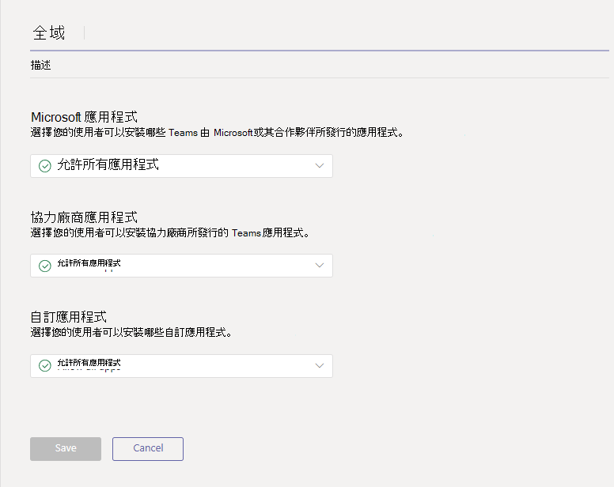
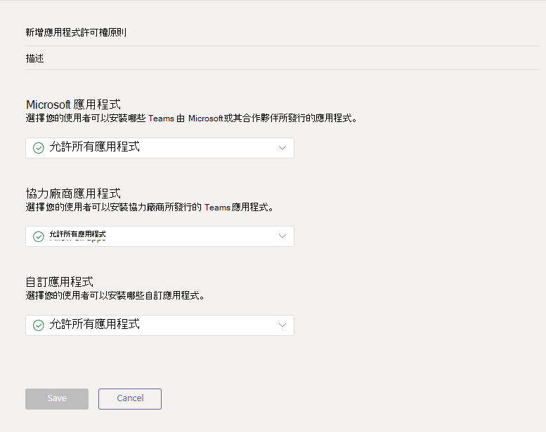

# <a name="manage-app-permission-policies-in-microsoft-teams"></a><span data-ttu-id="e552a-103">管理 Microsoft 團隊中的 app 許可權原則</span><span class="sxs-lookup"><span data-stu-id="e552a-103">Manage app permission policies in Microsoft Teams</span></span>

<span data-ttu-id="e552a-104">身為管理員，您可以使用應用程式許可權原則來控制貴組織中的 Microsoft 團隊使用者可以使用哪些應用程式。</span><span class="sxs-lookup"><span data-stu-id="e552a-104">As an admin, you can use app permission policies to control what apps are available to Microsoft Teams users in your organization.</span></span> <span data-ttu-id="e552a-105">您可以允許或封鎖由 Microsoft、協力廠商及貴組織發佈的所有 app 或特定應用程式。</span><span class="sxs-lookup"><span data-stu-id="e552a-105">You can allow or block all apps or specific apps published by Microsoft, third-parties, and your organization.</span></span> <span data-ttu-id="e552a-106">當您封鎖應用程式時，使用者無法從 [團隊 app store] 進行安裝。</span><span class="sxs-lookup"><span data-stu-id="e552a-106">When you block an app, users are unable to install it from the Teams app store.</span></span>

<span data-ttu-id="e552a-107">您可以在 Microsoft 團隊系統管理中心管理 app 許可權原則。</span><span class="sxs-lookup"><span data-stu-id="e552a-107">You manage app permission policies in the Microsoft Teams admin center.</span></span> <span data-ttu-id="e552a-108">您可以套用全域性設定、使用全域（組織範圍預設值）原則，以及建立並指派自訂原則給群組中的個別使用者或使用者。</span><span class="sxs-lookup"><span data-stu-id="e552a-108">You can apply settings org-wide, use the global (Org-wide default) policy, and create and assign custom policies to individual users or users in a group.</span></span>  



> [!NOTE]
> <span data-ttu-id="e552a-110">除非您建立並指派自訂原則，否則貴組織中的使用者會自動取得全域原則。</span><span class="sxs-lookup"><span data-stu-id="e552a-110">Users in your organization will automatically get the global policy unless you create and assign a custom policy.</span></span> <span data-ttu-id="e552a-111">整個組織內的應用程式設定會覆寫全域原則和您建立並指派給使用者的任何自訂原則。</span><span class="sxs-lookup"><span data-stu-id="e552a-111">Org-wide app settings override the global policy and any custom policies that you create and assign to users.</span></span>

<span data-ttu-id="e552a-112">如果您的組織已在團隊中，您在 Microsoft 365 系統管理中心的 [租使用者]**設定**中所設定的 app 設定會反映在組織內的應用程式設定中。</span><span class="sxs-lookup"><span data-stu-id="e552a-112">If your organization is already on Teams, the app settings you configured in **Tenant-wide settings** in the Microsoft 365 admin center are reflected in org-wide app settings.</span></span> <span data-ttu-id="e552a-113">如果您是團隊新手，且剛開始使用，則預設會允許全域原則中的所有 app。</span><span class="sxs-lookup"><span data-stu-id="e552a-113">If you're new to Teams and just getting started, by default, all apps are allowed in the global policy.</span></span> <span data-ttu-id="e552a-114">這包含由 Microsoft、協力廠商及貴組織發佈的應用程式。</span><span class="sxs-lookup"><span data-stu-id="e552a-114">This includes apps published by Microsoft, third-parties, and your organization.</span></span>

<span data-ttu-id="e552a-115">例如，您想要封鎖所有協力廠商應用程式，並允許 Microsoft 針對貴組織中的人力資源小組特定應用程式。</span><span class="sxs-lookup"><span data-stu-id="e552a-115">Say, for example, you want to block all third-party apps and allow specific apps from Microsoft for the HR team in your organization.</span></span> <span data-ttu-id="e552a-116">您可以建立名為 [HR App] 許可權原則的自訂原則，將它設定為 [封鎖] 並允許您想要的 app，然後將它指派給 HR 小組的使用者。</span><span class="sxs-lookup"><span data-stu-id="e552a-116">You would create a custom policy named HR App Permission Policy, set it to block and allow the apps that you want, and then assign it to users on the HR team.</span></span>

> [!NOTE]
> <span data-ttu-id="e552a-117">如果您已在 Microsoft 365 政府版的環境中部署團隊，請參閱適用于[gcc 的 App 許可權原則](#app-permission-policies-for-gcc)，以深入瞭解適用于 GCC 的協力廠商應用程式設定。</span><span class="sxs-lookup"><span data-stu-id="e552a-117">If you deployed Teams in a Microsoft 365 Government - GCC environment, see [App permission policies for GCC](#app-permission-policies-for-gcc) to learn more about third-party app settings that are unique to GCC.</span></span>

## <a name="manage-org-wide-app-settings"></a><span data-ttu-id="e552a-118">管理整個組織內的應用程式設定</span><span class="sxs-lookup"><span data-stu-id="e552a-118">Manage org-wide app settings</span></span>

<span data-ttu-id="e552a-119">使用組織範圍內的應用程式設定來控制貴組織提供哪些 app。</span><span class="sxs-lookup"><span data-stu-id="e552a-119">Use org-wide app settings to control which apps are available across your organization.</span></span> <span data-ttu-id="e552a-120">全組織式應用程式設定會控制所有使用者的行為，並覆寫指派給使用者的任何其他應用程式許可權原則。</span><span class="sxs-lookup"><span data-stu-id="e552a-120">Org-wide app settings govern the behavior for all users and override any other app permission policies assigned to users.</span></span> <span data-ttu-id="e552a-121">您可以使用它們來控制惡意或有問題的 app。</span><span class="sxs-lookup"><span data-stu-id="e552a-121">You can use them to control malicious or problematic apps.</span></span>

1. <span data-ttu-id="e552a-122">在 Microsoft 團隊系統管理中心的左導覽中，移至 [**團隊 app** > ]**許可權原則**。</span><span class="sxs-lookup"><span data-stu-id="e552a-122">In the left navigation of the Microsoft Teams admin center, go to **Teams apps** > **Permission policies**.</span></span>
2. <span data-ttu-id="e552a-123">選取 [**整個組織的設定**]。</span><span class="sxs-lookup"><span data-stu-id="e552a-123">Select **Org-wide settings**.</span></span> <span data-ttu-id="e552a-124">接著，您可以在面板中設定您想要的設定。</span><span class="sxs-lookup"><span data-stu-id="e552a-124">You can then configure the settings you want in the panel.</span></span> 
    <span data-ttu-id="e552a-125"></span><span class="sxs-lookup"><span data-stu-id="e552a-125"></span></span>
3. <span data-ttu-id="e552a-126">在**協力廠商應用程式**下，關閉或開啟這些設定以控制對協力廠商應用程式的存取：</span><span class="sxs-lookup"><span data-stu-id="e552a-126">Under **Third-party apps**, turn off or turn on these settings to control access to third-party apps:</span></span>

    - <span data-ttu-id="e552a-127">**允許在團隊中使用協力廠商**：這會控制使用者是否可以使用協力廠商應用程式。</span><span class="sxs-lookup"><span data-stu-id="e552a-127">**Allow third-party in Teams**: This controls whether users can use third-party apps.</span></span>
    - <span data-ttu-id="e552a-128">**允許預設發佈至商店的任何新的協力廠商應用程式**：這會控制發佈至 [小組] 應用程式商店的新的協力廠商應用程式是否會自動在小組中提供。</span><span class="sxs-lookup"><span data-stu-id="e552a-128">**Allow any new third-party apps published to the store by default**: This controls whether new third-party apps that are published to the Teams app store become automatically available in Teams.</span></span> <span data-ttu-id="e552a-129">如果您允許協力廠商應用程式，則只能設定此選項。</span><span class="sxs-lookup"><span data-stu-id="e552a-129">You can only set this option if you allow third-party apps.</span></span>

4. <span data-ttu-id="e552a-130">在 [**自訂應用程式**] 底下，關閉或開啟 [**允許與自訂應用程式互動**]。</span><span class="sxs-lookup"><span data-stu-id="e552a-130">Under **Custom apps**, turn off or turn on **Allow interaction with custom apps**.</span></span> <span data-ttu-id="e552a-131">這個設定控制使用者是否能與自訂（側載） app 互動。</span><span class="sxs-lookup"><span data-stu-id="e552a-131">This setting controls whether users can interact with custom (sideloaded) apps.</span></span> <span data-ttu-id="e552a-132">請記住，這與允許使用者*上傳*自訂應用程式不同。</span><span class="sxs-lookup"><span data-stu-id="e552a-132">Keep in mind that this is different from allowing users to *upload* custom apps.</span></span>
5. <span data-ttu-id="e552a-133">在 [**封鎖的應用程式**] 底下，搜尋並新增您想要在組織內封鎖的 app。</span><span class="sxs-lookup"><span data-stu-id="e552a-133">Under **Blocked apps**, search for and add the apps that you want to block across your organization.</span></span> <span data-ttu-id="e552a-134">您可以從租使用者應用程式目錄或團隊 app store 中選擇應用程式。</span><span class="sxs-lookup"><span data-stu-id="e552a-134">You can choose apps from the tenant app catalog or the Teams app store.</span></span>
6. <span data-ttu-id="e552a-135">按一下 [**儲存**以組織範圍內的應用程式設定] 生效。</span><span class="sxs-lookup"><span data-stu-id="e552a-135">Click **Save** for org-wide app settings to take effect.</span></span>

## <a name="create-a-custom-app-permission-policy"></a><span data-ttu-id="e552a-136">建立自訂應用程式許可權原則</span><span class="sxs-lookup"><span data-stu-id="e552a-136">Create a custom app permission policy</span></span>

<span data-ttu-id="e552a-137">如果您想要控制貴組織中不同群組使用者的可用應用程式，請建立並指派一或多個自訂應用程式許可權原則。</span><span class="sxs-lookup"><span data-stu-id="e552a-137">If you want to control the apps that are available for different groups of users in your organization, create and assign one or more custom app permission policies.</span></span> <span data-ttu-id="e552a-138">您可以根據 Microsoft、協力廠商或您的組織發佈的應用程式，建立並指派個別的自訂原則。</span><span class="sxs-lookup"><span data-stu-id="e552a-138">You can create and assign separate custom policies based on whether apps are published by Microsoft, third-parties, or your organization.</span></span> <span data-ttu-id="e552a-139">您必須知道，在您建立自訂原則之後，如果已停用組織內設定中的協力廠商應用程式，就無法變更它。</span><span class="sxs-lookup"><span data-stu-id="e552a-139">It's important to know that after you create a custom policy, you can't change it if third-party apps are disabled in org-wide settings.</span></span> 

1. <span data-ttu-id="e552a-140">在 Microsoft 團隊系統管理中心的左導覽中，移至 [**團隊 app** > ]**許可權原則**。</span><span class="sxs-lookup"><span data-stu-id="e552a-140">In the left navigation of the Microsoft Teams admin center, go to **Teams apps** > **Permission policies**.</span></span>
2. <span data-ttu-id="e552a-141">按一下 [**新增**]。</span><span class="sxs-lookup"><span data-stu-id="e552a-141">Click **Add**.</span></span>
    <span data-ttu-id="e552a-142"></span><span class="sxs-lookup"><span data-stu-id="e552a-142"></span></span>
3. <span data-ttu-id="e552a-143">輸入原則的名稱和描述。</span><span class="sxs-lookup"><span data-stu-id="e552a-143">Enter a name and description for the policy.</span></span>
4. <span data-ttu-id="e552a-144">在 [ **Microsoft app**]、**協力廠商應用程式**和**租使用者應用**程式底下，選取下列其中一項：</span><span class="sxs-lookup"><span data-stu-id="e552a-144">Under **Microsoft apps**, **Third-party apps**, and **Tenant apps**, select one of the following:</span></span>

    - <span data-ttu-id="e552a-145">**允許所有 app**</span><span class="sxs-lookup"><span data-stu-id="e552a-145">**Allow all apps**</span></span>
    - <span data-ttu-id="e552a-146">**允許特定的 app 和封鎖所有人**</span><span class="sxs-lookup"><span data-stu-id="e552a-146">**Allow specific apps and block all others**</span></span>
    - <span data-ttu-id="e552a-147">**封鎖特定應用程式並允許所有其他 app**</span><span class="sxs-lookup"><span data-stu-id="e552a-147">**Block specific apps and allow all others**</span></span>
    - <span data-ttu-id="e552a-148">**封鎖所有 app**</span><span class="sxs-lookup"><span data-stu-id="e552a-148">**Block all apps**</span></span>

5. <span data-ttu-id="e552a-149">如果您已選取 [**允許特定應用程式並封鎖其他 app**]，請新增您想要允許的應用程式：</span><span class="sxs-lookup"><span data-stu-id="e552a-149">If you selected **Allow specific apps and block others**, add the apps that you want to allow:</span></span>

    1. <span data-ttu-id="e552a-150">選取 [**允許應用程式**]。</span><span class="sxs-lookup"><span data-stu-id="e552a-150">Select **Allow apps**.</span></span>
    1. <span data-ttu-id="e552a-151">搜尋您要允許的應用程式，然後按一下 [**新增**]。</span><span class="sxs-lookup"><span data-stu-id="e552a-151">Search for the apps that you want to allow, and then click **Add**.</span></span> <span data-ttu-id="e552a-152">搜尋結果會篩選到應用程式發行者（**Microsoft**app、**協力廠商應用程式**或**租**使用者 app）。</span><span class="sxs-lookup"><span data-stu-id="e552a-152">The search results are filtered to the app publisher (**Microsoft apps**, **Third-party apps**, or **Tenant apps**).</span></span>
    1. <span data-ttu-id="e552a-153">當您選取 app 清單後，請按一下 [**允許**]。</span><span class="sxs-lookup"><span data-stu-id="e552a-153">When you've chosen the list of apps, click **Allow**.</span></span>

6. <span data-ttu-id="e552a-154">同樣地，如果您已選取 [**封鎖特定應用程式並允許所有人**]，請搜尋並新增您想要封鎖的 app。</span><span class="sxs-lookup"><span data-stu-id="e552a-154">Similarly, if you selected **Block specific apps and allow all others**, search for and add the apps that you want to block.</span></span>
7. <span data-ttu-id="e552a-155">按一下 [**儲存**]。</span><span class="sxs-lookup"><span data-stu-id="e552a-155">Click **Save**.</span></span>

## <a name="edit-an-app-permission-policy"></a><span data-ttu-id="e552a-156">編輯應用程式許可權原則</span><span class="sxs-lookup"><span data-stu-id="e552a-156">Edit an app permission policy</span></span>

<span data-ttu-id="e552a-157">您可以使用 Microsoft 團隊系統管理中心來編輯原則，包括您建立的全域原則和自訂原則。</span><span class="sxs-lookup"><span data-stu-id="e552a-157">You can use the Microsoft Teams admin center to edit a policy, including the global policy and custom policies that you create.</span></span>

1. <span data-ttu-id="e552a-158">在 Microsoft 團隊系統管理中心的左導覽中，移至 [**團隊 app** > ]**許可權原則**。</span><span class="sxs-lookup"><span data-stu-id="e552a-158">In the left navigation of the Microsoft Teams admin center, go to **Teams apps** > **Permission policies**.</span></span>
2. <span data-ttu-id="e552a-159">按一下原則名稱左邊的，然後按一下 [**編輯**]，選取原則。</span><span class="sxs-lookup"><span data-stu-id="e552a-159">Select the policy by clicking to the left of the policy name, and then click **Edit**.</span></span>
3. <span data-ttu-id="e552a-160">您可以從這裡進行所要的變更。</span><span class="sxs-lookup"><span data-stu-id="e552a-160">From here, make the changes that you want.</span></span> <span data-ttu-id="e552a-161">您可以根據應用程式發行者管理設定，然後根據 [允許/封鎖] 設定新增及移除應用程式。</span><span class="sxs-lookup"><span data-stu-id="e552a-161">You can manage settings based on the app publisher and add and remove apps based on the allow/block setting.</span></span>
4. <span data-ttu-id="e552a-162">按一下 [**儲存**]。</span><span class="sxs-lookup"><span data-stu-id="e552a-162">Click **Save**.</span></span>

## <a name="assign-a-custom-app-permission-policy-to-users"></a><span data-ttu-id="e552a-163">將自訂應用程式許可權原則指派給使用者</span><span class="sxs-lookup"><span data-stu-id="e552a-163">Assign a custom app permission policy to users</span></span>

<span data-ttu-id="e552a-164">您可以使用 Microsoft 團隊系統管理中心，將自訂原則指派給一或多個使用者或商務用 Skype PowerShell 模組，將自訂原則指派給使用者群組，例如安全群組或通訊群組中的所有使用者。</span><span class="sxs-lookup"><span data-stu-id="e552a-164">You can use the Microsoft Teams admin center to assign a custom policy to one or more users or the Skype for Business PowerShell module to assign a custom policy to groups of users, such as all users in a security group or distribution group.</span></span>

### <a name="assign-a-custom-app-permission-policy-to-a-user"></a><span data-ttu-id="e552a-165">將自訂應用程式許可權原則指派給使用者</span><span class="sxs-lookup"><span data-stu-id="e552a-165">Assign a custom app permission policy to a user</span></span>

1. <span data-ttu-id="e552a-166">在 Microsoft 團隊系統管理中心的左導覽中，前往 [**使用者**]。</span><span class="sxs-lookup"><span data-stu-id="e552a-166">In the left navigation of the Microsoft Teams admin center, go to **Users**.</span></span>
2. <span data-ttu-id="e552a-167">按一下使用者名稱左邊的，然後按一下 [**編輯設定**]，選取使用者。</span><span class="sxs-lookup"><span data-stu-id="e552a-167">Select the user by clicking to the left of the user name, and then click **Edit settings**.</span></span>
3. <span data-ttu-id="e552a-168">在 [**應用程式許可權原則**] 底下，選取您要指派的 App 許可權原則，**然後按一下 [** 套用]。</span><span class="sxs-lookup"><span data-stu-id="e552a-168">Under **App permission policy**, select the app permission policy you want to assign, and then click **Apply**.</span></span>

<span data-ttu-id="e552a-169">若要一次將原則指派給多位使用者，請參閱[大量編輯團隊使用者設定](edit-user-settings-in-bulk.md)。</span><span class="sxs-lookup"><span data-stu-id="e552a-169">To assign a policy to multiple users at a time, see [Edit Teams user settings in bulk](edit-user-settings-in-bulk.md).</span></span>

<span data-ttu-id="e552a-170">或者，您也可以執行下列動作：</span><span class="sxs-lookup"><span data-stu-id="e552a-170">Or, you can also do the following:</span></span>

1. <span data-ttu-id="e552a-171">在 Microsoft 團隊系統管理中心的左導覽中，移至 [**團隊 app** > ]**許可權原則**。</span><span class="sxs-lookup"><span data-stu-id="e552a-171">In the left navigation of the Microsoft Teams admin center, go to **Teams apps** > **Permission policies**.</span></span>
2. <span data-ttu-id="e552a-172">按一下原則名稱左方，選取原則。</span><span class="sxs-lookup"><span data-stu-id="e552a-172">Select the policy by clicking to the left of the policy name.</span></span>
3. <span data-ttu-id="e552a-173">選取 [**管理使用者**]。</span><span class="sxs-lookup"><span data-stu-id="e552a-173">Select **Manage users**.</span></span>
4. <span data-ttu-id="e552a-174">在 [**管理使用者**] 窗格中，依 [顯示名稱] 或 [使用者名稱] 搜尋使用者，選取名稱，然後按一下 [**新增**]。</span><span class="sxs-lookup"><span data-stu-id="e552a-174">In the **Manage users** pane, search for the user by display name or by user name, select the name, and then click **Add**.</span></span> <span data-ttu-id="e552a-175">針對您要新增的每個使用者重複此步驟。</span><span class="sxs-lookup"><span data-stu-id="e552a-175">Repeat this step for each user that you want to add.</span></span>
5. <span data-ttu-id="e552a-176">完成新增使用者後，請按一下 [**儲存**]。</span><span class="sxs-lookup"><span data-stu-id="e552a-176">When you're finished adding users, click **Save**.</span></span>

### <a name="assign-a-custom-app-permission-policy-to-users-in-a-group"></a><span data-ttu-id="e552a-177">將自訂應用程式許可權原則指派給群組中的使用者</span><span class="sxs-lookup"><span data-stu-id="e552a-177">Assign a custom app permission policy to users in a group</span></span>

<span data-ttu-id="e552a-178">您可能會想要將自訂應用程式許可權原則指派給已識別的多個使用者。</span><span class="sxs-lookup"><span data-stu-id="e552a-178">You may want to assign a custom app permission policy to multiple users that you’ve already identified.</span></span> <span data-ttu-id="e552a-179">例如，您可能會想要將原則指派給安全性群組中的所有使用者。</span><span class="sxs-lookup"><span data-stu-id="e552a-179">For example, you may want to assign a policy to all users in a security group.</span></span> <span data-ttu-id="e552a-180">您可以透過連線到 Azure Active Directory PowerShell for Graph 模組及商務用 Skype PowerShell 模組來執行此動作。</span><span class="sxs-lookup"><span data-stu-id="e552a-180">You can do this by connecting to the Azure Active Directory PowerShell for Graph module and the Skype for Business PowerShell module.</span></span> <span data-ttu-id="e552a-181">如需有關使用 PowerShell 來管理團隊的詳細資訊，請參閱[團隊 PowerShell 概覽](teams-powershell-overview.md)。</span><span class="sxs-lookup"><span data-stu-id="e552a-181">For more information about using PowerShell to manage Teams, see [Teams PowerShell Overview](teams-powershell-overview.md).</span></span>

<span data-ttu-id="e552a-182">在這個範例中，我們會將名為「人力資源 App」許可權原則的自訂應用程式許可權原則指派給 Contoso 製藥人力資源專案群組中的所有使用者。</span><span class="sxs-lookup"><span data-stu-id="e552a-182">In this example, we assign a custom app permission policy called HR App Permission Policy to all users in the Contoso Pharmaceuticals HR Project group.</span></span>  

> [!NOTE]
> <span data-ttu-id="e552a-183">請依照在[單一 Windows PowerShell 視窗中連線至 [所有 Office 365 服務]](https://docs.microsoft.com/office365/enterprise/powershell/connect-to-all-office-365-services-in-a-single-windows-powershell-window)中的步驟，確認您首先連線至 [圖形模組] 和 [商務用 Skype] powershell 模組的 [Azure Active Directory PowerShell]。</span><span class="sxs-lookup"><span data-stu-id="e552a-183">Make sure you first connect to the Azure Active Directory PowerShell for Graph module and Skype for Business PowerShell module by following the steps in [Connect to all Office 365 services in a single Windows PowerShell window](https://docs.microsoft.com/office365/enterprise/powershell/connect-to-all-office-365-services-in-a-single-windows-powershell-window).</span></span>

<span data-ttu-id="e552a-184">取得特定群組的 GroupObjectId。</span><span class="sxs-lookup"><span data-stu-id="e552a-184">Get the GroupObjectId of the particular group.</span></span>
```PowerShell
$group = Get-AzureADGroup -SearchString "Contoso Pharmaceuticals HR Project"
```
<span data-ttu-id="e552a-185">取得指定群組的成員。</span><span class="sxs-lookup"><span data-stu-id="e552a-185">Get the members of the specified group.</span></span>
```PowerShell
$members = Get-AzureADGroupMember -ObjectId $group.ObjectId -All $true | Where-Object {$_.ObjectType -eq "User"}
```
<span data-ttu-id="e552a-186">將群組中的所有使用者指派給特定的 app 許可權原則。</span><span class="sxs-lookup"><span data-stu-id="e552a-186">Assign all users in the group to a particular app permission policy.</span></span> <span data-ttu-id="e552a-187">在這個範例中，它是人力資源應用程式許可權原則。</span><span class="sxs-lookup"><span data-stu-id="e552a-187">In this example, it's HR App Permission Policy.</span></span>
```PowerShell
$members | ForEach-Object { Grant-CsTeamsAppPermissionPolicy -PolicyName "HR App Permission Policy" -Identity $_.UserPrincipalName}
``` 
<span data-ttu-id="e552a-188">根據群組中的成員數目而定，此命令可能需要幾分鐘的時間執行。</span><span class="sxs-lookup"><span data-stu-id="e552a-188">Depending on the number of members in the group, this command may take several minutes to execute.</span></span>

## <a name="app-permission-policies-for-gcc"></a><span data-ttu-id="e552a-189">適用于 GCC 的 App 許可權原則</span><span class="sxs-lookup"><span data-stu-id="e552a-189">App permission policies for GCC</span></span>

<span data-ttu-id="e552a-190">在 Microsoft 365 政府版的團隊部署中，請務必瞭解下列關於適用于 GCC 的協力廠商應用程式設定。</span><span class="sxs-lookup"><span data-stu-id="e552a-190">In a Microsoft 365 Government - GCC deployment of Teams, it's important to know the following about third-party app settings, which are unique to GCC.</span></span>

<span data-ttu-id="e552a-191">在 GCC 中，預設會封鎖所有協力廠商應用程式。</span><span class="sxs-lookup"><span data-stu-id="e552a-191">In GCC, all third-party apps are blocked by default.</span></span> <span data-ttu-id="e552a-192">此外，您會在 Microsoft 團隊系統管理中心的 [應用程式許可權原則] 頁面上，看到有關管理協力廠商應用程式的相關資訊。</span><span class="sxs-lookup"><span data-stu-id="e552a-192">Additionally, you'll see the following note about managing third-party apps on the app permission policies page in the Microsoft Teams admin center.</span></span>


<span data-ttu-id="e552a-194">若要為您組織中的使用者或一組使用者啟用協力廠商應用程式，請執行下列動作：</span><span class="sxs-lookup"><span data-stu-id="e552a-194">To enable a third-party app for a user or a set of users in your organization, do the following:</span></span>

1. <span data-ttu-id="e552a-195">在 Microsoft 團隊系統管理中心的左導覽中，移至 [**團隊 app** > ]**許可權原則**。</span><span class="sxs-lookup"><span data-stu-id="e552a-195">In the left navigation of the Microsoft Teams admin center, go to **Teams apps** > **Permission policies**.</span></span>
2. <span data-ttu-id="e552a-196">確認您要允許一組使用者使用的協力廠商應用程式已在組織層級封鎖。</span><span class="sxs-lookup"><span data-stu-id="e552a-196">Confirm that the third-party app that you want to allow for a set of users is blocked at the org level.</span></span> <span data-ttu-id="e552a-197">若要這樣做，請按一下 [**整個組織的設定**]，然後在 [**封鎖的應用程式**] 下，確認已列出該應用程式。</span><span class="sxs-lookup"><span data-stu-id="e552a-197">To do this, click **Org-wide settings**, and then under **Blocked apps**, check to make sure the app is listed.</span></span>
3. <span data-ttu-id="e552a-198">編輯全域原則來封鎖協力廠商應用程式。</span><span class="sxs-lookup"><span data-stu-id="e552a-198">Edit the global policy to block the third-party app.</span></span> <span data-ttu-id="e552a-199">若要執行此動作：</span><span class="sxs-lookup"><span data-stu-id="e552a-199">To do this:</span></span>
    1. <span data-ttu-id="e552a-200">在 [應用程式許可權原則] 頁面上，按一下 [**全域（組織範圍預設值）**]，然後按一下 [**編輯**]。</span><span class="sxs-lookup"><span data-stu-id="e552a-200">On the App permission policies page, click **Global (Org-wide default)**, and then click **Edit**.</span></span>
    2. <span data-ttu-id="e552a-201">在 [**協力廠商應用程式**] 底下，選取 [**封鎖特定的 app 並允許所有其他**app]，新增應用程式，然後按一下 [**儲存**]。</span><span class="sxs-lookup"><span data-stu-id="e552a-201">Under **Third-party apps**, select **Block specific apps and allow all others**, add the app, and then click **Save**.</span></span>

    > [!NOTE]
    > <span data-ttu-id="e552a-202">在您移至下一個步驟之前，請務必先執行此動作，才能允許組織層級的 app。</span><span class="sxs-lookup"><span data-stu-id="e552a-202">It's important to do this before you go to the next step to allow the app at the org level.</span></span> <span data-ttu-id="e552a-203">這是因為如果協力廠商應用程式未封鎖在全域原則中，則全域原則適用的所有使用者，都可以在組織階層允許時存取協力廠商 app。</span><span class="sxs-lookup"><span data-stu-id="e552a-203">This is because if the third-party app isn't blocked in the global policy, all users that the global policy applies to will be able to access the third-party app when you allow it at the org level.</span></span>

4. <span data-ttu-id="e552a-204">允許組織階層的協力廠商應用程式。</span><span class="sxs-lookup"><span data-stu-id="e552a-204">Allow the third-party app at the org level.</span></span> <span data-ttu-id="e552a-205">若要這樣做，請按一下 [**整個組織的設定**]，然後在 [**封鎖的應用程式**] 底下，從清單中移除應用程式，然後按一下 [**儲存**]。</span><span class="sxs-lookup"><span data-stu-id="e552a-205">To do this, click **Org-wide settings**, under **Blocked apps**, remove the app from the list, and then click **Save**.</span></span>
5. <span data-ttu-id="e552a-206">[建立自訂應用程式許可權原則](#create-a-custom-app-permission-policy)以允許 app，然後[將原則指派](#assign-a-custom-app-permission-policy-to-users)給您想要的使用者。</span><span class="sxs-lookup"><span data-stu-id="e552a-206">[Create a custom app permission policy](#create-a-custom-app-permission-policy) to allow the app, and then [assign the policy](#assign-a-custom-app-permission-policy-to-users) to the users you want.</span></span>

## <a name="faq"></a><span data-ttu-id="e552a-207">常見問題集</span><span class="sxs-lookup"><span data-stu-id="e552a-207">FAQ</span></span>

### <a name="working-with-app-permission-policies"></a><span data-ttu-id="e552a-208">使用應用程式許可權原則</span><span class="sxs-lookup"><span data-stu-id="e552a-208">Working with app permission policies</span></span>

#### <a name="can-i-control-line-of-business-lob-apps"></a><span data-ttu-id="e552a-209">我可以控制商務用線（LOB）應用程式嗎？</span><span class="sxs-lookup"><span data-stu-id="e552a-209">Can I control line of business (LOB) apps?</span></span>
<span data-ttu-id="e552a-210">是的，您可以使用應用程式許可權原則來控制自訂（LOB）應用程式的推出與發佈。</span><span class="sxs-lookup"><span data-stu-id="e552a-210">Yes, you can use app permission policies to control the rollout and distribution of custom (LOB) apps.</span></span> <span data-ttu-id="e552a-211">您可以建立自訂原則或編輯全域原則，以根據貴組織的需求來允許或封鎖自訂應用程式。</span><span class="sxs-lookup"><span data-stu-id="e552a-211">You can create a custom policy or edit the global policy to allow or block custom apps based on the needs of your organization.</span></span>

#### <a name="how-do-app-permission-policies-relate-to-pinned-apps-and-app-setup-policies"></a><span data-ttu-id="e552a-212">App 許可權原則如何與釘選的 app 和 app 設定原則相關？</span><span class="sxs-lookup"><span data-stu-id="e552a-212">How do app permission policies relate to pinned apps and app setup policies?</span></span>

<span data-ttu-id="e552a-213">您可以將應用程式設定原則與 app 許可權原則搭配使用。</span><span class="sxs-lookup"><span data-stu-id="e552a-213">You can use app setup policies together with app permission policies.</span></span> <span data-ttu-id="e552a-214">已從使用者的已啟用應用程式集中選取預先固定的 app。</span><span class="sxs-lookup"><span data-stu-id="e552a-214">Pre-pinned apps are selected from the set of enabled apps for a user.</span></span> <span data-ttu-id="e552a-215">此外，如果使用者有應用程式許可權原則，而該策略封鎖 app 設定原則中的 app，該 app 就不會出現在小組中。</span><span class="sxs-lookup"><span data-stu-id="e552a-215">Additionally, if a user has an app permission policy that blocks an app in their app setup policy, that app won't appear in Teams.</span></span>

#### <a name="can-i-use-app-permission-policies-to-restrict-uploading-custom-apps-also-known-as-sideloading"></a><span data-ttu-id="e552a-216">我可以使用應用程式許可權原則來限制上傳自訂應用程式（也稱為邊載）嗎？</span><span class="sxs-lookup"><span data-stu-id="e552a-216">Can I use app permission policies to restrict uploading custom apps (also known as sideloading)?</span></span>

<span data-ttu-id="e552a-217">使用應用程式許可權原則中的全組織設定，限制您的組織上傳自訂應用程式。</span><span class="sxs-lookup"><span data-stu-id="e552a-217">Use org-wide settings in app permission policies to restrict uploading custom apps for your organization.</span></span>  

<span data-ttu-id="e552a-218">若要限制特定使用者上傳自訂應用程式，請使用自訂 app 原則。</span><span class="sxs-lookup"><span data-stu-id="e552a-218">To restrict specific users from uploading custom apps, use custom app policies.</span></span> <span data-ttu-id="e552a-219">若要深入瞭解，請參閱[管理團隊中的自訂應用程式原則和設定](teams-custom-app-policies-and-settings.md)。</span><span class="sxs-lookup"><span data-stu-id="e552a-219">To learn more, see [Manage custom app policies and settings in Teams](teams-custom-app-policies-and-settings.md).</span></span>

#### <a name="does-blocking-an-app-apply-to-teams-mobile-clients"></a><span data-ttu-id="e552a-220">封鎖應用程式適用于團隊行動用戶端嗎？</span><span class="sxs-lookup"><span data-stu-id="e552a-220">Does blocking an app apply to Teams mobile clients?</span></span>

<span data-ttu-id="e552a-221">是的，當您封鎖應用程式時，該應用程式會在所有團隊用戶端間封鎖。</span><span class="sxs-lookup"><span data-stu-id="e552a-221">Yes, when you block an app, that app is blocked across all Teams clients.</span></span>  

### <a name="user-experience"></a><span data-ttu-id="e552a-222">使用者體驗</span><span class="sxs-lookup"><span data-stu-id="e552a-222">User experience</span></span>

#### <a name="what-does-a-user-experience-when-an-app-is-blocked"></a><span data-ttu-id="e552a-223">當應用程式遭到封鎖時，使用者有何體驗？</span><span class="sxs-lookup"><span data-stu-id="e552a-223">What does a user experience when an app is blocked?</span></span>

<span data-ttu-id="e552a-224">使用者無法與封鎖的 app 或其功能（例如 bot、索引標籤和訊息延伸）互動。</span><span class="sxs-lookup"><span data-stu-id="e552a-224">Users can't interact with a blocked app or its capabilities, such bots, tabs, and messaging extensions.</span></span> <span data-ttu-id="e552a-225">在共用的內容（例如小組或群組聊天）中，機器人仍可以傳送訊息給該內容的所有參與者。</span><span class="sxs-lookup"><span data-stu-id="e552a-225">In a shared context, such as a team or group chat, bots can still send messages to all participants of that context.</span></span> <span data-ttu-id="e552a-226">小組會在應用程式遭到封鎖時向使用者顯示。</span><span class="sxs-lookup"><span data-stu-id="e552a-226">Teams indicates to the user when an app is blocked.</span></span>

<span data-ttu-id="e552a-227">例如，當應用程式遭到封鎖時，使用者就不能執行下列任何一項動作：</span><span class="sxs-lookup"><span data-stu-id="e552a-227">For example, when an app is blocked, users can't do any of the following:</span></span>

- <span data-ttu-id="e552a-228">將 app 新增至個人或加入聊天或團隊</span><span class="sxs-lookup"><span data-stu-id="e552a-228">Add the app personally or to a chat or team</span></span>
- <span data-ttu-id="e552a-229">傳送訊息給應用程式的 bot</span><span class="sxs-lookup"><span data-stu-id="e552a-229">Send messages to the app’s bot</span></span>
- <span data-ttu-id="e552a-230">執行傳送資訊回到應用程式的按鈕動作，例如可操作的訊息</span><span class="sxs-lookup"><span data-stu-id="e552a-230">Perform button actions that send information back to the app, such as actionable messages</span></span>  
- <span data-ttu-id="e552a-231">[查看] 應用程式的索引標籤</span><span class="sxs-lookup"><span data-stu-id="e552a-231">View the app’s tab</span></span>
- <span data-ttu-id="e552a-232">設定連接器接收通知</span><span class="sxs-lookup"><span data-stu-id="e552a-232">Set up connectors to receive notifications</span></span>
- <span data-ttu-id="e552a-233">使用應用程式的訊息延伸</span><span class="sxs-lookup"><span data-stu-id="e552a-233">Use the app’s messaging extension</span></span>

<span data-ttu-id="e552a-234">舊版入口網站允許您在組織階層控制應用程式，這表示當應用程式遭到封鎖時，系統會封鎖組織中的所有使用者。</span><span class="sxs-lookup"><span data-stu-id="e552a-234">The legacy portal allowed controlling apps at the organization level, which means when an app is blocked, it's blocked for all users in the organization.</span></span> <span data-ttu-id="e552a-235">應用程式許可權原則中的全組織式應用程式設定的運作方式會完全相同。</span><span class="sxs-lookup"><span data-stu-id="e552a-235">The org-wide app setting in app permission policies works exactly the same way.</span></span>

<span data-ttu-id="e552a-236">針對指派給特定使用者的 app 許可權原則，如果允許並封鎖含 bot 或連接器功能的應用程式，而且如果在共用的內容中則只允許部分使用者使用該應用程式的群組聊天或頻道成員，就不會有該應用程式的許可權 可以查看由 bot 或連接器所張貼的訊息歷程記錄和訊息，但無法與它互動。</span><span class="sxs-lookup"><span data-stu-id="e552a-236">For app permission policies assigned to specific users, if an app with bot or connector capability was allowed and then blocked, and if the app is then allowed only for some users in a shared context, members of a group chat or channel that don't have permission to that app can see the message history and messages that were posted by the bot or connector, but can't interact with it.</span></span>

 ## <a name="related-topics"></a><span data-ttu-id="e552a-237">相關主題</span><span class="sxs-lookup"><span data-stu-id="e552a-237">Related topics</span></span>
- [<span data-ttu-id="e552a-238">在 Teams 中的應用程式系統管理設定</span><span class="sxs-lookup"><span data-stu-id="e552a-238">Admin settings for apps in Teams</span></span>](admin-settings.md)
