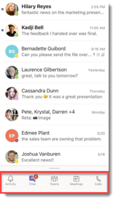

# <a name="manage-app-setup-policies-in-microsoft-teams"></a><span data-ttu-id="6b246-103">在 Microsoft 團隊中管理 app 設定原則</span><span class="sxs-lookup"><span data-stu-id="6b246-103">Manage app setup policies in Microsoft Teams</span></span>

> [!NOTE]
> <span data-ttu-id="6b246-104">如果您已啟用整個組織內的應用程式許可權原則設定，**允許與自訂應用程式互動**，您可能不會在 Microsoft 團隊系統管理中心看到 app 安裝原則。</span><span class="sxs-lookup"><span data-stu-id="6b246-104">If you enabled the org-wide app permission policy setting, **Allow interaction with custom apps**, you may not see app setup policies yet in the Microsoft Teams admin center.</span></span> <span data-ttu-id="6b246-105">目前正在推出，且即將在您的組織中提供此功能。</span><span class="sxs-lookup"><span data-stu-id="6b246-105">It's currently being rolled out and will be available soon in your organization.</span></span>

<span data-ttu-id="6b246-106">身為系統管理員，您可以使用應用程式設定原則來自訂 Microsoft 團隊，以醒目提示對您的使用者而言最重要的應用程式。</span><span class="sxs-lookup"><span data-stu-id="6b246-106">As an admin, you can use app setup policies to customize Microsoft Teams to highlight the apps that are most important for your users.</span></span> <span data-ttu-id="6b246-107">您可以選擇要釘選的 app，並設定它們出現的順序。</span><span class="sxs-lookup"><span data-stu-id="6b246-107">You choose the apps to pin and set the order that they appear.</span></span> <span data-ttu-id="6b246-108">應用程式設定原則可讓您展示貴組織中的使用者所需的 app，包括由協力廠商或貴組織中的開發人員所建立的 app。</span><span class="sxs-lookup"><span data-stu-id="6b246-108">App setup policies let you showcase apps that users in your organization need, including those built by third parties or by developers in your organization.</span></span> <span data-ttu-id="6b246-109">您也可以使用應用程式設定原則來管理內建功能的顯示方式。</span><span class="sxs-lookup"><span data-stu-id="6b246-109">You can also use app setup policies to manage how built-in features appear.</span></span>

<span data-ttu-id="6b246-110">應用程式會釘選到應用程式行。</span><span class="sxs-lookup"><span data-stu-id="6b246-110">Apps are pinned to the app bar.</span></span> <span data-ttu-id="6b246-111">這是團隊桌面用戶端和團隊行動用戶端（iOS 和 Android）底部的列。</span><span class="sxs-lookup"><span data-stu-id="6b246-111">This is the bar on the side of the Teams desktop client and at the bottom of the Teams mobile clients (iOS and Android).</span></span> 

|<span data-ttu-id="6b246-112">團隊桌面用戶端</span><span class="sxs-lookup"><span data-stu-id="6b246-112">Teams desktop client</span></span>  |<span data-ttu-id="6b246-113">團隊行動用戶端</span><span class="sxs-lookup"><span data-stu-id="6b246-113">Teams mobile client</span></span> |
|---------|---------|
|<br>  |         |

<span data-ttu-id="6b246-116">您可以在 Microsoft [團隊管理中心] 管理 app 設定原則。</span><span class="sxs-lookup"><span data-stu-id="6b246-116">You manage app setup policies in the Microsoft Teams admin center.</span></span> <span data-ttu-id="6b246-117">您可以使用全域（組織範圍預設值）原則，或建立自訂原則，並將它們指派給使用者。</span><span class="sxs-lookup"><span data-stu-id="6b246-117">You can use the global (Org-wide default) policy or create custom policies and assign them to users.</span></span> <span data-ttu-id="6b246-118">除非您建立並指派自訂原則，否則貴組織中的使用者會自動取得全域原則。</span><span class="sxs-lookup"><span data-stu-id="6b246-118">Users in your organization will automatically get the global policy unless you create and assign a custom policy.</span></span>

<span data-ttu-id="6b246-119">您可以編輯全域原則中的設定，以包含您想要的 app。</span><span class="sxs-lookup"><span data-stu-id="6b246-119">You can edit the settings in the global policy to include the apps that you want.</span></span> <span data-ttu-id="6b246-120">如果您想要針對貴組織中不同的使用者群組自訂小組，請建立並指派一或多個自訂原則。</span><span class="sxs-lookup"><span data-stu-id="6b246-120">If you want to customize Teams for different groups of users in your organization, create and assign one or more custom policies.</span></span> <span data-ttu-id="6b246-121">如果指派給使用者的是自訂原則，該原則會套用給使用者。</span><span class="sxs-lookup"><span data-stu-id="6b246-121">If a user is assigned a custom policy, that policy applies to the user.</span></span> <span data-ttu-id="6b246-122">如果使用者未獲指派自訂原則，則全域原則會套用至使用者。</span><span class="sxs-lookup"><span data-stu-id="6b246-122">If a user isn't assigned a custom policy, the global policy applies to the user.</span></span>

![顯示 [應用程式設定原則] 頁面的螢幕擷取畫面](media/app-setup-policies.png)

> [!NOTE]
> <span data-ttu-id="6b246-124">如果您有教育版小組，請務必知道作業 app 預設會在全域原則中固定，即使您目前不會看到它列在全域原則中也一樣。</span><span class="sxs-lookup"><span data-stu-id="6b246-124">If you have Teams for Education, it's important to know that the Assignments app is pinned by default in the global policy even though currently, you don't see it listed in the global policy.</span></span> <span data-ttu-id="6b246-125">它將是團隊用戶端上固定應用程式清單中的第四個應用程式。</span><span class="sxs-lookup"><span data-stu-id="6b246-125">It will be the fourth app in the list of pinned apps on Teams clients.</span></span>

## <a name="create-a-custom-app-setup-policy"></a><span data-ttu-id="6b246-126">建立自訂應用程式設定原則</span><span class="sxs-lookup"><span data-stu-id="6b246-126">Create a custom app setup policy</span></span>

<span data-ttu-id="6b246-127">您可以使用 Microsoft 團隊系統管理中心來建立自訂原則。</span><span class="sxs-lookup"><span data-stu-id="6b246-127">You can use the Microsoft Teams admin center to create a custom policy.</span></span>

1. <span data-ttu-id="6b246-128">在 Microsoft 團隊系統管理中心的左導覽中，移至 [**團隊 app** > **設定原則**]。</span><span class="sxs-lookup"><span data-stu-id="6b246-128">In the left navigation of the Microsoft Teams admin center, go to **Teams apps** > **Setup policies**.</span></span>
2. <span data-ttu-id="6b246-129">按一下 [**新增**]。</span><span class="sxs-lookup"><span data-stu-id="6b246-129">Click **Add**.</span></span>
3. <span data-ttu-id="6b246-130">輸入原則的名稱和描述，然後按一下 [**新增應用程式**]。</span><span class="sxs-lookup"><span data-stu-id="6b246-130">Enter a name and description for the policy, and then click **Add apps**.</span></span>
4. <span data-ttu-id="6b246-131">開啟或關閉 [**允許上傳自訂的應用程式**]，視您是否要讓使用者將自訂應用程式上傳給團隊而定。</span><span class="sxs-lookup"><span data-stu-id="6b246-131">Turn on or turn off **Allow uploading custom apps**, depending on whether you want to let users upload custom apps to Teams.</span></span> <span data-ttu-id="6b246-132">如果 [**允許協力廠商] 或 [自訂應用程式**] 在 app 許可權原則中的[組織內應用程式設定](teams-app-permission-policies.md#manage-org-wide-app-settings)中關閉，您將無法變更此設定。</span><span class="sxs-lookup"><span data-stu-id="6b246-132">You won't be able to change this setting if **Allow third-party or custom apps** is turned off in [org-wide app settings](teams-app-permission-policies.md#manage-org-wide-app-settings) in app permission policies.</span></span>
5. <span data-ttu-id="6b246-133">在 [**新增釘選的應用程式**] 窗格中，搜尋您要新增的應用程式，然後按一下 [**新增**]。</span><span class="sxs-lookup"><span data-stu-id="6b246-133">In the **Add pinned apps** pane, search for the apps you want to add, and then click **Add**.</span></span> <span data-ttu-id="6b246-134">您也可以依應用程式許可權原則篩選 app。</span><span class="sxs-lookup"><span data-stu-id="6b246-134">You can also filter apps by app permission policy.</span></span> <span data-ttu-id="6b246-135">當您選取 app 清單後，請按一下 [**新增**]。</span><span class="sxs-lookup"><span data-stu-id="6b246-135">When you've chosen your list of apps, click **Add**.</span></span>

     ![顯示 [新增釘選的應用程式] 窗格的螢幕擷取畫面](media/app-setup-policies-add-apps.png)

6. <span data-ttu-id="6b246-137">依您希望它們出現在團隊中的順序排列應用程式，然後按一下 [**儲存**]。</span><span class="sxs-lookup"><span data-stu-id="6b246-137">Arrange the apps in the order that you want them to appear in Teams, and then click **Save**.</span></span>

    ![顯示 [固定的 app] 區段的螢幕擷取畫面](media/app-setup-policies-new-policy-setup.png)

## <a name="edit-an-app-setup-policy"></a><span data-ttu-id="6b246-139">編輯應用程式設定原則</span><span class="sxs-lookup"><span data-stu-id="6b246-139">Edit an app setup policy</span></span>

<span data-ttu-id="6b246-140">您可以使用 Microsoft 團隊系統管理中心來編輯原則，包括全域（組織範圍預設值）原則和您建立的自訂原則。</span><span class="sxs-lookup"><span data-stu-id="6b246-140">You can use the Microsoft Teams admin center to edit a policy, including the global (Org-wide default) policy and custom policies that you create.</span></span>

1. <span data-ttu-id="6b246-141">在 Microsoft 團隊系統管理中心的左導覽中，移至 [**團隊 app** > **設定原則**]。</span><span class="sxs-lookup"><span data-stu-id="6b246-141">In the left navigation of the Microsoft Teams admin center, go to **Teams apps** > **Setup policies**.</span></span>
2. <span data-ttu-id="6b246-142">按一下原則名稱左邊的，然後按一下 [**編輯**]，選取原則。</span><span class="sxs-lookup"><span data-stu-id="6b246-142">Select the policy by clicking to the left of the policy name, and then click **Edit**.</span></span>
3. <span data-ttu-id="6b246-143">您可以從這裡進行所要的變更。</span><span class="sxs-lookup"><span data-stu-id="6b246-143">From here, make the changes that you want.</span></span> <span data-ttu-id="6b246-144">您可以新增、移除及變更 app 順序。</span><span class="sxs-lookup"><span data-stu-id="6b246-144">You can add, remove, and change the order of apps.</span></span>
4. <span data-ttu-id="6b246-145">按一下 [**儲存**]。</span><span class="sxs-lookup"><span data-stu-id="6b246-145">Click **Save**.</span></span>

## <a name="assign-a-custom-app-setup-policy-to-users"></a><span data-ttu-id="6b246-146">將自訂應用程式設定原則指派給使用者</span><span class="sxs-lookup"><span data-stu-id="6b246-146">Assign a custom app setup policy to users</span></span>

<span data-ttu-id="6b246-147">您可以使用 Microsoft 團隊系統管理中心，將自訂原則指派給個別的使用者或商務用 Skype PowerShell 模組，將自訂原則指派給使用者群組，例如安全群組或通訊群組。</span><span class="sxs-lookup"><span data-stu-id="6b246-147">You can use the Microsoft Teams admin center to assign a custom policy to individual users or the Skype for Business PowerShell module  to assign a custom policy to groups of users, such as a security group or distribution group.</span></span>

### <a name="assign-a-custom-app-setup-policy-to-users"></a><span data-ttu-id="6b246-148">將自訂應用程式設定原則指派給使用者</span><span class="sxs-lookup"><span data-stu-id="6b246-148">Assign a custom app setup policy to users</span></span>

1. <span data-ttu-id="6b246-149">在 Microsoft 團隊系統管理中心的左導覽中，前往 [**使用者**]，然後按一下使用者。</span><span class="sxs-lookup"><span data-stu-id="6b246-149">In the left navigation of the Microsoft Teams admin center, go to **Users**, and then click  the user.</span></span>
2. <span data-ttu-id="6b246-150">按一下使用者名稱左邊的，然後按一下 [**編輯設定**]，選取使用者。</span><span class="sxs-lookup"><span data-stu-id="6b246-150">Select the user by clicking to the left of the user name, and then click **Edit settings**.</span></span>
3. <span data-ttu-id="6b246-151">在 [**應用程式設定原則**] 底下，選取您要指派的 App 設定原則，**然後按一下 [** 套用]。</span><span class="sxs-lookup"><span data-stu-id="6b246-151">Under **App setup policy**, select the app setup policy you want to assign, and then click **Apply**.</span></span>

<span data-ttu-id="6b246-152">若要一次將原則指派給多位使用者，請參閱[大量編輯團隊使用者設定](edit-user-settings-in-bulk.md)。</span><span class="sxs-lookup"><span data-stu-id="6b246-152">To assign a policy to multiple users at a time, see [Edit Teams user settings in bulk](edit-user-settings-in-bulk.md).</span></span>

<span data-ttu-id="6b246-153">或者，您也可以執行下列動作：</span><span class="sxs-lookup"><span data-stu-id="6b246-153">Or, you can also do the following:</span></span>

1. <span data-ttu-id="6b246-154">在 Microsoft 團隊系統管理中心的左導覽中，移至 [**團隊 app** > **設定原則**]。</span><span class="sxs-lookup"><span data-stu-id="6b246-154">In the left navigation of the Microsoft Teams admin center, go to **Teams apps** > **Setup policies**.</span></span>
2. <span data-ttu-id="6b246-155">按一下原則名稱左方，選取原則。</span><span class="sxs-lookup"><span data-stu-id="6b246-155">Select the policy by clicking to the left of the policy name.</span></span>
3. <span data-ttu-id="6b246-156">選取 [**管理使用者**]。</span><span class="sxs-lookup"><span data-stu-id="6b246-156">Select **Manage users**.</span></span>
4. <span data-ttu-id="6b246-157">在 [**管理使用者**] 窗格中，依 [顯示名稱] 或 [使用者名稱] 搜尋使用者，選取名稱，然後選取 [**新增**]。</span><span class="sxs-lookup"><span data-stu-id="6b246-157">In the **Manage users** pane, search for the user by display name or by user name, select the name, and then select **Add**.</span></span> <span data-ttu-id="6b246-158">針對您要新增的每個使用者重複此步驟。</span><span class="sxs-lookup"><span data-stu-id="6b246-158">Repeat this step for each user that you want to add.</span></span>
5. <span data-ttu-id="6b246-159">完成新增使用者之後，請選取 [**儲存**]。</span><span class="sxs-lookup"><span data-stu-id="6b246-159">After you finish adding users, select **Save**.</span></span>

### <a name="assign-a-custom-app-setup-policy-to-users-in-a-group"></a><span data-ttu-id="6b246-160">將自訂應用程式設定原則指派給群組中的使用者</span><span class="sxs-lookup"><span data-stu-id="6b246-160">Assign a custom app setup policy to users in a group</span></span>

<span data-ttu-id="6b246-161">您可能會想要將自訂應用程式設定原則指派給已識別的多個使用者。</span><span class="sxs-lookup"><span data-stu-id="6b246-161">You may want to assign a custom app setup policy to multiple users that you’ve already identified.</span></span> <span data-ttu-id="6b246-162">例如，您可能會想要將原則指派給安全性群組中的所有使用者。</span><span class="sxs-lookup"><span data-stu-id="6b246-162">For example, you may want to assign a policy to all users in a security group.</span></span> <span data-ttu-id="6b246-163">您可以透過連線到 Azure Active Directory PowerShell for Graph 模組及商務用 Skype PowerShell 模組來執行此動作。</span><span class="sxs-lookup"><span data-stu-id="6b246-163">You can do this by connecting to the Azure Active Directory PowerShell for Graph module and the Skype for Business PowerShell module.</span></span> <span data-ttu-id="6b246-164">如需有關使用 PowerShell 來管理團隊的詳細資訊，請參閱[團隊 PowerShell 概覽](teams-powershell-overview.md)。</span><span class="sxs-lookup"><span data-stu-id="6b246-164">For more information about using PowerShell to manage Teams, see [Teams PowerShell Overview](teams-powershell-overview.md).</span></span>

<span data-ttu-id="6b246-165">在這個範例中，我們會將名為「人力資源 App 設定」策略的自訂應用程式設定原則指派給 Contoso 製藥人力資源專案群組中的所有使用者。</span><span class="sxs-lookup"><span data-stu-id="6b246-165">In this example, we assign a custom app setup policy called HR App Setup Policy to all users in the Contoso Pharmaceuticals HR Project group.</span></span>  

> [!NOTE]
> <span data-ttu-id="6b246-166">請依照在[單一 Windows PowerShell 視窗中連線至 [所有 Office 365 服務]](https://docs.microsoft.com/office365/enterprise/powershell/connect-to-all-office-365-services-in-a-single-windows-powershell-window)中的步驟，確認您首先連線至 [圖形模組] 和 [商務用 Skype] powershell 模組的 [Azure Active Directory PowerShell]。</span><span class="sxs-lookup"><span data-stu-id="6b246-166">Make sure you first connect to the Azure Active Directory PowerShell for Graph module and Skype for Business PowerShell module by following the steps in [Connect to all Office 365 services in a single Windows PowerShell window](https://docs.microsoft.com/office365/enterprise/powershell/connect-to-all-office-365-services-in-a-single-windows-powershell-window).</span></span>

<span data-ttu-id="6b246-167">取得特定群組的 GroupObjectId。</span><span class="sxs-lookup"><span data-stu-id="6b246-167">Get the GroupObjectId of the particular group.</span></span>
```
$group = Get-AzureADGroup -SearchString "Contoso Pharmaceuticals HR Project"
```
<span data-ttu-id="6b246-168">取得指定群組的成員。</span><span class="sxs-lookup"><span data-stu-id="6b246-168">Get the members of the specified group.</span></span>
```
$members = Get-AzureADGroupMember -ObjectId $group.ObjectId -All $true | Where-Object {$_.ObjectType -eq "User"}
```
<span data-ttu-id="6b246-169">將群組中的所有使用者指派給特定的 app 設定原則。</span><span class="sxs-lookup"><span data-stu-id="6b246-169">Assign all users in the group to a particular app setup policy.</span></span> <span data-ttu-id="6b246-170">在這個範例中，它是 HR App 設定原則。</span><span class="sxs-lookup"><span data-stu-id="6b246-170">In this example, it's HR App Setup Policy.</span></span>
```
$members | ForEach-Object { Grant-CsTeamsAppSetupPolicy -PolicyName "HR App Setup Policy" -Identity $_.UserPrincipalName}
``` 
<span data-ttu-id="6b246-171">根據群組中的成員數目而定，此命令可能需要幾分鐘的時間執行。</span><span class="sxs-lookup"><span data-stu-id="6b246-171">Depending on the number of members in the group, this command may take several minutes to execute.</span></span>

## <a name="faq"></a><span data-ttu-id="6b246-172">常見問題集</span><span class="sxs-lookup"><span data-stu-id="6b246-172">FAQ</span></span>

### <a name="working-with-app-setup-policies"></a><span data-ttu-id="6b246-173">使用應用程式設定原則</span><span class="sxs-lookup"><span data-stu-id="6b246-173">Working with app setup policies</span></span>

#### <a name="what-built-in-app-setup-policies-are-included-in-the-microsoft-teams-admin-center"></a><span data-ttu-id="6b246-174">Microsoft 團隊系統管理中心包含哪些內建應用程式設定原則？</span><span class="sxs-lookup"><span data-stu-id="6b246-174">What built-in app setup policies are included in the Microsoft Teams admin center?</span></span>

- <span data-ttu-id="6b246-175">**全域（組織範圍預設值）**：除非您指派其他原則，否則此預設原則會套用到貴組織中的所有使用者。</span><span class="sxs-lookup"><span data-stu-id="6b246-175">**Global (Org-wide default)**: This default policy applies to all users in your organization unless you assign another policy.</span></span> <span data-ttu-id="6b246-176">編輯 [全域原則]，將最重要的 app 釘選到您的使用者。</span><span class="sxs-lookup"><span data-stu-id="6b246-176">Edit the global policy to pin apps that are most important for your users.</span></span>
- <span data-ttu-id="6b246-177">**FirstLineWorker**：此原則適用于第一列工作人員。</span><span class="sxs-lookup"><span data-stu-id="6b246-177">**FirstLineWorker**: This policy is for first-line workers.</span></span> <span data-ttu-id="6b246-178">您可以將它指派給您組織中的第一列工作人員。</span><span class="sxs-lookup"><span data-stu-id="6b246-178">You can assign it to first-line workers in your organization.</span></span> <span data-ttu-id="6b246-179">請務必注意，您所建立的自訂原則，您必須將原則指派給使用者，才能讓設定生效。</span><span class="sxs-lookup"><span data-stu-id="6b246-179">It's important to know that like custom policies that you create, you have to assign the policy to users for the settings to be active.</span></span> <span data-ttu-id="6b246-180">如需詳細資訊，請移至本文的將[自訂應用程式設定原則指派給 [使用者](#assign-a-custom-app-setup-policy-to-users)] 區段。</span><span class="sxs-lookup"><span data-stu-id="6b246-180">For more information, go to the [Assign a custom app setup policy to users](#assign-a-custom-app-setup-policy-to-users) section of this article.</span></span>

#### <a name="why-cant-i-find-an-app-in-the-add-pinned-apps-pane"></a><span data-ttu-id="6b246-181">為什麼我無法在 [新增釘選的 app] 窗格中找到應用程式？</span><span class="sxs-lookup"><span data-stu-id="6b246-181">Why can't I find an app in the Add pinned apps pane?</span></span>

<span data-ttu-id="6b246-182">並非所有 app 都可透過應用程式設定原則釘選到團隊。</span><span class="sxs-lookup"><span data-stu-id="6b246-182">Not all apps can be pinned to Teams through an app setup policy.</span></span> <span data-ttu-id="6b246-183">有些應用程式可能不支援此功能。</span><span class="sxs-lookup"><span data-stu-id="6b246-183">Some apps may not support this functionality.</span></span> <span data-ttu-id="6b246-184">若要尋找可釘選的 app，請在 [**新增釘**選的 app] 窗格中搜尋應用程式。</span><span class="sxs-lookup"><span data-stu-id="6b246-184">To find apps that can be pinned, search for the app in the **Add pinned apps** pane.</span></span> <span data-ttu-id="6b246-185">具有個人範圍（靜態索引標籤）和 bot 的索引標籤可釘選到團隊桌面用戶端，而這些應用程式可在 [**新增固定的應用程式**] 窗格中取得。</span><span class="sxs-lookup"><span data-stu-id="6b246-185">Tabs that have a personal scope (static tabs) and bots can be pinned to the Teams desktop client and these apps are available in the **Add pinned apps** pane.</span></span>

<span data-ttu-id="6b246-186">請記住，[團隊] app 商店會列出所有團隊應用程式，而 [**新增固定應用程式**] 窗格只會包含可透過原則釘選至團隊的 app。</span><span class="sxs-lookup"><span data-stu-id="6b246-186">Keep in mind that the Teams app store lists all Teams apps whereas the **Add pinned apps** pane includes only apps that can be pinned to Teams through a policy.</span></span> 

#### <a name="im-a-teams-for-education-admin-what-do-i-need-to-know-about-app-setup-policies-in-teams-for-education"></a><span data-ttu-id="6b246-187">我是教育版管理員的團隊。關於 [教育版小組] 中的應用程式設定原則，我還需要知道什麼？</span><span class="sxs-lookup"><span data-stu-id="6b246-187">I'm a Teams for Education admin. What do I need to know about app setup policies in Teams for Education?</span></span>

<span data-ttu-id="6b246-188">在教育版小組中無法使用通話應用程式。</span><span class="sxs-lookup"><span data-stu-id="6b246-188">The Calling app isn't available in Teams for Education.</span></span> <span data-ttu-id="6b246-189">當您建立新的自訂應用程式設定原則時，通話 app 會顯示在應用程式清單中。</span><span class="sxs-lookup"><span data-stu-id="6b246-189">When you create a new custom app setup policy, the Calling app is displayed in the list of apps.</span></span> <span data-ttu-id="6b246-190">不過，應用程式不會釘選到團隊用戶端與教育版小組，也不會在團隊中看到 [通話] 應用程式。</span><span class="sxs-lookup"><span data-stu-id="6b246-190">However, the app isn't pinned to Teams clients and Teams for Education users won't see the Calls app in Teams.</span></span>

#### <a name="how-many-apps-can-be-added-to-a-policy"></a><span data-ttu-id="6b246-191">您可以將多少應用程式新增至原則？</span><span class="sxs-lookup"><span data-stu-id="6b246-191">How many apps can be added to a policy?</span></span>

<span data-ttu-id="6b246-192">您至少必須將兩個 app 釘選到團隊行動用戶端（iOS 和 Android）。</span><span class="sxs-lookup"><span data-stu-id="6b246-192">A minimum of two apps must be pinned to the Teams mobile clients (iOS and Android).</span></span> <span data-ttu-id="6b246-193">如果原則的 app 少於兩個，行動用戶端不會反映原則設定，而是會繼續使用現有的設定。</span><span class="sxs-lookup"><span data-stu-id="6b246-193">If a policy has less than two apps, the mobile clients won't reflect the policy settings and instead will continue to use the existing configuration.</span></span>

<span data-ttu-id="6b246-194">您可以新增至原則的 app 數目沒有限制。</span><span class="sxs-lookup"><span data-stu-id="6b246-194">There's no limit on the number of apps you can add to a policy.</span></span>

#### <a name="how-long-does-it-take-for-policy-changes-to-take-effect"></a><span data-ttu-id="6b246-195">原則變更需要多少時間才能生效？</span><span class="sxs-lookup"><span data-stu-id="6b246-195">How long does it take for policy changes to take effect?</span></span>

<span data-ttu-id="6b246-196">在您編輯全域原則或指派原則之後，變更才會生效24小時。</span><span class="sxs-lookup"><span data-stu-id="6b246-196">After you edit the global policy or assign a policy, it can take up to 24 hours for changes to take effect.</span></span>

### <a name="user-experience"></a><span data-ttu-id="6b246-197">使用者體驗</span><span class="sxs-lookup"><span data-stu-id="6b246-197">User experience</span></span>

#### <a name="how-can-users-see-all-their-pinned-apps-in-teams"></a><span data-ttu-id="6b246-198">使用者如何在團隊中查看所有釘選的 app？</span><span class="sxs-lookup"><span data-stu-id="6b246-198">How can users see all their pinned apps in Teams?</span></span>

<span data-ttu-id="6b246-199">若要查看針對使用者釘選的所有 app，使用者可能必須執行下列動作，視已安裝的應用程式數量以及其小組用戶端視窗的大小而定。</span><span class="sxs-lookup"><span data-stu-id="6b246-199">To view all apps that are pinned for a user, users may have to do the following depending on the number of installed apps and the size of their Teams client window.</span></span>

|<span data-ttu-id="6b246-200">團隊桌面用戶端</span><span class="sxs-lookup"><span data-stu-id="6b246-200">Teams desktop client</span></span> |<span data-ttu-id="6b246-201">團隊行動用戶端</span><span class="sxs-lookup"><span data-stu-id="6b246-201">Teams mobile client</span></span> |
|---------|---------|
|<span data-ttu-id="6b246-202">在團隊側面的應用程式行中，按一下 **.。。其他應用程式**。</span><span class="sxs-lookup"><span data-stu-id="6b246-202">In the app bar on the side of Teams, click **... More apps**.</span></span>| <span data-ttu-id="6b246-203">在團隊底部附近的 [應用程式行] 中，向上滑動。</span><span class="sxs-lookup"><span data-stu-id="6b246-203">In the app bar near the bottom of Teams, swipe up.</span></span>|
|<br>   |  

#### <a name="what-do-i-need-to-know-about-the-teams-mobile-experience"></a><span data-ttu-id="6b246-206">關於小組行動體驗，我還需要知道什麼？</span><span class="sxs-lookup"><span data-stu-id="6b246-206">What do I need to know about the Teams mobile experience?</span></span>

<span data-ttu-id="6b246-207">團隊行動用戶端（iOS 和 Android）目前不支援使用靜態索引標籤的個人 app。</span><span class="sxs-lookup"><span data-stu-id="6b246-207">The Teams mobile clients (iOS and Android) currently don't support personal apps with static tabs.</span></span> <span data-ttu-id="6b246-208">根據原則中設定的應用程式，釘選到團隊行動用戶端的應用程式可能不會出現在小組行動用戶端中。</span><span class="sxs-lookup"><span data-stu-id="6b246-208">Depending on the apps set in the policy, apps pinned to the Teams desktop client might not appear in the Teams mobile clients.</span></span> <span data-ttu-id="6b246-209">在行動用戶端上，個人機器人仍會出現在聊天中。</span><span class="sxs-lookup"><span data-stu-id="6b246-209">Personal bots will still appear in Chat on mobile clients.</span></span>

<span data-ttu-id="6b246-210">透過團隊行動用戶端，使用者將會看到核心團隊 app （例如活動、交談和團隊），而且您可以將某些協力廠商應用程式釘選到 Microsoft （例如倒班）。</span><span class="sxs-lookup"><span data-stu-id="6b246-210">With the Teams mobile clients, users will see core Teams apps such as Activity, Chat, and Teams, and you can pin some first-party apps from Microsoft, such as Shifts.</span></span> 

#### <a name="can-users-change-the-order-of-apps-pinned-through-a-policy"></a><span data-ttu-id="6b246-211">使用者可以變更透過原則釘選的 app 順序嗎？</span><span class="sxs-lookup"><span data-stu-id="6b246-211">Can users change the order of apps pinned through a policy?</span></span>

<span data-ttu-id="6b246-212">目前，使用者可以變更小組行動用戶端上的釘選 app 順序，但不能變更小組桌面或 web 用戶端上的應用程式。</span><span class="sxs-lookup"><span data-stu-id="6b246-212">Currently, users can change the order of their pinned apps on Teams mobile clients but not on the Teams desktop or web clients.</span></span> 

### <a name="custom-teams-apps"></a><span data-ttu-id="6b246-213">自訂團隊應用程式</span><span class="sxs-lookup"><span data-stu-id="6b246-213">Custom Teams apps</span></span>

#### <a name="my-organization-built-a-custom-teams-app-and-published-it-either-to-appsource-or-the-tenant-app-catalog-but-the-app-icon-isnt-displayed-as-expected-when-the-app-is-pinned-to-the-app-bar-in-teams-how-do-i-fix-it"></a><span data-ttu-id="6b246-214">我的組織已建立自訂團隊應用程式，並將其發佈至 AppSource 或租使用者目錄，但是當 app 釘選到 [團隊] 中的應用程式行時，應用程式圖示不會顯示為預期。</span><span class="sxs-lookup"><span data-stu-id="6b246-214">My organization built a custom Teams app and published it, either to AppSource or the Tenant app catalog, but the app icon isn't displayed as expected when the app is pinned to the app bar in Teams.</span></span> <span data-ttu-id="6b246-215">我要如何修正？</span><span class="sxs-lookup"><span data-stu-id="6b246-215">How do I fix it?</span></span> 

<span data-ttu-id="6b246-216">在提交 app 之前，請務必遵循標誌指導方針。</span><span class="sxs-lookup"><span data-stu-id="6b246-216">Make sure that you follow the logo guidelines before you submit the app.</span></span> <span data-ttu-id="6b246-217">若要深入瞭解，請參閱[賣方儀表板提交的檢查清單](/microsoftteams/platform/concepts/deploy-and-publish/appsource/prepare/overview)。</span><span class="sxs-lookup"><span data-stu-id="6b246-217">To learn more, see [Checklist for Seller Dashboard submission](/microsoftteams/platform/concepts/deploy-and-publish/appsource/prepare/overview).</span></span> 

 ## <a name="related-topics"></a><span data-ttu-id="6b246-218">相關主題</span><span class="sxs-lookup"><span data-stu-id="6b246-218">Related topics</span></span>
- [<span data-ttu-id="6b246-219">在 Teams 中的應用程式系統管理設定</span><span class="sxs-lookup"><span data-stu-id="6b246-219">Admin settings for apps in Teams</span></span>](admin-settings.md)
- [<span data-ttu-id="6b246-220">將應用程式發佈至團隊用戶端的租使用者應用程式目錄</span><span class="sxs-lookup"><span data-stu-id="6b246-220">Publish an app to the Tenant Apps Catalog from the Teams client</span></span>](tenant-apps-catalog-teams.md)
