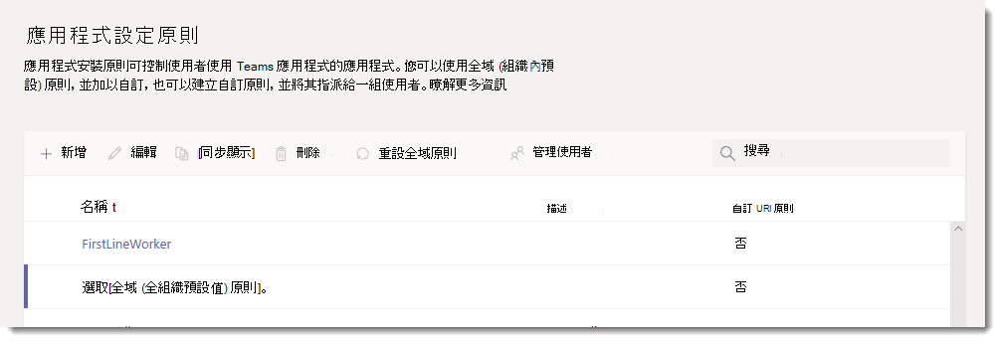
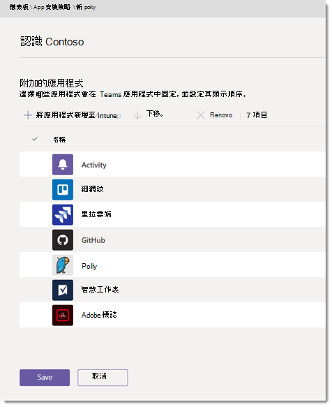

# 管理應用程式中的應用程式設定Microsoft TeamsManage app setup policies in Microsoft Teams

做為系統管理員，您可以使用應用程式設定策略執行下列工作：As an admin, you can use app setup policies to do the following tasks:

- 自訂 Teams 以強調對使用者而言最重要的應用程式。Customize Teams to highlight the apps that are most important for your users. 您可以選擇要釘選的應用程式，並設定其顯示順序。You choose the apps to pin and set the order that they appear. 釘上應用程式可讓您展示貴組織中使用者所需的應用程式，包括由協力廠商或貴組織的開發人員所建立的應用程式。Pinning apps lets you showcase apps that users in your organization need, including apps built by third parties or by developers in your organization.
- 控制使用者是否可以將應用程式釘選到 Teams。Control whether users can pin apps to Teams.
- 代表使用者安裝應用程式。Install apps on behalf of users. 您可以選擇使用者啟動應用程式時，預設會安裝Teams。You choose which apps are installed by default for users when they start Teams. 請記住，如果指派給使用者的應用程式許可權政策允許，使用者仍可自行安裝 App。Keep in mind that users can still install apps themselves if the [app permission policy](teams-app-permission-policies.md) that's assigned to them allows it.

> [!Note]
> 對於系統管理員安裝的 App，使用者無法卸載這些應用程式。For apps installed by admins, users can't uninstall those apps.

應用程式會釘到應用程式欄，即 Teams 桌面用戶端側邊以及 Teams 行動用戶端 (iOS 和 Android) 。Apps are pinned to the app bar, which is the bar on the side of the Teams desktop client and at the bottom of the Teams mobile clients (iOS and Android).

|Teams桌面用戶端Teams desktop client  |Teams 行動用戶端Teams mobile client |
|---------|---------|
|   |         |

若要查看系統管理員安裝的應用程式，請在應用程式欄中選取 **...在桌面** 和 web 用戶端Teams更多應用程式，然後向上滑動到行動用戶端。To see the apps installed by admins, in the app bar, users select **... More apps** in the Teams desktop and web clients and swipe up in the mobile clients.

您可以在系統管理中心管理Microsoft Teams設定政策。You manage app setup policies in the Microsoft Teams admin center. 使用全域 (整個組織的預設) ，或建立及指派自訂策略。Use the global (Org-wide default) policy or create and assign custom policies.  除非您建立並指派自訂原則，否則組織中的使用者將會自動取得全域原則。Users in your organization will automatically get the global policy unless you create and assign a custom policy. 您必須是全域系統管理員或 Teams 服務系統管理員，才能管理這些原則。You must be a global admin or Teams service admin to manage these policies.

您可以編輯全域原則中的設定，以包含您想要的應用程式。You edit the settings in the global policy to include the apps that you want. 若要自訂Teams組織中不同使用者群組的使用者，請建立並指派一或多個自訂策略。To customize Teams for different groups of users in your organization, create and assign one or more custom policies.

> [!NOTE]
> 如果您有Teams，您必須知道全域原則中的作業應用程式預設為釘點，即使目前未在全域原則中列出。If you have Teams for Education, it's important to know that the Assignments app is pinned by default in the global policy even though currently, you don't see it listed in the global policy. 它會是用戶端上釘上應用程式清單中的第四Teams App。It will be the fourth app in the list of pinned apps on Teams clients.

## 建立自訂應用程式設定策略Create a custom app setup policy

您可以使用系統管理Microsoft Teams建立自訂策略。You can use the Microsoft Teams admin center to create a custom policy.

1. 在系統管理中心的左側導Microsoft Teams，請前往 Teams **設定**  >  **政策**。In the left navigation of the Microsoft Teams admin center, go to **Teams apps** > **Setup policies**.

2. 選取 [新增 **]**。Select **Add**.

   

3. 輸入原則的名稱和描述。Enter a name and description for the policy.

4. 視您是否要讓使用者上傳 **自訂** Upload，開啟或關閉自訂應用程式Teams。Turn on or turn off **Upload custom apps**, depending on whether you want to let users upload custom apps to Teams. 如果全組織 App 設定中已關閉 **允許第** 三方應用程式， [則無法變更此設定](manage-apps.md#manage-org-wide-app-settings)。You can't change this setting if **Allow third-party apps** is turned off in [org-wide app settings](manage-apps.md#manage-org-wide-app-settings).

5. 開啟或關閉 **允許使用者釘點**，取決於您是否要讓使用者將應用程式釘到 App 欄來個人化其 App 欄。Turn on or turn off **Allow user pinning**, depending on whether you want to let users personalize their app bar by pinning apps to it.

   > [!NOTE]
   > **Microsoft 365 政府社群雲端 (GCC) 、 (GCC** GCC高和 DoD Teams系統管理中心提供允許使用者釘) 設定，但目前沒有作用。The **Allow user pinning** setting is available in the Teams admin center in Microsoft 365 Government Community Cloud (GCC) environments (GCC, GCC High and DoD), but currently it has no effect.

6. 若要為使用者安裝應用程式，請執行下列工作：To install apps for users, do the following tasks:

    1. 在 **安裝的應用程式下**，選取 新增 **應用程式**。Under **Installed apps**, select **Add apps**.

    2. 在新增 **已安裝的應用程式窗格中**，搜尋使用者啟動應用程式時要自動安裝Teams。In the **Add installed apps** pane, search for the apps you want to automatically install for users when they start Teams. 您也可以根據應用程式權限原則篩選應用程式。You can also filter apps by app permission policy. 當您選擇您的應用程式清單時，請選取 **新增**。When you've chosen your list of apps, select **Add**.

       

7. 若要釘上應用程式，請執行下列步驟：To pin apps, do the following steps:

    1. 在 **已釘選的 App** 下，選取 新增 **應用程式**。Under **Pinned apps**, select **Add apps**.

    2. 在新增 **釘選的應用程式窗格中** ，搜尋您想要新增的應用程式，然後選取 **新增**。In the **Add pinned apps** pane, search for the apps you want to add, and then select **Add**. 您也可以根據應用程式權限原則篩選應用程式。You can also filter apps by app permission policy. 當您選擇要釘選的應用程式清單時， **請選取** 新增 。When you've chosen your list of apps to pin, select **Add**.

       

    3. 以您希望 App 在應用程式中顯示的順序排列Teams，然後選取 **儲存**。Arrange the apps in the order that you want them to appear in Teams, and then select **Save**.

       

## 編輯應用程式設定策略Edit an app setup policy

您可以使用系統管理Microsoft Teams編輯策略，包括您 (全組織的預設) 策略和自訂策略。You can use the Microsoft Teams admin center to edit a policy, including the global (Org-wide default) policy and custom policies that you create.

1. 在系統管理中心的左側導Microsoft Teams，請前往 Teams **設定**  >  **政策**。In the left navigation of the Microsoft Teams admin center, go to **Teams apps** > **Setup policies**.

2. 按一下原則名稱左側來選取原則，然後選取 [編輯 **]**。Select the policy by clicking to the left of the policy name, and then select **Edit**.

3. 從此處，進行您需要的變更。From here, make the changes that you want.

4. 選取 [儲存 **]**。Select **Save**.

## 指派自訂應用程式設定策略給使用者Assign a custom app setup policy to users

[!INCLUDE [assign-policy](includes/assign-policy.md)]

## 常見問題集FAQ

### 使用應用程式設定策略Working with app setup policies

#### 系統管理中心內建的應用程式設定Microsoft Teams政策What built-in app setup policies are included in the Microsoft Teams admin center

- **全域 (全組織的預設) ：** 除非您指派其他原則，否則此預設原則會適用于貴組織中的所有使用者。**Global (Org-wide default)**: This default policy applies to all users in your organization unless you assign another policy. 編輯全域原則以釘上使用者最重要的應用程式。Edit the global policy to pin apps that are most important for your users.

- **FrontlineWorker：** 此政策適用于前線員工。**FrontlineWorker**: This policy is for Frontline Workers. 您可以將它指派給貴組織的前線工作人員。You can assign it to Frontline Workers in your organization. 您必須知道，就像您建立自訂策略一樣，您必須將策略指派給使用者，讓設定保持有效。It's important to know that like custom policies that you create, you have to assign the policy to users for the settings to be active. For more information, go to the [Assign a custom app setup policy to users](#assign-a-custom-app-setup-policy-to-users) section of this article.For more information, go to the [Assign a custom app setup policy to users](#assign-a-custom-app-setup-policy-to-users) section of this article.

#### 為什麼我在新增釘上的應用程式窗格中找不到應用程式Why can't I find an app in the Add pinned apps pane

並非所有應用程式都可以透過應用程式設定Teams釘釘至其他應用程式。Not all apps can be pinned to Teams through an app setup policy. 某些應用程式可能不支援此功能。Some apps may not support this functionality. 若要尋找可釘上的應用程式，請搜尋在新增釘上 App 窗格中 **的應用程式** 。To find apps that can be pinned, search for the app in the **Add pinned apps** pane. 具有個人範圍 (靜態) 和 bot 的定位點可以釘釘到 Teams 桌面用戶端，這些應用程式可在新增釘上的應用程式窗格中 **使用**。Tabs that have a personal scope (static tabs) and bots can be pinned to the Teams desktop client and these apps are available in the **Add pinned apps** pane.

請記住，應用程式Teams會列出所有Teams應用程式。Keep in mind that the Teams app store lists all Teams apps. 新增 **釘上應用程式窗格** 僅包含可透過Teams釘釘至應用程式。The **Add pinned apps** pane includes only apps that can be pinned to Teams through a policy.

#### 我是教育Teams管理員。我需要知道教育用應用程式中的應用程式設定Teams政策I'm a Teams for Education admin. What do I need to know about app setup policies in Teams for Education

教育用應用程式無法Teams通話應用程式。The Calling app isn't available in Teams for Education. 當您建立新的自訂應用程式設定策略時，通話應用程式會顯示在應用程式清單中。When you create a new custom app setup policy, the Calling app is displayed in the list of apps. 不過，應用程式不會釘Teams用戶端，Teams使用者不會在 Teams 中看到通話應用程式。However, the app isn't pinned to Teams clients and Teams for Education users won't see the Calls app in Teams.

#### 可新增多少個釘點應用程式至策略How many pinned apps can be added to a policy

在 iOS 和 Android 手機上，Teams至少 (兩個 app) 。A minimum of two apps must be pinned to the Teams mobile clients (iOS and Android). 如果策略少於兩個 App，行動用戶端不會反映該策略設定，而是會繼續使用現有的設定。If a policy has fewer than two apps, the mobile clients won't reflect the policy settings and instead will continue to use the existing configuration.

您可以新增到策略的釘點 App 數量沒有限制。There's no limit on the number of pinned apps you can add to a policy.

#### 政策變更生效需要多久時間How long does it take for policy changes to take effect

編輯或指派原則之後，變更可能需要幾個小時的時間才會生效。After you edit or assign a policy, it can take a few hours for changes to take effect.

### 使用者體驗User experience

#### 使用者如何在應用程式中查看所有已釘TeamsHow can users see all their pinned apps in Teams

若要查看已釘住使用者的所有 App，使用者可能需要根據已安裝的應用程式數量及其用戶端視窗Teams執行下列操作。To view all apps that are pinned for a user, users might have to do the following depending on the number of installed apps and the size of their Teams client window.

|Teams桌面用戶端Teams desktop client |Teams 行動用戶端Teams mobile client |
|---------|---------|
|在應用程式欄的 Teams中，選取 **...更多應用程式**。In the app bar on the side of Teams, select **... More apps**.| 在靠近應用程式底部的應用程式Teams向上滑動。In the app bar near the bottom of Teams, swipe up.|
|    |  

#### 我需要知道行動Teams體驗What do I need to know about the Teams mobile experience

iOS Teams Android (的手機用戶端) 靜態選項卡支援個人 App。The Teams mobile clients (iOS and Android) support personal apps with static tabs. 固定到桌面Teams的應用程式會顯示在Teams用戶端中。Apps pinned to the Teams desktop client will appear in the Teams mobile clients. 個人 Bot 會顯示在行動用戶端上的聊天中。Personal bots will appear in Chat on mobile clients.

協力廠商應用程式 (可從 Store Teams下載) ，才能在行動版上顯示。Third-party apps (which can be downloaded from Teams Store) need to be approved before they show up on mobile. 如果系統管理員釘釘了未經 Microsoft for Mobile Teams的應用程式，它會顯示在桌上出版上，但不會顯示在行動版上。If an admin pins an app, which is unapproved by Microsoft for Mobile, it will show up on the Teams Desktop, but not show up on mobile. 請參閱 [行動用戶端](/microsoftteams/platform/tabs/what-are-tabs#mobile-clients) 以瞭解更多資訊。See [Mobile clients](/microsoftteams/platform/tabs/what-are-tabs#mobile-clients) for more information.

有了Teams用戶端，使用者會看到核心 Teams 應用程式，例如活動、聊天和 Teams，而且您可以釘上 Microsoft 的一些第一方應用程式，例如 Shifts。With the Teams mobile clients, users will see core Teams apps such as Activity, Chat, and Teams, and you can pin some first-party apps from Microsoft, such as Shifts.

#### 使用者可以變更透過策略釘上的應用程式順序嗎？Can users change the order of apps pinned through a policy

如果使用者開啟了允許使用者釘選選項，Teams桌面和行動用戶端上的釘選應用程式順序。 Users can change the order of their pinned apps on Teams desktop and mobile clients if the **Allow user pinning** option is turned on. 使用者無法變更在 Web 用戶端上釘Teams的順序。Users can't change the order of their pinned apps on Teams web clients.

#### 使用者釘點是否優先Does user pinning take precedence

系統管理圖釘永遠優先。Admin pins always take precedence. 如果開啟 **了允許使用者釘選** 選項，使用者就會在系統管理員釘選的 App 下方保留已釘選的應用程式。If the **Allow user pinning** option is turned on, then users will retain their pinned apps below admin pinned apps. 如果 **關閉允許使用者** 釘選選項，則使用者將失去其預先存在的圖釘，且只有系統管理員釘選的應用程式會存在於應用程式欄中。If the **Allow user pinning** option is turned off, then users will lose their pre-existing pins, and only admin-pinned apps will be present in the app bar.

### 自訂Teams應用程式Custom Teams apps

我的組織已建立自訂 Teams 應用程式，併發布至 AppSource 或租使用者應用程式目錄，但是當應用程式釘釘到 Teams 中的應用程式欄時，應用程式圖示不會如預期顯示。My organization built a custom Teams app and published it, either to AppSource or the tenant app catalog, but the app icon isn't displayed as expected when the app is pinned to the app bar in Teams. 如何修正此問題How do I fix it

提交應用程式之前，請務必遵循標誌指導方針。Make sure that you follow the logo guidelines before you submit the app. 若要深入瞭解，請參閱賣方 [儀表板提交檢查清單](/microsoftteams/platform/concepts/deploy-and-publish/appsource/prepare/overview)。To learn more, see [Checklist for Seller Dashboard submission](/microsoftteams/platform/concepts/deploy-and-publish/appsource/prepare/overview).

## 相關主題Related topics

[在 Teams 中管理應用程式的設定Admin settings for apps in Teams](admin-settings.md)

[在 Teams 中將原則指派給使用者Assign policies to your users in Teams](assign-policies.md)
