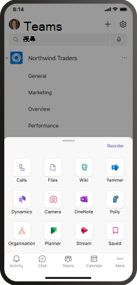
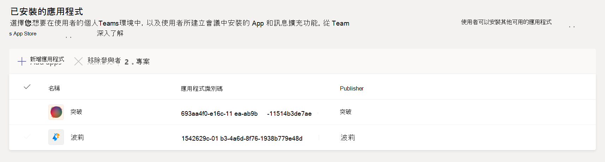
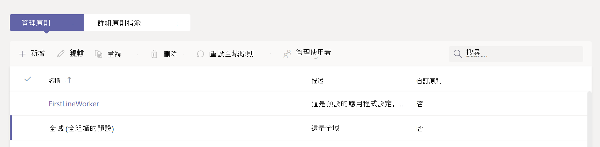

# 管理應用程式中的應用程式設定Microsoft Teams

如果您是系統管理員，您可以使用應用程式設定策略來安裝及釘釘應用程式，以宣傳貴組織中最常用的應用程式，以及決定是否要讓使用者將自訂應用程式上傳到 Teams。

- **釘上應用程式：** 應用程式設定政策讓您選擇要釘選的 App、在 Teams 應用程式欄或撰寫訊息區域中為您的使用者設定其顯示順序，以及控制使用者是否能釘選自己的 App。 詳細資訊，請參閱釘 [上應用程式](#pin-apps)。
- **安裝應用程式：** 應用程式設定政策讓您在使用者啟動應用程式時代表使用者Teams會議期間安裝 App。 詳細資訊，請參閱安裝 [應用程式](#install-apps)。
- **Upload自訂應用程式：** App 設定政策讓您允許使用者將自訂應用程式上傳至Teams。 詳細資訊請參閱自訂[Upload應用程式](#upload-custom-apps)。

## 釘上應用程式

釘上應用程式可讓您展示貴組織中使用者所需的應用程式，包括由協力廠商或貴組織的開發人員所建立的應用程式。

您可以使用應用程式設定策略執行下列工作：

- 自訂 Teams 以強調對使用者而言最重要的應用程式。 您可以選擇要釘選的應用程式，並設定其顯示順序。
- 控制使用者是否可以將應用程式釘選到 Teams。

App 已釘釘到：

- 應用程式行是 Teams 桌面用戶端左側，以及 Teams 行動用戶端 (iOS 和 Android) 。

- 撰寫郵件區域底部的訊息擴充功能區。

|Teams 桌面用戶端  |Teams 行動用戶端 |
|---------|---------|
|   |         |

> [!NOTE]
> 如果您有Teams 教育版，必須知道全域原則中的作業應用程式預設為釘上，即使目前未在全域原則中列出。 它會是用戶端上釘上應用程式清單中的第四Teams App。

若要建立 App 設定策略以釘上應用程式，請執行下列步驟：

1. 在系統管理中心的左側導 [Teams，請](https://www.admin.teams.microsoft.com)前往 **Teams Setup**  >  **政策**。

2. 選取 [新增 **]**。

3. 輸入原則的名稱和描述。

4. 開啟使用者 **釘點**。

   > [!NOTE]
   > **Teams系統** 管理中心提供使用者釘Microsoft 365 政府社群雲端 (GCC) 設定 (GCC、GCC高) ，但目前沒有任何效果。

5. 在 **已釘選的 App** 下，選取 **新增應用程式**。

6. 在新增 **釘選的應用程式窗格中**，搜尋您想要新增的應用程式，然後 **選取新增。** 您也可以根據應用程式權限原則篩選應用程式。

7. 選取 [新增 **]**。

8. 在 **應用程式欄** 或 **訊息** 擴充功能下，以您希望應用程式顯示在應用程式Teams。

   

9. 選取 [儲存 **]**。

## 安裝應用程式

您可以選擇在使用者個人環境中預設安裝哪些應用程式Teams，將應用程式安裝為訊息擴充功能，以及指定要安裝在會議中的應用程式。

您可以使用應用程式設定策略執行下列工作：

- 在使用者的個人環境中安裝Teams應用程式
- 安裝使用者應用程式做為訊息擴充功能
- 在會議召集人的會議中安裝應用程式

> [!NOTE]
> 如果指派給使用者的應用程式許可權政策允許，使用者仍可自行安裝 App。

若要建立應用程式設定策略以安裝應用程式，請執行下列步驟：

1. 在系統管理中心的左側導Microsoft Teams，請前往 **Teams Setup**  >  **政策**。

2. 選取 [新增 **]**。

3. 輸入原則的名稱和描述。

4. 在 **安裝的應用程式下**，選取 **新增應用程式**。

5. 在新增 **已安裝的應用程式窗格中** ，搜尋您想要為使用者自動安裝的應用程式。 您也可以根據應用程式權限原則篩選應用程式。

6. 選取 [新增 **]**。

> [!IMPORTANT]
> 使用者無法卸載系統管理員安裝的 App。

## Upload自訂應用程式

您可以使用系統管理Microsoft Teams建立自訂策略，讓使用者上傳自訂應用程式至Teams。

若要建立應用程式設定策略，讓使用者上傳自訂應用程式至Teams，請執行下列步驟：

1. 在系統管理中心的左側導Microsoft Teams，請前往 **Teams Setup**  >  **政策**。

2. 選取 [新增 **]**。

3. 輸入原則的名稱和描述。

4. 視您是否要讓使用者上傳 **自訂** Upload，開啟或關閉自訂應用程式Teams。

> [!NOTE]
> 如果全組織 App 設定中關閉第三方應用程式，[則無法變更此設定](manage-apps.md#manage-org-wide-app-settings)。

## 管理應用程式設定政策

您可以在系統管理中心管理Microsoft Teams設定政策。 使用全域 (整個組織的預設) ，或建立及指派自訂策略。  除非您建立並指派自訂原則，否則貴組織中的使用者將會自動取得全域原則。 您必須是全域系統管理員或 Teams 服務系統管理員，才能管理這些原則。

您可以編輯全域原則中的設定，以包含您想要的應用程式。 若要自訂Teams組織中不同使用者群組的使用者，請建立並指派一或多個自訂策略。

### 編輯應用程式設定策略

您可以使用系統管理Microsoft Teams編輯策略，包括您建立 (全組織) 預設策略和自訂策略。

1. 在系統管理中心的左側導Microsoft Teams，請前往 **Teams Setup**  >  **政策**。

2. 選擇您想要編輯的政策，然後 **選取編輯。**

3. 進行您想要的變更。

4. 選取 [儲存 **]**。

### 指派自訂應用程式設定策略給使用者和群組

有關指派策略給使用者和群組的資訊，請參閱指派策略 [給使用者和群組](assign-policies-users-and-groups.md)。

## 常見問題集

### 使用應用程式設定策略

#### 系統管理中心內建的應用程式設定Microsoft Teams政策

- **全域 (全組織的預設)**：除非您指派其他原則，否則此預設原則會適用于貴組織中的所有使用者。 編輯全域原則以釘上使用者最重要的應用程式。

- **FrontlineWorker**：此政策適用于前線工作者。 您可以將它指派給貴組織的前線工作人員。 您必須知道，就像您建立自訂策略一樣，您必須將策略指派給使用者，讓設定保持為使用中。 For more information, go to the [Assign a custom app setup policy to users](#assign-a-custom-app-setup-policy-to-users-and-groups) section of this article.

#### 為什麼我在新增釘上的應用程式窗格中找不到應用程式

並非所有應用程式都可以透過應用程式設定Teams釘釘至其他應用程式。 某些應用程式可能不支援此功能。 若要尋找可釘上的應用程式，請搜尋在新增釘上 App 窗格中 **的應用程式** 。 具有個人範圍 (靜態) 和 bot 的定位點可以釘釘到 Teams 桌面用戶端，這些應用程式可在新增釘上的應用程式 **窗格中使用。**

請記住，應用程式Teams會列出所有Teams應用程式。 新增 **釘上應用程式窗格** 僅包含可透過Teams釘釘至應用程式。

#### 我是系統管理員Teams 教育版管理員。我需要知道什麼，瞭解應用程式中的應用程式設定Teams 教育版

通話應用程式無法于 Teams 教育版。 當您建立新的自訂應用程式設定策略時，通話應用程式會顯示在應用程式清單中。 不過，應用程式不會釘Teams用戶端Teams 教育版使用者不會在 Teams。

#### 可新增多少個釘點應用程式至策略

在 iOS 和 Android Teams中， (至少必須釘) 。 如果策略少於兩個 App，行動用戶端不會反映該策略設定，而是會繼續使用現有的設定。

您可以新增到策略的釘點 App 數量沒有限制。

#### 政策變更生效需要多久時間

編輯或指派原則之後，變更可能需要幾個小時的時間才會生效。

### 使用者體驗

#### 使用者如何在應用程式中查看其所有已釘Teams

若要查看已釘住使用者的所有應用程式，使用者可能需要根據已安裝的應用程式數量及其用戶端視窗Teams執行下列操作。

|Teams 桌面用戶端 |Teams 行動用戶端 |
|---------|---------|
|在應用程式欄的 Teams中，選取 **...更多應用程式**。| 在靠近應用程式底部的應用程式Teams向上滑動。|
|    |  

#### 我需要知道行動Teams體驗

iOS (Teams Android Teams的手機用戶端) 靜態選項卡支援個人 App。 固定至桌面Teams的應用程式會顯示在Teams用戶端中。 個人 Bot 會顯示在行動用戶端上的聊天中。

協力廠商應用程式 (可從 Store Teams下載) ，才能在行動版上顯示。 如果系統管理員釘釘了未由 Microsoft for Mobile Teams的應用程式，它會顯示在桌面Teams，但不會顯示在行動版上。 請參閱 [行動用戶端](/microsoftteams/platform/tabs/what-are-tabs#mobile-clients) 以瞭解更多資訊。

有了Teams用戶端，使用者會看到核心 Teams 應用程式，例如活動、聊天和 Teams，而且您可以釘上 Microsoft 的一些第一方應用程式，例如 Shifts。

#### 使用者可以變更透過策略釘上的應用程式順序嗎？

如果使用者開啟了使用者釘選選項，Teams桌面和行動用戶端上的釘選應用程式順序。**** 使用者無法變更在 Web 用戶端上釘Teams的順序。

#### 使用者釘點是否優先

系統管理圖釘永遠優先。 如果已 **開啟使用者釘選** 選項，使用者就會在系統管理員釘選的 App 下方保留已釘選的應用程式。 如果關閉 **使用者釘** 選選項，使用者將失去其預先存在的圖釘，且只有系統管理員釘選的應用程式會存在於應用程式欄中。

### 自訂Teams應用程式

#### 我的組織建立了自訂 Teams 應用程式，併發布至 AppSource 或租使用者應用程式目錄，但是當應用程式釘釘到 Teams 中的應用程式欄時，應用程式圖示不會如預期顯示。 如何修正此問題？

提交應用程式之前，請務必遵循標誌指導方針。 若要深入瞭解，請參閱賣方 [儀表板提交檢查清單](/microsoftteams/platform/concepts/deploy-and-publish/appsource/prepare/overview)。

## 相關文章

[在 Teams 中管理應用程式的設定](admin-settings.md)

[在 Teams 中將原則指派給使用者](assign-policies-users-and-groups.md)
