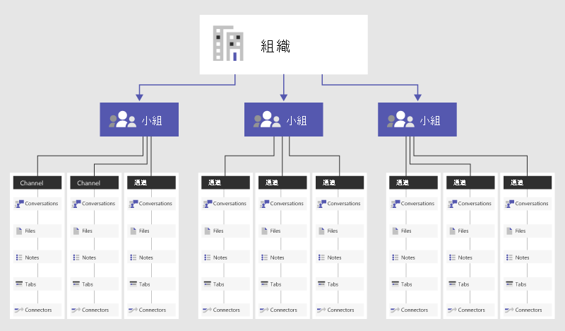

# Microsoft Teams 中的團隊和頻道概覽

> [!NOTE]
> 請檢閱下列資訊以了解 Teams 中的聊天、團隊、頻道和應用程式。 然後，移至 [Teams 中的聊天、團隊、頻道和應用程式](deploy-chat-teams-channels-microsoft-teams-landing-page.md)，逐步完成您首次使用 Teams 時的重要決策清單。

讓我們先來了解 Microsoft Teams 如何讓個別團隊在商務案例之間自我組織及共同作業：

- **Teams** 是與組織內不同專案和結果有關的人員、內容和工具的集合。

    - Teams 可以建立為只有受邀使用者才可加入的形式。
    - Teams 也可以建立為公開形式，組織內的任何人都可以加入 (最多 5,000 個成員)。
    
    設計團隊的目的是聚集一群人，讓他們以密切合作的方式來完成工作。 專案型工作 (例如啟動產品、建立數位戰情室) 的團隊可以是動態且持續性的，以反映組織的內部結構 (例如部門和辦公室位置)。 團隊中的聊天、檔案和記事只會對團隊成員顯示。

- **頻道**是團隊內的專用區段，可依據特定主題、專案或訓練等適合團隊的分類來讓交談保持在井然有序的狀態中！ 您在頻道中共用的檔案 (位於 [檔案] 索引標籤上) 會儲存在 SharePoint 中。 如需詳細資訊，請參閱 [SharePoint Online 和商務用 OneDrive 如何與 Teams 互動](SharePoint-OneDrive-interact.md)。

    - 頻道是指交談發生的位置，以及實際完成工作的位置。 您可以為所有團隊成員開啟頻道，或將頻道設為私人頻道 (如果您需要挑選對象)。 標準頻道是團隊中每個人都可參與的頻道，而[私人頻道](private-channels.md)會限制僅與團隊內一小群人員交談。
    - 頻道若以包含索引標籤、連接器和 Bot 的應用程式進行擴充，則其對於團隊成員的作用，將最具價值。 若要深入了解，請參閱 [Teams 中的應用程式、Bot 和連接器](deploy-apps-microsoft-teams-landing-page.md)。
    
如需使用團隊和頻道的說明，請參閱[團隊和頻道](https://support.office.com/article/teams-and-channels-df38ae23-8f85-46d3-b071-cb11b9de5499)。

若要深入了解建立團隊和頻道的最佳做法，請觀看這段短片。

   > [!VIDEO https://www.youtube.com/embed/WkAVgNKn0hs]

成員資格、角色和設定
------------------------------

**團隊成員資格**

為您的整個組織啟用 Microsoft Teams 時，指定的團隊擁有者可以邀請與他們共同作業的任何員工加入其團隊。 Microsoft Teams 可讓團隊擁有者根據姓名輕鬆地在組織中新增人員。 視組織的設定而定，您也可以將屬於團隊成員但位在組織外部的來賓新增至您的團隊。 如需詳細資訊，請參閱 [Microsoft Teams 中的來賓存取](guest-access.md)。 

小組擁有者也可以根據現有的 Microsoft 365 群組建立小組。 對群組所做的任何變更都會自動與 Microsoft Teams 同步。 根據現有的 Microsoft 365 群組建立小組，不僅可簡化邀請與管理成員的程式，還能同步處理 Microsoft 團隊內的群組檔案。

**團隊角色**

Microsoft Teams 中的主要角色如下： 

- **團隊擁有者** - 建立團隊的人員。 團隊擁有者可以在邀請人員加入團隊時，或在人員加入團隊之後的任何時間點，讓團隊成員成為共同擁有者。 擁有多個團隊擁有者，表示您能將管理設定和成員資格的責任 (包括邀請) 由其他人分擔。
- **團隊成員** - 擁有者邀請加入其團隊的人員。

此外，如果已設定仲裁功能，則團隊擁有者和成員都可以有頻道的仲裁者功能。 仲裁者可在頻道中開始新的文章，並控制團隊成員是否可以回覆現有的頻道訊息。 團隊擁有者可以在頻道內指派仲裁者。 (頻道擁有者會預設為具有仲裁者功能。) 頻道內的仲裁者可以新增或移除該頻道中的其他仲裁者。 如需詳細資訊，請參閱[在 Microsoft Teams 中設定和管理頻道仲裁](manage-channel-moderation-in-teams.md)。

**團隊設定** 

團隊擁有者可以直接在 Microsoft Teams 中管理整個團隊內的設定。 設定包括新增團隊圖片、設定團隊成員的權限以建立標準和 [私人頻道](private-channels.md)、新增索引標籤和連接器、以 @ 提及整個團隊或頻道，以及使用 Gif、貼紙和 Meme。

請花三分鐘觀看專為團隊擁有者準備的指南：

   > [!VIDEO https://www.youtube.com/embed/kalV4dG-oFo]

如果您是 Microsoft 365 或 Office 365 中的 Microsoft 團隊管理員，您可以在 Microsoft 團隊系統管理中心中存取全系統的設定。 這些設定可以影響團隊擁有者可在其團隊設定底下看到的選項和預設值。 例如，您可以啟用預設的「一般」頻道，在整個團隊中發佈公告、進行討論和提供資源，這些都會顯示在所有團隊中。

根據預設，所有使用者都有權在 Microsoft Teams 內建立團隊 (若要修改此設定，請參閱[在 Teams 中指派角色和權限](assign-roles-permissions.md))。 現有 Microsoft 365 群組的使用者也可以利用團隊功能加強其許可權。

為了讓使用者與 Microsoft Teams 接觸而建立早期規劃活動的其中一個重點是，這可協助使用者思考並了解 Teams 可如何加強他們日常生活中的共同作業。 藉由與其他人交談，協助他們選取目前以零碎方式進行共同作業的商務案例。 透過相關索引標籤將他們聚集在頻道中，以協助他們完成工作。 Teams 最強的使用案例之一就是任何跨組織的程序。 

團隊範例
--------------

以下幾個實用案例可說明不同類型的使用者可如何設定其團隊、頻道和應用程式 (索引標籤/連接器/Bot)。 這可能有助於您與您的使用者社群開始一個有關 Microsoft Teams 的交談。 當您思考如何在您組織中實作 Microsoft Teams 時，請記住，您可以提供如何建構團隊的指導方針，不過，使用者可以自行控制管理方式。 這些只是協助團隊開始思考可能性的範例。

Microsoft Teams 非常適合用來打破組織中的隔閡，以及建立跨功能性的團隊，因此，請鼓勵您的使用者考慮建立打破組織界限的功能性團隊。

|團隊類型  |潛在頻道  |應用程式 (索引標籤 /連接器 /Bot )  |
|---------|---------|---------|
|銷售     |年度銷售會議   季度業務審查   每月銷售漏斗審查   銷售手冊 |Power BI  Trello  CRM  摘要 Bot         |
|公共關系     |新聞稿  新聞和更新  事實查核         |RSS 摘要  Twitter         |
|活動計劃     |行銷  物流和排程  場地  預算         |Twitter  Facebook  Planner  PDF         |
|行銷/進入市場   |市場研究  訊息支柱 (Messaging Pillars)  通訊方案  行銷物料單        |YouTube  Microsoft Stream  Twitter  MailChimp         |
|技術操作    |事件管理  短期衝刺計劃  工作項目  基礎結構和運營         |團隊服務  Jira  AzureBot         |
|產品團隊      |策略  行銷  銷售  營運  深入解析  服務與支援         |Power BI  團隊服務         |
|財務    |目前財務  財務年度規劃  預測  應收帳款  應付帳款         |Power BI  Google Analytics         |
|物流     |倉儲營運  交通工具維護  司機名冊         |氣象服務  旅行/道路中斷  Planner  Tubot  UPS Bot         |
|人力資源     |人才管理  招募  績效審查規劃  士氣         |人力資源工具  外部工作張貼網站  Growbot         |
|跨組織   虛擬團隊 |策略  工作力開發  競爭及研究         |Power BI  Microsoft Stream         |

您可以建立與組織結構一致的團隊。 領導者最適合使用此服務來推動士氣、進行團隊特定審查、闡明員工報到流程、討論工作力計畫，以及提高多樣化人力的可見度。  

## 全組織團隊

如果您組織的使用者不到 5000 人，您可以建立全組織團隊。 全組織團隊提供自動化方式，讓組織中的每個人都成為單一團隊的一部分來進行共同作業。 如需詳細資訊 (包括建立及管理組織內團隊的最佳做法)，請參閱[在 Microsoft Teams 中建立全組織團隊](create-an-org-wide-team.md)。
