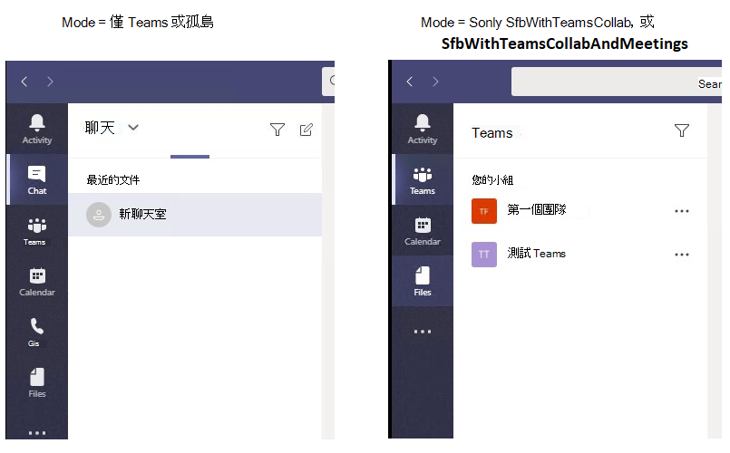

# Teams 用戶端體驗和遵從共存模式Teams client experience and conformance to coexistence modes

商務用 Skype 共存模式（SfBOnly、SfBWithTeamsCollab、SfBWithTeamsCollabAndMeetings）的用途，是提供使用者的簡單且可預測的體驗，就像是組織從商務用 Skype 轉換到團隊。The purpose of the Skype for Business coexistence modes (SfBOnly, SfBWithTeamsCollab, SfBWithTeamsCollabAndMeetings) is to provide a simple, predictable experience for end users as organizations transition from Skype for Business to Teams.  如果組織要移至團隊，則 [**團隊專用**] 模式是每個使用者的最終目的地，但並非所有使用者都需要同時指派**團隊**（或任何其他模式）。For an organization moving to Teams, the **Teams Only** mode is the final destination for each user, though not all users need to be assigned **Teams Only** (or any other mode) at the same time.  在使用者進入 TeamsOnly 模式之前，組織可以使用任何商務用 Skype 共存模式，以確保**僅供團隊**使用的使用者和尚不在小組中的使用者進行預期通訊。Prior to users reaching TeamsOnly mode, organizations can use any of the Skype for Business coexistence modes to ensure predictable communication between users who are **Teams Only** and those who aren’t yet. 

當使用者處於任何商務用 Skype 模式時，所有傳入聊天和通話會傳送到使用者的商務用 Skype 用戶端。When a user is in any of the Skype for Business modes, all incoming chats and calls are routed to the user’s Skype for Business client. 若要避免使用者混淆並確保正確地進行路由，小組用戶端中的呼叫及聊天功能會在使用者處於任何商務用 Skype 模式時停用。To avoid end user confusion and ensure proper routing, calling and chat functionality in the Teams client is disabled when a user is in any of the Skype for Business modes. 同樣地，在使用者處於 SfBOnly 或 SfBWithTeamsCollab 模式時，小組中的會議排程會明確停用，且在使用者處於 SfBWithTeamsCollabAndMeetings 模式時明確啟用。Similarly, meeting scheduling in Teams is explicitly disabled when users are in the SfBOnly or SfBWithTeamsCollab modes, and explicitly enabled when a user is in the SfBWithTeamsCollabAndMeetings mode.

因為目前狀態是透過聊天和通話提供可存取性的指示，所以當聊天和通話停用時，會在團隊中自行存在（也就是，在使用者圖片的團隊用戶端中顯示自己的目前狀態）也會隱藏。Because presence is an indication of reachability through chat and calling, when chat and calling are disabled, self-presence in Teams (that is, the display of one’s own presence in the Teams client in the user’s picture) is also hidden. 

## 團隊用戶端中的可用功能如何根據模式變更How the available functionality in Teams client changes based on mode

團隊中的可用功能，取決於使用者的共存模式（由 TeamsUpgradePolicy 設定）。The available functionality in Teams depends on the user's coexistence mode, as set by TeamsUpgradePolicy. 下表摘要說明行為：The following table summarizes the behavior:

|使用者的有效模式User's effective mode|團隊用戶端中的體驗Experience in Teams client|
|---|---|
|任何商務用 Skype 模式Any Skype for Business mode|[通話]、[交談] 和 [自我顯示] 是停用的。Calling, Chat, and self-presence are disabled.|
|SfBWithTeamsCollabAndMeetingsSfBWithTeamsCollabAndMeetings|提供會議排程Meeting scheduling is available|
|SfBWithTeamsCollab 或 SfBOnly1SfBWithTeamsCollab or SfBOnly1|無法使用會議排程Meeting scheduling is not available|
|||

下列螢幕擷取畫面說明**僅限團隊**或**孤島**模式與所有其他模式之間的差異。The following screenshots illustrate the difference between **Teams Only** or **Islands** mode and all other modes. 請注意，「聊天」和「通話」圖示預設會提供給**小組**或**孤島**模式（左螢幕擷取畫面），但不適用於其他模式（右側螢幕擷取畫面）：Note that the chat and calling icons are available by default with **Teams Only** or **Islands** mode (left screenshot), but not with the other modes (right screenshot):

此外，在其他模式中不提供自我目前狀態，如下所示。In addition, self presence is not available in the other modes, as shown here.

 
**注意：**
1此時，SfBwithTeamsCollab 和 SfBOnly 的行為相同，但在 SfBOnly 模式中，也可以停用團隊中的頻道與檔案功能。**Note:**
1 At this time, SfBwithTeamsCollab and SfBOnly behave the same, but the intent is for SfBOnly mode to also disable Channels and Files functionality in Teams. 在間歇中，您可以使用應用程式許可權原則隱藏頻道。In the interim, Channels can be hidden using the App Permissions policy.

## 模式對其他原則設定的影響Impact of Mode on other policy settings
如上所述，使用者的共存模式會影響使用者的團隊用戶端提供的功能。As described above, a user's coexistence mode impact's what functionality is available in the user's Teams client. 這表示 mode 的值可能會優先于其他原則設定的值，視模式而定。This means that the value of mode can take precedence over the value of other policy settings, depending on the mode. 具體說來，共存模式會影響是否會遵守下列原則設定：Specifically,  coexistence mode impacts whether the following policy settings are honored:

|**模態（應用程式）****Modality (App)**|**原則。設定****Policy.Setting**|
|---|---|
|聊天Chat|TeamsMessagingPolicy.AllowUserChatTeamsMessagingPolicy.AllowUserChat|
|通話Calling|TeamsCallingPolicy.AllowPrivateCallingTeamsCallingPolicy.AllowPrivateCalling|
|會議排程Meeting scheduling|TeamsMeetingPolicy.AllowPrivateMeetingSchedulingTeamsMeetingPolicy.AllowPrivateMeetingScheduling TeamsMeetingPolicy.AllowChannelMeetingSchedulingTeamsMeetingPolicy.AllowChannelMeetingScheduling|
|||

當您使用 [共存] 模式時，系統管理員*不*需要明確設定這些原則設定，但請務必瞭解這些設定在特定模式下的行為方式如下。Administrators need *not* explicitly set these policy settings when using co-existence mode, but it's important to understand that these settings effectively behave as follows for a given mode. 

|下Mode|AllowUserChatAllowUserChat|AllowPrivateCallingAllowPrivateCalling|AllowPrivateMeetingSchedulingAllowPrivateMeetingScheduling|AllowChannelMeetingSchedulingAllowChannelMeetingScheduling|
|---|---|---|---|---|
|TeamsOnly 或孤島TeamsOnly or Islands|後Enabled|後Enabled|後Enabled|後Enabled|
|SfBWithTeamsCollabAndMeetingsSfBWithTeamsCollabAndMeetings|禁止Disabled|禁止Disabled|後Enabled|後Enabled|
|SfBWithTeamsCollab 或 SfBOnlySfBWithTeamsCollab or SfBOnly|禁止Disabled|禁止Disabled|禁止Disabled|禁止Disabled|
||||||

使用 PowerShell 時，此`Grant-CsTeamsUpgradePolicy` Cmdlet 會檢查 TeamsMessagingPolicy、TeamsCallingPolicy 和 TeamsMeetingPolicy 中對應設定的設定，以判斷這些設定是否會被 TeamsUpgradePolicy 取代，如果是，則會在 PowerShell 中提供資訊訊息。When using PowerShell, the `Grant-CsTeamsUpgradePolicy` cmdlet checks the configuration of the corresponding settings in TeamsMessagingPolicy, TeamsCallingPolicy, and TeamsMeetingPolicy to determine if those settings would be superseded by TeamsUpgradePolicy and if so, an informational message is provided in PowerShell.  如上所述，不需要再設定其他原則設定。As noted above,  is no longer necessary to set these other policy settings. 以下是 PowerShell 警告外觀的範例：The following is an example of what the PowerShell warning looks like:

`Grant-CsTeamsUpgradePolicy -Identity user1@contoso.com -PolicyName SfBWithTeamsCollab`

`WARNING: The user 'user1@contoso.com' currently has enabled values for: AllowUserChat, AllowPrivateCalling, AllowPrivateMeetingScheduling, AllowChannelMeetingScheduling, however these values will be ignored. This is because you are granting this user TeamsUpgradePolicy with mode=SfBWithTeamsCollab, which causes the Teams client to behave as if they are disabled.`

## 相關主題Related topics

[與商務用 Skype 搭配使用團隊之組織的遷移和互通性指南Migration and interoperability guidance for organizations using Teams together with Skype for Business](https://docs.microsoft.com/microsoftteams/migration-interop-guidance-for-teams-with-skype)

