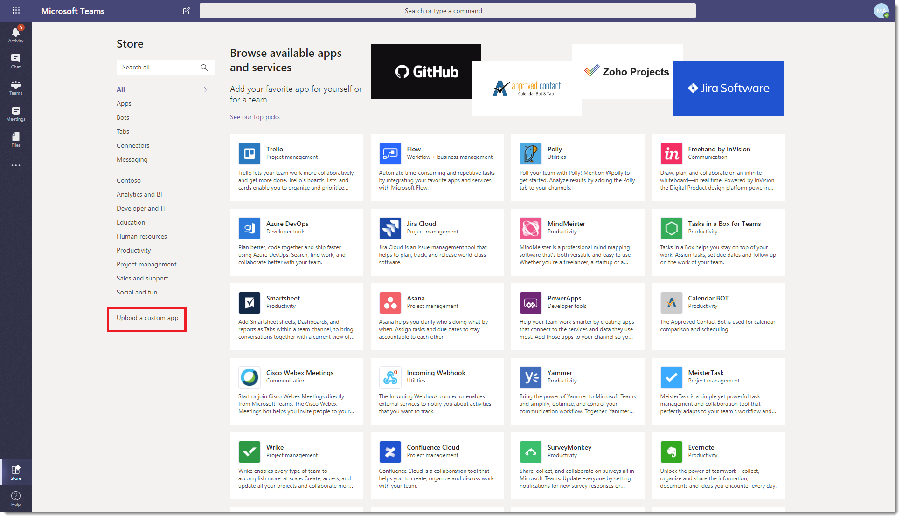

# 在 Microsoft Teams 中管理自訂應用程式策略和設定

> [!NOTE]
> 若要使用 App Studio，請參閱在 Microsoft Teams 平臺上開始使用 [C#/.NET](/microsoftteams/platform/get-started/get-started-dotnet-app-studio) 和 App Studio 的最後一個步驟尚未執行，因此您必須下載 zip，然後以舊的方式在上傳應用程式套件至 [Microsoft Teams](/microsoftteams/platform/concepts/apps/apps-upload)時安裝。

做為系統管理員，您可以使用自訂應用程式策略和設定來控制組織中誰可以上傳自訂應用程式至 Microsoft Teams。 系統管理員會決定哪些使用者可以上傳自訂應用程式，而系統管理員和團隊擁有者可以判斷貴組織的特定團隊是否允許將自訂應用程式新加入他們。  編輯自訂應用程式策略之後，可能需要幾個小時，變更才能生效。 您必須是全域系統管理員或 Teams 服務系統管理員，才能管理這些原則。

## 自訂應用程式概觀

使用者可以將應用程式套件上傳至 Teams，將應用程式套件 (.zip 檔案) 直接上傳至團隊或個人內容。 這和透過 Teams App Store 新增應用程式的方式不同。 上傳應用程式套件來新增自訂應用程式 ，也稱為側載功能可讓您在應用程式準備好廣泛發佈之前，先測試正在開發中的應用程式。 它也可讓您建立僅供內部使用的應用程式，並與小組共用，而不將應用程式提交至 Teams App Store 中的 Teams 應用程式目錄。

## 自訂應用程式策略和設定

三個元件可決定使用者是否可以將自訂應用程式上傳至團隊，讓您精細控制誰可以新增自訂應用程式至團隊，以及哪些團隊自訂應用程式可以新增到：

- [使用者自訂應用程式政策](#user-custom-app-policy)
- [小組自訂應用程式設定](#team-custom-app-setting)
- [全組織自訂應用程式設定](#org-wide-custom-app-setting)

這些設定不會影響封鎖協力廠商應用程式的能力。  

### 使用者自訂應用程式政策

在應用程式[設定政策](teams-app-setup-policies.md)中，系統管理員可以使用策略設定上傳自訂應用程式，以控制使用者是否可以將自訂應用程式上傳至 Teams。
 
如果此設定已關閉：

- 使用者無法將自訂應用程式上傳到貴組織或個人環境中的任何小組。
- 使用者可以視整個組織自訂應用程式設定，與自訂應用程式互動。

如果已開啟此設定：

- 使用者可以視整個組織自訂應用程式設定，將自訂應用程式上傳到允許的小組，以及他們擁有的團隊。
- 使用者可以將自訂應用程式上傳至個人內容。 
- 使用者可以視整個組織自訂應用程式設定，與自訂應用程式互動。

您可以編輯全域應用程式設定策略中的設定，以包含您想要的應用程式。 如果您想要為貴組織的不同使用者群組自訂 Teams，請建立並指派一或多個自訂應用程式設定政策。

#### 設定使用者自訂應用程式策略

1. 在 Microsoft Teams 系統管理中心的左側流覽中，前往 **Teams 應用程式**  >  **設定政策**。
2. 按一下 [新增 **]**。
3. 開啟或關閉上傳 **自訂應用程式**。
4. 選擇您想要用於該策略的其他任何設定。
5. 按一下 [儲存]。

### 小組自訂應用程式設定

系統管理員和團隊擁有者可以控制團隊是否允許新增自訂應用程式。 此設定 **：允許成員上傳自訂應用程式**，以及使用者的自訂應用程式策略，決定誰可以新增自訂應用程式至特定團隊。
 
如果此設定已關閉：

- 團隊擁有者可以新增自訂應用程式 ，如果他們的自訂應用程式策略允許的話。
- 不是團隊擁有者的小組成員無法新增自訂應用程式至團隊。

如果已開啟此設定：

- 如果團隊擁有者的自訂應用程式政策允許，可以新增自訂應用程式。
- 如果團隊成員的自訂應用程式策略允許，不是團隊擁有者的小組成員可以新增自訂應用程式。

#### 設定小組自訂應用程式設定

1. 在 Teams 中，前往團隊，按一下 [**更多選項 2010 年 1 月管理**  >  **小組**。
2. 按一下 **[設定**，然後展開 **成員許可權**。
3. 選取或清除允許 **成員上傳自訂應用程式** 核取方塊。

    

### 全組織自訂應用程式設定

在 **管理應用程式** 頁面上，允許與自訂應用程式互動的全組織自訂 應用程式設定會適用于貴組織中的每個人，並規範他們是否可以上傳或與自訂應用程式互動。 此設定可做為使用者和小組自訂應用程式策略設定的主開啟/關閉開關。 它旨在做為安全性事件期間的主開啟/關閉開關。 因此，使用者和小組自訂應用程式策略設定不會生效，除非啟用全組織自訂應用程式設定，即使已啟用使用者和小組自訂應用程式策略設定。

#### 設定全組織自訂應用程式設定

1. 在 Microsoft Teams 系統管理中心的左側瀏覽窗格中，移至 **Teams 應用程式** > **管理應用程式**。
2. 按一下 **[全組織應用程式設定>**。
3. 在 **自訂應用程式下**，開啟或關閉允許 **與自訂應用程式互動**。

    

## 自訂應用程式策略和設定如何共同作業

下表摘要列出自訂應用程式策略和設定、它們如何共同作業，以及它們對於控制貴組織中誰可以將自訂應用程式上傳至 Teams 的合併影響。

例如，假設您想要只允許團隊擁有者將自訂應用程式上傳至特定團隊。 您可以設定下列專案：
- 在 Microsoft  Teams 系統管理中心開啟允許與自訂應用程式互動設定。
- 關閉允許 **成員針對** 您想要限制存取的每一個團隊上傳自訂應用程式。
- 在 Microsoft Teams 系統管理中心建立並指派自訂應用程式設定策略，且已開啟上傳自訂應用程式設定，並將它指派給團隊擁有者。

|全組織自訂應用程式設定 |小組自訂應用程式設定 |使用者自訂應用程式政策 |影響  |
|---------|---------|---------|---------|
| 關閉    | 關閉    | 關閉     |貴組織會封鎖所有自訂應用程式的互動。 除了 Teams 服務系統管理員或全域系統管理員之外，任何人都無法上傳自訂應用程式。您可以使用 PowerShell 移除自訂應用程式。   |
| 關閉     | 關閉     | 已上        |貴組織會封鎖所有自訂應用程式的互動。 除了 Teams 服務系統管理員或全域系統管理員之外，任何人都無法上傳自訂應用程式。您可以使用 PowerShell 移除自訂應用程式。         |
| 關閉    | 已上        | 關閉        |貴組織會封鎖所有自訂應用程式的互動。 除了 Teams 服務系統管理員或全域系統管理員之外，任何人都無法上傳自訂應用程式。您可以使用 Windows PowerShell 刪除自訂應用程式。         |
| 關閉    | 已上      | 已上       |貴組織會封鎖所有自訂應用程式的互動。 除了 Teams 服務系統管理員或全域系統管理員之外，任何人都無法上傳自訂應用程式。您可以使用 PowerShell 移除自訂應用程式。         |
| 已上    | 關閉       | 關閉         |  使用者無法上傳自訂應用程式。      |
| 已上     | 關閉       | 已上         | 如果使用者是團隊擁有者，他們可以將自訂應用程式上傳至團隊。 如果使用者不是團隊擁有者，他們無法將自訂應用程式上傳至團隊。 使用者可以在個人環境中上傳自訂應用程式。     |
| 已上     | 已上     | 關閉         | 使用者無法上傳自訂應用程式。       |
| 已上    | 已上        | 已上        | 無論使用者是團隊擁有者，使用者都可以將自訂應用程式上傳至團隊。 使用者可以在個人環境中上傳自訂應用程式。       |

## 相關主題
 
[在 Teams 中管理應用程式的設定](admin-settings.md)

[在 Teams 中將原則指派給使用者](assign-policies.md)