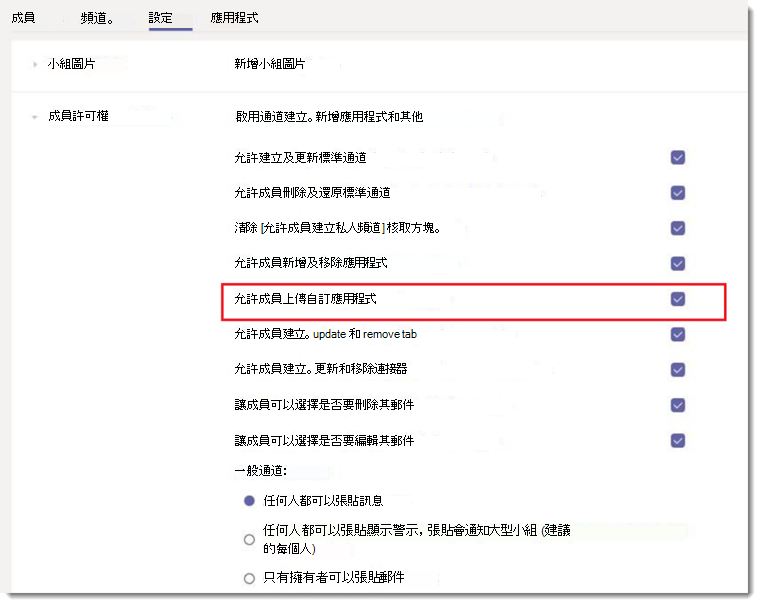
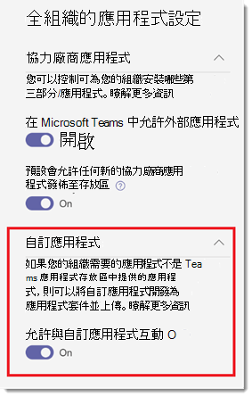

# 管理 Microsoft 團隊中的自訂應用程式原則和設定Manage custom app policies and settings in Microsoft Teams

> [!NOTE]
> 若要使用應用程式 Studio，請參閱[使用 c #/.NET 和 App Studio 的 Microsoft 團隊平臺快速](https://docs.microsoft.com/microsoftteams/platform/get-started/get-started-dotnet-app-studio)入門最後一個步驟尚無法運作，因此您必須先下載該 zip，然後在將[應用程式套件上傳到 Microsoft 團隊](https://docs.microsoft.com/microsoftteams/platform/concepts/apps/apps-upload)時將它安裝。To use App Studio see [Get started on the Microsoft Teams platform with C#/.NET and App Studio](https://docs.microsoft.com/microsoftteams/platform/get-started/get-started-dotnet-app-studio) The last step is not working yet, so you will need to download the zip and install it the old way at [Upload an app package to Microsoft Teams](https://docs.microsoft.com/microsoftteams/platform/concepts/apps/apps-upload).

做為管理員，您可以使用自訂的應用程式原則和設定來控制貴組織中的哪些人可以將自訂應用程式上傳到 Microsoft 團隊。As an admin, you can use custom app policies and settings to control who in your organization can upload custom apps to Microsoft Teams. 系統管理員決定可以上傳自訂應用程式的使用者，以及系統管理員和小組擁有者可以判斷您組織中的特定團隊是否允許將自訂應用程式新增到他們。Admins decide which users can upload custom apps, and admins and team owners can determine whether specific teams in your organization allow custom apps to be added to them.  在您編輯自訂應用程式原則之後，變更才會生效24小時。After you edit the custom app policy, it can take up to 24 hours for changes to take effect. 您必須是全域管理員或團隊服務系統管理員，才能管理這些原則。You must be a global admin or Teams service admin to manage these policies.

## 自訂應用程式的概覽Overview of custom apps

使用者可以將自訂 app 新增至團隊，方法是將應用程式套件（在 .zip 檔案中）直接上傳到小組或個人內容。Users can add a custom app to Teams by uploading an app package (in a .zip file) directly to a team or in the personal context. 這與透過 [團隊 app store] 新增應用程式的方式不同。This is different from how apps are added through the Teams app store. 透過上傳應用程式套件（又稱為邊載）來新增自訂應用程式，可讓您在開發應用程式之前先測試該 app，然後才能廣泛發佈。Adding a custom app by uploading an app package, also known as sideloading, lets you test an app as it's being developed, before it's ready to be widely distributed. 它也可讓您建立僅供內部使用的 app，並與您的小組共用該應用程式，而不需提交至 [小組] app 商店中的 [小組] 應用程式目錄。It also lets you build an app for internal use only and share it with your team without submitting it to the Teams app catalog in the Teams app store.

![螢幕擷取畫面顯示 app store 中的 [上傳自訂應用程式] 選項](media/teams-custom-app-policy-and-settings-upload-app.png)

## 自訂 app 原則和設定Custom app policy and settings

三個元件會判斷使用者是否可將自訂應用程式上傳至團隊，讓您精細控制哪些人可以將自訂應用程式新增至團隊，以及可將哪些團隊自訂應用程式新增至：Three components determine whether a user can upload a custom app to a team, giving you granular control over who can add custom apps to a team and which teams custom apps can be added to:

- [使用者自訂 app 原則User custom app policy](#user-custom-app-policy)
- [團隊自訂應用程式設定Team custom app setting](#team-custom-app-setting)
- [全組織的自訂應用程式設定Org-wide custom app setting](#org-wide-custom-app-setting)

這些設定不會影響封鎖協力廠商應用程式的能力。These settings don't affect the ability to block third-party apps.  

### 使用者自訂 app 原則User custom app policy

在[應用程式設定原則](teams-app-setup-policies.md)中，系統管理員可以使用原則設定、**上傳自訂應用程式**，控制使用者是否能將自訂應用程式上傳給小組。As part of [app setup policies](teams-app-setup-policies.md), admins can use a policy setting, **Upload custom apps**, to control whether a user can upload custom apps to Teams.
 
如果已關閉此設定：If this setting is turned off:

- 使用者無法將自訂應用程式上傳到貴組織中的任何小組或個人內容。The user can't upload a custom app to any team in your organization or in the personal context.
- 根據組織範圍內的自訂應用程式設定，使用者可以與自訂應用程式互動。The user can interact with custom apps, depending on the org-wide custom app setting.

如果已開啟此設定：If this setting is turned on:

- 使用者可以將自訂應用程式上傳給小組，讓他們能根據組織範圍內的自訂應用程式設定，將自訂 app 上傳給擁有者的團隊。The user can upload custom apps to teams that allow it and to teams for which they are owners, depending on the org-wide custom app setting.
- 使用者可以將自訂應用程式上傳到個人內容。The user can upload custom apps to the personal context. 
- 根據組織範圍內的自訂應用程式設定，使用者可以與自訂應用程式互動。The user can interact with custom apps, depending on the org-wide custom app setting.

您可以編輯全域 app 設定原則中的設定，以包含您想要的 app。You can edit the settings in the global app setup policy to include the apps that you want. 如果您想要針對貴組織中不同的使用者群組自訂小組，請建立並指派一或多個自訂應用程式設定原則。If you want to customize Teams for different groups of users in your organization, create and assign one or more custom app setup policies.

#### 設定使用者自訂 app 原則Set a user custom app policy

1. 在 Microsoft 團隊系統管理中心的左導覽中，移至 [**團隊 app** > **設定原則**]。In the left navigation of the Microsoft Teams admin center, go to **Teams apps** > **Setup policies**.
2. 按一下 [**新增**]。Click **Add**.
3. 開啟或關閉 **[上傳自訂應用程式**]。Turn on or turn off **Upload custom apps**.
4. 選擇您想要用於原則的任何其他設定。Choose any other settings that you want to for the policy.
5. 按一下 [**儲存**]。Click **Save**.

### 團隊自訂應用程式設定Team custom app setting

系統管理員和小組擁有者可以控制團隊是否允許將自訂應用程式新增到其中。Admins and team owners can control whether a team allows for custom apps to be added to it. 此設定可**讓成員上傳自訂應用程式**，以及使用者的自訂應用程式原則，決定誰可以將自訂應用程式新增至特定團隊。This setting, **Allow members to upload custom apps**, together with a user's custom app policy determines who can add custom apps to a particular team.
 
如果已關閉此設定：If this setting is turned off:

- 如果他們的自訂 app 原則允許，小組擁有者可以新增自訂應用程式。Team owners can add custom apps, if their custom app policy allows it.
- 不是團隊擁有者的小組成員無法將自訂應用程式新增至團隊。Team members who aren't team owners can't add custom apps to the team.

如果已開啟此設定：If this setting is turned on:

- 小組擁有者可以新增自訂的應用程式（如果他們的自訂應用程式原則允許）。Team owners can add custom apps, if their custom app policy allows for it.
- 不是團隊擁有者的小組成員可以新增自訂應用程式（如果他們的自訂應用程式原則允許）。Team members who aren't team owners can add custom apps, if their custom app policy allows for it.

#### 設定小組自訂應用程式設定Configure the team custom app setting

1. 在 [團隊] 中，移至團隊，按一下 [**更多選項] ̇̇̇** > [**管理團隊**]。In Teams, go to the team, click **More options ˙˙˙** > **Manage team**.
2. 按一下 [**設定**]，然後展開 [**成員許可權**]。Click **Settings**, and then expand **Member permissions**.
3. 選取或清除 [**允許成員上傳自訂應用程式**] 核取方塊。Select or clear the **Allow members to upload custom apps** check box.

    

### 全組織的自訂應用程式設定Org-wide custom app setting

[[管理應用](manage-apps.md)程式] 頁面上的 [**允許與自訂應用程式互動**] 的 [管理 app] 頁面上的 [全式自訂應用程式] 設定適用于您組織中的所有人，並可控制他們是否The **Allow interaction with custom apps** org-wide custom app setting on the [Manage apps](manage-apps.md) page applies to everyone in your organization and governs whether they can upload or interact with custom apps. 此設定會覆寫使用者和團隊的自訂應用程式原則與設定。This setting overrides the user and team custom app policy and setting. 它是用來在安全性事件期間作為主機開啟/關閉切換。It's intended to serve as a master on/off switch during security events.

#### 設定組織範圍的自訂應用程式設定Configure the org-wide custom app setting

1. 在 Microsoft 團隊系統管理中心的左導覽中，移至 [**團隊 app** > **管理應用程式**]。In the left navigation of the Microsoft Teams admin center, go to **Teams apps** > **Manage apps**.
2. 按一下 [**全組織式應用程式設定**]。Click **Org-wide app settings**.
3. 在 [**自訂應用程式**] 底下，開啟或關閉 [**允許與自訂應用程式互動**]。Under **Custom apps**, turn on or turn off **Allow interaction with custom apps**.

    

## 自訂 app 原則與設定如何共同運作How custom app policies and settings work together

下表摘要列出自訂應用程式原則和設定、它們如何共同運作，以及其結合控制哪些人可以將自訂應用程式上傳至團隊的效果。This table summarizes the custom app policy and settings, how they work together, and their combined effect on controlling who in your organization can upload custom apps to Teams.

例如，您想要只允許團隊擁有者將自訂應用程式上傳到特定團隊。Say, for example, you want to allow only team owners to upload custom apps to specific teams. 您可以設定下列專案：You would set the following:
- 在 Microsoft 團隊系統管理中心開啟 [**允許與自訂應用程式互動**] 設定。Turn on the **Allow interaction with custom apps** setting in the Microsoft Teams admin center.
- 針對您要限制存取權的每個團隊，關閉 [**允許成員上傳自訂應用程式**]。Turn off the **Allow members to upload custom apps** for every team to which you want to restrict access.
- 在 Microsoft 團隊系統管理中心中建立並指派自訂應用程式設定原則，並將 [**上傳自訂應用程式**] 設定為開啟狀態，然後將它指派給團隊擁有者。Create and assign a custom app setup policy in the Microsoft Teams admin center with the **Upload custom apps** setting turned on, and assign it to the team owners.

|全組織的自訂應用程式設定Org-wide custom app setting |團隊自訂應用程式設定Team custom app setting |使用者自訂 app 原則User custom app policy |效果Effect  |
|---------|---------|---------|---------|
| 出Off    | 出Off    | 出Off     |您的組織已封鎖與所有自訂應用程式的互動。Interaction with all custom apps is blocked for your organization. 任何人都無法上傳自訂應用程式。Custom apps can't be uploaded by anyone. 您可以使用 PowerShell 來移除自訂應用程式。You can use PowerShell to remove the custom app.   |
| 出Off     | 出Off     | 按On        |您的組織已封鎖與所有自訂應用程式的互動。Interaction with all custom apps is blocked for your organization. 任何人都無法上傳自訂應用程式。Custom apps can't be uploaded by anyone. 您可以使用 PowerShell 來移除自訂應用程式。You can use PowerShell to remove the custom app.         |
| 出Off    | 按On        | 出Off        |您的組織已封鎖與所有自訂應用程式的互動。Interaction with all custom apps is blocked for your organization. 任何人都無法上傳自訂應用程式。Custom apps can't be uploaded by anyone. 您可以使用 Windows PowerShell 來刪除自訂應用程式。You can use Windows PowerShell to delete custom apps.         |
| 出Off    | 按On      | 按On       |您的組織已封鎖與所有自訂應用程式的互動。Interaction with all custom apps is blocked for your organization. 任何人都無法上傳自訂應用程式。Custom apps can't be uploaded by anyone. 您可以使用 PowerShell 來移除自訂應用程式。You can use PowerShell to remove the custom app.         |
| 按On    | 出Off       | 出Off         |  使用者無法上傳自訂應用程式。The user can't upload custom apps.      |
| 按On     | 出Off       | 按On         | 如果使用者是團隊擁有者，則可將自訂應用程式上傳至團隊。If the user is a team owner, they can upload custom apps to the team. 如果使用者不是團隊擁有者，則他們無法將自訂應用程式上傳至團隊。If the user isn't a team owner, they can't upload custom apps to the team. 使用者可以在個人內容中上傳自訂應用程式。The user can upload custom apps in the personal context.     |
| 按On     | 按On     | 出Off         | 使用者無法上傳自訂應用程式。The user can't upload custom apps.       |
| 按On    | 按On        | 按On        | 無論使用者是否為小組擁有者，使用者都可以將自訂應用程式上傳至團隊。The user can upload custom apps to the team, regardless of whether the user is a team owner. 使用者可以在個人內容中上傳自訂應用程式。The user can upload custom apps in the personal context.       |

 ## 相關主題Related topics
 
- [在 Teams 中的應用程式系統管理設定Admin settings for apps in Teams](admin-settings.md)
