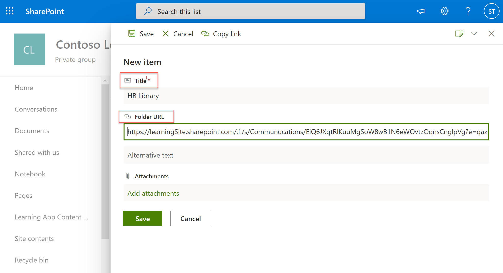

# 安裝、管理及指派 Teams 學習應用程式的許可權， (預覽) Install, manage, and assign permissions for the Teams Learning app (private preview)

*本文包含 Teams Learning 應用程式的初步內容，此為私人預覽。**This article contains preliminary content for the Teams Learning app, which is in private preview.*

Microsoft Teams Learning 應用程式 (預覽) 讓貴組織的團隊和個人能夠自然地學習一天中的內容。The Microsoft Teams Learning app (private preview) empowers teams and individuals in your organization to make learning a natural part of their day. 應用程式在 Teams 中建立一個中央中樞，讓員工可以共用、指派及學習整個組織的內容庫。The app creates a central hub in Teams where employees can share, assign, and learn from content libraries across your organization. 系統管理員設定許可權並允許應用程式的學習內容來源。Admins set permissions and allow learning content sources for the app. 學習內容可能包括 LinkedIn學習、Microsoft Learn、Microsoft 365 訓練、您組織儲存在 SharePoint Online 中的內容，以及應用程式支援的協力廠商提供者。Learning content can include LinkedIn Learning, Microsoft Learn, Microsoft 365 training, your organization's own content stored in SharePoint online, and third-party providers that are supported by the app.

若要將 Teams Learning 應用程式設定 (預覽) ，您需要包含：To set up the Teams Learning app (private preview), you'll need to involve:

-   Teams 系統管理中心系統管理員Teams admin center admin
-   Microsoft 365 系統管理中心系統管理員 (，即全域系統管理員) Microsoft 365 admin center admin (that is, a global admin)

## 在 Teams 系統管理中心 (Teams) Teams 學習應用程式的私人預覽頁面Manage the Teams Learning app (private preview) in the Teams admin center

Teams 系統管理員會從 App store 安裝 Teams Learning (私人預覽) ，並透過 Teams 系統管理中心來申請應用程式設定、管理及許可權原則。The Teams admin installs the Teams Learning app (private preview) from the app store and applies app setup, manage, and permissions policies through the Teams admin center.

### 管理 Teams Learning 應用程式 (的私人預覽) Manage the Teams Learning app (private preview)

若要管理應用程式的設定，請遵循下列步驟：To manage settings for app, follow these steps:

1. 在 Microsoft Teams 系統管理中心的左側流覽區中，前往 **Teams 應用程式**  >  **管理應用程式**。In the left navigation of the Microsoft Teams admin center, go to **Teams apps** > **Manage apps**.

   

2. 在管理應用程式頁面的搜尋方塊中，輸入如何搜尋 Teams Learning 應用程式， (預覽) 。 On the **Manage apps** page, in the search box, type *learning* to search for the Teams Learning app (private preview).

   

3. 在學習 **頁面上** ：On the **Learning** page:
   1. 在 **狀態\*\*\*\*下，選取** 允許開啟應用程式。Under **Status**, select **Allowed** to turn on the app.
   2. 在應用程式設定的設定設定。On the **Settings** tab, in the **App settings** section, go to the Microsoft 365 admin center to configure learning content sources.

   

4. 在 **管理應用程式** 設定之後，請前往許可權和設定政策，將許可權授予應擁有應用程式存取權的員工，做為貴組織參與私人預覽的一部分。After **Manage app** settings, go to **Permissions and Set-up policies** to grant permission to employees who should have access to the app as part of your organization's participation in the private preview.

> [!NOTE]
>  如果貴組織在 Ring 4.0 中屬於 Teams TAP100 計畫的一部分，您可能需要執行下列操作，才能讓在 Ring 3.0 中核准的使用者存取 Teams Learning 應用程式 (私人預覽) 。If your organization is in Ring 4.0 as part of Teams TAP100 program, you might need to do the following to enable approved users in Ring 3.0 to access the Teams Learning app (private preview).

做為私人預覽的一部分，Teams 學習應用程式 (私人預覽) 在 Ring 3.0 中發行。As part of private preview, the Teams Learning app (private preview) is released in Ring 3.0. 如果貴組織是在 Ring 4.0，您就不會在 App Store 看到該應用程式。If your organization is in Ring 4.0, you won’t see the app in the app store. 若要測試應用程式，您需要建立自訂應用程式權限原則，將其設定為允許所有應用程式，並將它指派給 Ring 3.0 核准的使用者。To test the app, you need to create a custom apps permission policy, set it to **Allow all apps**, and assign it to Ring 3.0 approved users.

   

## 在 Microsoft 365 系統管理中心設定學習內容來源Configure learning content sources in the Microsoft 365 admin center

Microsoft 365 系統管理中心的系統管理員可以管理 Teams 學習應用程式的相關設定 (私人預覽) 並設定學習內容來源。The admins for the Microsoft 365 admin center can manage settings related to the Teams Learning app (private preview) and can configure the learning content sources.

系統管理員選取哪些學習內容來源 (App 中LinkedIn學習) SharePoint 頁面。The admin selects which learning content sources (such as LinkedIn Learning or SharePoint) will be available in the app. 系統管理員接著會設定這些來源，以確保內容可供搜尋和探索使用，且使用 App 的員工可以流覽。The admin then configures those sources to make sure the content is available for search and discovery and can be browsed by the employees who use the app.

### 設定應用程式學習內容來源的設定Configure settings for the learning content sources for the app

這些步驟是由 Microsoft 365 系統管理員執行。These steps are to be performed by the Microsoft 365 admin.

1.  在 Microsoft 365 系統管理中心的左側流覽區中，**前往設定**  >  **組織設定**。In the left navigation of the Microsoft 365 admin center, go to **Settings** > **Org settings**.

2.  在設定頁面上，&載入程式按鈕上的學習 **應用程式。**On the **Settings** page, on the **Services & add-ins** tab, select **Learning app**.

   

3.  在學習 **應用程式面板** 上，選取您想要為組織設定的學習內容來源， **然後選取儲存**。On the **Learning app** panel, select the learning content sources you want to configure for the organization, and then select **Save**.

   

在所有的學習來源中，有些預設會啟用。Among all the learning sources that exist, some will be enabled by default. 包括：These include:

- LinkedIn學習 (免費內容) LinkedIn Learning (free content)
- Microsoft LearnMicrosoft Learn
- Microsoft 365 訓練Microsoft 365 Training

> [!NOTE]
> 如果貴組織有LinkedIn標準版或專業版訂閱，貴組織的員工就會解除鎖定內容存放庫。If your organization has a LinkedIn Learning Standard or Pro subscription, the content repository will be unlocked for the employees in your organization. 只有擁有許可權的員工才能使用整個內容存放庫。Only those employees who have permission will be able to use the entire content repository.

其他來源可能需要啟用或手動進行安裝。Other sources might need to be enabled or configured manually. 非 Microsoft 的學習來源會由您的組織和協力廠商個別授權。Learning sources that are not from Microsoft are separately licensed between your organization and the third party. 您必須確認自己已經註冊，為學生和使用者學習。You’ll need to verify you’ve signed up for their learning for you and your users.

若要啟用或停用學習內容來源，請選取來源旁的核取方塊。To enable or disable a learning content source, select the check box next to the source. 如果啟用來源，將會顯示勾選記號。If a source is enabled, a check mark will be visible.

## 將 SharePoint 設定為學習內容來源 (即將推出) Configure SharePoint as a learning content source (Coming Soon)

您可以在 Microsoft 365 系統管理中心將 SharePoint 設定為 Teams 學習 (的私人) 內容來源。You configure SharePoint as a learning content source for the Teams Learning app (private preview) in the Microsoft 365 admin center.

### 概觀Overview

系統管理員提供網站 URL，讓學習服務可以在其中以結構化 SharePoint 清單的形式，建立空白的集中式學習內容存放庫。The admin provides a site URL to where the Learning Service can create an empty centralized learning content repository in the form of a structured SharePoint list. 組織可以使用此清單來建立包含學習內容的跨公司 SharePoint 資料夾連結。This list can be used by the organization to house links to cross-company SharePoint folders that contain learning content. 系統管理員負責收集和策展資料夾的 URL 清單。Admins are responsible for collecting and curating a list of URLs for folders. 這些資料夾應只包含可在 Teams Learning 應用程式中取得的內容， (預覽) 。These folders should only include content that can be made available in the Teams Learning app (private preview).

### 權限Permissions

資料夾 URL 可以從組織的任何 SharePoint 網站收集。Folder URLs can be collected from any SharePoint site in the organization. 這些資料夾中的任何內容都可以搜尋，但只能使用個別員工擁有許可權的內容。Any content within these folders will be searchable, but only content to which the individual employee has permissions can be used.
 
### 學習服務Learning Service

學習服務會使用提供的資料夾 URL，取得儲存在這些資料夾中之所有內容的中繼資料。The Learning Service uses the provided folder URLs to get metadata from all content stored in those folders. 在提供集中式存放庫中資料夾 URL 的 24 小時內，員工可以在 App 中搜尋及使用公司的內容。Within 24 hours of supplying the folder URL in the centralized repository, employees can search for and use the company’s content within the app. 此時不支援從存放庫刪除內容。Content deletion from the repository isn't supported at this point. 只有在 Microsoft 365 系統管理中心提供新的 SharePoint 網站 URL，才能移除不小心顯示的內容。Unintentionally surfaced content can only be removed by supplying a new SharePoint site URL in the Microsoft 365 admin center.

### 將 SharePoint 設定為來源Configure SharePoint as a source

這些步驟是由 Microsoft 365 系統管理員執行。These steps are to be performed by Microsoft 365 admin.

1.  在 Microsoft 365 系統管理中心的左側流覽區中，前往設定 **。**In the left navigation of the Microsoft 365 admin center, go to **Settings**.
 
2.  在設定頁面上，&載入程式按鈕上的學習 **應用程式。**On the **Settings** page, on the **Services & add-ins** tab, select **Learning app**.

   

3.  在學習 **應用程式面板** 上，提供您想要應用程式建立集中式存放庫之 SharePoint 網站的網站 URL。On the **Learning app** panel, provide the site URL to the SharePoint site where you want the app to create a centralized repository.

   

4.  SharePoint 清單會在提供的組織的 SharePoint 網站中自動建立。A SharePoint list is created automatically within the provided organization’s SharePoint site. 在 SharePoint 網站的左側流覽中，選取學習 **應用程式內容存放庫**。In the left navigation of the SharePoint site, select **Learning App Content Repository**. 

   

 
5. 在學習 **應用程式內容存放庫** 頁面上，將 URL 填入 SharePoint 清單至學習內容資料夾。On the **Learning App Content Repository** page, populate the SharePoint list with URLs to the learning content folders.

   1.   選取 **新增** 以查看 **新增專案** 面板。Select **New** to view the **New item** panel. 

   
 
   2.   在新增 **專案面板** 的標題欄位中，新增您所選擇的目錄名稱。On the **New item** panel, in the **Title** field, add a directory name of your choice. 在資料夾 **URL 欄位中** ，將 URL 新增到學習內容資料夾。In the **Folder URL** field, add the URL to the learning content folder. 選取 **儲存**。Select **Save**.

   

   3. 學習應用程式內容存放庫頁面會以新的學習內容更新。The Learning App Content Repository page is updated with the new learning content.

   

 

