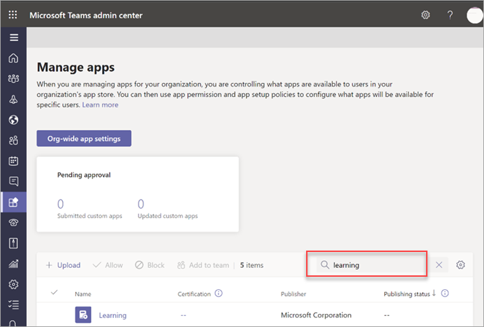
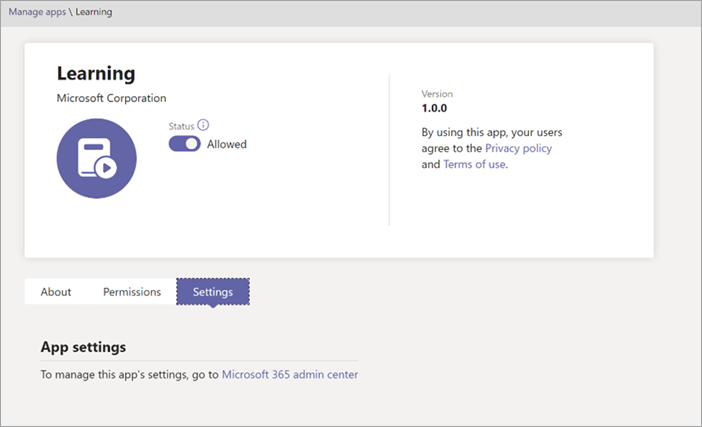
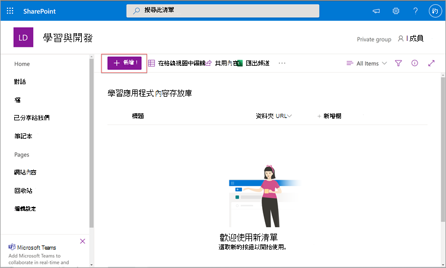
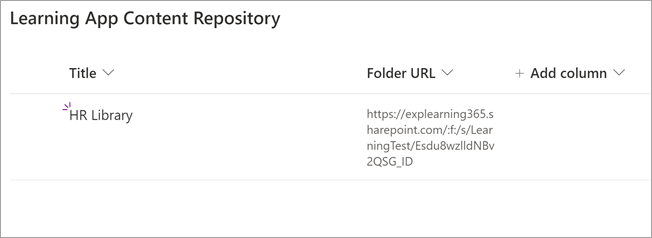

# 安裝、管理及指派 Microsoft Viva Learning (私人預覽) 

*本文包含 Microsoft Viva Learning 的初步內容，內容為私人預覽版。*

Microsoft Viva Learning (私人預覽) 讓貴組織的小組和個人能夠自然地學習一天。 應用程式在 Teams 中建立中央中樞，讓員工可以共用、指派內容庫，以及向整個組織學習。

系統管理員會設定許可權，並允許 Viva Learning (私人預覽) 。 學習內容可以包含 LinkedIn 學習、Microsoft Learning、Microsoft 365 訓練、貴組織儲存在 SharePoint Online 中的內容，以及 Viva Learning (私人預覽版) 支援的協力廠商提供者。

## 系統管理員角色

若要設定 Viva Learning (預覽) ，您需要許可權為：

- Microsoft Teams 系統管理員
- Microsoft 365 全域系統管理員或 SharePoint 系統管理員
- 知識系統管理員 - 這是 Microsoft 365 系統管理中心的一個新角色，可指派給組織中任何人。 此角色透過 Microsoft 365 系統管理中心管理組織的學習內容來源。 

> [!TIP]
> 知識系統管理員應具備適中的技術，並擁有現有的 SharePoint 系統管理員認證，最好是熟悉組織教育、學習、訓練或員工經驗的人。
 
## 在 Teams 系統管理 (管理) 管理 Viva Learning

Teams 系統管理員會從 app store (Viva Learning) 個人預覽版，然後透過 Teams 系統管理中心來適用設定、管理和許可權原則。

### 管理 Viva Learning (私人預覽) 

您必須是 Teams 系統管理中心的系統管理員，才能執行這些工作。

若要管理 Viva Learning 的設定，請遵循下列步驟：

1. 在 Teams 系統管理中心的左側流覽中，前往 **Teams 應用程式**  >  **管理應用程式**。

   

2. 在管理 **應用程式頁面** 的搜尋方塊中，輸入搜尋Teams Learning App (預覽) 。

   

3. 在學習 **頁面上** ：
   1. 在 **狀態****下，選取** 允許開啟應用程式。
   2. 在設定 **選項卡** 的 <App **設定** > 區段，前往 Microsoft 365 系統管理中心以設定學習內容來源。

   

4. 管理 **應用程式** 設定之後，請前往許可權和設定政策，將許可權授予應有權存取應用程式的員工，作為貴組織參與私人預覽的一部分。

> [!NOTE]
>  如果貴組織是 Teams TAP100 計畫的一部分，在 Ring 4.0 中，您可能需要執行下列操作，才能在 Ring 3.0 中啟用核准使用者，才能存取 Viva Learning (私人預覽) 。

在私人預覽中，Viva Learning (私人預覽) 于 Ring 3.0 中發行。 如果貴組織位於 Ring 4.0，您就不會在 App Store 中看到該應用程式。 若要測試應用程式，您需要建立自訂應用程式權限原則，將其設定為允許所有應用程式，並將它指派給 Ring 3.0 核准使用者。

   

## 在 Microsoft 365 系統管理中心設定學習內容來源

Microsoft 365 系統管理中心的系統管理員可以自行或指派知識系統管理員角色給貴組織中選定的人員，以管理與 Viva Learning (私人預覽版) 相關的設定，並可以設定學習內容來源。

系統管理員會選取哪些其他學習內容來源 (例如 SharePoint 或支援的協力廠商內容提供者來源) 可供 Viva Learning (私人預覽版) 。 系統管理員接著會設定這些來源，以確保內容可供搜尋和探索，且可供使用 Viva Learning (私人預覽版) 。

> [!NOTE]
>  使用者會以瀏覽器或內嵌檢視器LinkedIn非 Microsoft 和 Learning Pro 學習。 此已配置的學習受貴組織和協力廠商之間的個別授權、隱私權和服務條款所限制，而非 Viva Learning (私人預覽) 條款。 選取這類學習之前，請確認貴組織與使用者已達成一致。

### 指派知識系統管理員角色 [選擇性]

您必須是 Microsoft 365 全域系統管理員才能執行這些工作。

若要指派 Viva Learning 的知識系統管理員，請遵循下列步驟：

1.  在 Microsoft 365 系統管理中心的左側流覽中， **前往角色**。

2.  在角色 **頁面上** 的 Azure **AD 選項卡** 上，選取 **知識系統管理員**。
 
3.  在知識 **系統管理員** 頁面上的 <指派的系統管理員> 區段，選取 新增 **，然後** 新增您為角色選擇的人。

### 設定 Viva 學習版學習內容來源的設定 (預覽) 

您必須是 Microsoft 365 全域系統管理員或知識系統管理員，才能執行這些工作。

若要在 Viva Learning 中設定學習內容來源的設定，請遵循下列步驟：

1.  在 Microsoft 365 系統管理中心的左側流覽中，**前往設定**  >  **組織設定**。

2.  在組織 **設定頁面上** 的 <服務> 選項卡上，選取學習 **應用程式 (預覽) 。**

     

3.  在學習 **應用程式** (預覽) 面板上，選取您想要為組織設定的學習內容來源，然後 **選取儲存**。

     

在存在的所有學習來源中，有些預設會啟用。 包括：

- LinkedIn學習 (免費) 
- Microsoft Learn
- Microsoft 365 訓練

> [!NOTE]
> 如果貴組織有 LinkedIn學習標準版或專業版訂閱，內容存放庫會針對貴組織的員工解除鎖定。 只有擁有許可權的員工才能使用整個內容存放庫。  其他來源可能需要啟用或手動進行配置。 非 Microsoft 的學習來源會分別在貴組織和協力廠商之間獲得授權。 您必須確認您為您和使用者註冊了學習課程。

若要啟用或停用學習內容來源，請選取來源旁的核取方塊。 如果已啟用來源，將會顯示一個核取方塊。

## 將 SharePoint 設定為學習內容來源

您可以將 SharePoint 設定為學習內容來源，讓貴組織自己的內容可在 Viva Learning (預覽) 。

### 概觀

知識系統管理員 (或全域系統管理員) 以結構化 SharePoint 清單的形式，提供網站 URL，讓學習服務可以在這裡建立空白的集中式位置 ，即學習應用程式內容存放庫。 貴組織可以使用此清單來提供包含學習內容的跨公司 SharePoint 資料夾連結。 系統管理員負責收集及管理資料夾的 URL 清單。 這些資料夾應只包含可在 Viva Learning 或私人預覽 (中) 。

Viva Learning (私人預覽) 支援下列檔案類型：

- Word、PowerPoint、Excel、PDF
- 音訊 (.m4a) 
- 影片 (.mov、.mp4、.avi) 

詳細資訊，請參閱 [SharePoint Online 檔](https://docs.microsoft.com/sharepoint/introductionlink)。 

### 權限

文件庫資料夾 URL 可以從組織的任何 SharePoint 網站收集。 Viva Learning (私人預覽) 遵循所有現有的內容許可權。 因此，只有使用者有權存取的內容，才能在 Viva Learning 中搜尋 (私人預覽) 。 這些資料夾中的任何內容都可以搜尋，但只能使用個別員工有權使用的內容。

目前不支援從貴組織存放庫刪除內容。

若要移除不小心浮出的內容，請遵循下列步驟：

1.  若要限制文件庫的存取權，請選取 **顯示動作** 選項，然後選取管理 **存取** 權。
     
     

2.  刪除文件庫中的原始檔案。

詳細資訊，請參閱 SharePoint 新式體驗中的 [共用和許可權](https://docs.microsoft.com/sharepoint/modern-experience-sharing-permissions)。 

### 學習服務

學習服務會使用所提供的資料夾 URL，從儲存在這些資料夾中的所有內容取得中繼資料。 在集中式存放庫中提供資料夾 URL 的 24 小時內，員工可以在 Viva Learning (私人預覽版) 。 內容的所有變更 ，包括更新的中繼資料和許可權，也會在 24 小時內于學習服務中適用。

### 將 SharePoint 設定為來源

您必須是 Microsoft 365 全域系統管理員、SharePoint 系統管理員或知識系統管理員，才能執行這些工作。

若要將 SharePoint 設定為 Viva Learning 中的學習內容來源 (私人預覽) ，請遵循下列步驟：

1.  在 Microsoft 365 系統管理中心的左側流覽中，**前往設定**  >  **組織設定**。
 
2.  在組織 **設定頁面上** 的 <服務> 選項卡上，選取學習 **應用程式 (預覽) 。**

     

3.  在學習 **應用程式** (預覽) 面板的 **SharePoint** 下，提供 SharePoint 網站的網站 URL，讓 Viva Learning 建立集中式存放庫。

     

4.  SharePoint 清單會在提供的 SharePoint 網站內自動建立。

     

     在 SharePoint 網站的左側流覽中，選取 **網站內容**  >  **學習應用程式內容存放庫**。 

      

5. 在學習 **應用程式內容存放庫頁面上** ，使用 URL 填入 SharePoint 清單至學習內容資料夾。

   1. 選取 **新增** 以查看 **新增專案** 面板。 

       
 
   2. 在新增 **專案面板** 的標題欄位中，新增您所選擇的目錄名稱。 在資料夾 **URL** 欄位中，將 URL 新增到學習內容資料夾。 選取 [儲存 **]**。

       

   3. 學習 **應用程式內容存放庫頁面** 會以新的學習內容更新。

       

> [!NOTE]
> 若要允許更多人存取學習應用程式內容存放庫，Viva Learning (私人預覽) 介面即將提供清單連結，使用者可以在這裡要求存取，並最終協助填入清單。 網站擁有者和全域系統管理員必須授予清單的存取權。 Access 僅適用于清單，不適用於儲存清單的網站。

### 資料夾 URL 文件庫的策展

預設中繼資料 (例如修改日期、建立者、檔案名稱、內容類型及組織名稱) ，Microsoft Graph API 會自動拉入 Viva Learning (私人預覽) 。
 
若要改善內容的整體探索和搜尋相關性，建議您新增描述 **欄** 。

若要 **新增描述列** 至文件庫頁面，請遵循下列步驟：

1.  在檔 **頁面上** ，選取 新增 **欄**。

2. 選取顯示 **動作** 選項，然後選取 **單行文字**。

     

3. 在建立 **欄面板的**<名稱>欄位中，新增欄的描述性名稱。 選取 [儲存 **]**。

     
 
4. 在檔 **頁面上** 的 <描述 **>** 欄中，新增每個專案的自訂描述。 如果沒有提供描述，Viva Learning (私人預覽) 會提供一則預設訊息，將內容強調為來自您自己的 SharePoint 文件庫。 

     
 
