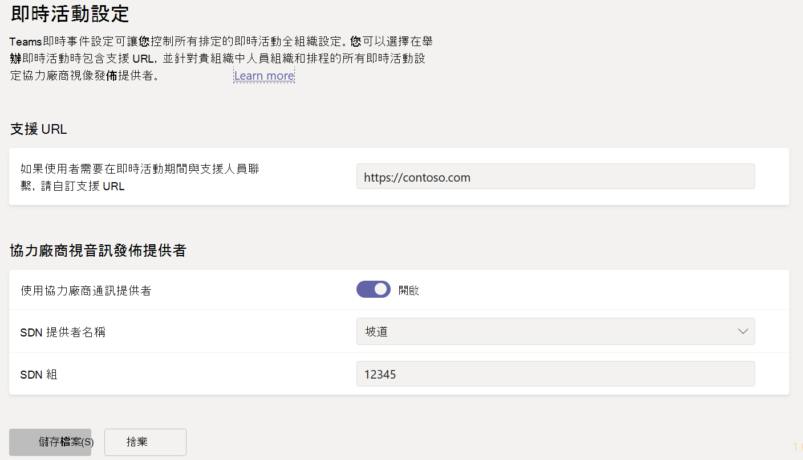
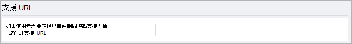

# <a name="configure-live-event-settings-in-microsoft-teams"></a>在 Microsoft Teams

使用 Teams活動設定來設定貴組織中舉辦的即時活動設定。 您可以設定支援 URL，並設定協力廠商視音訊發佈提供者。 這些設定適用于在貴組織中建立的所有即時活動。

您可以在系統管理中心輕鬆管理Microsoft Teams設定。 在左側流覽中，前往 **會議**  >  **Live 事件設定**。



## <a name="set-up-event-support-url"></a>設定活動支援 URL

此 URL 會顯示給即時活動出席者。 新增貴組織的支援 URL，讓出席者在即時活動期間與支援人員聯繫。

### <a name="using-the-microsoft-teams-admin-center"></a>使用 Microsoft Teams 系統管理中心

1. 在左側流覽中，前往 **會議**  >  **Live 事件設定**。
2. 在 **支援 URL** 下，輸入貴組織的支援 URL。

    

### <a name="using-windows-powershell"></a>使用Windows PowerShell

執行下列操作：

```PowerShell
Set-CsTeamsMeetingBroadcastConfiguration -SupportURL “{your URL}”
```
詳細資訊，請參閱 [Set-CsTeamsMeetingBroadcastConfiguration](/powershell/module/skype/set-csteamsmeetingbroadcastconfiguration?view=skype-ps&preserve-view=true)。
## <a name="configure-a-third-party-video-distribution-provider"></a>設定協力廠商視音訊發佈提供者 

如果您透過 Microsoft 影片傳遞合作夥伴購買並設定軟體定義的網路 (SDN) 解決方案或企業內容傳遞網路 (eCDN) 解決方案，請設定 Teams 中的即時事件提供者。 

### <a name="using-the-microsoft-teams-admin-center"></a>使用 Microsoft Teams 系統管理中心

1. 在左側流覽中，前往 **會議**  >  **Live 事件設定**。
2. 在 **協力廠商視訊發佈提供者下**，完成下列操作： 

    

    - **使用協力廠商通訊提供者** 開啟此開啟以啟用協力廠商視音訊發佈提供者。
    - **SDN 提供者名稱** 選擇您使用的提供者。
    - **SDN 組** 輸入 SDN 組組詳細資料。
        
### <a name="using-windows-powershell"></a>使用Windows PowerShell
從提供者連絡人取得授權識別碼或 API 權杖和 API 範本，然後根據您使用的提供者執行下列其中一項操作：

**Hive** 
```PowerShell
Set-CsTeamsMeetingBroadcastConfiguration -AllowSdnProviderForBroadcastMeeting $True -SdnProviderName hive -SdnLicenseId {license ID GUID provided by Hive} -SdnApiTemplateUrl “{API template URL provided by Hive}”
```
**Kollective** 
```PowerShell
Set-CsTeamsMeetingBroadcastConfiguration -AllowSdnProviderForBroadcastMeeting $True -SdnProviderName kollective -SdnApiTemplateUrl "{API template URL provided by Kollective}" -SdnApiToken {API token GUID provided by Kollective}
```
**Riverbed** 
```PowerShell
Set-CsTeamsMeetingBroadcastConfiguration -AllowSdnProviderForBroadcastMeeting $True -SdnProviderName riverbed -SdnApiTemplateUrl "{API template URL provided by Riverbed}" -SdnApiToken {API token GUID provided by Riverbed}
```
**Ramp** 
```PowerShell
Set-CsTeamsMeetingBroadcastConfiguration -AllowSdnProviderForBroadcastMeeting $True -SdnProviderName ramp -SdnRuntimeConfiguration "{Configuration provided by RAMP}"
```
**Peer5**
```PowerShell
Set-CsTeamsMeetingBroadcastConfiguration -AllowSdnProviderForBroadcastMeeting $True -SdnProviderName peer5 -SdnLicenseId {peer5CustomerId}
```

詳細資訊，請參閱 [Set-CsTeamsMeetingBroadcastConfiguration](/powershell/module/skype/set-csteamsmeetingbroadcastconfiguration?view=skype-ps&preserve-view=true)。

> [!NOTE]
> 如果您打算使用外部 App 或裝置建立即時活動，您也需要使用 Microsoft Stream 設定 [您的 eCDN 提供者](/stream/network-caching)。 

>[!Note]
> 從使用 Microsoft Stream 變更為使用[商務用 OneDrive 和 SharePoint 來進行會議錄製](../tmr-meeting-recording-change.md)，將會採取階段性的方式。推出時您將可以加入此體驗。在 11 月，如果您想要繼續使用 Stream，則必須退出體驗。在 2021 年初的某個時候，我們將要求所有客戶對新會議錄製使用商務用 OneDrive 和 SharePoint。

>[!Note]
> 您所選擇的 eCDN 解決方案受所選協力廠商提供者的服務條款與隱私權政策所規範，這將規範您對於 eCDN 提供者解決方案的使用。 您對於 eCDN 提供者解決方案的使用不受 Microsoft 大量授權條款或線上服務條款限制。 如果您不同意協力廠商提供者的條款，請不要在 Microsoft Teams 中啟用 eCDN 解決方案。

### <a name="related-topics"></a>相關主題
- [什麼是 Teams 即時活動？](what-are-teams-live-events.md)
- [Teams 即時活動的方案](plan-for-teams-live-events.md)
- [設定 Teams 即時活動](set-up-for-teams-live-events.md)
