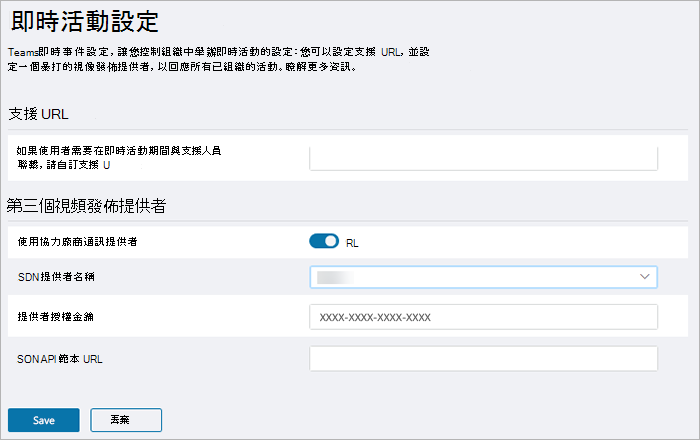
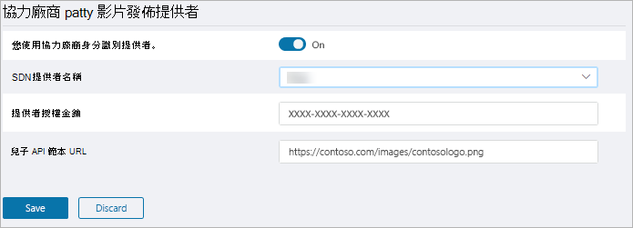

# <a name="configure-live-event-settings-in-microsoft-teams"></a><span data-ttu-id="12d4b-103">在 Microsoft Teams 中設定即時活動設定</span><span class="sxs-lookup"><span data-stu-id="12d4b-103">Configure live event settings in Microsoft Teams</span></span>

<span data-ttu-id="12d4b-104">使用 Teams 即時活動設定來設定貴組織中舉辦的即時活動設定。</span><span class="sxs-lookup"><span data-stu-id="12d4b-104">Use Teams live events settings to configure settings for live events that are held in your organization.</span></span> <span data-ttu-id="12d4b-105">您可以設定支援 URL，並設定協力廠商影片發佈提供者。</span><span class="sxs-lookup"><span data-stu-id="12d4b-105">You can set up a support URL and configure a third-party video distribution provider.</span></span> <span data-ttu-id="12d4b-106">這些設定會適用于組織中建立的所有即時活動。</span><span class="sxs-lookup"><span data-stu-id="12d4b-106">These settings apply to all live events that are created in your organization.</span></span>

<span data-ttu-id="12d4b-107">您可以在 Microsoft Teams 系統管理中心輕鬆管理這些設定。</span><span class="sxs-lookup"><span data-stu-id="12d4b-107">You can easily manage these settings in the Microsoft Teams admin center.</span></span> <span data-ttu-id="12d4b-108">在左側流覽中，前往 **會議**  >  **即時活動設定**。</span><span class="sxs-lookup"><span data-stu-id="12d4b-108">In the left navigation, go to **Meetings** > **Live events settings**.</span></span>

<span data-ttu-id="12d4b-109"></span><span class="sxs-lookup"><span data-stu-id="12d4b-109"></span></span>

## <a name="set-up-event-support-url"></a><span data-ttu-id="12d4b-110">設定事件支援 URL</span><span class="sxs-lookup"><span data-stu-id="12d4b-110">Set up event support URL</span></span>

<span data-ttu-id="12d4b-111">此 URL 會顯示給即時活動出席者。</span><span class="sxs-lookup"><span data-stu-id="12d4b-111">This URL is shown to live event attendees.</span></span> <span data-ttu-id="12d4b-112">新增貴組織的支援 URL，讓出席者在即時活動中與支援人員聯繫。</span><span class="sxs-lookup"><span data-stu-id="12d4b-112">Add the support URL for your organization to give attendees a way to contact support during a live event.</span></span>

### <a name="an-icon-showing-the-microsoft-teams-logo-using-the-microsoft-teams-admin-center"></a> <span data-ttu-id="12d4b-114">使用 Microsoft Teams 系統管理中心</span><span class="sxs-lookup"><span data-stu-id="12d4b-114">Using the Microsoft Teams admin center</span></span>

1. <span data-ttu-id="12d4b-115">在左側流覽中，前往 **會議**  >  **即時活動設定**。</span><span class="sxs-lookup"><span data-stu-id="12d4b-115">In the left navigation, go to **Meetings** > **Live event settings**.</span></span>
2. <span data-ttu-id="12d4b-116">在 **支援 URL** 下，輸入貴組織的支援 URL。</span><span class="sxs-lookup"><span data-stu-id="12d4b-116">Under **Support URL**, enter your organization's support URL.</span></span>

    <span data-ttu-id="12d4b-117"></span><span class="sxs-lookup"><span data-stu-id="12d4b-117"></span></span>

### <a name="using-windows-powershell"></a><span data-ttu-id="12d4b-118">使用 Windows PowerShell</span><span class="sxs-lookup"><span data-stu-id="12d4b-118">Using Windows PowerShell</span></span>

<span data-ttu-id="12d4b-119">執行下列操作：</span><span class="sxs-lookup"><span data-stu-id="12d4b-119">Run the following:</span></span>

```PowerShell
Set-CsTeamsMeetingBroadcastConfiguration -SupportURL “{your URL}”
```
<span data-ttu-id="12d4b-120">詳細資訊請參閱[Set-CsTeamsMeetingBroadcastConfiguration。](https://docs.microsoft.com/powershell/module/skype/set-csteamsmeetingbroadcastconfiguration?view=skype-ps)</span><span class="sxs-lookup"><span data-stu-id="12d4b-120">For more information, see [Set-CsTeamsMeetingBroadcastConfiguration](https://docs.microsoft.com/powershell/module/skype/set-csteamsmeetingbroadcastconfiguration?view=skype-ps).</span></span>
## <a name="configure-a-third-party-video-distribution-provider"></a><span data-ttu-id="12d4b-121">設定協力廠商影片發佈提供者</span><span class="sxs-lookup"><span data-stu-id="12d4b-121">Configure a third-party video distribution provider</span></span> 

<span data-ttu-id="12d4b-122">如果您透過 Microsoft 影片傳遞合作夥伴購買並設定軟體定義的網路 (SDN) 解決方案或企業內容傳遞網路 (eCDN) 解決方案，請設定 Teams 中的即時活動提供者。</span><span class="sxs-lookup"><span data-stu-id="12d4b-122">If you purchased and set up a software defined network (SDN) solution or enterprise content delivery network (eCDN) solution through a Microsoft video delivery partner, configure the provider for live events in Teams.</span></span> 

### <a name="an-icon-showing-the-microsoft-teams-logo-using-the-microsoft-teams-admin-center"></a> <span data-ttu-id="12d4b-124">使用 Microsoft Teams 系統管理中心</span><span class="sxs-lookup"><span data-stu-id="12d4b-124">Using the Microsoft Teams admin center</span></span>

1. <span data-ttu-id="12d4b-125">在左側流覽中，前往 **會議**  >  **即時活動設定**。</span><span class="sxs-lookup"><span data-stu-id="12d4b-125">In the left navigation, go to **Meetings** > **Live event settings**.</span></span>
2. <span data-ttu-id="12d4b-126">在 **協力廠商視訊發佈提供者下**，完成下列操作：</span><span class="sxs-lookup"><span data-stu-id="12d4b-126">Under **Third-party video distribution providers**, complete the following:</span></span> 

    <span data-ttu-id="12d4b-127"></span><span class="sxs-lookup"><span data-stu-id="12d4b-127"></span></span>

    - <span data-ttu-id="12d4b-128">**使用協力廠商發佈提供者** 開啟此選項以啟用協力廠商視音訊發佈提供者。</span><span class="sxs-lookup"><span data-stu-id="12d4b-128">**Use a third-party distribution provider** Turn this on to enable the third-party video distribution provider.</span></span>
    - <span data-ttu-id="12d4b-129">**SDN 提供者名稱** 選擇您目前使用的提供者。</span><span class="sxs-lookup"><span data-stu-id="12d4b-129">**SDN provider name** Choose the provider you're using.</span></span>
    - <span data-ttu-id="12d4b-130">**提供者授權金鑰** 輸入您從提供者連絡人獲得授權識別碼。</span><span class="sxs-lookup"><span data-stu-id="12d4b-130">**Provider license key** Enter the license ID that you got from your provider contact.</span></span>
    - <span data-ttu-id="12d4b-131">**SDN API 範本 URL** 輸入您從提供者連絡人獲得之 API 範本 URL。</span><span class="sxs-lookup"><span data-stu-id="12d4b-131">**SDN API template URL** Enter the API template URL that you got from your provider contact.</span></span>

### <a name="using-windows-powershell"></a><span data-ttu-id="12d4b-132">使用 Windows PowerShell</span><span class="sxs-lookup"><span data-stu-id="12d4b-132">Using Windows PowerShell</span></span>
<span data-ttu-id="12d4b-133">從提供者連絡人取得授權識別碼或 API 權杖和 API 範本，然後根據您使用的提供者執行下列其中一項：</span><span class="sxs-lookup"><span data-stu-id="12d4b-133">Get the license ID or API token and API template from your provider contact, and then run one of the following, depending on the provider you're using:</span></span>

<span data-ttu-id="12d4b-134">**蜂巢**</span><span class="sxs-lookup"><span data-stu-id="12d4b-134">**Hive**</span></span> 
```PowerShell
Set-CsTeamsMeetingBroadcastConfiguration -AllowSdnProviderForBroadcastMeeting $True -SdnProviderName hive -SdnLicenseId {license ID GUID provided by Hive} -SdnApiTemplateUrl “{API template URL provided by Hive}”
```
<span data-ttu-id="12d4b-135">**Kollective**</span><span class="sxs-lookup"><span data-stu-id="12d4b-135">**Kollective**</span></span> 
```PowerShell
Set-CsTeamsMeetingBroadcastConfiguration -AllowSdnProviderForBroadcastMeeting $True -SdnProviderName kollective -SdnApiTemplateUrl "{API template URL provided by Kollective}" -SdnApiToken {API token GUID provided by Kollective}
```
<span data-ttu-id="12d4b-136">**河床**</span><span class="sxs-lookup"><span data-stu-id="12d4b-136">**Riverbed**</span></span> 
```PowerShell
Set-CsTeamsMeetingBroadcastConfiguration -AllowSdnProviderForBroadcastMeeting $True -SdnProviderName riverbed -SdnApiTemplateUrl "{API template URL provided by Riverbed}" -SdnApiToken {API token GUID provided by Riverbed}
```

<span data-ttu-id="12d4b-137">詳細資訊請參閱[Set-CsTeamsMeetingBroadcastConfiguration。](https://docs.microsoft.com/powershell/module/skype/set-csteamsmeetingbroadcastconfiguration?view=skype-ps)</span><span class="sxs-lookup"><span data-stu-id="12d4b-137">For more information, see [Set-CsTeamsMeetingBroadcastConfiguration](https://docs.microsoft.com/powershell/module/skype/set-csteamsmeetingbroadcastconfiguration?view=skype-ps).</span></span>

> [!NOTE]
> <span data-ttu-id="12d4b-138">如果您打算使用外部 App 或裝置建立即時活動，您也需要使用 Microsoft Stream 設定 [eCDN 提供者](https://docs.microsoft.com/stream/network-caching)。</span><span class="sxs-lookup"><span data-stu-id="12d4b-138">If you plan to create live events using an external app or device, you'll also need to [configure your eCDN provider with Microsoft Stream](https://docs.microsoft.com/stream/network-caching).</span></span> 

>[!Note]
> <span data-ttu-id="12d4b-p104">從使用 Microsoft Stream 變更為使用[商務用 OneDrive 和 SharePoint 來進行會議錄製](../tmr-meeting-recording-change.md)，將會採取階段性的方式。推出時您將可以加入此體驗。在 11 月，如果您想要繼續使用 Stream，則必須退出體驗。在 2021 年初的某個時候，我們將要求所有客戶對新會議錄製使用商務用 OneDrive 和 SharePoint。</span><span class="sxs-lookup"><span data-stu-id="12d4b-p104">The change from using Microsoft Stream to [OneDrive for Business and SharePoint for meeting recordings](../tmr-meeting-recording-change.md) will be a phased approach. At launch you'll be able to opt-in to this experience, in November you'll have to opt-out if you want to continue using Stream, and some time in early 2021 we'll require all customers to use OneDrive for Business and SharePoint for new meeting recordings.</span></span>

### <a name="related-topics"></a><span data-ttu-id="12d4b-141">相關主題</span><span class="sxs-lookup"><span data-stu-id="12d4b-141">Related topics</span></span>
- [<span data-ttu-id="12d4b-142">什麼是 Teams 即時活動？</span><span class="sxs-lookup"><span data-stu-id="12d4b-142">What are Teams live events?</span></span>](what-are-teams-live-events.md)
- [<span data-ttu-id="12d4b-143">Teams 即時活動的方案</span><span class="sxs-lookup"><span data-stu-id="12d4b-143">Plan for Teams live events</span></span>](plan-for-teams-live-events.md)
- [<span data-ttu-id="12d4b-144">設定 Teams 即時活動</span><span class="sxs-lookup"><span data-stu-id="12d4b-144">Set up for Teams live events</span></span>](set-up-for-teams-live-events.md)
