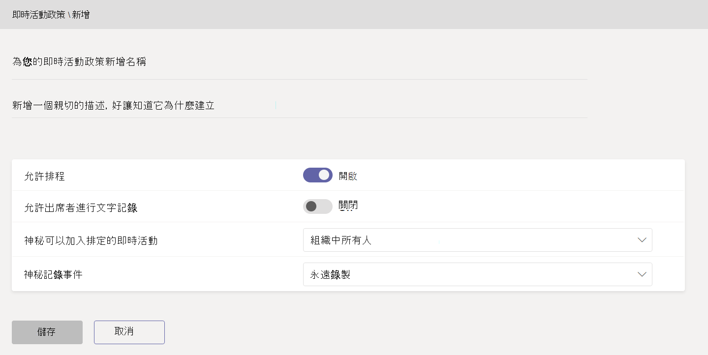

# 在 Microsoft Teams 中設定即時活動

設定即時活動時，您必須採取幾個步驟。

## 步驟 1：在 Teams 中針對即時活動設定您的網路

在 Teams 中產生的即時活動，需要您[針對 Teams 準備組織的網路](../prepare-network.md)。  

## 步驟 2：取得和指派授權

確保您擁有[可建立及排程即時活動的人員](plan-for-teams-live-events.md#who-can-attend-create-and-schedule-live-events)和[可監視即時活動的人員](plan-for-teams-live-events.md#who-can-watch-live-events)的正確授權指派。

## 步驟 3：設定即時活動原則

即時活動原則是用來控制組織中的哪些人員可以舉辦即時活動，以及在他們所建立活動中可用的功能。 您可以使用預設原則或建立一或多個自訂即時活動原則。 建立自訂原則之後，請將它指派給組織中一個或一組使用者。

> [!NOTE]
> 除非您建立並指派自訂原則，否則貴組織中的使用者會獲得全域 (組織的預設) 原則。 依預設在全域原則中，會為 Teams 使用者啟用即時活動排程，關閉即時的輔助字幕和翻譯字幕 (謄寫)，組織中的每個人都可以加入即時活動，且錄製設定設為永遠錄製。

### 建立或編輯即時活動原則

1. 在 Microsoft Teams 系統管理中心的左側導覽畫面中，移至 **[會議**  >  **即時活動原則**  >  **管理原則]** 索引標籤。
2. 執行下列其中一個選項：

    - 如果要編輯現有的預設原則，請選擇 **[全域 (全組織預設值)]**。
    - 如果您想要建立新的自訂原則，請選擇 **[+新增]**。
    - 如果要編輯自訂原則，請選取該原則，然後選擇 **[編輯]**。

    以下是您可以根據組織需求變更的設定。

    

|設定  |描述  |
|---------|---------|
|**標題**     |這是顯示在即時活動原則頁面上的原則標題。 不能超過 64 個字元或含有任何特殊字元。          |
|**描述**    |使用此項目來新增原則的易記描述。         |
|**即時活動排程**     |開啟此功能可讓組織中的使用者在 Teams 中建立及排程即時活動。 請注意，如果您希望使用者排程由外部應用程式或裝置產生的即時活動，您必須執行其他步驟。 若要深入了解，請參閱[讓使用者能夠排程使用外部應用程式或裝置所產生的活動](#enable-users-to-schedule-events-that-were-produced-with-an-external-app-or-device)。     |
|**出席者的轉譯** |此設定只能套用至在 Teams 中產生的活動。 開啟此功能可讓即時活動出席者在活動期間查看即時輔助字幕和翻譯字幕。         |
|**誰可加入已排程的即時活動**    |選擇下列其中一項。  **每個人**：使用者可以建立每個人 (包括組織外部人員) 都可以出席的即時活動。 當使用者排程即時活動時，此設定會在 Teams 中啟用 **公用** 權限類型。  **組織中的每個人**：使用者可以建立組織中的人員 (包括新增至您組織的 [來賓使用者](../add-guests.md)) 可以出席的即時活動。 使用者無法建立由匿名使用者出席的即時活動。 當使用者排程即時活動時，此設定會在 Teams 中啟用 **全組織** 權限類型。  **特定使用者或群組**：使用者可以建立只有組織中特定使用者或群組可以出席的即時活動。 使用者無法建立由組織中的每個人或匿名使用者出席的即時活動。 當使用者排程即時活動時，此設定會在 Teams 中啟用 **人員及群組** 權限類型。       |
|**錄製設定**        | 此設定只能套用至在 Teams 中產生的活動。 選擇下列其中一項。    **永遠錄製**：永遠會錄製使用者建立的即時活動。 活動結束之後，活動團隊成員可以下載錄製，而出席者可以觀看活動。   **永不錄製**：永不錄製使用者建立的即時活動。  **召集人可否錄製**：使用者可以決定是否要錄製即時活動。 如果有錄製，活動結束之後，活動團隊成員可以下載錄製，而出席者可以觀看活動。

您也可以使用 Windows PowerShell 執行此動作，而且目前 GCC High 和 DoD 客戶必須使用此方法。 如需詳細資訊，請參閱[使用 PowerShell 在 Teams 中設定即時活動原則](set-teams-live-events-policies-using-powershell.md)。

### 將即時活動原則指派給使用者

如果您建立了自訂即時活動原則，請將它指派給使用者，讓原則成為使用中。   [!INCLUDE [assign-policy](../includes/assign-policy.md)]

### 讓使用者能夠排程使用外部應用程式或裝置所產生的活動

若要讓使用者排程使用外部應用程式或裝置製作的活動，您也必須執行下列步驟：

1. 為組織中的使用者啟用 Microsoft Stream。 Stream 可做為符合資格的 Microsoft 365 或Office 365訂閱或獨立服務的一部分提供。 Stream 未包含在商務基本版或商務進階版方案中。 如需詳細資訊，請參閱 [Stream 授權概觀](/stream/license-overview)。

   >[!Note]
   > 從使用 Microsoft Stream 到變更為使用[商務用 OneDrive 和 SharePoint 來進行會議錄製](../tmr-meeting-recording-change.md)，將會採取階段性的方式。 剛開始時，您可以加入這項體驗，在 11 月如果您想要繼續使用 Stream，則必須退出體驗，而在 2021 初期的某時間，我們將要求所有客戶使用商務用 OneDrive 和 SharePoint 來進行新的會議錄製。 深入瞭解如何 [**指派授權給使用者**](https://support.office.com/article/Assign-licenses-to-users-in-Office-365-for-business-997596B5-4173-4627-B915-36ABAC6786DC) ，讓使用者能夠存取 Stream。 請確定 [**不會依照本文**](/stream/disable-user-organization)所定義，封鎖使用者的 Stream。

2. 確保使用者擁有在 Stream 中建立即時活動的權限。 根據預設，系統管理員可以使用外部應用程式或裝置來建立活動。 Stream 系統管理員可以在 Stream 中[為額外的使用者啟用即時活動建立](/stream/live-event-administration#restrict-who-can-create-events)。

3. 確保即時活動召集人已同意 Stream 系統管理員設定的公司原則。如果 Stream 系統管理員已[設定公司指導方針原則](/stream/company-policy-and-consent)，並要求員工在儲存內容之前先接受此原則，則使用者必須先接受，才能在 Teams 中建立即時活動 (使用外部應用程式或裝置)。 在組織中推出即時事件功能之前，請確認將建立這些即時活動的使用者已同意該原則。

## 步驟 4：在 Teams 中針對即時活動設定視訊發佈解決方案

播放即時活動視訊會使用的自適性串流 (ABR)，但它是單點廣播串流，表示每個檢視器都會從網際網路取得自己的視訊。 針對向外傳送給組織中大多數的即時活動或視訊，檢視器可能會明顯耗用大量網際網路頻寬。 對於想要減少即時活動的網際網路流量的組織，Microsoft提供第一方解決方案[，Microsoft eCDN](/ecdn) (企業內容傳遞網路) 。 即時活動解決方案也與Microsoft信任的影片傳遞合作夥伴整合，提供軟體定義的網路 (SDN) 或 eCDN。 這些 SDN/eCDN 平臺可讓組織優化網路頻寬，而不需要犧牲使用者檢視體驗。 這些解決方案可協助您在整個商業網路上進行更可縮放且更有效率的視訊發佈。

- **Microsoft eCDN** Microsoft eCDN 已整合至 Teams，並且與 Stream 和 Yammer 相容。 它在公司網路中採用對等技術，以從 WAN 連線卸載頻寬。

- **在 Teams 以外購買和設定您的解決方案** 運用 Microsoft 信任的視訊傳遞合作夥伴，獲得擴大視訊傳遞的專家協助。 

下列 SDN/eCDN 解決方案已預先整合，且可設定以搭配 Stream 使用。

- **Hive Streaming** 為即時且隨選的企業視訊發佈提供簡單且功能強大的解決方案。 Hive 是一項軟體型解決方案，不需要額外的硬體或頻寬，並可提供一個安全的方式讓您啟用數千個同時使用的視訊檢視器，而不會影響您的網路。 針對想要在購買 SDN/eCDN 解決方案之前了解視訊對其網路的影響的客戶，Hive Streaming 也為 Microsoft 客戶提供瀏覽器型分析解決方案。 [深入了解](https://www.hivestreaming.com/partners/integration-partners/microsoft/)。

- **Kollective** 是雲端型智慧對等通訊平臺，可運用您現有的網路基礎結構，以多種形式提供內容， (即時串流視訊、隨選視訊、軟體更新、安全性修補程式，以及更快速、更可靠且頻寬較少的) 。 我們的安全平台受到世界上最大的金融機構信任，且不需要額外的硬體，且設定和維護極為簡單。 [深入了解](https://kollective.com/microsoft-pilot/)。

- **Ramp** 提供通用的 eCDN 解決方案，可提供安全無瑕疵的視訊傳遞。 由頂級財務、醫療保健和政府機構所信任，Ramp 會在雲端或混合式部署內部部署，非常適合零信任環境。 我們的通用授權包含所有三種 eCDN 傳遞方法， (P2P、Multicast 和快取) ，確保您的即時串流和隨選影片以最高品質提供，並以最低頻寬影響來保護共用公司網路的商務關鍵應用程式。 [深入了解](https://rampecdn.com/)。

- **Riverbed** 是網路優化的業界標準，它正將加速解決方案延伸至 Microsoft Teams 和 Stream。  現在Microsoft 365 位客戶可以安心地加速 365 個流量，包括 Teams 和 Stream，以及豐富的其他前導企業 SaaS 服務，以隨時隨地提高員工生產力。 Teams 和 Stream 加速可透過隨附于 Riverbed 世界級支援與持續投資的所有保證輕鬆設定來啟用。

> [!NOTE]
> 如果您選擇協力廠商 SDN 或 eCDN 解決方案，則會受到所選 **協力廠商提供者的服務條款和隱私權原則** 所規範，這將會規範您對提供者解決方案的使用。 您對提供者解決方案的使用方式將不受限於 Microsoft 大量授權條款或線上服務條款。 如果您不同意 **協力廠商提供者的條款**，則不要在 Teams 中啟用該解決方案。

設定了 SDN 或 eCDN 解決方案之後，您就可以開始為 Teams 中的即時活動設定提供者。

## 後續步驟

前往[在 Teams 中設定即時活動設定](configure-teams-live-events.md)。

### 相關主題

- [什麼是 Teams 即時活動？](what-are-teams-live-events.md)
- [Teams 即時活動的規劃](plan-for-teams-live-events.md)
- [在 Teams 中設定即時活動設定](configure-teams-live-events.md)
