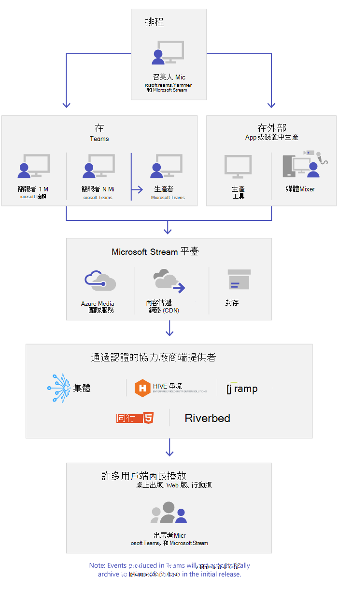
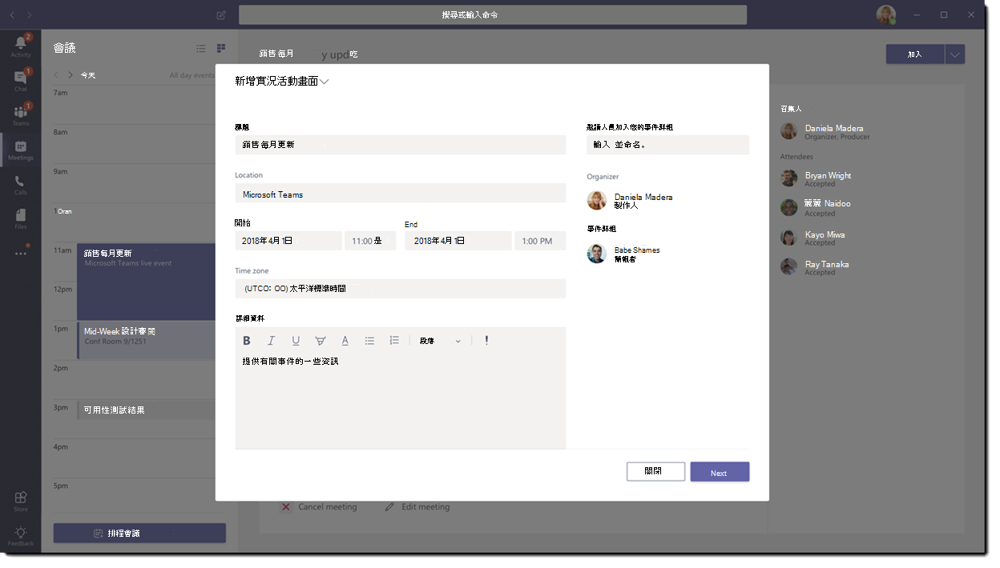

# 什麼是 Microsoft Teams 即時活動

## 概觀

透過 Teams 即時活動，組織中的使用者可將影片和會議內容廣播給廣大的線上觀眾。

Microsoft 365 即時活動將即時影片串流帶到新的層次。 即時活動鼓勵與出席者在即時期間和之後建立整個參與期間的聯繫。 無論觀眾、團隊或社群位於何處，都可以使用 Teams 或 Yammer 建立即時活動。  

Teams 提供聊天式的共同作業、通話、會議和即時活動，因此您可以擴大會議的觀眾。 Teams 即時活動是 Teams 會議的擴充功能，可讓使用者向大量線上觀眾廣播影片和會議內容。 即時活動特別適合一對多通訊，其中活動的主持人會引導互動，而觀眾的參與主要是觀看主持人分享的內容。 出席者可以在 Yammer 或 Teams 中觀看即時或錄製的活動，並可使用管理的 Q & A 或 Yammer 交談與簡報者互動。

So, let's get started. First, take a look at the following diagram that shows high level components involved in Microsoft 365 live events and how they're connected.

> [!NOTE]
> 我們想強調，由於廣播技術的本質，Teams 即時活動通常超過一般 (內部) 會議人數。
>
> 就像其他較大型的媒體廣播服務一樣，我們依賴內容傳遞網路將即時活動的內容傳送給收件者。 此內容受加密方法保護，並受存取權杖授權所限制，這些權杖只會根據您的即時活動會議設定發給收件者。
>
> 請特別小心確認會議內容適合如此大量的觀眾，或者確認觀眾數量適合敏感性內容。  
>
> 就像業界中常見的情況一樣，對安全的其他元素 (例如人員或基礎結構) 的危害，可能會影響即時活動的安全性。 組織在安全性規劃和練習中應考慮納入即時活動和其他廣播服務。

### 活動群組角色

Teams 中的即時活動賦予多個角色 (召集人、製作人、簡報者和出席者) 成功廣播並參與活動的權力。 若要深入了解，請參閱[活動群組角色](https://support.office.com/article/get-started-with-microsoft-teams-live-events-d077fec2-a058-483e-9ab5-1494afda578a?ui=en-US&rs=en-US&ad=US#bkmk_roles)。

## 主要元件

從上方圖片中，您可以看見五個與 Teams 即時活動一起使用的主要元件。

> [!NOTE]
> 如需如何設定即時活動與出席者體驗的概觀，請觀賞這些簡短的[影片](https://support.office.com/article/video-plan-and-schedule-a-live-event-f92363a0-6d98-46d2-bdd9-f2248075e502)。

### 排程

Teams 可讓召集人建立採用適當參與者權限的活動、指定活動小組成員、選取生產方法，以及邀請參與者。 如果即時活動是從 Yammer 群組內建立的，則即時活動參與者將可以使用 Yammer 交談與活動中的人員互動。

> [!IMPORTANT]
> 當使用者離線或以有限頻寬執行時，Teams 不會讓使用者排程會議或即時活動。

### 產生

影片輸入是即時活動的基礎，從單一網路攝影機到多相機專業影片製作，可能會有所不同。 Microsoft 365 中的即時活動支援各種產生案例，包括在 Teams 中使用網路攝影機產生的活動，或在外部應用程式或裝置中產生的活動。 您可以根據專案需求與預算選擇這些選項。 產生活動的方法有兩種：

- **Teams**：此產生方法可讓使用者在 Teams 中使用網路相機或從 Teams 會議室系統使用 A/V 輸入，產生即時活動。 如果您想要使用連接到電腦的音訊和視訊裝置，或邀請遠端簡報者參與活動，這是最佳且最快的選項。 此選項可讓使用者輕鬆地使用網路攝影機，並分享螢幕做為活動中的輸入。

- **Teams 編碼器**：允許使用者使用 [Teams](../teams-stream-overview.md)直接從外部硬體或軟體型編碼器產生即時活動。 如果您已經有支援串流到即時訊息通訊協定 (RTMP) 服務的工作室品質設備 (例如媒體混音器)，這是最佳選項。 這種類型的製作通常用於大型活動，例如市政府，將媒體混音器的單一串流廣播給觀眾。

    

### 串流平台

即時活動串流平台由下列項目組成：

- **Azure 媒體服務**：[Azure 媒體服務](/azure/media-services/previous/)提供您廣播品質的視訊串流服務，透過現今最熱門的行動裝置接觸更多觀眾。 媒體服務可增強協助工具、發佈和擴充性，以輕鬆且經濟地將內容串流到您當地或全球的觀眾，同時保護您的內容。
- **Azure 內容傳遞網路 (CDN)**：一旦串流進入直播，它會透過 [Azure 內容傳遞網路 (CDN)](/azure/cdn/)傳遞。 Azure 媒體服務為串流端點提供整合式 CDN。 這可讓串流在全球各地觀賞，無需緩衝處理。

### 企業內容傳遞網路 (eCDN)

eCDN 的目標是從網際網路拍攝影片內容，並將內容發佈至整個企業，而不會影響網路效能。 您可以使用 [Microsoft 第一方 eCDN 解決方案](/ecdn) ，或是下列其中一個認證的 eCDN 合作夥伴，針對組織內舉行的即時活動優化您的網路：

- [Hive](https://www.hivestreaming.com/partners/integration-partners/microsoft/)
- [Kollective](https://kollective.com/ecdn-solutions/microsoft-live-events/)
- [Ramp](https://rampecdn.com)
- [Riverbed](https://www.riverbed.com/solutions/office-365.html)

### 出席者體驗

出席者體驗是即時活動最重要的層面，出席者必須能參與即時活動，而沒有任何問題。 出席者體驗會針對在 Teams) 和 Azure Media Player (中製作的活動使用 Teams (，以用於外部應用程式或裝置) 中產生的活動，並可跨桌上型電腦、瀏覽器和行動裝置 (iOS、Android) 使用。 Microsoft 365 和 Office 365 提供 Yammer 和 Teams 作為兩個共同作業中樞，而即時出席者體驗已整合到這些共同作業工具中。

### 即時活動使用情況報告

租用戶系統管理員可以在 Microsoft Teams 系統管理中心檢視即時活動的即時使用情況分析。  [即時活動使用情況報告](../teams-analytics-and-reports/teams-live-event-usage-report.md)顯示組織中所舉辦即時活動的活動概觀。  系統管理員可以檢視活動使用情況資訊，包括活動狀態、開始時間、觀看數及產生類型。  

## 後續步驟

移至[規劃 Teams 即時活動](plan-for-teams-live-events.md)。

### 相關主題

- [開始使用 Microsoft Teams 即時活動](https://support.office.com/article/d077fec2-a058-483e-9ab5-1494afda578a)
- [Yammer 中的即時活動](https://support.office.com/article/live-events-in-yammer-4ece0ee2-c268-4636-bf2a-16e454befe57)
- [Microsoft Teams 中的即時串流活動](../teams-stream-overview.md)
