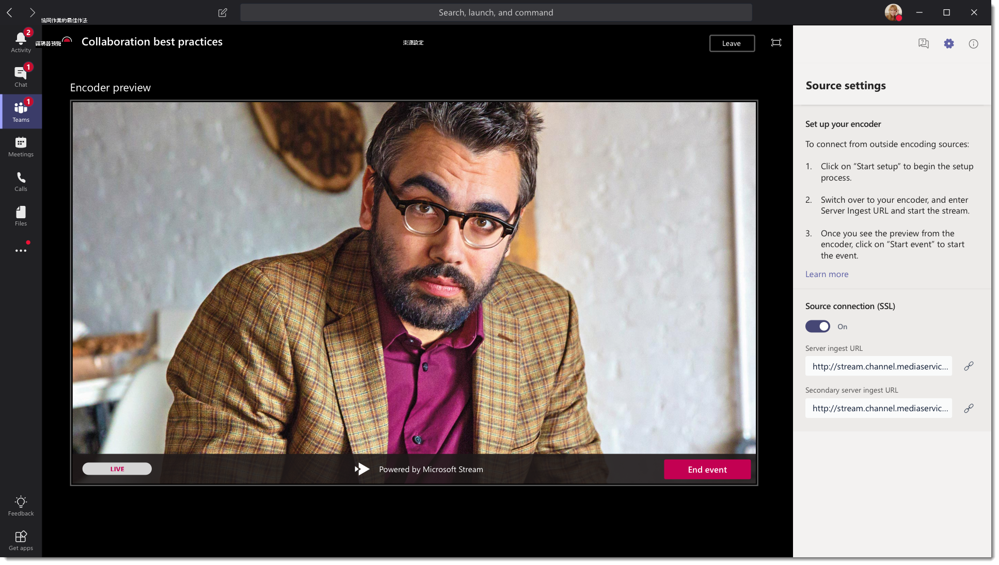
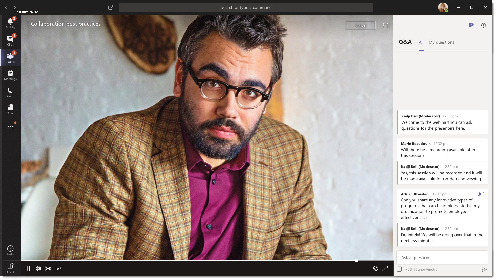

# 什麼是 Microsoft 團隊即時事件？

## 概觀

您組織中的使用者可以使用小組即時活動，將影片和會議內容廣播至大型的線上觀眾。 

Microsoft 365 live 事件會將即時影片資料流程傳送到新的階層，在整個專案週期中與出席者之前、期間及之後的參與者進行即時的連線。 您可以使用 Microsoft Stream、團隊或 Yammer，在您的物件、團隊或社區所駐留的任何位置建立即時活動。  

小組提供聊天的共同作業、通話、會議及即時事件，讓您可以擴大會議物件。 團隊即時事件是團隊會議的延伸，可讓使用者將影片和會議內容廣播至大型線上物件。 這些是針對一對多通訊，在這種情況下，會將事件主機的互動與聽眾參與主要用於查看由主機共用的內容。 出席者可以在 Yammer、團隊和/或串流中觀看即時或錄製的事件，而且可以使用 & 或 Yammer 交談的 [中繼問答] 與簡報者互動。

團隊即時事件會被視為下次版本的 Skype 會議廣播，並會最終取代 Skype 會議廣播中提供的功能。 此時，Microsoft 將針對在組織中使用商務用 Skype 的使用者繼續支援 Skype 會議廣播，不會中斷新的或未來事件的服務。 不過，我們鼓勵您試用團隊即時事件，以利用所有全新且激動人心的功能，包括螢幕共用及外部硬體/軟體編碼器支援。

所以，讓我們開始吧。 首先，請參閱下列圖表，其中顯示 Microsoft 365 live 事件中所涉及的高層元件，以及它們的連線方式。 

### 事件群組角色
團隊中的即時事件可讓多個角色（召集人、製造者、簡報者和出席者）順利廣播並參與活動。 若要深入瞭解，請參閱[事件群組角色](https://support.office.com/article/get-started-with-microsoft-teams-live-events-d077fec2-a058-483e-9ab5-1494afda578a?ui=en-US&rs=en-US&ad=US#bkmk_roles)。

## 主要元件
您可以從上述圖片看到，有四個主要元件與團隊中的即時事件搭配使用。

> [!NOTE]
> 如需如何設定即時事件和出席者體驗的概覽，請查看這些[短片。](https://support.office.com/article/video-plan-and-schedule-a-live-event-f92363a0-6d98-46d2-bdd9-f2248075e502)

### 排程
團隊能讓召集人使用適當的出席者許可權來建立事件、指派事件小組成員、選取生產方法，以及邀請出席者。 如果即時事件是從 Yammer 群組中建立，則即時活動出席者就能使用 Yammer 交談來與事件中的人員互動。 

![顯示 [新增即時事件] 畫面的螢幕擷取畫面](../media/teams-live-events-schedule.png "顯示 [新增即時事件] 畫面的螢幕擷取畫面，可用於建立及排程新的即時事件")

### 出具
影片輸入是即時事件的基礎，且可能會因單一網路攝影機而異。 Microsoft 365 中的即時事件支援多種產品案例，包括使用網路攝影機或外部 app 或裝置產生的事件在小組中產生的事件。 您可以根據專案需求與預算來選擇這些選項。 產生事件的方式有兩種：

- **團隊**：此生產方法可讓使用者使用其網路攝影機在團隊中產生即時事件，或使用來自團隊室系統的/V 輸入。 如果您想要使用連線到電腦的音訊和視頻裝置，或邀請遠端簡報者參與事件，此選項是最佳且最快速的選項。 這個選項可讓使用者輕鬆地使用網路攝像機，並在事件中共用其螢幕作為輸入。 

    

- **外部 app 或裝置**：外部編碼器可讓使用者直接從含[資料流程](https://stream.microsoft.com)的外部硬體或軟體編碼器產生即時事件。 如果您已經有錄音室品質的裝置（例如媒體 mixers），且支援資料流程到即時訊息通訊協定（RTMP）服務，則此選項是最佳做法。 這種類型的生產通常用於大型小性事件（例如 executive 城鎮 halls），其中單一資料流程會將媒體混音器廣播給物件。 

    

### 流式平臺
即時事件流程平臺是由下列各部分組成：

- **Azure 媒體服務**： [azure 媒體服務](https://docs.microsoft.com/azure/media-services/previous/)可讓您在當今最受歡迎的行動裝置上，為您提供廣播品質的視頻流式處理服務，以達到較大的目標。 媒體服務可增強協助工具、發佈和伸縮性，並能讓您輕鬆且經濟高效地將內容資料流程傳遞給您當地或全球的目標物件，同時保護您的內容。
- **Azure 內容傳遞網路（CDN）**：一旦您的資料流程生效，就會透過[Azure 內容傳遞網路（CDN）](https://docs.microsoft.com/azure/cdn/)傳送。 Azure 媒體服務提供整合式 CDN 以進行流式處理端點。 這可讓資料流程在全球查看，不含緩衝。

### 企業內容傳遞網路（eCDN）
ECDN 的目的是從網際網路取得影片內容，並在整個企業中散佈內容，而不會影響網路效能。 您可以使用下列其中一個認證的 eCDN 合作夥伴來針對貴組織內的即時事件優化您的網路：
- [一兩](https://www.hivestreaming.com/partners/integration-partners/microsoft/)
- [Kollective](https://kollective.com/ecdn-solutions/microsoft-live-events/)
- [向](http://www.ramp.com)

### 出席者體驗 
出席者體驗是即時事件最重要的部分，而且很重要的是，出席者不需要任何問題，也能參與即時事件。 出席者體驗會使用串流播放程式（適用于團隊中產生的事件）和 Azure 媒體播放機（適用于外部 app 或裝置中產生的事件），並可跨桌面、瀏覽器和行動裝置（iOS、Android）運作。 Office 365 提供 Yammer 和團隊作為兩個共同作業中樞，且即時出席者體驗會整合到這些共同作業工具中。 

### 即時事件使用量報告 
租使用者管理員可以在 Microsoft 團隊系統管理中心中查看即時事件的即時使用狀況分析。  [[即時事件使用量] 報告](../teams-analytics-and-reports/teams-live-event-usage-report.md)會顯示組織中的即時事件的活動概覽。  系統管理員可以查看事件使用量資訊，包括事件狀態、開始時間、視圖和生產類型。  

## 後續步驟
移至 [[規劃小組即時事件](plan-for-teams-live-events.md)]。

### 相關主題
- [在 Yammer、Microsoft 團隊及 Microsoft Stream 中跨 Microsoft 365 的即時事件](https://docs.microsoft.com/stream/live-event-m365)
- [Microsoft 團隊即時活動快速入門](https://support.office.com/article/d077fec2-a058-483e-9ab5-1494afda578a)
- [Yammer 中的即時事件](https://support.office.com/article/live-events-in-yammer-4ece0ee2-c268-4636-bf2a-16e454befe57)
- [Microsoft Stream 中的即時事件](https://docs.microsoft.com/stream/live-event-overview)

 
