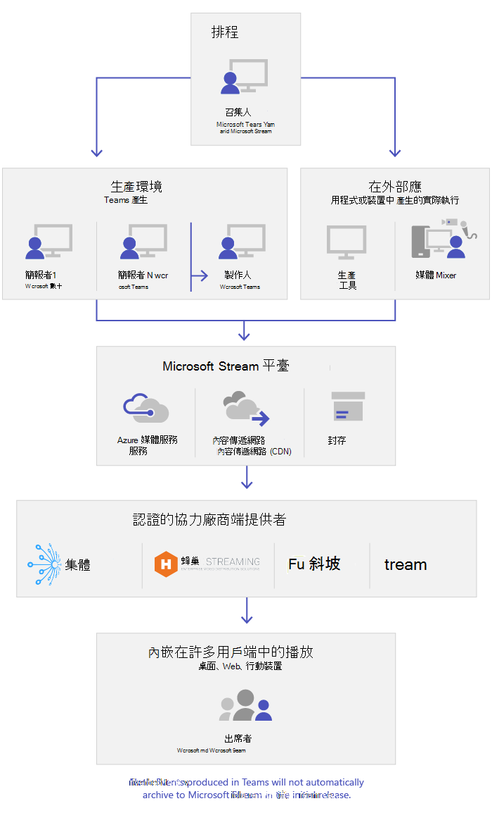

# 什麼是 Microsoft 團隊即時事件What are Microsoft Teams live events

## 概觀Overview

隨著團隊生活活動，貴組織中的使用者可以將影片和會議內容廣播至大型的線上觀眾。With Teams lives events, users in your organization can broadcast video and meeting content to large online audiences.

Microsoft 365 live 事件會將即時影片資料流程傳送到新的層級。Microsoft 365 live events bring live video streaming to a new level. 即時事件在整個參與期間，以及在即時事件期間和之後，都能鼓勵與出席者進行連線。Live events encourage connection throughout the entire engagement lifecycle with attendees before, during, and after live events. 您可以使用 Microsoft Stream、團隊或 Yammer，在您的物件、團隊或社區所駐留的任何位置建立即時活動。You can create a live event wherever your audience, team, or community resides, using Microsoft Stream, Teams, or Yammer.  

小組提供聊天的共同作業、通話、會議及即時事件，讓您可以擴大會議物件。Teams delivers chat-based collaboration, calling, meetings, and live events, so you can expand the audience of your meetings. 團隊即時事件是團隊會議的延伸，可讓使用者將影片和會議內容廣播至大型線上物件。Teams live events is an extension of Teams meetings, enabling users to broadcast video and meeting content to a large online audience. 即時事件是針對一對多通訊，在這種情況下，活動的主要目標是在互動與觀眾參與中，主要是要查看由主機共用的內容。Live events are meant for one-to-many communications where the host of the event is leading the interactions and audience participation is primarily to view the content shared by host. 出席者可以在 Yammer、團隊和/或串流中觀看即時或錄製的事件，而且可以使用 & 或 Yammer 交談的 [審查] Q 與簡報者互動。The attendees can watch the live or recorded event in Yammer, Teams, and/or Stream and can interact with the presenters using moderated Q & A or a Yammer conversation.

團隊即時事件會被視為下次版本的 Skype 會議廣播，並會最終取代 Skype 會議廣播中提供的功能。Teams live events are considered the next version of Skype Meeting Broadcast and will eventually replace the capabilities provided in Skype Meeting Broadcast. 此時，Microsoft 將針對在組織中使用商務用 Skype 的使用者繼續支援 Skype 會議廣播，不會中斷新的或未來事件的服務。At this point, Microsoft will continue to support Skype Meeting Broadcast for users who are using Skype for Business in their organizations, with no disruption in service for new or future events. 不過，我們鼓勵您試用團隊即時事件，以利用所有全新且激動人心的功能，包括螢幕共用及外部硬體/軟體編碼器支援。However, we encourage you to try out Teams live events to leverage all the new and exciting features including screen sharing and support for external hardware/software encoders.

所以，讓我們開始吧。So, let's get started. 首先，請參閱下列圖表，其中顯示 Microsoft 365 live 事件中所涉及的高層元件，以及它們的連線方式。First, take a look at the following diagram that shows high level components involved in Microsoft 365 live events and how they're connected.

### 事件群組角色Event group roles

團隊中的即時活動可讓您在召集人、製造者、簡報者和出席者) 中進行多個角色 (，以順利廣播並參與活動。Live events in Teams empowers multiple roles (organizer, producer, presenter, and attendee) to successfully broadcast and participate in an event. 若要深入瞭解，請參閱 [事件群組角色](https://support.office.com/article/get-started-with-microsoft-teams-live-events-d077fec2-a058-483e-9ab5-1494afda578a?ui=en-US&rs=en-US&ad=US#bkmk_roles)。To learn more, see [Event group roles](https://support.office.com/article/get-started-with-microsoft-teams-live-events-d077fec2-a058-483e-9ab5-1494afda578a?ui=en-US&rs=en-US&ad=US#bkmk_roles).

## 主要元件Key components

您可以從上述圖片看到，有四個主要元件與團隊中的即時事件搭配使用。You can see from the picture above that there are four key components that are used with live events in Teams.

> [!NOTE]
> 如需如何設定即時事件和出席者體驗的概覽，請查看這些[短片。](https://support.office.com/article/video-plan-and-schedule-a-live-event-f92363a0-6d98-46d2-bdd9-f2248075e502)For an overview of how to set up live events and the attendee experience, check out these short [videos](https://support.office.com/article/video-plan-and-schedule-a-live-event-f92363a0-6d98-46d2-bdd9-f2248075e502).

### 排程Scheduling

團隊能讓召集人使用適當的出席者許可權來建立事件、指派事件小組成員、選取生產方法，以及邀請出席者。Teams provides the ability for the organizers to create an event with the appropriate attendee permissions, designate event team members, select a production method, and invite attendees. 如果即時事件是從 Yammer 群組中建立，則即時活動出席者就能使用 Yammer 交談來與事件中的人員互動。If the live event was created from within a Yammer group, the live event attendees will be able to use Yammer conversation for interacting with people in the event.

![新的 [即時事件] 畫面](../media/teams-live-events-schedule.png "顯示 [新增即時事件] 畫面的螢幕擷取畫面，可用於建立及排程新的即時事件")

### 出具Production

影片輸入是即時事件的基礎，且可能會因單一網路攝影機而異。The video input is the foundation of the live event and it can vary from a single webcam to a multi-camera professional video production. Microsoft 365 中的即時事件支援多種產品案例，包括使用網路攝影機或外部 app 或裝置產生的事件在小組中產生的事件。The live events in Microsoft 365 support a spectrum of production scenarios, include an event produced in Teams using a webcam or an event produced in an external app or device. 您可以根據專案需求與預算來選擇這些選項。You can choose these options depending on their project requirements and budget. 產生事件的方式有兩種：There are two ways to produce events:

- **團隊** ：此生產方法可讓使用者使用其網路攝影機在團隊中產生即時事件，或使用來自團隊室系統的/V 輸入。**Teams** : This production method allows users to produce their live events in Teams using their webcam or using A/V input from Teams room systems. 如果您想要使用連線到電腦的音訊和視頻裝置，或邀請遠端簡報者參與事件，此選項是最佳且最快速的選項。This option is the best and quickest option if you want to use the audio and video devices connected to the PC or are inviting remote presenters to participate in the event. 這個選項可讓使用者輕鬆地使用網路攝像機，並在事件中共用其螢幕作為輸入。This option allows users to easily use their webcams and share their screen as input in the event.

    

- **外部 app 或裝置** ：外部編碼器可讓使用者直接從含 [資料流程](https://stream.microsoft.com)的外部硬體或軟體編碼器產生即時事件。**External app or device** : External encoders allow users to produce their live events directly from an external hardware or software-based encoder with [Stream](https://stream.microsoft.com). 如果您已經擁有錄音室品質的裝置，此選項就是最佳做法 (例如，媒體 mixers) 可支援資料流程到即時訊息通訊協定 (RTMP) service。This option is best if you already have studio quality equipment (for example, media mixers) which support streaming to a Real-time Messaging Protocol (RTMP) service. 這種類型的生產通常用在大規模事件（例如 executive 城鎮 halls）中，其中單一資料流程從媒體混音器廣播給物件。This type of production is typically used in large-scale events such as executive town halls – where a single stream from a media mixer is broadcasted to the audience.

    

>[!Note]
> 從使用 Microsoft Stream 到變更為使用[商務用 OneDrive 和 OneDrive 來進行會議錄製](../tmr-meeting-recording-change.md)，將會採取階段性的方式。The change from using Microsoft Stream to [OneDrive for Business and SharePoint for meeting recordings](../tmr-meeting-recording-change.md) will be a phased approach. 剛開始時，您可以加入這項體驗，在 11 月如果您想要繼續使用 Stream，則必須退出體驗，而在 2021 初期的某時間，我們將要求所有客戶使用商務用 OneDrive 和 SharePoint 來進行新的會議錄製。At launch you'll be able to opt-in to this experience, in November you'll have to opt-out if you want to continue using Stream, and some time in early 2021 we'll require all customers to use OneDrive for Business and SharePoint for new meeting recordings.

### 流式平臺Streaming platform

即時事件流程平臺是由下列各部分組成：The live event streaming platform is made up of the following pieces:

- **Azure 媒體服務** ：  [azure 媒體服務](https://docs.microsoft.com/azure/media-services/previous/) 可讓您在當今最受歡迎的行動裝置上，為您提供廣播品質的視頻流式處理服務，以達到較大的目標。**Azure Media Services** :  [Azure Media Services](https://docs.microsoft.com/azure/media-services/previous/) gives you broadcast-quality video streaming services to reach larger audiences on today’s most popular mobile devices. 媒體服務可增強協助工具、發佈和伸縮性，並能讓您輕鬆且經濟高效地將內容資料流程傳遞給您當地或全球的目標物件，同時保護您的內容。Media Services enhances accessibility, distribution, and scalability, and makes it easy and cost-effective to stream content to your local or worldwide audiences — all while protecting your content.
- **Azure 內容傳遞網路 (CDN)** ：當您的資料流程生效之後，就會透過 [Azure 內容傳遞網路 (CDN)](https://docs.microsoft.com/azure/cdn/)來傳送。**Azure Content Delivery Network (CDN)** :  Once your stream goes live, it's delivered through the [Azure Content Delivery Network (CDN)](https://docs.microsoft.com/azure/cdn/). Azure 媒體服務提供整合式 CDN 以進行流式處理端點。Azure Media Services provides integrated CDN for streaming endpoints. 這可讓資料流程在全球查看，不含緩衝。This allows the streams to be viewed worldwide with no buffering.

### 企業內容傳遞網路 (eCDN) Enterprise Content Delivery Network (eCDN)

ECDN 的目的是從網際網路取得影片內容，並在整個企業中散佈內容，而不會影響網路效能。The goal of eCDN is to take the video content from the internet and distribute the content throughout your enterprise without impacting network performance. 您可以使用下列其中一個認證的 eCDN 合作夥伴來針對貴組織內的即時事件優化您的網路：You can use one of the following certified eCDN partners to optimize your network for live events held within your organization:

- [一兩Hive](https://www.hivestreaming.com/partners/integration-partners/microsoft/)
- [KollectiveKollective](https://kollective.com/ecdn-solutions/microsoft-live-events/)
- [向Ramp](https://rampecdn.com)
- [RiverbedRiverbed](https://www.riverbed.com/solutions/office-365.html)

### 出席者體驗Attendee experience

出席者體驗是即時事件最重要的部分，而且很重要的是，出席者不需要任何問題，也能參與即時事件。The attendee experience is the most important aspect of live events and it's critical that the attendees can participate in the live event without having any issues. 出席者體驗會針對團隊) 和 Azure 媒體 (播放機中產生的事件使用串流播放程式 () 並在桌面、瀏覽器以及行動裝置 (iOS、Android) 中運作。The attendee experience uses Stream Player (for events produced in Teams) and Azure Media Player (for events produced in an external app or device) and works across desktop, browser, and mobile (iOS, Android). Microsoft 365 和 Office 365 提供 Yammer 和團隊作為兩個共同作業中樞，且即時出席者體驗會整合到這些共同作業工具中。Microsoft 365 and Office 365 provide Yammer and Teams as two collaboration hubs, and the live attendee experience is integrated into these collaboration tools.

### 即時事件使用量報告Live event usage report

租使用者管理員可以在 Microsoft 團隊系統管理中心中查看即時事件使用方式分析。Tenant admins can view real-time usage analytics for live events in Microsoft Teams admin center.  [ [即時事件使用量] 報告](../teams-analytics-and-reports/teams-live-event-usage-report.md) 會顯示組織中的即時事件的活動概覽。The [live event usage report](../teams-analytics-and-reports/teams-live-event-usage-report.md) shows the activity overview of the live events held in the organization.  系統管理員可以查看事件使用量資訊，包括事件狀態、開始時間、查看及生產類型。Admins can view event usage information, including event status, start time, views, and production type.  

## 後續步驟Next steps

移至 [ [規劃小組即時事件](plan-for-teams-live-events.md)]。Go to [Plan for Teams live events](plan-for-teams-live-events.md).

### 相關主題Related topics

- [在 Yammer、Microsoft 團隊及 Microsoft Stream 中跨 Microsoft 365 的即時事件Live events across Microsoft 365 in Yammer, Microsoft Teams, and Microsoft Stream](https://docs.microsoft.com/stream/live-event-m365)
- [從 Microsoft Teams 五場即時活動開始Get started with Microsoft Teams live events](https://support.office.com/article/d077fec2-a058-483e-9ab5-1494afda578a)
- [Yammer 中的即時事件Live events in Yammer](https://support.office.com/article/live-events-in-yammer-4ece0ee2-c268-4636-bf2a-16e454befe57)
- [Microsoft Stream 中的即時事件Live events in Microsoft Stream](https://docs.microsoft.com/stream/live-event-overview)
