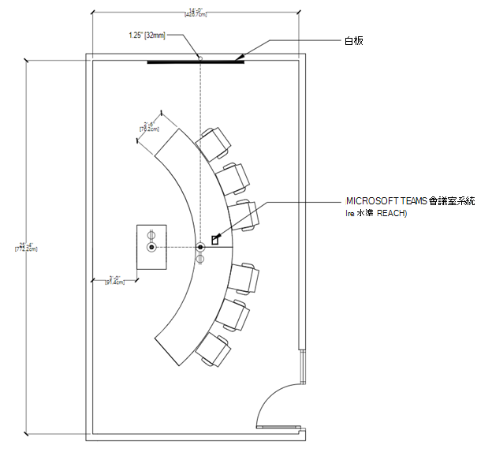

# 會議室Teams指引

本文旨在引導使用者瞭解如何使用Microsoft Teams 會議室解決方案和裝置優化會議空間。 它包含有關Teams 會議室裝置和解決方案使用方式、版面配置和規格的資訊。

# [會議室使用與版面配置](#tab/uses)

## 概觀

Microsoft Teams 會議室解決方案可在傳統會議室所沒有的空間中，提供彈性的用途，甚至是靈活的移動彈性。 例如，使用Teams 會議室裝置時，使用者可以利用數位白板加強共同作業，智慧型人員追蹤攝影機可確保無論每位本機參與者在會議室中的位置都能看見他們。 任何類型的空間和任何類型的會議都可以與Teams 會議室裝置或Teams 會議室解決方案優化。

### 簡報導向的會議 

會議和簡報會議是第一個貯體，而此會議通常較為正式。 音訊視覺是優先順序，而焦點會放在簡報內容上。 裝置通常會修正，讓使用者在從平板電腦中央與裝置互動時，仍可維持坐著狀態。

開會及展示空格會排定簡報和討論的優先順序，這表示版面配置和技術必須針對內容共用和遠端共同建立進行優化。 每個人都需要參與討論，而且必須能夠看到共用內容並與之互動。

**開會及展示****空間版面配置：** 表格應固定並位於會議室的前方顯示器中。 在較小的會議室中，表格可能會連接到牆面，但在較大的空間中，它們必須分開，以配合相機的考慮。

### 共同建立焦點會議

會議和共同建立會議通常不太正式，且優先于共同建立、筆跡和白板。 存取個人檔案也是此貯體的焦點。 裝置可以是行動裝置，鼓勵使用者與裝置保持聯繫、收集裝置並與之互動。

適當的空間能順暢地架設使用者與科技，甚至能讓大多數的新手使用者免去摩擦。 Teams裝置的設計可讓年幼學生或新使用者能夠順暢地進行流覽，並讓授課者或系統管理員從初次使用開始控制和自訂。

**開會及共同建立空間配置：** 資料表和共同建立設備可以具有彈性的位置，且應能容納在資料表或設備上工作的一群人。

### 簡報和共同建立焦點會議

請記住，這兩種類型的聊天室都可以在需要時處理這兩種類型的體驗。 會議室也可以設計成讓兩者都能夠輕鬆地容納，方法是讓每個使用都具備技術。 請務必記住，無論您正在使用何種空間，從私人辦公室到講堂，都必須Teams啟用。

**組合簡報和共同建立空間版面配置：** 其他會議案例的使用案例組合可以結合成多用途的會議室，讓簡報導向的會議以及共同建立工作能以相同的效率達成，通常同時進行。

## 優化會議體驗
絕佳的會議體驗是使用最佳可能技術來建立會議空間的結果，有助於在不具有干擾的情況下交換想法。

### 原生Teams 會議室體驗與其他裝置

Teams 會議室提供獨一無二的會議室功能，例如單點連接、內容攝影機以智慧方式將實體白板共用至會議，以及像是順暢地將Teams會議從個人裝置移轉至會議室等近接式功能，以超越個人裝置上的Teams功能。

依賴外部服務或隨身攜帶裝置連線的非原生和自我建置系統，永遠不會真正符合原生Teams空間的便於使用或沈浸式品質。

根據瞭解，在部署過程中，可能需要進行中繼步驟 (，例如快速部署帶入您自己的裝置會議室，) 在會議空間中實作，以取得完全原生Teams體驗。

### 使用Teams建立最佳的會議體驗

將兩個Teams放在所有個人裝置上，並在所有空間中正確部署Microsoft Teams 會議室，就能為每一個使用者提供最佳的會議體驗。 當您計畫要獲得最佳可能體驗時，就技術部署和使用者指導方針與訓練而言，您必須同時處理所有空格。

在規劃大規模全公司推行計畫時，一般會分階段進行，某些會議室會看到在不同時間新增技術，甚至比其他元件更早安裝某些元件， (例如，在) 一次安裝Teams 會議室解決方案時，部署Teams面板以便在特定建築物的每個會議室排程。

為您的使用者做好分階段執行此動作的準備，以便在過程中的每個時間點最大化Teams會議體驗。

#### 良好體驗 – 只在會議空間中使用個人裝置

您可以從此計畫開始，解決所有非 AV 或非共同作業配備的會議空間。 即使會議室尚未安裝Teams裝置，您仍然可以利用會議室中的Teams。

*音訊：* 建立完整Teams會議室的一大橋樑是規劃會議技術，方法是為個別使用者提供小型會議室和群組的Teams認證音訊裝置，或是在完整Teams 會議室解決方案之前將裝置部署到會議室中，以供小型裝置無法剪下的大型群組使用。

*視頻：* 使用這些會議室時，個別使用者可以攜帶自己的裝置來共用Teams會議內容，並使用個別相機擷取運算式。 使用者接著可以指定某人為本機群組的單一音訊來源，將該個人裝置連線到經過認證的音訊裝置，讓所有 (本機和遠端) 都能獲得正面的會議音訊體驗。

*訂婚：* 即使需要使用個人裝置和周邊設備，啟用會議室以獲得更佳的Teams會議體驗，仍可讓您的使用者擴充可使用Teams執行的動作。 當您的使用者位於私人辦公室和個別工作站時，Teams除了與遠端參與者互動之外，還可促進親自討論。

#### 更好的體驗 – Teams 會議室解決方案，而且沒有個人裝置

如果您安裝Teams 會議室解決方案，或者如果您已經有已針對其個別空間的適當Teams 會議室裝置部署的會議室，那麼您就能擁有絕佳的會議體驗。

*音訊：* 這些會議空間的音訊將由Teams 會議室解決方案及其 Microsoft 認證的音訊裝置處理。

*視頻：* 這些空間中的影片將由Teams 會議室解決方案及其 Microsoft 認證相機處理。

*訂婚：* 您的使用者將能夠利用會議的完整Teams 會議室體驗，確保每個人都能輕鬆加入會議，並擁有絕佳的音訊和視訊。

#### 最佳體驗 – Teams 會議室與個人裝置搭配使用的解決方案

訓練您的使用者以協調的方式使用技術，能帶來最有效率且最精簡的結果。 最佳可能的情況是結合安裝的技術和個人裝置。

*音訊：* 大部分會議室連線和音訊視訊工作將由Teams 會議室解決方案處理，而個別使用者可以使用開啟和關閉音訊的相機加入同一個會議，以獲得完全沈浸式的體驗。

*視頻：* 遠端使用者將能看到每個人除了只說語和共用內容之外，還參與會議。 遠端使用者可以開啟個人視訊，從會議室的任何位置取得檢視，並能將焦點放在任何參與者。

*訂婚：* 所有參與者、本機和遠端參與者、參與度和參與度皆可保持動態。 從Teams 會議室和透過個別相機進行視訊分享，可讓遠端參與者感受到與每個人的互動。

在所有裝置上使用Teams，可確保本機會議室使用者和遠端使用者對會議的參與度相同。

## 技術考慮

正確的音訊和視訊技術選項可協助使用者充分利用Microsoft Teams會議。

### 音訊

音訊考慮對於確保可清楚聽到和理解遠端和會議室參與者至關重要。 麥克風和喇叭涵蓋範圍必須包含會議室中的每一個座位，而不需留下間距。

*每個空間的正確音訊裝置*

需要一個空格的單一音訊來源，以確保會議室中沒有音訊問題。

為每個空格配對正確的麥克風和喇叭，可讓您在不受干擾的情況下清楚聆聽，獲得最佳的可能結果。

-   在共用空間中，選項會展開，但仍維持相同的原則：會議參與者必須清楚聽取並聆聽其他人的意見。

    -   萬一音訊裝置是適用于 **較小空間** 的簡單部署、高品質選項，只有少數參與者坐著相對靠近音訊裝置。

    -   在 **較大的空間** 中，麥克風和喇叭會分開，以確保所有參與者在空間中的涵蓋範圍最大。 許多中型大型會議室的解決方案都可做為不需要設定之套件的一部分，只提供麥克風和喇叭的實體安裝。

    -   **在最大且最複雜的空間** 中，可以使用各種不同的麥克風和喇叭類型，例如從大型大廳擷取答錄機和觀眾的聲音，同時為每個人傳送通話。 當與 Microsoft 合作夥伴一起部署時，這些解決方案在設計和部署更具技術性的解決方案方面具有專長時獲得最佳成效。

### 影片

視訊與音訊同樣重要。 擷取如臉部表情或手勢等實體非口頭通訊，與課堂或會議內容一樣重要，以確保最大參與度和理解。 會議室必須配備適當的顯示大小，這樣每個人才能在會議室或遠端正常體驗會議。 這就是為什麼會議室也需要有正確的相機涵蓋範圍和檢視欄位 (FOV) ，才能有效擷取所有從遠端加入的會議內會議參與者。

*每個空間的相機正確無誤*

高品質視訊與音訊一樣重要，也是現代化Teams共同作業的必要條件。 相機技術有了大幅的進階，高品質的相機現在可供所有空間使用。

-   膝上型電腦和平板電腦等裝置中隨附的相機應該用於所有會議，以確保每個人都能看到並聽到。 對於想要為 **個人空間** 提供更豐富的視訊體驗的使用者，外部攝影機代表內嵌裝置的上一步，可在更多案例和設定中使用，確保通話參與者能分享自己的最佳品質檢視。 這些裝置可透過在每個電腦上找到的簡易 USB 連線輕鬆安裝。

-   在共用空間中，選項和功能會展開。 **較小的會議室** 可能會被音訊欄等一體音訊裝置內的相機所覆蓋。 這些相機通常具有廣泛的視野，可確保在一次拍攝中擷取空間中的每一位參與者。 其中許多相機也具有智慧型影像框架等功能，因此相機只會顯示會議中的人員，而非空白的椅子或正在計算的人員數目，以追蹤及瞭解空間使用量。

-   在 **較大的會議室** 中，相機採用可在不同距離的不同位置擷取參與者所需的技術。 這些相機可以擷取群組或聚焦于特定個人，同時保持絕佳的視覺清晰度。 只能追蹤並只使用主動式喇叭的裝置，會經常在較大的空間中使用，讓許多參與者在參與整個會議時，都能在參與會議時個別受到精選。

# [增強Microsoft Teams會議室](#tab/emtr)

## 增強Microsoft Teams會議室

本節將探討 Microsoft 如何將標準會議室轉換為增強Microsoft Teams 會議室，以提供最佳的新Teams前列體驗。 本文提供會議室設計與技術指導方針、建議產品，以及 Microsoft 企業設施參考規格。

## Microsoft 對於未來會議室的願景

未來的工作將會是流暢、動態的，並由雲端提供。 Microsoft 啟用會議體驗，讓使用者隨時隨地都能參加會議。 這些會議是混合式會議，這表示您可以順暢地加入會議。 使用 Microsoft 裝置加強的會議具有包容性;系統會聽到每一個聲音，並清楚呈現每個人的聲音。

Microsoft 會在未來看到會議是沈浸式的，而且在人員周圍設計空格。 我們的動態會議檢視可讓每個人彼此保持聯繫：正式簡報與共同作業聊天配對。 數位畫布釋放群組創意。 每個人無論身在何處，都能面對面交流。

未來會議的願景是以簡單的信念為根據：會議應該提供的不只是一次性交易而已。 會議是專為所有人設計，無論他們在會議室或在世界各地。

## 什麼是增強Microsoft Teams室？

在 Microsoft 的混合式工作場所中，遠端和會議室參與者的需求會告知下一代會議室標準。 增強式會議室是一個Microsoft Teams會議室，專門用來提供 *提升* 的混合式會議體驗，促進更自然且沈浸式的連線，同時讓會議中的每個人都感到包含在內、有表現和生產力。 會議室會遵循一組由Teams 會議室軟硬體功能和會議室設定指導方針結合而實作的原則。

增強型Microsoft Teams會議室的概念是針對一組體驗原則支援的兩個主要目標所設計。

**目標 1：會議中的每個人都覺得包含在內、有呈現且具生產力。**

設計原則：

-   遠端參與者可以在會議室中建立正版目前狀態

-   會議室內的參與者可以在會議中保留其個人身分識別

-   所有會議參與者都可以進行無邊界的共同作業。

**目標 2：關係感覺自然且沈浸式。**

設計原則：

-   體驗會針對人性化連線進行縮放，讓互動感覺每個人都在同一個房間。

增強的會議室體驗是所有這些元件和構想整合在一起，沒有任何定義體驗的單一功能。 在我們的增強型Microsoft Teams 會議室中找到的個別功能和概念，也可以自行部署。

特定功能部署的範例：

-   在所有類型的會議空間中，如果有支援該功能的Microsoft Teams會議室解決方案，請善用我們全新的前列前方會議室顯示體驗。

-   實作具有傳統Microsoft Teams會議室體驗的弧形表格和前方版面配置，以促進會議室中更好的人性化連線，同時在所有會議空間保持經驗的連續性。

## 您應該何時部署此聊天室類型？

增強Microsoft Teams 會議室不應取代貴組織內所有其他的會議空間，而是用來補充使用Microsoft Teams的現有會議空間。 它們應該以策略性的方式部署到與遠端會議參與者進行面對面互動的空格和位置。

Microsoft Teams 會議室將繼續提供以人員為中心的混合式會議體驗，並透過軟體更新提供。 不過，有些硬體技術和會議室設定指引在優化一些增強的體驗方面扮演關鍵角色。 這是這些元件的組合，組成了增強Microsoft Teams空間。 評估要進化為增強Microsoft Teams會議室的Microsoft Teams 會議室數時，請考慮下列事項：

-   需要進行哪些硬體升級和/或投資。

-   大部分的會議室是設計來最大化寶貴的方塊片段，且會議室維度與會議室容量之間有密切的關係。 增強Microsoft Teams會議室可將會議體驗優先于最大化方塊片段。 並非每個組織都可以針對每個會議空間排列這種優先順序，因為它可能會減少其會議室數目。

### 瞭解此空間 

*在混合式彈性與包容性之間取得平衡*

在 Microsoft，我們彈性的工作指導方針優先提供員工在工作地點和時間上的選擇和彈性。 這種原則的基本改變讓我們重新思考會議空間和技術的演進。

我們的研究顯示，遠端會議在進行期間有許多優點，尤其是關於增加的資產和包容性感受。 當我們考慮在混合式設定中返回時，隨著遠端和親自共同作業同時進行，我們尋求建立會議空間以更完善地支援我們的彈性工作原則，同時透過會議室設計和技術為所有參與者維護一個水準的遊戲場。

### 此空間用途為何？

這個空間專為實體會議室中的一小群人提供最沈浸式Teams會議體驗。

就像一般Microsoft Teams會議室一樣，會議參與者可以在進行簡報和共同建立內容的同時，從遠端和本機進行會議，以順暢地共同作業。

### 此空間是如何佈置出來的？

會議室版面配置是專為與遠端參與者和內容的最大可見度和參與度所設計。

版面配置具有弧形表格，可讓參與者親自眼球接觸及方向，讓所有椅子都朝向顯示器的遠端參與者，讓參與者可以跟著走。

### 音訊如何運作？ 

使用通過Microsoft Teams 會議室認證的音訊解決方案，使用者就能清楚聽到並聽到聲音。

在未來，Teams 會議室將支援使用稱為空間音訊概念的音訊系統。 使用空間音訊時，聲音會從說話者的方向發出。 例如，如果會議圖庫右側的人員說話，音訊會來自最接近該位置的喇叭。 這種沈浸式音訊體驗可協助會議更貼近親自交談。

### 相機如何運作？

超全形相機位於顯示器下方會議室的前方，以擷取空間中的每一個人。

超全形相機具有智慧追蹤會議參與者的功能，可讓參與者在大型檢視中個別呈現，而非以整個會議室的大型影像呈現臉部。

### 前方顯示器如何運作？ 

此聊天室已針對稱為前列的Microsoft Teams 會議室版面配置進行優化，並透過特殊短交高解析度投影機顯示，建立專為Teams會議設計的沈浸式前室體驗。 

### 什麼是前列？

為了讓會議室中的人員與遠端參與者有更大的連線感，並支援在會議之前、期間及之後進行共同作業，Microsoft 為Microsoft Teams 會議室稱為前列推出了新的內容版面配置。 透過視覺效果，這個新的版面配置會將視訊庫移到畫面底部，並以特定比例進行修正，讓臉部保持逼真大小。 使用此版面配置，會議室參與者可以在水準平面上看到遠端同事面對面交談，類似他們是否在同一個房間。

會議內容會被議程、工作和記事等關聯式流體元件所環繞，這些元件可以即時更新，協助參與者保持參與並提高生產力。 此外，會議聊天會清楚顯示，因此從Teams會議室加入Teams會議時，您可以輕鬆地即時查看及參與交談。 在增強Microsoft Teams會議室中，此內容會顯示在寬寬長寬比畫面上，以最大化會議內容的大小，以及可同時檢視的參與者數目。

單一和雙顯示設定皆支援此版面配置。 前列配置在增強型會議室中尤其具影響力，但無論傢俱與硬體設定為何，前列都可用於在Windows上執行的任何Teams會議室。

### 如何共同建立內容？

在Microsoft Teams 會議室中，使用者可以使用智慧擷取功能來利用傳統類比白板。 為了獲得所有參與者可以一起繪圖和手繪的現代化體驗，您可以使用觸控螢幕前方顯示器、電腦、手機或平板電腦等隨附裝置，以及透過Microsoft Surface Hub存取Microsoft Whiteboard。

## 增強Microsoft Teams室設計指引

本節旨在涵蓋從頭開始建置會議室。 

### 會議室版面配置 

#### 會議室大小

25 吋 x 14 吋

#### 會議室容量 

此增強Microsoft Teams室已針對 6 到 8 個人優化。 

#### 會議室傢俱

此聊天室具有一個曲線表格，參與者坐在一邊，讓會議室內參與者可以保留彼此的可見度，並與遠端參與者面對面。

此會議室具有高度為 30 公分或 76 公分的標準會議室表格。

#### 設備安裝

選取硬體位置通常是由選取指定會議空間內所用Teams經過會議室認證的硬體所驅動。

為了在 Microsoft 設施內初始部署增強型會議室，我們選擇在表格中安裝Microsoft Teams 會議室計算和觸控主控台，其中包含整合式相機和音效列裝置 (空間音訊的獨立左通道和右通道音訊) 安裝在特殊傢俱上，位於顯示的影像下方，以及會議室前方投影和表格之間。 請務必讓主機與參與者接觸，而不要妨礙他們使用表格來處理個人裝置和/或檔。 針對顯示器，會使用短鍵高解析度投影機。

大部分的參與者會選擇透過個人裝置加入Teams會議，以共用這類會議室中的內容。 不過，會議室內本機視訊簡報也應以易於存取的方式提供給無法加入會議通話的人員。

#### 觸控主機位置

Microsoft Teams 會議室觸控主控台應該會安裝在表格中央，方便會議參與者使用，而不會封鎖個人裝置或檔表格的使用。

#### 本機視訊簡報

雖然許多參與者可以選擇透過個人裝置加入Teams會議來共用這類會議室中的內容，Teams通話，但會議室內的本機視訊簡報也應以易於存取的方式在表格中提供。

## 基礎 設施 

### 基礎結構電源

至少應該在資料表 (為使用者) 和設備安裝位置提供電源連線。 如果共同建立裝置是在空間中使用，也可能需要在其位置 () 電源連線。

### 基礎結構資料

使用者) 的資料表 (以及Teams 會議室解決方案) 主網路的設備安裝位置 (都應提供網路連線。 如果共同建立裝置是在空間中使用，連線到主網路的網路連線也需要Teams 會議室解決方案。

### 聲牆寄生

在這類會議室中，至少兩面牆應經過聲學處理，以防止會議期間發生回音和周遭環境噪音問題。

### 視窗區

這類房間內的視窗光線可能會對光線造成負面影響，並同時對相機影像和前室顯示器產生眩光和陰影。 任何具有視窗功能的空間也應具備視窗搜尋功能，讓外部光線在會議期間遭到封鎖。

### 樓層作業

這類房間的樓層應有毯子，或是以聲學方式處理，以防止會議期間發生回音與周遭環境噪音問題。

### 照明 

應提供頭頂燈號以平均顯示空間，會議室參與者看起來不會被刷淡或坐在深色空間中。 為了避免出現眩光，應努力將房間前顯示器上的直接光源、共同建立裝置或空間內的其他反射表面降到最低。

## 技術指引 

### Microsoft Teams 會議室解決方案

Microsoft Teams增強的會議室需要在 Microsoft Windows 上使用Microsoft Teams 會議室。

### 相機

#### 相機選項

這類聊天室需要使用智慧型的超寬角前方相機，並適當地分級為寬度和深度空間。

#### 相機位置

相機應該放在會議室前方投影下方，但位於表格頂端的會議室前方，以便盡可能接近眼球層級擷取所有會議室參與者。

### 麥克風

#### 麥克風選項

前方的麥克風陣列、桌面和頭頂麥克風都適用于這種類型的空間。

#### 麥克風位置

麥克風陣列必須定位，以提供裝置認證範圍內所有會議室參與者的涵蓋範圍。

### 揚聲器

#### 喇叭選項

前方會議室喇叭陣列和頭頂喇叭適用于這種類型的空間。

注意：空間音訊尚未提供，可能需要特定的音訊裝置。

#### 喇叭位置

喇叭必須處於定位狀態，以在所用裝置或裝置的認證範圍內為所有會議室參與者提供涵蓋範圍。

### 會議室前方顯示器

#### 顯示類型

這類聊天室需要使用超寬度長寬比、高解析度前方顯示器，其大小適當，適合寬度和深度的空間，以確保最大可見度和清晰度。

顯示類型範例包括：

-   雷射投影機

-   LED 視訊牆

-   特殊 LCD 或 OLED 平面面板顯示

#### 顯示函數

增強Microsoft Teams 會議室和其他所有Microsoft Teams 會議室解決方案一樣，都需要使用可容納下列功能的顯示器，才能正常運作：

-   根據 HDMI 同步處理，從睡眠狀態睡眠與快速喚醒。

    -   對於投影機，必須支援自動熱身和冷卻期間，而不需要使用者介入。

-   顯示器必須支援Microsoft Teams 會議室設計所需的適當 EDID 和解析度。

#### 顯示位置

增強的會議室需要將顯示器放在所有會議室內會議參與者的正反面。

顯示器的水準中心線必須置中于與表格相同的中央線。

顯示器的垂直中央線不得超過 +/- 15 度位移，與一般會議室內會議參與者坐在表格上的眼線距離。

#### 顯示計數

增強的會議室需要顯示器是單一寬寬寬比顯示器，或是混合的顯示器組合，當會議室內的會議參與者看到時，可以達到單一顯示器的效果。

### 共同建立選項

#### Microsoft Whiteboard

所有Teams 會議室都能夠透過互動式共同作業裝置來利用Microsoft Whiteboard，例如Microsoft Surface Hub、觸控式螢幕前方顯示器，以及透過電腦、手機或平板電腦等隨附裝置。

#### 傳統白板 

Windows上的所有Teams 會議室都可以使用智慧型擷取功能和次要內容相機，在Teams會議中運用傳統白板。

## 此空間的建議產品

### Microsoft Teams會議室主機和計算

-   以Windows為基礎的Microsoft Teams 會議室解決方案。

如圖所示：

[與 Lenovo Compute 裝置配對之觸控主控台的登入點選。](https://www.microsoft.com/en-us/microsoft-teams/across-devices/devices/product/logitech-tap-room-systems-with-thinksmart-edition-tiny/523)

其他選項：

-   [Lenovo ThinkSmart Core + Controller](https://www.microsoft.com/en-us/microsoft-teams/across-devices/devices/product/lenovo-thinksmart-core-controller/948)

-   [Cres要彈性自訂的會議系統](https://www.microsoft.com/en-us/microsoft-teams/across-devices/devices/product/crestron-flex-customizable-conference-system/849)

-   [Cres括定可自訂的會議系統進階](https://www.microsoft.com/en-us/microsoft-teams/across-devices/devices/product/crestron-flex-customizable-conference-system/849)

-   [Poly G10-T](https://www.microsoft.com/en-us/microsoft-teams/across-devices/devices/product/poly-g10-t/564)

### 相機

-   具有智慧框架的超全形相機。

如圖所示：

[Jabra Panacast 50](https://www.microsoft.com/en-us/microsoft-teams/across-devices/devices/product/jabra-panacast-50-series/922)

其他選項：

-   [Jabra PanaCast](https://www.microsoft.com/en-us/microsoft-teams/across-devices/devices/product/jabra-panacast/353)

-   [Yealink UVC30](https://www.microsoft.com/en-us/microsoft-teams/across-devices/devices/product/yealink-uvc30-room/409)

-   [Yealink UVC40](https://www.microsoft.com/en-us/microsoft-teams/across-devices/devices/product/yealink-uvc40/648)

-   [Bose 視訊列 VB1](https://www.microsoft.com/en-us/microsoft-teams/across-devices/devices/product/bose-videobar-vb1/809)

-   [Poly Studio](https://www.microsoft.com/en-us/microsoft-teams/across-devices/devices/product/poly-studio/206)

-   Poly Studio E70

-   [Logitech Rally](https://www.logitech.com/product/rally-ultra-hd-conferencecam)

-   [Logitech 方塊](https://www.logitech.com/products/video-conferencing/room-solutions/rallybar.960-001308.html)

-   [Logitech 欄 Mini](https://www.logitech.com/products/video-conferencing/room-solutions/rallybarmini.960-001336.html)

### 麥克風

-   可清楚擷取所有會議室內會議參與者的認證麥克風解決方案。

如圖所示：

[Jabra Panacast 50](https://www.microsoft.com/en-us/microsoft-teams/across-devices/devices/product/jabra-panacast-50-series/922)

其他選項：

-   [Yealink UVC40](https://www.microsoft.com/en-us/microsoft-teams/across-devices/devices/product/yealink-uvc40/648)

-   [Bose 視訊列 VB1](https://www.microsoft.com/en-us/microsoft-teams/across-devices/devices/product/bose-videobar-vb1/809)

-   [Poly Studio](https://www.microsoft.com/en-us/microsoft-teams/across-devices/devices/product/poly-studio/206)

-   [Lenovo ThinkSmart Bar](https://www.microsoft.com/en-us/microsoft-teams/across-devices/devices/product/lenovo-thinksmart-bar/949)

-   [Lenovo ThinkSmart Bar XL](https://www.microsoft.com/en-us/microsoft-teams/across-devices/devices/product/lenovo-thinksmart-bar/949)

-   [含柏拉角落麥克風的 Biamp Devio 會議室中心](https://www.microsoft.com/en-us/microsoft-teams/across-devices/devices/product/biamp-devio-conference-room-hubs/920)

-   [含 Parle 表格麥克風的 Biamp Devio 會議室中心](https://www.microsoft.com/en-us/microsoft-teams/across-devices/devices/product/biamp-devio-conference-room-hubs/920)

-   [Shure MXA710-4FT 掛牆音訊系統](https://www.microsoft.com/en-us/microsoft-teams/across-devices/devices/product/shure-mxa710-audio-systems/967)

-   [Nureva HDL300 音訊會議系統](https://www.microsoft.com/en-us/microsoft-teams/across-devices/devices/product/nureva-hdl300-audio-conferencing-system/739)

-   [QSC 會議室音訊：in--ceiling 喇叭](https://www.microsoft.com/en-us/microsoft-teams/across-devices/devices/product/qsc-meeting-room-audio-in-ceiling-speakers/700)

-   [QSC 方向音訊 - 上限音訊](https://www.microsoft.com/en-us/microsoft-teams/across-devices/devices/product/qsc-directional-audio/704)

-   [QSC 會議室音訊：垂直喇叭](https://www.microsoft.com/en-us/microsoft-teams/across-devices/devices/product/qsc-meeting-room-audio-pendant-speakers/711)

-   [含 Parlé ceiling 麥克風的 Biamp 音訊](https://www.microsoft.com/en-us/microsoft-teams/across-devices/devices/product/biamp-complete-room-audio-with-parle-ceiling-mic/613)

-   [含 Parlé 平板麥克風的 Biamp 音訊](https://www.microsoft.com/en-us/microsoft-teams/across-devices/devices/product/biamp-complete-room-audio-with-parle-ceiling-mic/613)

-   [Bose DS4 上限音訊解決方案](https://www.microsoft.com/en-us/microsoft-teams/across-devices/devices/product/bose-ds4-ceiling-audio-solution/694)

-   [Bose ES1 上限音訊解決方案](https://www.microsoft.com/en-us/microsoft-teams/across-devices/devices/product/bose-es1-ceiling-audio-solution/506)

-   [Shure Microflex Advance MXA910 + IntelliMix P300](https://www.microsoft.com/en-us/microsoft-teams/across-devices/devices/product/shure-microflex-advance-mxa910-intellimix-p300/429)

-   [Biamp Tesira DSP & Sennheiser TeamConnect Ceiling 2](https://www.microsoft.com/en-us/microsoft-teams/across-devices/devices/product/biamp-tesira-dsp-sennheiser-teamconnect-ceiling-2/359)

### 揚聲器

-   可為所有會議室內的會議參與者提供清楚且可省略音訊的認證喇叭解決方案。

如圖所示：

[Jabra Panacast 50](https://www.microsoft.com/en-us/microsoft-teams/across-devices/devices/product/jabra-panacast-50-series/922)

其他選項：

-   [Yealink UVC40](https://www.microsoft.com/en-us/microsoft-teams/across-devices/devices/product/yealink-uvc40/648)

-   [Bose 視訊列 VB1](https://www.microsoft.com/en-us/microsoft-teams/across-devices/devices/product/bose-videobar-vb1/809)

-   [Poly Studio](https://www.microsoft.com/en-us/microsoft-teams/across-devices/devices/product/poly-studio/206)

-   [Lenovo ThinkSmart Bar](https://www.microsoft.com/en-us/microsoft-teams/across-devices/devices/product/lenovo-thinksmart-bar/949)

-   [Lenovo ThinkSmart Bar XL](https://www.microsoft.com/en-us/microsoft-teams/across-devices/devices/product/lenovo-thinksmart-bar/949)

-   [含柏拉角落麥克風的 Biamp Devio 會議室中心](https://www.microsoft.com/en-us/microsoft-teams/across-devices/devices/product/biamp-devio-conference-room-hubs/920)

-   [含 Parle 表格麥克風的 Biamp Devio 會議室中心](https://www.microsoft.com/en-us/microsoft-teams/across-devices/devices/product/biamp-devio-conference-room-hubs/920)

-   [Shure MXA710-4FT 掛牆音訊系統](https://www.microsoft.com/en-us/microsoft-teams/across-devices/devices/product/shure-mxa710-audio-systems/967)

-   [Nureva HDL300 音訊會議系統](https://www.microsoft.com/en-us/microsoft-teams/across-devices/devices/product/nureva-hdl300-audio-conferencing-system/739)

-   [QSC 會議室音訊：in--ceiling 喇叭](https://www.microsoft.com/en-us/microsoft-teams/across-devices/devices/product/qsc-meeting-room-audio-in-ceiling-speakers/700)

-   [QSC 方向音訊 - 上限音訊](https://www.microsoft.com/en-us/microsoft-teams/across-devices/devices/product/qsc-directional-audio/704)

-   [QSC 會議室音訊：垂直喇叭](https://www.microsoft.com/en-us/microsoft-teams/across-devices/devices/product/qsc-meeting-room-audio-pendant-speakers/711)

-   [含 Parlé ceiling 麥克風的 Biamp 音訊](https://www.microsoft.com/en-us/microsoft-teams/across-devices/devices/product/biamp-complete-room-audio-with-parle-ceiling-mic/613)

-   [含 Parlé 平板麥克風的 Biamp 音訊](https://www.microsoft.com/en-us/microsoft-teams/across-devices/devices/product/biamp-complete-room-audio-with-parle-ceiling-mic/613)

-   [Bose DS4 上限音訊解決方案](https://www.microsoft.com/en-us/microsoft-teams/across-devices/devices/product/bose-ds4-ceiling-audio-solution/694)

-   [Bose ES1 上限音訊解決方案](https://www.microsoft.com/en-us/microsoft-teams/across-devices/devices/product/bose-es1-ceiling-audio-solution/506)

-   [Shure Microflex Advance MXA910 + IntelliMix P300](https://www.microsoft.com/en-us/microsoft-teams/across-devices/devices/product/shure-microflex-advance-mxa910-intellimix-p300/429)

-   [Biamp Tesira DSP & Sennheiser TeamConnect Ceiling 2](https://www.microsoft.com/en-us/microsoft-teams/across-devices/devices/product/biamp-tesira-dsp-sennheiser-teamconnect-ceiling-2/359)

### 顯示

- 短傳或超短傳回、高解析度和高亮度雷射投影機，在同步處理時自動喚醒，並在睡眠功能期間進行冷卻。 低增益投影機畫面具有環境光線拒絕屬性，可在亮麗的房間中提供最佳的圖片品質。

如圖所示： 

- [Epson EB-PU1007 Projector with ELPLX01S Ultra Short Throw lens](https://epson.com/For-Work/Projectors/Large-Venue/EB-PU1007B-WUXGA-3LCD-Laser-Projector-with-4K-Enhancement/p/V11HA34820)
- [Da-Lite UTB Contour Screen |HD 漸進式 0.6 螢幕|Cinemascope 138「 對角線](https://www.legrandav.com/products/da-lite/screens/fixed_frame_screens/utb_contour)

其他選項：

在理想情況下，其他顯示選項 (替代投影機、LED 牆和平面面板顯示器) 應該能夠建立跨越圖像的表格、支援 4k 影像，以及 21：9 長寬比。

### 共同建立選項

-   含內容相機 OR 的類比白板

-   相容的互動式觸控顯示器。

如圖所示：

[Logitech Scribe](https://www.microsoft.com/en-us/microsoft-teams/across-devices/devices/product/logitech-scribe/966)

其他選項：

內容相機：

-   [Yealink UVC30 內容相機](https://www.microsoft.com/en-us/microsoft-teams/across-devices/devices/product/yealink-uvc30-content-camera/647)

-   [哈茲利畫布](https://www.microsoft.com/en-us/microsoft-teams/across-devices/devices/product/huddly-canvas/568)

-   [Logitech BRIO Content 相機 Kit](https://www.microsoft.com/en-us/microsoft-teams/across-devices/devices/product/logitech-brio-content-camera-kit/349)

互動式觸控式裝置：

[Microsoft Surface Hub 2S](https://www.microsoft.com/en-us/microsoft-teams/across-devices/devices/product/microsoft-surface-hub-2s/822?)
