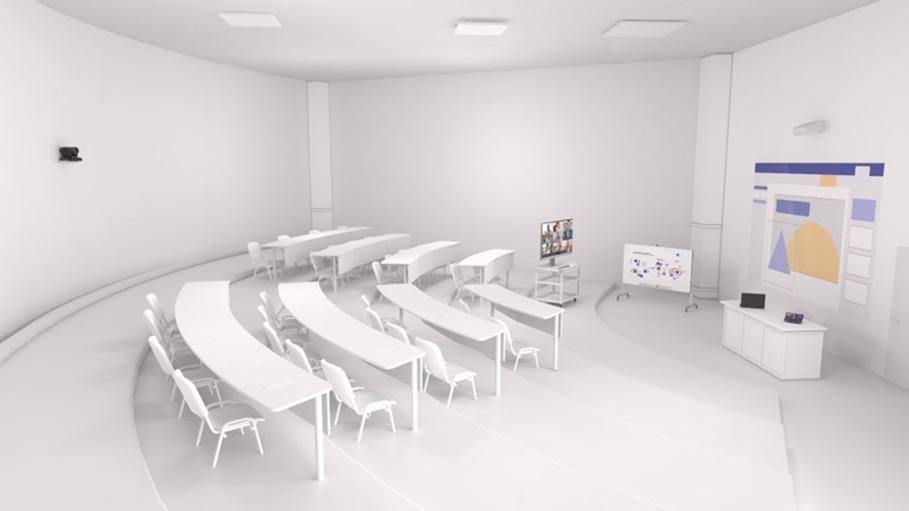

# 會議室指南Teams

本文旨在引導使用者瞭解如何使用各種解決方案Microsoft Teams 會議室會議空間。 其中包含裝置Teams 會議室使用、版面配置和規格的資訊。

本文[的](#example-spaces)範例空間區段包含規格和呈現的會議室佈局，是視覺化及規劃裝置和/或Teams裝置和/或Teams 會議室部署。

## 會議室的用途和版面配置

Microsoft Teams 會議室解決方案提供用途彈性，甚至可在整個空間中移動，而傳統會議室無法提供彈性。 例如，使用 Teams 會議室 裝置，使用者可以使用數位白板加強共同合作，而智慧型人員追蹤攝影機則能確保每個當地參與者不論在會議室中在何處，都可以看到他們。 任何類型的空間和任何類型的會議都可以在裝置或Teams 會議室優化Teams 會議室優化。

### 簡報型會議 

開會和展示會議是第一個容器，而此會議通常較為正式。 音訊 -visual 是優先順序，且焦點會放在呈現內容上。 裝置通常會修正，讓使用者在從表格中央主控台與裝置互動時保持就地就位。

開會和簡報空間會優先處理簡報和討論，這表示版面配置和技術必須針對內容共用和遠端共同建立進行優化。 每個人都必須參與討論，而且必須能夠查看共用內容並與其互動。

**開會和展示****空間版面配置：** 表格應固定且位於會議室前方的顯示器中。 在較小的會議室中，表格可能會連接到牆面，但在較大的空間中，必須分開，以配合相機的考慮。

### 以共同建立為主的會議

會議與共同建立會議通常不太正式，且優先使用共同建立、書寫和白板。 存取個人檔案也是此資料桶的焦點。 裝置可以是行動裝置，可鼓勵使用者站起身來、收集裝置並與裝置互動。

正確的空間能順暢地連接使用者與技術，甚至最新手使用者也能消除摩擦。 Teams裝置的設計，足以方便學生或新使用者輕鬆流覽，讓教育者或系統管理員能控制及自訂第一次使用。

**開會及共同建立空間版面配置：** 表格和共同建立設備可以有彈性的位置，而且應該適合在資料表或設備中工作的人群組。

### 簡報和共同建立的會議

請記住，這兩種類型的會議室都可以在需要時同時處理這兩種類型的體驗。 會議室也可以設計成每一種用途都具備技術，以便輕鬆容納兩者。 請記住，不論您配備什麼空間，從私人辦公室到講堂，都需要啟用Teams功能。

**組合簡報和共同建立空間版面配置：** 結合其他會議案例的使用案例組合，可以組合成多功能會議室，讓簡報型會議以及共同建立工作能夠以相同的效率達成，通常同時進行。

## 優化會議體驗
最佳會議體驗是使用會議空間的最佳技術，在不幹擾的情況下促進想法交換的結果。

### 原生Teams 會議室體驗與其他裝置

Teams 會議室個人裝置上的 Teams，提供獨特的室內功能，例如單鍵連接、內容攝影機以智慧方式共用實體白板到會議，以及鄰近功能，例如從個人裝置順暢地將 Teams 會議移轉到會議室等。。

仰賴外部服務或自建裝置連接的非原生和自我建置系統，將永遠無法真正符合原生聊天室的輕鬆使用或Teams品質。

據瞭解，在部署過程中，可能需要執行中間步驟 (例如快速部署在會議空間中完全原生 Teams 體驗的路徑上) 的裝置式會議室。

### 使用Teams建立最佳會議體驗

您可以在所有Teams裝置上同時使用兩者，並在所有Microsoft Teams 會議室適當部署會議，為每位使用者提供最佳的會議體驗。 當您打算取得最佳體驗時，您必須同時解決技術部署和使用者指引與訓練的所有空間。

規劃大規模的全公司推出計畫時，如果部分會議室看到在不同時間新增技術，或甚至比其他會議室更早安裝某些元件 (例如將 Teams 面板部署到特定建築物中每個會議室排程，同時安裝 Teams 會議室 解決方案一層，甚至一次安裝一間會議室) 時，這是正常現象。

準備您的使用者以階段的方式執行這項工作，Teams在一路的每一個時間點，最大化您的會議體驗。

#### 良好的體驗 – 在會議空間中單獨使用個人裝置

首先，您可以解決所有非 AV 或非共同合作的會議空間。 即使會議室尚未安裝Teams，您仍可使用會議室Teams功能。

*音訊：* 若要規劃完整的 Teams 會議室，一個很棒的橋樑就是規劃會議技術，為個別使用者提供 Teams 認證的音訊裝置，以用於較小的會議室和群組，或是將裝置部署在會議室中，以在適用于大型群組且小型裝置無法剪下之較大空間的完整 Teams 會議室 解決方案之前部署這些裝置。

*影片：* 使用這些會議室時，個別使用者可以帶自己的裝置在會議內容Teams共用，然後使用個別的相機來捕獲其運算式。 然後，使用者可以將某人指定為本地群組的單一音訊來源，將該個人裝置連接到通過認證的音訊裝置，讓 (和遠端) 都有會議音訊的正面體驗。

*互動：* 即使您需要使用個人裝置和Teams，讓會議室擁有更好的會議體驗，您仍可使用Teams。 當您的使用者位於私人辦公室和個別工作站時，Teams除了與遠端參與者互動之外，還有助於進行個人討論。

#### 更好的體驗 – Teams 會議室解決方案，且沒有個人裝置

如果您安裝 Teams 會議室解決方案，或者如果您已經部署會議室，並針對各自的空間部署適當的 Teams 會議室 裝置，表示您正順利享有良好的會議體驗。

*音訊：* 這些會議空間的音訊將由 Teams 會議室解決方案及其 Microsoft 認證的音訊裝置處理。

*影片：* 這些空間中的視Teams 會議室將由 Microsoft 認證的相機處理。

*互動：* 您的使用者將能夠利用會議的完整Teams 會議室體驗，確保每個人都能輕鬆加入會議，並擁有出色的音訊和視音訊。

#### 最佳體驗 – Teams 會議室個人裝置一起使用的解決方案

訓練您的使用者以協調方式使用技術，以取得最有效率且最簡化的結果。 最佳案例是安裝的技術和個人裝置組合。

*音訊：* 大部分的會議室連接和音訊-視音訊工作將由 Teams 會議室 解決方案處理，而個別使用者可以使用相機加入同一場會議，並關閉音訊，以獲得完全身臨其境的體驗。

*影片：* 除了說話和內容共用之外，遠端使用者將能看到所有人參與會議。 遠端使用者可以開啟個人視視，從會議室中的任何位置取得觀看，並專注于任何參與者。

*互動：* 所有參與者 ，包括本地和遠端、參與和參與，都可以保持動態聊天。 從兩部Teams 會議室以及透過個別相機進行視像分享，可讓遠端參與者感到與所有人有一種交流。

在所有Teams使用會議室功能，可確保當地會議室使用者和遠端使用者有同樣參與會議的感覺。

## 技術考慮

正確的音訊和視音訊技術選擇可協助使用者從會議Microsoft Teams使用。

### 音訊

音訊考慮對於確保遠端和會議室參與者能夠清楚聽到和瞭解至關重要。 麥克風和喇叭的涵蓋範圍必須包含會議室中的每個座位，而不需要留下空白。

*適合每個空間的音訊裝置*

為了確保會議室沒有音訊問題，需要一個空間的音訊來源。

針對每個空間配對適當的麥克風和喇叭，可提供最佳結果，讓聲音清楚且不分心。

-   在共用空間中，選項會展開，但相同的原則仍然存在：會議參與者必須聽到並清楚聽到其他人的聲音。

    -   一體式音訊裝置是易於部署且高品質的選項，適用于人數有限且距離音訊裝置較近的參與者較小的空間。

    -   在 **較大的空間中**，麥克風和喇叭會分開，以確保空間內所有參與者的涵蓋範圍最大。 許多中型至大型會議室的解決方案都是作為套件的一部分提供，不需要任何組組，只需要實際安裝麥克風和喇叭。

    -   在最大且最複雜的空間中，提供可同時使用各種麥克風和喇叭類型的解決方案，例如從大型大廳中捕獲演講者和觀眾的聲音，同時將通話帶到所有人。 這些解決方案最適合與具備設計及部署技術相關解決方案的 Microsoft 合作夥伴一起部署。

### 影片

視像音訊一樣重要。 捕獲臉部表情或手勢等實體、非語言溝通，與教室或會議內容一樣重要，可確保最大參與度與理解度。 會議室必須配備適當的顯示大小，讓每個人都能在會議室或遠端正確體驗會議。 這就是為什麼會議室也需要擁有正確的攝影機覆蓋和視野 (FOV) 才能有效捕獲所有遠端加入的會議室會議參與者。

*適合每個空間的相機*

高品質視像良好的音訊一樣重要，也是現代化Teams的必要條件。 相機技術已大幅提升，現在所有空間都提供高品質的相機。

-   所有會議都應該使用膝上型電腦和平板電腦等裝置中的相機，以確保每個人都能看到和聽到。 對於想要為個人空間帶來更豐富影片體驗的使用者，外接式攝影機代表內嵌裝置中的進一步功能，可用於更多案例和組組，確保通話參與者能夠分享自己的最佳品質視圖。 這些裝置能輕鬆安裝，且每部電腦都提供簡單的 USB 連接。

-   在共用空間中，選項和功能會展開。 **小型會議室** 可能由一對一音訊裝置內包含的相機所覆蓋，例如聲帶。 這些相機通常具有寬廣的視野，確保它們能一次拍攝到空間中的每一位參與者。 這些相機中有許多也具有智慧型影像框架等功能，因此相機只會顯示會議中的人員，而不是空椅子，或計算人員，以追蹤並瞭解空間使用方式。

-   在 **較大型的** 會議室中，攝影機採用所需的技術，可拍攝不同距離不同位置的參與者。 這些相機可以拍攝群組或將焦點放在特定人員上，同時維持良好的視覺清晰度。 只有使用中喇叭才能追蹤和功能的裝置，一般會用於較大的空間，讓許多參與者在參與會議時，在貢獻想法時，個別地受到精選。

## 範例空格

本節會探索一些範例，瞭解如何處理大多陣列織找到的各種空間。 有許多方法可以達到出色的會議體驗，這些範例空間在建立您自己的組織時可做為很好的指南。

## 較小的會議空間

### 有會議空間的私人辦公室

| 使用 | 佈局 | 音訊 | 影片 |
|------------------|----------------------------------------------------|------------------------------------------------------------|------------------------------------------------------------------|
| 開會與展示 | 一般容量：3-4 人                       | 建議的音訊：單一會議室或桌面裝置 | 建議的相機：超寬視野的短距離 |
|                  | 一般尺寸：10 ft x 10 ft                  |                                                            | 最小顯示大小：46in                                       |
|                  | 建議使用單一或雙主要顯示器：單一 |                                                            |                                                                  |

私人辦公室的設計通常與工作區分開的會議空間，因此小型會議可以與本地和遠端參與者混合進行。

 

*顯示的解決方案為：*

大型私人工作區內的一個擠在一起或焦點會議室區域。

*為什麼此版面配置和裝置類型？*

空間的版面配置是專為方便與當地和遠端參與者的會議所設計。

會議桌與私人的工作時間和會議室技術在實體上是分開的，方便與當地和遠端參與者進行會議。

會議室採用單一顯示大小，讓所有參與者都清楚看到所有呈現的內容和遠端視音訊參與者。 此外，它還有一個以聲吧為基礎的會議室解決方案，以及整合的智慧型相機。 此解決方案易於安裝及操作，並提供適合這類空間會議的音訊和視音訊覆蓋。

*圖片在這裡：*

-   單一顯示

-   一對一的音效Teams 會議室解決方案

### 開啟空格

| 使用 | 佈局 | 音訊 | 影片 |
|--------------------|------------------------------------------|-----------------------------------------|--------------------------------------------|
| 開會及共同建立 | 一般容量：3-13 人            | 建議的音訊：取決於空間 | 建議的相機：取決於空間   |
|                    | 一般維度：取決於空間 |                                         | 最小顯示大小：取決於空間 |
|                    |                                          |                                         |                                            |

開放式空間 ，例如大廳和共同區域，通常採用傳統會議的共同合作技術。

 

*顯示的解決方案為：*

兩個Surface Hub裝置，可于大型開放空間中進行互動式共同合作和建立選項。

*為什麼此版面配置和裝置類型？*

反高度表格是放置於大型Surface Hub裝置，用於內容建立顯示，以及小型會議Teams 會議室解決方案。 另Surface Hub裝置已設定在購物車上，可四處移動至隨意的休息區域，以建立內容。 這些傢俱可同時用於非正式的辦公室交談，以及即席共同工作，提供所有空間類型的選項。

*圖片在這裡：*

-   大型牆面安裝Surface Hub

-   購物車式行動裝置Surface Hub

### 焦點/空間

| 使用 | 佈局 | 音訊 | 影片 |
|------------------|----------------------------------------------------|------------------------------------------------------------|------------------------------------------------------------------|
| 開會與展示 | 一般容量：3-5 人                       | 建議的音訊：單一會議室或桌面裝置 | 建議的相機：超寬視野的短距離 |
|                  | 一般尺寸：10 ft x 10 ft                  |                                                            | 最小顯示大小：46in                                       |
|                  | 建議使用單一或雙主要顯示器：單一 |                                                            |                                                                  |

這些空間是小型群組共同合作和討論的理想空間。

 

*顯示的解決方案為：*

小型群組共同Microsoft Teams 會議室或焦點會議室。

*為什麼此版面配置和裝置類型？*

表格會附加在牆面，可最大化各種版面配置的空間彈性。 它可確保Teams 會議室解決方案是空間的焦點。 會議室大小的安裝顯示器可確保實際出席的每個人都可以看到遠端會議參與者和/或共同檔。 會議室攝影機可拍攝遠端參與者的會議室。 由於會議室是專用的會議空間，因此桌面音訊裝置可確保所有派對都聽到。

*圖片在這裡：*

-   適用于Teams 會議室會議室的輕鬆安裝解決方案

-   遠端參與者和要共用內容的單一會議室前顯示器

### 小型傳統會議室

| 使用 | 佈局 | 音訊 | 影片 |
|------------------|----------------------------------------------------|------------------------------------------------------------|------------------------------------------------------------------|
| 開會與展示 | 一般容量：5-7 人                       | 建議的音訊：單一會議室或桌面裝置 | 建議的相機：超寬視野的短距離 |
|                  | 一般尺寸：10 ft x 15 ft                  |                                                            | 最小顯示大小：50in                                       |
|                  | 建議使用單一或雙主要顯示器：單一 |                                                            |                                                                  |

這些空間是小型群組共同合作和討論的理想空間。

 

*顯示的解決方案為：*

一間傳統地佈局小型會議室，提供Microsoft Teams 會議室解決方案。

*為什麼此版面配置和裝置類型？*

較傳統的會議室版面配置可以設計成與遠端參與者和內容的會議一樣，完全適用于個人會議。 表格會與顯示牆和Teams 會議室分開。 會議室大小的安裝顯示器可確保實際出席的每個人都可以看到遠端會議參與者和/或共同檔。 會議室攝影機可拍攝遠端參與者的會議室。 由於會議室是專用的會議空間，因此桌面音訊裝置可確保所有派對都聽到。

*圖片在這裡：*

-   適用于Teams 會議室會議室的輕鬆安裝解決方案

-   遠端參與者和要共用內容的單一會議室前顯示器

## 較大的會議空間

### 中型傳統會議室

| 使用 | 佈局 | 音訊 | 影片 |
|------------------------------|------------------------------------------------------------|-------------------------------------------------------------------------------------------------------------------------------|-----------------------------------------------------------------------------------------------------------------------------|
| 開會及展示 + 共同建立 | 一般容量：10-12 人                             | 建議的音訊：安裝音訊與離散式桌面或天花板麥克風，以及牆面或天花板式喇叭 | 建議相機：具有平移傾斜縮放功能和/或智慧型人員追蹤功能的中長距離相機 |
|                              | 一般尺寸：15 ft x 20 ft                          |                                                                                                                               | 最小顯示大小：55in for dual，大於單一                                                                      |
|                              | 建議使用單一或雙主顯示器：單一或雙 |                                                                                                                               |                                                                                                                             |

這個中型會議室非常適合用於會議與群組共同合作，尤其是在現有空間中，已採用傳統會議室版面配置。

 

*顯示的解決方案為：*

一個中型會議室，有兩個會議室的前方，可顯示各種人員版面配置，以及包含注釋和共同Surface Hub 2 的內容。

*為什麼此版面配置和裝置類型？*

較傳統的會議室版面配置可以設計成與遠端參與者和內容的會議一樣，完全適用于個人會議。 表格會與顯示牆和Teams 會議室分開。 多重顯示器可確保遠端參與者在實體會議室中擁有顯眼的空間，而且可以看到任何共同檔。 安裝式喇叭為遠端出席者提供「在會議室中」的語音。 安裝攝影機可確保所有實體會議參與者都獲得捕獲。

*圖片在這裡：*

-   Microsoft Teams 會議室提供雙會議室前顯示器的解決方案，讓遠端參與者和共用內容高可見度

-   用於注釋Surface Hub白板的選擇性選項 2

-   安裝較大、分隔的音訊和相機解決方案，以在較大的空間中讓參與者獲得最大的覆蓋。 桌上麥克風和掛牆式喇叭可確保所有人在通話中Teams聽到

### 大型傳統會議室

| 使用 | 佈局 | 音訊 | 影片 |
|------------------------------|------------------------------------------------------------|-------------------------------------------------------------------------------------------------------------------------------|-----------------------------------------------------------------------------------------------------------------------------|
| 開會及展示 + 共同建立 | 一般容量：12-20 人                             | 建議的音訊：安裝音訊與離散式桌面或天花板麥克風，以及牆面或天花板式喇叭 | 建議相機：具有平移傾斜縮放功能和/或智慧型人員追蹤功能的中長距離相機 |
|                              | 一般尺寸：15 ft x 30 ft                          |                                                                                                                               | 最小顯示大小：65in for dual，大於單一                                                                      |
|                              | 建議使用單一或雙主顯示器：單一或雙 |                                                                                                                               |                                                                                                                             |

大型會議室是會議與群組共同合作的理想空間，尤其是在現有空間中，已採用傳統會議室版面配置。

 

*顯示的解決方案為：*

大型會議室具有兩個會議室前方，可顯示各種人員版面配置，以及包含注釋和共同Surface Hub 2 的內容。

*為什麼此版面配置和裝置類型？*

較傳統的會議室版面配置可以設計成與遠端參與者和內容的會議一樣，完全適用于個人會議。 表格會與顯示牆和Teams 會議室分開。 多重顯示器可確保遠端參與者在實體會議室中擁有顯眼的空間，而且可以看到任何共同檔。 安裝式喇叭為遠端出席者提供「在會議室中」的語音。 安裝攝影機可確保所有實體會議參與者都獲得捕獲。

*圖片在這裡：*

-   Microsoft Teams 會議室提供雙會議室前顯示器的解決方案，讓遠端參與者和共用內容高可見度

-   注釋Surface Hub白板的選擇性 Surface Hub 2

-   安裝較大且分隔的音訊和相機解決方案，以在較大的空間中獲得參與者的最大涵蓋範圍。 桌上麥克風和掛牆式喇叭可確保每個人都能聽到Teams通話

### 超大型的傳統會議室/會議室

| 使用 | 佈局 | 音訊 | 影片 |
|------------------------------|------------------------------------------------------------|--------------------------------------------------------------------------------------------------------------|----------------------------------------------------------------------------------------------------------------------|
| 開會及展示 + 共同建立 | 一般容量：25-40 人                             | 建議的音訊：安裝有數位訊號處理器的天花板或表格麥克風和喇叭 (數位)  | 建議相機：具有平移縮放功能和/或智慧型人員追蹤功能的遠距相機 |
|                              | 一般尺寸：28 呎 x 33 呎                          |                                                                                                              | 最小顯示大小：75in for dual，大於單一                                                               |
|                              | 建議使用單一或雙主顯示器：單一或雙 |                                                                                                              |                                                                                                                      |

這類空間一般包括具有會議室表格的超大型版面配置，以及具有兩個會議室前顯示器的觀眾席區域。

 

*顯示的解決方案為：*

具有雙會議室前方的超大型會議室，可針對各種人員版面配置和內容顯示注釋和共同Surface Hub 2。

*為什麼此版面配置和裝置類型？*

此空間提供許多會議參與者的主要會議室表格，以及供當地會議出席者額外容納的觀眾席區。 雙大型顯示器讓遠端參與者在會議室內擁有實際狀態。 在天花板安裝的音訊表示會議室每一部分的所有參與者都享有音訊覆蓋，即使是坐在主要會議桌外的參與者也一樣。 共同合作白板畫面專門提供會議室和遠端參與者參與任何創意構想的內容。

*圖片在這裡：*

-   Microsoft Teams 會議室雙顯示器的解決方案

-   注釋Surface Hub白板的選擇性 Surface Hub 2

-   已安裝的音訊-視覺元件，具有安裝天花板的音訊裝置和相機解決方案，以在空間內獲得參與者的最大涵蓋範圍

### 全景會議室

| 使用 | 佈局 | 音訊 | 影片 |
|------------------------------|--------------------------------------------------------------------------------------------------------|-----------------------------------------------------------------------------------------------------------|--------------------------------------------------------------------------------------------------------|
| 開會及展示 + 共同建立 | 一般容量：6-12 人                                                                          | 建議的音訊：已安裝可支援方向音訊的天花板或表格麥克風和喇叭 | 建議相機：具有超寬視野和智慧型人員追蹤的遠距相機 |
|                              | 一般維度：取決於空間                                                               |                                                                                                           | 最小顯示大小：取決於空間                                                             |
|                              | 建議使用單一或雙主要顯示器：雙傳統顯示器或雙邊緣混合投影機 |                                                                                                           |                                                                                                        |

這個空間專門提供最Teams會議體驗。
 

*顯示的解決方案為：*

以表格為導向的會議室，面朝混合式顯示器的全景，可確保所有使用者都獲得最佳的會議參與者和內容。

*為什麼此版面配置和裝置類型？*

全景表格版面配置是專為最大化可見度與與遠端參與者和內容互動所設計。 大型混合式顯示器讓您有一種身臨其境的感覺，所有椅子都面對顯示器，而且可以跟著一起進行。 空間音訊表示，根據遠端參與者在會議室前畫面上的位置，他們似乎在有當地參與者的會議室中。

*圖片在這裡：*

-   Microsoft Teams 會議室兩個邊緣混合式專案顯示器的解決方案，打造專為會議設計的身臨其境Teams體驗

-   Surface Hub 2 用於注釋和白板

-   安裝的音訊-視覺元件具有天花板安裝及會議室前方音訊裝置，可針對空間音訊考慮，讓參與者在空間空間獲得最大覆蓋

-   智慧型超寬角的會議室前方相機，可拍攝空間中的每一位參與者

## 傳統會議空間

### 多功能空格

| 使用 | 佈局 | 音訊 | 影片 |
|------------------------------|----------------------------------------------------|-----------------------------------------------------------------------------------------------------------|--------------------------------------------------------------------------------------------------------|
| 開會及展示 + 共同建立 | 一般容量：自訂                           | 建議的音訊：已安裝可支援方向音訊的天花板或表格麥克風和喇叭 | 建議相機：具有超寬視野和智慧型人員追蹤的遠距相機 |
|                              | 一般維度：自訂                         |                                                                                                           | 最小顯示大小：自訂                                                                           |
|                              | 建議使用單一或雙主要顯示器：自訂 |                                                                                                           |                                                                                                        |

Teams幾乎可以在任何教育或多功能空間中執行。 文件庫、混合使用的簡報和共同合作空間、咖啡館空間和空地空間都可以搭配Teams或Teams裝置。

 

*一個多功能空間範例為：*

這是Teams 會議室投影機式大型會議室前顯示器、多個操作觸控主控台，以及多個 Surface Hub 2 個裝置，適用于各種用途的一種解決方案。

*裝置包括：*

-   Microsoft Teams 會議室多種觸控主控台的解決方案，配備單一大型會議室前投影機和螢幕，讓遠端參與者和共用內容高可見度

-   注釋Surface Hub白板的選擇性 Surface Hub 2

-   已安裝的音訊-視覺元件，具有安裝在天花板上的音訊裝置和相機解決方案，可在整個空間中為參與者提供最大的覆蓋

### 教室

| 使用 | 佈局 | 音訊 | 影片 |
|------------------------------|----------------------------------------------------|-------------------------------------------------------------------------------------------------------------------------------|-----------------------------------------------------------------------------------------------------------------------------|
| 開會及展示 + 共同建立 | 一般容量：自訂                           | 建議的音訊：安裝音訊與離散式桌面或天花板麥克風，以及牆面或天花板式喇叭 | 建議相機：具有平移傾斜縮放功能和/或智慧型人員追蹤功能的中長距離相機 |
|                              | 一般維度：自訂                         |                                                                                                                               | 最小顯示大小：自訂                                                                                                |
|                              | 建議使用單一或雙主要顯示器：自訂 |                                                                                                                               |                                                                                                                             |

教室 ，包括傳統教室和反向教室，需要所有出席者主動參與。 有效的指示、討論及許多方之間的共同合作是關鍵。

 

*顯示的解決方案為：*

專為個人與遠端學生參與者設計的教室，其版面配置可同時容納單一授課者同時處理這兩個群組。

*為什麼此版面配置和裝置類型？*

大型顯示器提供遠端參與者在會議室中的實體狀態，以及會議室前方的喇叭，讓所有參與者聽到他們的聲音，即使最遠離來源的桌前人員也一樣。 麥克風位於會議室的前方和整個空間，因此教師和學生可以在會議室四處移動，而且仍然可以聽見。 簡報畫面專門提供會議室和遠端參與者的內容。

*圖片在這裡：*

-   Microsoft Teams 會議室分開的雙顯示器、顯示遠端參與者讓教育者清楚查看的單一購物車或立式顯示器，以及供當地和遠端學生觀察之教育內容共用的個別簡報畫面。

-   會議室前方有喇叭和相機的套件，前面有麥克風，而且分散在教室中

### 演講大廳和禮堂

| 使用 | 佈局 | 音訊 | 影片 |
|------------------------------|----------------------------------------------------|-------------------------------------------------------------------------------------------------------------------------------|--------------------------------------------------------------------------------------------------------------------------|
| 開會及展示 + 共同建立 | 一般容量：自訂                           | 建議的音訊：安裝音訊與離散式桌面或天花板麥克風，以及牆面或天花板式喇叭 | 建議的相機：具有平移傾斜縮放功能和/或智慧型人員追蹤功能的中長距離相機 |
|                              | 一般維度：自訂                         |                                                                                                                               | 最小顯示大小：自訂                                                                                             |
|                              | 建議使用單一或雙主要顯示器：自訂 |                                                                                                                               |                                                                                                                          |

就像教室一樣，教室包含許多學生，他們必須專注于授課者，以及他們正在發表的任何資訊。 不過，授課大廳通常不需要學生之間相同的互動量。 焦點會放在資訊上，而不是共同合作上。

 

*顯示的解決方案為：*

專為個人與遠端學生參與者設計的講堂，其版面配置可同時容納單一授課者同時處理這兩個群組，以及從觸控表面建立和標注內容。

*為什麼此版面配置和裝置類型？*

遠端參與者可以透過安裝的相機看到與人員參與者相同的視野。 講師可以在顯示畫面上透過攝影機看到遠端學生。 專用的簡報畫面和用於白板的觸控式螢幕，可顯示演講者的授課內容。 天花板磚麥克風和功能強大的喇叭，確保演講者和任何學生的問題都清楚聽到。

*圖片在這裡：*

-   Microsoft Teams 會議室雙顯示器的單獨解決方案、顯示遠端參與者的遠端參與者清楚查看的單一購物車或獨立顯示畫面，以及個別的簡報畫面，讓當地和遠端學生能夠觀察通話中分享的教育內容

-   注釋Surface Hub白板的選擇性 Surface Hub 2

-   已安裝的音訊-視覺元件，具有安裝在天花板上的音訊裝置和相機解決方案，可在整個空間中為參與者提供最大的覆蓋
