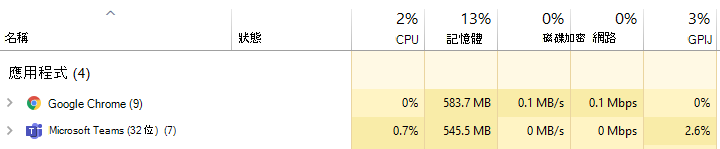
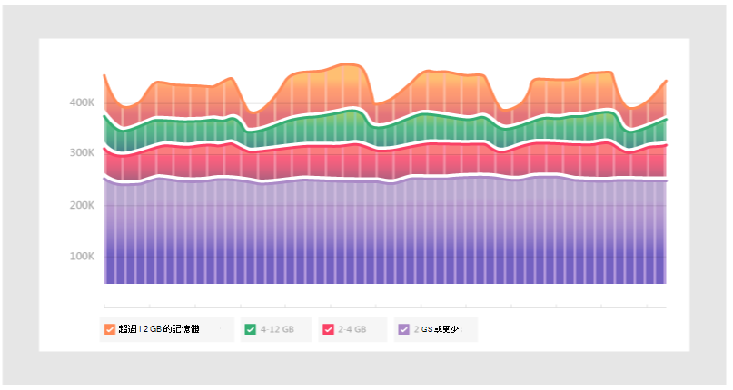
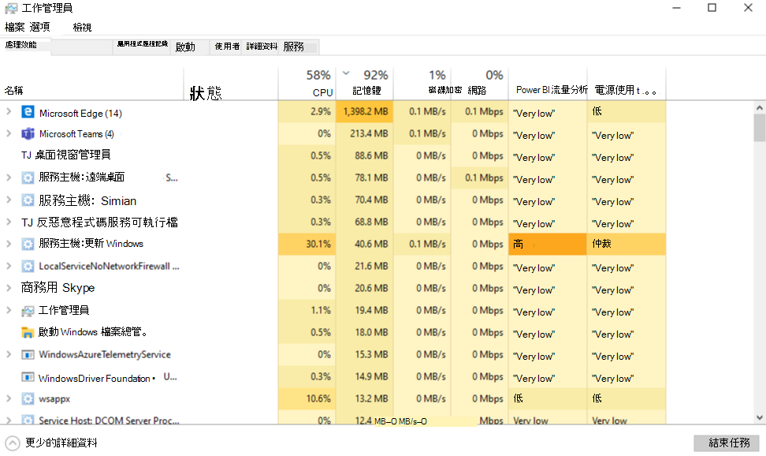
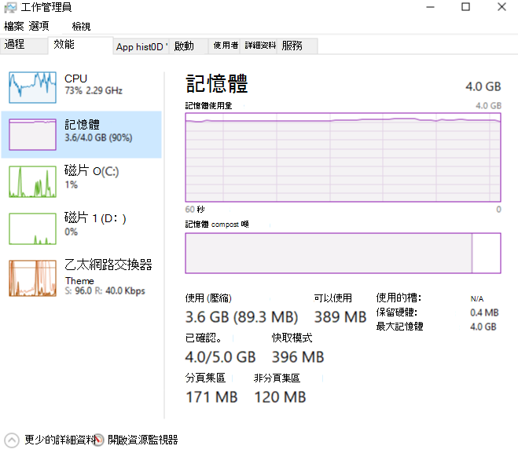

# Microsoft Teams 如何使用記憶體

有些Microsoft Teams使用者對於如何使用記憶體Teams有疑問。 本文將說明 Teams 如何使用記憶體，以及 Teams 桌面應用程式 (應用程式) 和 Teams Web App 為何無法防止同一部電腦上其他應用程式和工作負載有足夠的記憶體以最佳方式執行。 Teams是專為使用新式 Web 技術所設計。 為了達成此目的，Teams桌面用戶端是在電子上開發，它使用 Chromium來呈現。 這是許多現今最熱門的瀏覽器背後的相同呈現引擎，包括 Edge 和 Chrome。

## 如何Teams運作

Teams電子版設計，可以加快開發速度，而且在不同作業系統 Teams、Mac 和 Linux (Windows 之間維持 Teams 版本之間的) 。 這個奇偶性是有可能的，因為電子Chromium在所有版本之間維持相似的程式碼基礎。 此架構的另一個優點，是 Web 應用程式與桌上出版Teams記憶體使用量設定檔類似。 Web App 和桌上出版使用記憶體的方式與瀏覽器的使用方式類似。 有關電子的更多資訊，請流覽 [他們的網站](https://electronjs.org/)。

請參閱[Chromium Chrome](https://www.chromium.org/developers/memory-usage-backgrounder)記憶體中的儲存體使用量和[主要](https://chromium.googlesource.com/chromium/src.git/+/master/docs/memory/key_concepts.md)概念，以瞭解更多資訊。

下圖顯示 Windows 版 Teams 桌面應用程式與此範例中的 Teams Web 應用程式 (在 Google Chrome) 中同時使用) 。

## 中記憶體使用量Teams

瞭解系統記憶體Teams預期的行為，並瞭解真正有問題的系統記憶體問題之症狀，這一點非常重要。

### 預期記憶體使用量Teams

無論您是在Teams或 Teams Web App 中，Chromium偵測可用的系統記憶體量，並運用足夠的記憶體來優化呈現體驗。 當其他應用程式或服務需要系統記憶體時，Chromium程式會放棄記憶體。 Chromium持續Teams調整記憶體使用量，以優化Teams，而不會影響目前執行中的任何其他專案。

如此一來，Chromium工作負載會根據可用的系統記憶體量，使用不同的記憶體量。

下圖說明在四個不同的系統上Teams記憶體使用量，每個系統都有不同的可用記憶體量。 每一個系統正在處理類似的工作負載， (開啟並執行相同的應用程式) 。

當電腦有更多記憶體時，Teams就會使用該記憶體。 在記憶體不足的系統中，Teams使用較少。

### 系統記憶體問題之症狀

如果您在電腦上看到下列一或多個症狀，可能是系統記憶體問題：

- 當多個大型應用程式同時執行時，會使用高記憶體。
- 系統執行速度變慢或應用程式懸空。
- 在所有 App 上持續使用 90% 或更高的系統記憶體使用量。 有了這個記憶體使用量，Teams應該會將記憶體回饋給其他應用程式和工作負載。 持續使用 90% Teams表示系統無法提供記憶體，這表示發生問題。

下列影像顯示當系統記憶體使用量異常高時，Task Manager 中的視圖範例。

