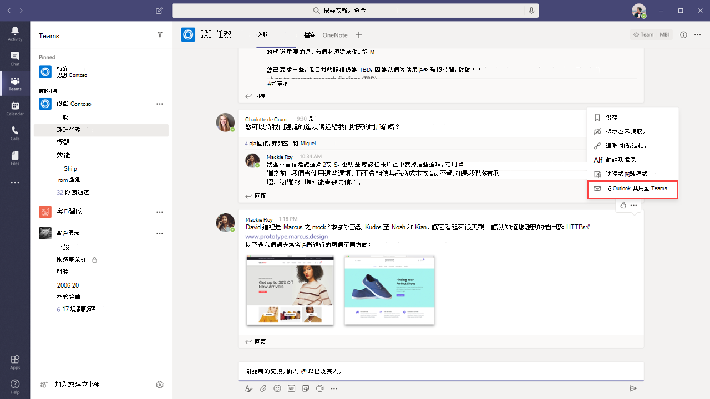

# Teams與Outlook電子郵件整合Teams and Outlook email integration

Microsoft Teams包含的功能，可讓使用者輕鬆在 Outlook 中的電子郵件與 Teams 中的聊天或頻道交談之間共用資訊，並隨時瞭解未接的交談。Microsoft Teams includes features that make it easy for users in your organization to share information between email in Outlook and chat or channel conversations in Teams and to stay on top of missed conversations. 本文提供這些功能和適用之系統管理控制項概觀。This article gives you an overview of these features and the admin controls that apply.

## 共用至OutlookShare to Outlook

**共用至Outlook** 可讓使用者在 Teams 中將交談的一份Outlook共用至電子郵件，而不需要離開Teams。**Share to Outlook** lets users share a copy of a Teams conversation to an email in Outlook, without having to leave Teams. 如果使用者需要與直系小組或甚至貴組織以外的使用者共用交談或狀態更新，這項功能非常實用。This feature is handy if users need to share conversations or status updates with users outside their immediate team or even your organization. 請前往交談的頂端，選取 **Teams Teams 1 1** 個更多選項，然後選取共用 **Outlook。**Go to the top of the conversation in Teams, select **˙˙˙ More options**, and then select **Share to Outlook**.  若要深入瞭解，請參閱從 Outlook[共用Teams。](https://support.office.com/article/share-to-outlook-from-teams-f9dabbe9-9e9b-4e35-99dd-2eeeb67c4f6d)To learn more, see [Share to Outlook from Teams](https://support.office.com/article/share-to-outlook-from-teams-f9dabbe9-9e9b-4e35-99dd-2eeeb67c4f6d).

若要使用這項功能，Outlook使用者必須開啟網頁連結。To use this feature, Outlook on the web must be turned on for the user. 如果Outlook關閉網頁連結，使用者Outlook共用至Teams選項。 If Outlook on the web is turned off, the **Share to Outlook** option isn't displayed in Teams for the user. 若要瞭解如何開啟和關閉網頁Outlook，請參閱啟用或停用Outlook[網頁信箱的瀏覽器](/exchange/recipients-in-exchange-online/manage-user-mailboxes/enable-or-disable-outlook-web-app)。For steps on how to turn on and turn off Outlook on the web, see [Enable or disable Outlook on the web for a mailbox](/exchange/recipients-in-exchange-online/manage-user-mailboxes/enable-or-disable-outlook-web-app).

## 可採取行動的活動電子郵件Actionable activity emails

使用者會自動收到可採取動作的未接活動電子郵件，協助他們趕上未接Teams。Users automatically get actionable missed activity emails which help them to catch up on missed conversations in Teams. 未接的活動電子郵件會顯示來自交談的最新回復，包括未接郵件後所寄的郵件，使用者可以按一下 [回復來直接從 Outlook。 The missed activity emails show the latest replies from a conversation, including messages that were sent after the missed message, and users can click **Reply** to respond directly from within Outlook. 若要深入瞭解，請參閱回復來自 Outlook[的未接Outlook。](https://support.office.com/article/reply-to-missed-activity-emails-from-outlook-bc0cf587-db26-4946-aac7-8eebd84f1381)To learn more, see [Reply to missed activity emails from Outlook](https://support.office.com/article/reply-to-missed-activity-emails-from-outlook-bc0cf587-db26-4946-aac7-8eebd84f1381). 

> [!NOTE]
> 此功能在 Mac 版 Outlook或部分舊版 Outlook中Windows。This feature isn't supported in Outlook for Mac or some older versions of Outlook for Windows. 詳細資訊請參閱群組和群組中的[可Outlook Office 365訊息](/outlook/actionable-messages/)。For more information, see [Actionable messages in Outlook and Office 365 Groups](/outlook/actionable-messages/).

您可以將 [Set-OrganizationConfig](/powershell/module/exchange/organization/set-organizationconfig) Cmdlet 與 **SmtpActionableMessagesEnabled 參數** 一起使用，以關閉可採取動作的電子郵件。You can use the [Set-OrganizationConfig](/powershell/module/exchange/organization/set-organizationconfig) cmdlet together with the **SmtpActionableMessagesEnabled** parameter to turn off actionable emails. 根據預設 **，SmtpActionableMessagesEnabled 參數** 會設為 **true。**By default, the **SmtpActionableMessagesEnabled** parameter is set to **true**. 將參數設定為 **false** 會關閉所有郵件Office 365。Setting the parameter to **false** turns off actionable email messages across Office 365. 對於Teams，這表示未接活動電子郵件中Outlook回復選項無法直接在電子郵件中回復。For Teams users, this means that the **Reply** option to respond directly in Outlook isn't available in missed activity emails. 相反地，未接的活動電子郵件會包含回復 **Teams，讓使用者** 在 Teams 中回復。Instead, the missed activity emails include a **Reply in Teams** option for users to reply in Teams.

另請參閱[群組和群組中的可Outlook Office 365訊息](https://docs.microsoft.com/outlook/actionable-messages/)。See also [Actionable messages in Outlook and Office 365 Groups](https://docs.microsoft.com/outlook/actionable-messages/).
