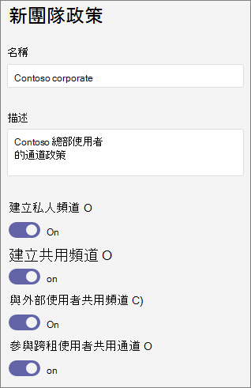

# 管理團隊Microsoft Teams

做為系統管理員，您可以使用團隊策略Microsoft Teams控制貴組織中使用者可以在團隊和頻道中執行哪些工作。 例如，您可以設定是否允許使用者建立私人頻道。

您可以在系統管理中心 **Teams Teams**  >  **管理Microsoft Teams** 團隊策略。 您可以使用全域 (全組織預設值) 原則，或建立並指派自訂原則。 除非您建立並指派自訂原則，否則組織中的使用者將會自動取得全域原則。

您可以編輯全域原則，或建立及指派自訂策略。 編輯全域原則或指派策略後，可能需要幾個小時，變更才能生效。

## 建立自訂團隊策略

1. 在系統管理中心的左側導Microsoft Teams，請前往 **Teams Teams。**  >  
2. 按一下 [新增 **]**。
3. 輸入原則的名稱和描述。

    
4. 視您是否 **要允許使用者**建立私人頻道，開啟或關閉建立私人頻道。

5. 按一下 [儲存]。

## 編輯團隊策略

您可以編輯全域原則或任何您建立的任何自訂策略。

1. 在系統管理中心的左側導Microsoft Teams，請前往 **Teams Teams。**  >  
2. 按一下原則名稱左側來選取原則，然後按一下 [編輯 **]**。
3. 開啟或關閉您想要的設定，然後按一下 [ **儲存**。

## 指派自訂團隊策略給使用者

[!INCLUDE [assign-policy](includes/assign-policy.md)]

## 相關主題

[頻道中的私人Teams](private-channels.md)

[將原則指派給 Teams 中的使用者](assign-policies.md)

[New-CsTeamsChannelsPolicy](/powershell/module/skype/new-csteamschannelspolicy?view=skype-ps)