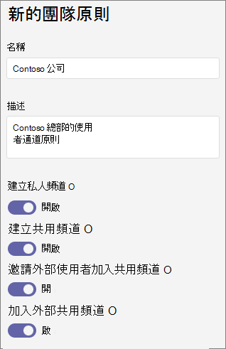

# 管理 Teams 中的頻道原則Microsoft

身為系統管理員，您可以使用 Microsoft Teams 中的原則來控制貴組織中的使用者可以在團隊和頻道中執行的動作。 例如，您可以設定是否允許使用者建立私人或共用頻道。

您可以移至 teams 系統管理 **中心Microsoft** **Teams**  >  原則來管理團隊原則。 您可以使用全域 (全組織預設值) 原則，或建立並指派自訂原則。 除非您建立並指派自訂原則，否則組織中的使用者將會自動取得全域原則。

您可以編輯全域原則，或建立及指派自訂原則。 編輯全域原則或指派原則之後，可能需要 24 小時，變更才會生效。

## 通道原則

下列原則適用于團隊頻道：

|政策|描述|
|:-----|:----------|
|**建立私人頻道**|開 **啟** 時，團隊擁有者和成員可以建立私人頻道。  (團隊擁有者可以控制成員是否可以在每個團隊中建立私人頻道。) |
|**建立共用頻道**|開 **啟** 時，團隊擁有者可以建立共用頻道。 您組織可用的 Teams 應用程式也可在共用頻道中使用。|
|**邀請外部使用者加入共用頻道**|**開啟** 時，共用頻道的擁有者和成員可以邀請已設定跨組織信任之組織的外部參與者。 貴組織的 Teams 原則適用于這些頻道。|
|**加入外部共用頻道**|開 **啟** 時，使用者可以參與由已設定跨組織信任的其他組織所建立的共用頻道。 其他組織的 Teams 原則適用于這些頻道。|

## 建立自訂團隊原則

1. 在 Microsoft Teams 系統管理中心的左側導覽畫面中，移至 **Teams Teams**  >  **原則**。
2. 按一下 [新增 **]**。
3. 輸入原則的名稱和描述。

    
4. 開啟或關閉您要的設定，然後按一下 [ **儲存]**。

5. 按一下 [儲存]。

## 編輯團隊原則

您可以編輯全域原則或您建立的任何自訂原則。

1. 在 Microsoft Teams 系統管理中心的左側導覽畫面中，移至 **Teams Teams**  >  **原則**。
2. 按一下原則名稱左側來選取原則，然後按一下 [編輯 **]**。
3. 開啟或關閉您要的設定，然後按一下 [ **儲存]**。

## 指派自訂團隊原則給使用者

[!INCLUDE [assign-policy](includes/assign-policy.md)]

## 相關主題

[管理 Teams 連線的網站和頻道網站](/SharePoint/teams-connected-sites)

[Teams 中的私人頻道](private-channels.md)

[在 Teams 中將原則指派給使用者](policy-assignment-overview.md)

[New-CsTeamsChannelsPolicy](/powershell/module/skype/new-csteamschannelspolicy)
