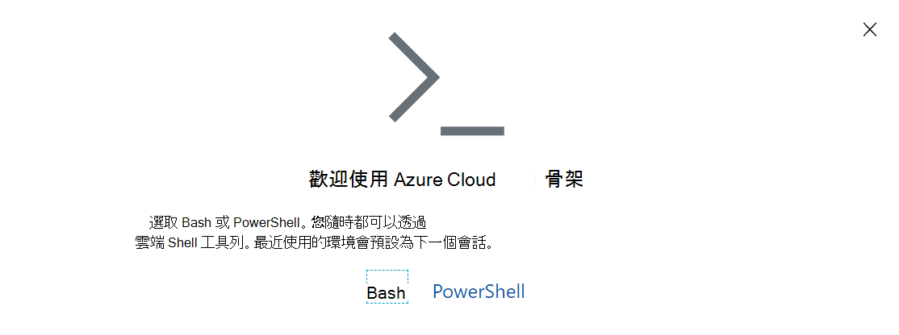

# <a name="manage-teams-with-microsoft-teams-powershell"></a>使用 Microsoft Teams PowerShell 管理 Teams

本文將示範如何使用 Microsoft Teams PowerShell 來管理 Teams 和商務用 Skype。

使用此指導方針搭配[Microsoft Teams Cmdlet 參照](/powershell/teams/?view=teams-ps)和[商務用 Skype Cmdlet 參照](/powershell/skype/intro?view=skype-ps)。

若要在 Teams 系統管理中心管理 Teams，請參閱[使用 Azure Cloud Shell管理 Teams](#manage-teams-with-azure-cloud-shell)。

## <a name="create-and-manage-teams-using-powershell"></a>使用 PowerShell 建立及管理團隊

建立及管理團隊的 Cmdlet 位於 [Microsoft Teams PowerShell 模組](https://www.powershellgallery.com/packages/MicrosoftTeams/)中。

團隊是由Office 365群組所支援，因此當您建立團隊時，您會建立群組。 核心團隊及其設定 (、) 、 ``get-team`` ``set-team`` 管理團隊使用者 ``add-teamuser`` (``new-team`` 、 ``remove-teamuser``) ，以及管理團隊 ``new-teamchannel`` ``remove-teamchannel`` (頻道的 Cmdlet、) ，都提供一組 Cmdlet。 所有這些 Cmdlet 都可以以使用者身分執行，但只能在您擁有或是成員的團隊上運作。 如果您是全域管理員或 Teams 系統管理員，您將能夠對組織中的所有團隊採取行動。

```powershell
New-Team -DisplayName "Contoso Marketing" -Description "Collaboration space for Contoso's Marketing department"
```

> [!NOTE]
> Microsoft Teams PowerShell 模組 Cmdlet 中使用的 **GroupId** 與 Exchange PowerShell 模組中傳 ``Get-UnifiedGroup`` 回的 **Identity** 屬性相同。

## <a name="manage-teams-with-azure-cloud-shell"></a>使用 Azure Cloud Shell管理 Teams

Cloud Shell是可讓您管理資源的互動式、經過驗證且易於瀏覽器存取的殼層。 如需Cloud Shell的詳細資訊，請參閱[Azure Cloud Shell](/azure/cloud-shell/overview)。

若要存取 Azure Cloud Shell並使用 PowerShell 管理 Teams，請登入 Teams 系統管理中心。

1. 選取右上角的Cloud Shell圖示。

    ![含有 [Cloud Shell] 圖示的 Teams 系統管理中心標頭的螢幕擷取畫面。](media/cloud-shell-icon-select.png)

1. 出現提示時，選擇 **[PowerShell]**。

    

1. 執行下列命令以啟動 Teams PowerShell 會話：

    ```powershell
    Connect-MicrosoftTeams
    ```

完成這些步驟之後，就可以執行 Teams PowerShell 命令。

> [!IMPORTANT]
> 如果您想要使用 Cs* Cmdlet，您必須先使用 ``Connect-MicrosoftTeams -UseDeviceAuthentication`` 命令連線到 Teams。

## <a name="manage-policies-via-powershell"></a>透過 PowerShell 管理原則

> [!NOTE]
> - 商務用 Skype Online Connector 會合並至 Teams PowerShell。 商務用 Skype Teams PowerShell 模組中原生提供套用至 Teams 的 Online Cmdlet。 安裝步驟可在 [安裝 Teams PowerShell](teams-powershell-install.md) 一文中取得。
> - 一旦您連線到 Teams，Cmdlet 就會在 PowerShell 會話中使用。 如需詳細資訊，請參閱[使用 Office 365 PowerShell 管理 商務用 Skype Online](/office365/enterprise/powershell/manage-skype-for-business-online-with-office-365-powershell)。

在 商務用 Skype [Cmdlet 模組](/powershell/module/teams)中尋找管理原則的 Cmdlet。

原則是一組可細化套用至個別使用者的設定。 每個原則類型都有一組自己的 Cmdlet，用於建立、檢視、刪除及更新原則本身，然後將這些原則指派給使用者。 一般結構為：

- **GET** 命令 (例如 ``Get-CsTeamsMeetingPolicy``) ：傳回您可在組織中指派的原則檔，包括 Microsoft 為您建立的原則，以及您建立的自訂原則。
  - 若只要尋找您在組織中建立的自訂原則，請使用 ``-Filter "tag:*"`` 。

- **新** 命令 (例如 ``New-CsTeamsMeetingPolicy``) ：為貴組織建立新原則，以指派給組織中的使用者。 並非所有原則都支援建立自訂原則。 這通常是為了確保您在組織中使用的原則具有支援的設定組合。

- **設定** 命令 (例如) ``Set-CsTeamsMeetingPolicy`` ：根據指定原則設定特定值。 某些原則沒有可用的 SET 命令，或包含無法在原則中自訂的參數。 PowerShell 描述會告訴您哪些參數無法自訂。
  - 若要編輯預設會指派給組織中未指派自訂原則之使用者的原則，請執行 ``Set-Cs<PolicyName> -Identity Global`` 。

- **移除** (命令， ``Remove-CsTeamsMeetingPolicy`` 例如) ：刪除已在租使用者中建立的自訂原則。 如果您刪除已指派給組織中至少一個使用者的自訂原則，該使用者將會回復到全域原則。
  - 您無法實際移除組織中的全域原則，但如果您想要將貴組織的全域原則重設為 Microsoft 提供的預設設定，請執行 ``Remove-Cs<PolicyName> -Identity Global`` 。

- **GRANT** 命令 (例如， ``Grant-CsTeamsMeetingPolicy``) ：指派原則給特定使用者。
  - 若要移除自訂原則指派，並讓使用者回復到貴組織的預設原則，請執行 ``Grant-Cs<PolicyName> -Identity <User Identity> -PolicyName $null`` 。

> [!TIP]
> 並非所有原則都允許建立自訂原則，而且有些原則有您無法自訂 (的設定，因此您可以檢視設定，但無法在) 期間 ``set-`` ``new-`` 設定自訂值。 每個 Cmdlet 的檔會指出參數是否可供客戶使用。

常見參數：

- **身分** 識別：對於 ``Get-`` 、 ``Set-`` 、 ``New-`` 和 ``Remove-`` ， **身分識別** 參數一律會參照特定的原則實例。 針對 ``Grant`` ，身分 **識別** 參數是指套用原則的特定使用者物件。

## <a name="manage-configurations-via-powershell"></a>透過 PowerShell 管理設定

在 商務用 Skype [Cmdlet 模組](/powershell/module/skype)中尋找管理您設定的 Cmdlet。

組態是服務中維護的設定貯體，無法在使用者層級指定。 設定一律會套用至整個組織。 您的全域設定是貴組織中唯一有效的設定。 每個組態類型都隨附兩個主要 Cmdlet：

- ``Get-Cs<ConfigurationName>`` (例如， ``Get-CsTeamsClientConfiguration``) ：

- [設定] 命令 (例如， ``Set-CsTeamsClientConfiguration``) ：設定該類型的屬性。 指定您要修改的參數。
    > [!NOTE]
    > 您可以使用下列兩種方式之一參照您要修改的設定：指定 -**Identity Global** 或執行 ``Get-Cs<ConfigurationName>``  |  ``Set-Cs<ConfigurationName>`` 。

## <a name="what-can-each-admin-role-do"></a>每個系統管理員角色可以做什麼？

請閱讀 [使用 Microsoft Teams 系統管理員角色管理 Teams](using-admin-roles.md) ，以瞭解哪些系統管理員角色可以執行每個 PowerShell Cmdlet。

## <a name="related-topics"></a>相關主題

[安裝 Teams PowerShell](teams-powershell-install.md)

[Teams PowerShell 版本資訊](teams-powershell-release-notes.md)

[Teams cmdlet 參考資料](/powershell/teams/?view=teams-ps)

[商務用 Skype Cmdlet 參照](/powershell/skype/intro?view=skype-ps)

[使用 Teams 系統管理員角色來管理 Teams](using-admin-roles.md)
