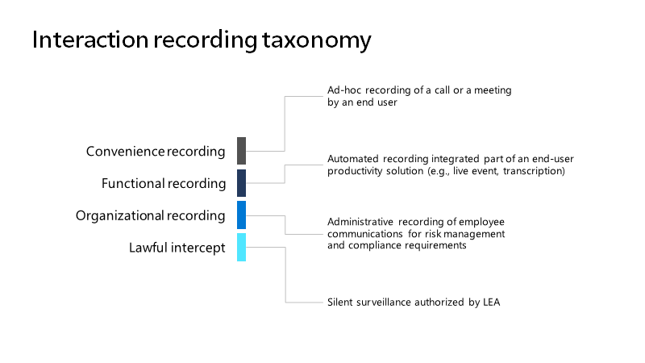

# <a name="introduction-to-teams-policy-based-recording-for-callings--meetings"></a>Teams 會議通話以&簡介

以政策為基礎的錄製可讓採用 Microsoft Teams 的組織使用系統管理政策，自動錄製電話和線上會議，並視相關公司或法規政策的要求，記錄電話和線上會議，以用於後續處理和保留。

Teams 已經過增強，支援整合協力廠商錄製解決方案，包括平臺功能、使用者體驗，以及提供端對端解決方案以用於安裝、管理、錄製、儲存及分析 Teams 通訊所需的系統管理介面。 增強功能包括通訊平臺 API 和錄製事件，提供：

- 在裝置和所有支援的端點之間無縫、高品質的媒體捕獲，以用於音訊、視視、螢幕分享和聊天。

- 支援 Teams 使用者與 Teams、Teams Mobile、商務用 Skype、PSTN (支援通話端點之間的互動) 

- 合規性記錄的新系統管理政策，包括與現有的 Teams 系統管理通話和會議工具和政策整合

Microsoft 365 A3/A5/E3/E5/Business Premium 和 Office 365 A3/A5/E3/E5 使用者可以啟用合規性錄製功能。 

合規性錄製解決方案整合功能在 Ignite 2019 的合規性錄製和 Microsoft Teams 會話中也 [<span class="underline">受到審查</span>](https://myignite.microsoft.com/archives/IG19-VCE40)。

## <a name="teams-interaction-recording-overview"></a>Teams 互動錄製概觀

互動錄製使用案例可以有效分成四個主要的錄製功能類別：便利性、功能、組織及合法截距，如影像所示：



每個類別對於開始錄製的方式、錄製內容、錄製的儲存位置、收到通知者、控制存取權的人，以及保留的處理方式，都有不同的需求。

| 類型                   | 方便 (一般團隊錄製)  | 組織 - 受規範 (合規性錄製)  |
| ---------------------- | ------------------ | --------------- |
| 引發              | 使用者               | 系統 (管理員)   |
| 目標                 | 每通話/會議 | 每個使用者        |
| 儲存空間擁有者          | 使用者               | 合規性      |
| 需要通知嗎？ | 是                | 是             |
| Access 擁有者           | 使用者               | 合規性      |
| 保留政策？      | 選用           | 是             |

Teams 提供各種功能，方便 [<span class="underline">您</span>](https://docs.microsoft.com/microsoftteams/cloud-recording) 錄製會議和即時活動的功能。 組織錄製是指讓採用 Teams 通話和會議的組織，能夠根據系統管理政策，自動錄製電話和線上會議，然後根據相關公司或法規政策的要求，錄製電話和線上會議，以便後續處理和保留。 根據此政策的使用者會知道，正在錄製與 Teams 的數位互動，但無法停用錄製，且互動完成後將無法存取錄製內容。 錄製成為組織檔案的一部分，可供合規性和法務人員使用，以用於電子檔探索、法務保存及其他公司保留用途。

## <a name="example-user-needs"></a>範例使用者需求

<table>
<thead>
<tr class="header">
<th><strong>角色</strong></th>
<th><strong>需要</strong></th>
</tr>
</thead>
<tbody>
<tr class="odd">
<td>已錄製的使用者</td>
<td><ul>
<li><p>進行錄製時收到通知。</p></li>
<li><p>當策略和/或錄製器錯誤導致通話行為變更時，請通知您。</p></li>
</ul></td>
</tr>
<tr class="even">
<td>通訊系統管理員</td>
<td><ul>
<li><p>瞭解將錄製原則適用于 Teams 使用者/端點的原因及方法。</p></li>
<li><p>設定及維護組織的 Teams 錄製政策。</p></li>
<li><p>監控和疑難排解 Teams 通話和會議的錄製相關問題。</p></li>
<li><p>支援內部合規性人員，提供使用方式、品質及可靠性的營運分析。</p></li>
</ul></td>
</tr>
<tr class="odd">
<td>合規性人員</td>
<td><ul>
<li><p>以符合適當地區邊界之合規性義務的方式收集所有 Teams 通訊。</p></li>
<li><p>根據與通訊相關的中繼資料或互動內容搜尋互動。 常見範例包括：</p>
<ul>
<li><p><strong>中繼資料</strong> - 參與者， 時間， 方向， 撥號號碼， 起始號碼， 自訂商務資料</p></li>
<li><p><strong>內容</strong> – 文字抄寫、情緒、語音、相關互動</p></li>
</ul></li>
<li><p>分析收集的通訊並與其互動，包括收集互動時監控互動的能力。</p></li>
<li><p>確保收集通訊的安全性，並防止所有階段遭到竄改。</p></li>
</ul></td>
</tr>
</tbody>
</table>

## <a name="solution-architecture-overview"></a>解決方案架構概觀

合規性錄製解決方案已與 Teams 整合，如下圖所示：


## <a name="recorder"></a>答錄機

合規性錄製解決方案的核心元件是錄製器。
錄製器是建立為可縮放的 Azure 型服務 (Bot) 運用 Microsoft [<span class="underline">的通訊</span>](https://docs.microsoft.com/graph/cloud-communications-concept-overview) 平臺，並註冊為 Microsoft Graph 應用程式。 錄製器提供與 Teams 通話和會議通訊平臺 [<span class="underline">API</span>](https://docs.microsoft.com/graph/api/resources/communications-api-overview?view=graph-rest-1.0) 的直接互動，並提供媒體的端點。

提供 [<span class="underline">範例合規性記錄器應用程式</span>](https://github.com/microsoftgraph/microsoft-graph-comms-samples/tree/a3943bafd73ce0df780c0e1ac3428e3de13a101f/Samples/BetaSamples/LocalMediaSamples/ComplianceRecordingBot) ，顯示如何設定 Bot、建立應用程式實例及指派合規性政策。 範例中也有 API 使用方式的範例，可錄製特定互動，例如[<span class="underline"></span>](https://github.com/microsoftgraph/microsoft-graph-comms-samples/blob/a3943bafd73ce0df780c0e1ac3428e3de13a101f/Samples/BetaSamples/LocalMediaSamples/ComplianceRecordingBot/FrontEnd/Http/Controllers/PlatformCallController.cs#L199-L244)處理來電路由、[<span class="underline"></span>](https://github.com/microsoftgraph/microsoft-graph-comms-samples/blob/a3943bafd73ce0df780c0e1ac3428e3de13a101f/Samples/BetaSamples/LocalMediaSamples/ComplianceRecordingBot/FrontEnd/Bot/CallHandler.cs#L135-L138)變更錄製狀態，以及移除正在[<span class="underline">錄製的使用者</span>](https://github.com/microsoftgraph/microsoft-graph-comms-samples/blob/a3943bafd73ce0df780c0e1ac3428e3de13a101f/Samples/BetaSamples/LocalMediaSamples/ComplianceRecordingBot/FrontEnd/Bot/CallHandler.cs#L121-L126)。
您可以在此找到特定 API 上的圖形檔，以用於[<span class="underline">updateRecordingStatus 和</span>](https://docs.microsoft.com/graph/api/call-updaterecordingstatus?view=graph-rest-1.0&tabs=http) [<span class="underline">incomingCoNtext。</span>](https://docs.microsoft.com/graph/api/resources/incomingcontext?view=graph-rest-1.0)

錄製器服務的確切執行方式會因合作夥伴而異，但必須設計成支援多個錄製器，才能達到部署的高可用性和地理位置分配，以減少從 Teams 到錄製器的延遲。 此外，預計錄製器本身在設計時會考慮復原和重複。

合作夥伴必須先向 Microsoft 確認 Microsoft Graph 通訊 API 和 SDK 的最低發行版本本，才能提交認證解決方案，以確保合規性錄製整合的所有需求都受到支援。

合規性記錄案例的兩項基本需求為：

- 錄製器 Bot 必須在 Azure 中部署

- 錄製器 Bot 必須在 Azure 的 Windows VM 上執行

Azure 和 Windows VM 需求僅適用于 Teams Bot 元件，這表示合作夥伴可以實施他們選擇的其他平臺，但必須符合合規性錄製的相關績效和功能需求。

## <a name="compliance-recording-policy-assignment-and-provisioning"></a>合規性錄製政策指派和設置

IT 系統管理員可以建立並指派合規性錄製政策，決定要錄製哪些使用者，以及將針對每個使用者使用哪些錄製器。 當通訊互動進行時，錄製者會自動根據這些策略的組式邀請參與交談。 合規性錄製原則是使用 [<span class="underline">Microsoft PowerShell 管理</span>](https://docs.microsoft.com/microsoftteams/teams-powershell-overview) ，而且可針對每個組織的租使用者、每個使用者及安全性群組層級進行申請。 您可以找到更多有關 Microsoft Docs [<span class="underline">會議政策</span>](https://docs.microsoft.com/microsoftteams/meeting-policies-in-teams)、 [<span class="underline">通話政策</span>](https://docs.microsoft.com/microsoftteams/teams-calling-policy) 及  [<span class="underline">群組原則的資訊</span>](https://docs.microsoft.com/microsoftteams/assign-policies#assign-a-policy-to-a-group)。

1. 在租使用者中建立應用程式實例。

   ```powershell
   PS C:\> New-CsOnlineApplicationInstance -UserPrincipalName cr.instance@contoso.onmicrosoft.com -DisplayName ComplianceRecordingBotInstance -ApplicationId fcc88ff5-a42d-49cf-b3d8-f2e1f609d511

   RunspaceId        : 4c13efa6-77bc-42db-b5bf-bdd62cdfc5df
   ObjectId          : 5069aae5-c451-4983-9e57-9455ced220b7
   TenantId          : 5b943d7c-5e14-474b-8237-5022eb8e0dc9
   UserPrincipalName : cr.instance@contoso.onmicrosoft.com
   ApplicationId     : fcc88ff5-a42d-49cf-b3d8-f2e1f609d511
   DisplayName       : ComplianceRecordingBotInstance
   PhoneNumber       :
   ```

   ```powershell
   PS C:\> Sync-CsOnlineApplicationInstance -ObjectId 5069aae5-c451-4983-9e57-9455ced220b7
   ```

2. 建立合規性錄製政策。

   ```powershell
   PS C:\> New-CsTeamsComplianceRecordingPolicy -Identity TestComplianceRecordingPolicy -Enabled $true -Description "Test policy created by tenant admin"

   Identity                        : Global
   ComplianceRecordingApplications : {}
   Enabled                         : True
   WarnUserOnRemoval               : True
   Description                     : Test policy created by tenant admin
   ```

   ```powershell
   PS C:\> Set-CsTeamsComplianceRecordingPolicy -Identity TestComplianceRecordingPolicy `
   -ComplianceRecordingApplications @(New-CsTeamsComplianceRecordingApplication -Id 5069aae5-c451-4983-9e57-9455ced220b7 -Parent TestComplianceRecordingPolicy)
   ```

   [<span class="underline">Set-CsTeamsComplianceRecordingPolicy</span>](https://docs.microsoft.com/powershell/module/skype/set-csteamscompliancerecordingpolicy?view=skype-ps)

3. 指派合規性錄製政策給使用者。

   ```powershell
   PS C:\> Grant-CsTeamsComplianceRecordingPolicy -Identity testuser@contoso.onmicrosoft.com -PolicyName TestComplianceRecordingPolicy
   ```

   [<span class="underline">Grant-CsTeamsComplianceRecordingPolicy</span>](https://docs.microsoft.com/powershell/module/skype/grant-csteamscompliancerecordingpolicy?view=skype-ps)

   ```powershell
   PS C:\> Get-CsOnlineUser testuser@contoso.onmicrosoft.com | select SipAddress, TenantId, TeamsComplianceRecordingPolicy | fl

   UserPrincipalName              : testuser@contoso.onmicrosoft.com
   TenantId                       : 5b943d7c-5e14-474b-8237-5022eb8e0dc9
   TeamsComplianceRecordingPolicy : TestComplianceRecordingPolicy
   ```

## <a name="user-experiences"></a>使用者體驗

使用 Teams 用戶端體驗啟用通知支援。 體驗可以是視覺或音訊。

**Teams 用戶端 - 視覺注意事項**
- 桌面/Web
- 行動 (iOS/Android) 
- Teams 電話
- Teams 會議室

**其他端點 - 音訊注意事項**
- SIP 電話
- 商務用 Skype
- 音訊會議
- PSTN 來電者

## <a name="compliance-recording-for-teams-certification-programs"></a>Teams 認證計畫合規性錄製

除了發佈可讓合作夥伴開發並整合 CCaaS 解決方案與 Teams 的公開 API 之外，我們開發 Microsoft Teams 認證計畫的合規性記錄，讓客戶能確保每個參與合作夥伴的解決方案都經過測試與驗證，以提供他們預期從 Microsoft 解決方案獲得的品質、相容性和可靠性。  

下列合作夥伴已認證其 Microsoft Teams 解決方案。

|夥伴|解決方案網站 |
|:--|:--|
|ASC Technologies |[https://www.asctechnologies.com/english/ASC_Recording_Insights_Compliance_Recording_for_Microsoft_Teams.html](https://www.asctechnologies.com/english/ASC_Recording_Insights_Compliance_Recording_for_Microsoft_Teams.html) |
|AudioCodes |[https://www.audiocodes.com/solutions-products/voiceai/meetings-and-recording/smarttap-360](https://www.audiocodes.com/solutions-products/voiceai/meetings-and-recording/smarttap-360) |
|配音器 |[https://www.dubber.net/call-recording/](https://www.dubber.net/call-recording/) |
|好 |[https://www.niceactimize.com/compliance/ms-teams-recording.html](https://www.niceactimize.com/compliance/ms-teams-recording.html) |


下列合作夥伴正在認證其 Microsoft Teams 解決方案。

|夥伴|解決方案網站 |
|:--|:--|
|CallCabinet |[https://www.callcabinet.com/compliance-microsoft-teams-call-recording](https://www.callcabinet.com/compliance-microsoft-teams-call-recording ) |
|Landis Technologies |[https://landistechnologies.com/](https://landistechnologies.com/) |
|Luware |[https://luware.com/en/solution/microsoft-teams-recording/](https://luware.com/en/solution/microsoft-teams-recording/) |
|Numonix |[https://numonix.cloud](https://numonix.cloud)    |
|力克創新 |[https://www.oakinnovate.com/call-recording](https://www.oakinnovate.com/call-recording) |
|紅色方塊 |[https://www.redboxvoice.com/compliance-recording-for-microsoft-teams](https://www.redboxvoice.com/compliance-recording-for-microsoft-teams)  |
|Verint |[https://www.verba.com/solutions/microsoft-teams-recording](https://www.verba.com/solutions/microsoft-teams-recording) |

當更多合作夥伴加入並符合認證準則時，此清單將會更新。

## <a name="next-steps"></a>後續步驟

如果您是尋求加入認證計畫的廠商，請寄<a href= "mailto:Teamscategorypartner@microsoft.com">郵件Teamscategorypartner@microsoft.com。</a>
