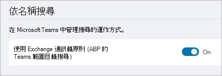

# 使用 Microsoft 團隊範圍的目錄搜尋

Microsoft 團隊範圍的目錄搜尋可讓組織建立虛擬邊界, 以控制使用者如何在組織中找到其他使用者並與之通訊。 

Microsoft 團隊可讓組織為使用者提供目錄的自訂視圖。 Microsoft 團隊使用[Exchange 通訊錄原則](https://docs.microsoft.com/exchange/address-books/address-book-policies/address-book-policies)來支援這些自訂視圖。 啟用原則後, 搜尋由其他使用者所傳回的結果 (例如, 啟動聊天或將成員新增至團隊) 將會根據設定的原則來設定範圍。 當作用中的搜尋生效時, 使用者將無法搜尋或探索團隊。 

## 您何時應該使用範圍的目錄搜尋？

從範圍目錄搜尋獲益的案例, 與通訊錄原則案例類似。 例如, 您可能會想在下列情況下使用範圍內的目錄搜尋:

- 貴組織在其租使用者中有多個公司, 您想要彼此分隔。 
- 您的學校想要限制教職員和學生之間的聊天。 
 
若要瞭解如何使用通訊錄原則, 請參閱[Exchange Online 中的通訊錄原則](https://docs.microsoft.com/exchange/address-books/address-book-policies/address-book-policies)。

> [!IMPORTANT]
> 通訊錄原則只提供從目錄角度來看使用者的虛擬隔離。 使用者仍可提供完整的電子郵件地址, 以與其他人發起通訊。 另外, 請務必注意, 在強制執行新的或更新的通訊錄原則之前, 已進行過快取的任何使用者資料, 都會持續提供給最多30天的使用者。

## 開啟作用中的目錄搜尋

1. 使用通訊錄原則將您的組織設定為虛擬子群組。 如需詳細資訊, 請參閱[通訊錄原則的程式](https://docs.microsoft.com/exchange/address-books/address-book-policies/address-book-policies)。

2. 在 Microsoft [團隊管理中心] 中, 選取 [全**組織性設定** > **團隊設定**]。

3. 在 [**搜尋**] 底下, 在**使用 Exchange 通訊錄原則 (APB)** 的 [小組] 中的 [範圍**** 目錄搜尋] 旁, 開啟 [開啟]。

    

