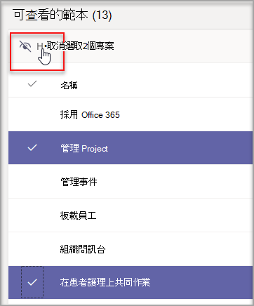
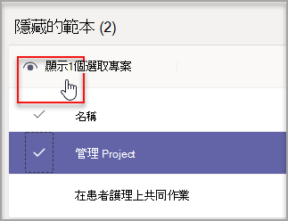
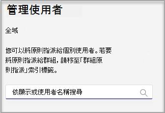
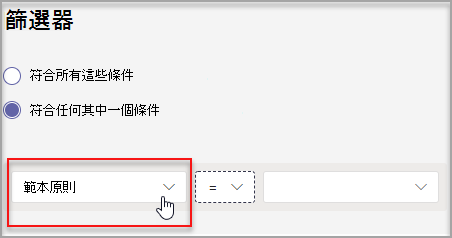

# 在系統管理中心管理 Teams 範本

在系統管理中心建立範本政策，管理使用者看到的 Teams 範本。 在每個範本策略中，您可以指定顯示或隱藏哪些範本。
將不同的使用者指派給不同的範本策略，讓使用者只查看指定的 Teams 範本子集。

請觀看這段短片，瞭解如何管理範本策略。

> [!VIDEO https://www.microsoft.com/videoplayer/embed/RWyXL9]

## 建立範本策略並指派可用的範本

1. 登入 Teams 系統管理中心。

2. 展開 **Teams**  >  **範本政策**。

3. 選取 [新增 **]**。

    

1. 在範本 **策略設定區** 段，完成下欄欄位：

    - 範本策略名稱

    - 範本策略簡短描述

2. 在可 **查看的範本資料** 表中，選取您想要隱藏的範本， **然後選取** 隱藏 。

    

    您可以在隱藏範本資料表中看到您選取要 **隱藏的** 範本。

1. 若要取消隱藏特定範本，請卷起至隱藏 **範本** 資料表。

2. 選取要取消隱藏的範本， **然後選取** 顯示 。

   

   選取的範本會顯示在可查看 **的範本資料** 表中。
3. 選取 **儲存**。

   您的新範本策略會顯示在範本 **策略清單中** 。

## 將使用者指派給範本策略

指派給策略的使用者只能查看該策略內的可查看範本。

1. 從 **範本政策** 中，選取一個策略，然後選取管理 **使用者**。

2. 輸入要指派給此策略的使用者。

   

3. 選取 **Apply**。

> [!Note]
> 您的新政策最多可能需要 24 小時，才能對使用者生效。

## 範本政策的大小限制

每個策略最多可以隱藏 100 個範本。 如果 **已** 隱藏 100 個範本，則停用了隱藏按鈕。

## 常見問題集

**問：我可以批次將使用者指派給小組範本政策嗎？**
  
答：是，我們支援 PowerShell 中範本策略的批次指派。 此動作的策略類型為 TeamsTemplatePermissionPolicy。 [瞭解更多資訊](/powershell/module/teams/new-csbatchpolicyassignmentoperation)

**問：群組可以指派給小組範本政策嗎？**

答：目前否。 這項功能將在未來提供。

**問：如果已建立新範本，範本會包含在我的政策中嗎？**

答：任何新範本預設都會顯示。 您可以在範本政策區段的系統管理中心選擇隱藏範本。

**問：刪除範本時會發生什麼情況？**

答：任何已刪除的範本將不再存在於任何範本政策中。

**問：我可以在 Teams 系統管理中心將多個使用者指派給範本策略嗎？**

答：是。

1. 在系統管理中心，前往 **使用者**。
1. 在使用者清單表格中，選取要指派給特定範本策略的使用者。
1. 選取編輯設定，然後變更範本政策欄位。
1. 選取 Apply。
   深入瞭解 [在 Microsoft Teams - Microsoft Teams \| Microsoft Docs 中指派策略給使用者](./assign-policies.md#assign-a-policy-to-a-batch-of-users)。

**問：如何查看指派給特定策略的所有使用者？**

答：在系統管理中心：

1. 前往 **使用者區** 段。
2. 在使用者清單資料表中選取篩選，然後針對團隊範本策略進行篩選。
3. 選取 **Apply**。

**問：我可以透過 PowerShell 管理範本政策嗎？**

答：否，不支援在 PowerShell 中管理範本。

**問：範本政策是否適用于 EDU？**

答：否，不支援 EDU 的範本策略。

## 相關主題

- [在系統管理中心開始使用小組範本](./get-started-with-teams-templates-in-the-admin-console.md)

- [建立自訂小組範本](./create-a-team-template.md)

- [從現有的小組建立範本](./create-template-from-existing-team.md)

- [從現有的小組範本建立小組範本](./create-template-from-existing-template.md)

- [在 Microsoft Teams 中指派策略給使用者 - Microsoft Teams \| Microsoft Docs](./assign-policies.md)

- [將使用者批次指派給策略](/powershell/module/teams/new-csbatchpolicyassignmentoperation)