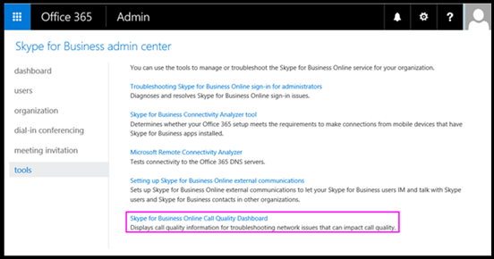

# 開啟並使用 Microsoft 團隊及商務用 Skype Online 的通話品質儀表板Turning on and using Call Quality Dashboard for Microsoft Teams and Skype for Business Online

瞭解如何設定您的 Office 365 組織, 以使用通話品質儀表板來監控通話品質。Learn how to configure your Office 365 organization to use the Call Quality Dashboard to monitor call quality.
  
Microsoft 團隊和商務用 Skype Online 的通話品質儀表板 (CQD) 可讓您深入瞭解使用 Microsoft 團隊和商務用 Skype 服務所進行的通話品質。The Call Quality Dashboard (CQD) for Microsoft Teams and Skype for Business Online allows you to gain insights into the quality of calls made using Microsoft Teams and Skype for Business services. 本主題描述開始收集資料所需完成的步驟。This topic describes the steps you'll need to complete to start collecting data.
  
  
## 最新變更與更新Latest changes and updates

最近的 CQD 變更如下所示:The most recent changes to CQD are as follows:
  
- 包括 Microsoft 團隊資料 (除了商務用 Skype Online 資料之外)。Includes Microsoft Teams data in addition to Skype for Business Online data.
    
- 摘要報告包含 [產品] 篩選器, 可供您選取 [所有資料]、[Microsoft 團隊資料] 或 [商務用 Skype Online] 資料。Summary reports include a product filter to select all data, Microsoft Teams data, or Skype for Business Online data.

- 已更新視頻與 VBSS 資料流程品質分類邏輯。Video and VBSS stream quality classification logic has been updated. 請參閱[通話品質儀表板中的資料流程分類](stream-classification-in-call-quality-dashboard.md), 以取得最新的分類器定義。Refer to [Stream Classification in Call Quality Dashboard](stream-classification-in-call-quality-dashboard.md) for the latest classifier definitions.

請參閱這篇文章, 以取得[通話品質儀表板中提供的維度與量值](dimensions-and-measures-available-in-call-quality-dashboard.md)的清單。Refer to this article for a list of [Dimensions and measures available in Call Quality Dashboard](dimensions-and-measures-available-in-call-quality-dashboard.md).
  
> [!NOTE]
> 您可以按一下 [**好消息**] 中的連結, 找到有關儀表板更新和變更的資訊!Information about updates and changes to the dashboard can be found by clicking the link in the **Good news!** 顯示在儀表板上的橫幅。banner when it is displayed on the dashboard.
  
## 啟動 Microsoft 通話品質儀表板 (CQD) 摘要報告Activate Microsoft Call Quality Dashboard (CQD) Summary Reports

在您開始使用 CQD 之前, 您必須針對您的 Office 365 組織啟用它。Before you can start using the CQD, you'll need to activate it for your Office 365 organization.

 **使用 microsoft [團隊管理中心**] 顯示 Microsoft 團隊標誌的圖示 **Using the Microsoft Teams admin center**
 
1. 使用 Microsoft 團隊服務系統管理員帳戶登入您的 Office 365 組織, 然後選取 [系統**管理**] 磚以開啟系統管理中心。Sign in to your Office 365 organization using Microsoft Teams service admin account, and then select the **Admin** tile to open the Admin center.
    
2. 在左窗格中的 [系統**管理中心**] 底下, 選取 [ **microsoft 團隊**] 以開啟 microsoft 團隊系統管理中心。In the left pane, under **Admin centers**, select **Microsoft Teams** to open the Microsoft Teams admin center.
    
3. 在 Microsoft [團隊管理中心] 中, 選取左窗格中的 [**通話品質儀表板**]。In the Microsoft Teams admin center, select **Call quality dashboard** in the left pane.
    
  
4. 在開啟的頁面上, 使用您的全域系統管理員帳戶或 Microsoft 團隊服務系統管理員帳戶登入, 然後在出現提示時提供該帳戶的認證。On the page that opens, sign in with your Global Administrator account or Microsoft Teams Service Admin account, and then provide the credentials for the account when prompted.
    
     ![顯示 [認證提示] 的螢幕擷取畫面](media/ac4c1699-d8c1-4bda-af30-0fec35b5fd22.png)
  
登入後, CQD 就會開始收集及處理資料。After you sign in, once activated, the CQD will begin collecting and processing data.  
> [!NOTE]
> 可能需要幾個小時的時間來處理足夠的資料, 才能在報表中顯示有意義的結果。It may take a couple of hours to process enough data to display meaningful results in the reports. 

 **使用商務用 skype 系統管理中心**顯示商務用 skype 標誌的圖示 **Using the Skype for Business admin center**
 
1. 使用系統管理員帳戶登入您的 Office 365 組織, 然後選取 [系統**管理**] 磚以開啟系統管理中心。Sign in to your Office 365 organization using an admin account, and then select the **Admin** tile to open the Admin center.
    
2. 在左窗格中的 [系統**管理中心**] 底下, 選取 [**商務用 skype** ] 以開啟商務用 skype 系統管理中心。In the left pane, under **Admin centers**, select **Skype for Business** to open the Skype for Business admin center.
    
3. 在商務用 Skype 系統管理中心中, 選取左窗格中的 [**工具**], 然後選取 [**商務用 Skype Online 通話品質儀表板**]。In the Skype for Business admin center, select **Tools** in the left pane, and then select **Skype for Business Online Call Quality Dashboard**.
    
     
  
4. 在開啟的頁面上, 使用您的全域系統管理員帳戶登入, 然後在出現提示時提供該帳戶的認證。On the page that opens, sign in with your Global Administrator account, and then provide the credentials for the account when prompted.
    
     ![顯示 [認證提示] 的螢幕擷取畫面](media/ac4c1699-d8c1-4bda-af30-0fec35b5fd22.png)
  
登入後, CQD 就會開始收集及處理資料。After you sign in, once activated, the CQD will begin collecting and processing data.

  
## Microsoft 團隊和商務用 Skype Online 的通話品質儀表板功能Features of the Call Quality Dashboard for Microsoft Teams and Skype for Business Online 

CQD 摘要報告提供規劃詳細報告之功能的子集。CQD Summary Reports provide a subset of the features planned for Detailed Reports. 這兩種版本之間的差異摘要如下:The differences between the two editions are summarized here:
  
|**功能****Feature**|**摘要報告****Summary Reports**|**詳細報告****Detailed Reports**|
|:-----|:-----|:-----|
|應用程式共用躍點數Application sharing metric    |不No    |是的Yes    |
|客戶建立資訊支援Customer building information support    |是的Yes    |是的Yes    |
|用戶端點資訊支援Customer endpoint information support    |僅限 cqd.teams.microsoft.comOnly in cqd.teams.microsoft.com    |僅限 cqd.teams.microsoft.comOnly in cqd.teams.microsoft.com    |
|向下切入分析支援Drill-down analysis support    |不No    |是的Yes    |
|媒體可靠性度量單位Media reliability metrics    |不No    |是的Yes    |
|外框報告Out-of-the-box reports    |是的Yes    |是的Yes    |
|[總覽] 報表Overview reports    |是的Yes    |是的Yes    |
|每個使用者的報表集Per-user report set    |不No    |是的Yes    |
|報表集自訂 (新增、刪除、修改報告)Report set customization (add, delete, modify reports)    |不No    |是的Yes    |
|以影片為基礎的畫面共用規格Video-based screen sharing metrics    |不No    |是的Yes    |
|影片度量單位Video metrics    |不No    |是的Yes    |
|可用的資料量Amount of data available    |過去6個月Last 6 months    |過去6個月Last 6 months    |
|Microsoft 團隊資料Microsoft Teams data    |是的Yes    |是的Yes    |
   
### 外框報告Out-of-the-box reports

這兩個版本的 CQD 都提供全新的體驗, 讓您可以呼叫品質指標, 而不需要建立任何新的報表。Both editions of CQD provide an out-of-the-box experience, giving you call quality metrics without the need to create any new reports. 在後端處理完資料之後, 您就可以開始在報表中查看通話品質資料。Once data is processed in the back-end, you can start seeing call quality data in the reports.
  
### [總覽] 報表Overview reports

這兩個版本的 CQD 都提供了整體通話品質資訊的高層進入點, 但資訊在摘要報告中呈現的方式與詳細報告的方式不同。Both editions of the CQD provide a high-level entry point to the overall call quality information, but the way information is presented in Summary Reports is different from that of Detailed Reports.
  
[摘要報告] 提供簡化的索引標籤式頁面報表檢視, 可讓使用者快速流覽並瞭解整體通話品質狀態與趨勢。Summary Reports provide a simplified tabbed page report view that enables users to quickly browse and understand the overall call quality status and trends.
  
四個索引標籤包括:The four tabs include:
  
- **整體通話品質**-提供所有資料流程的相關資訊, 這些資料流程是伺服器用戶端資料流程與用戶端資料流程的匯總, 以及獨立的伺服器用戶端和用戶端資料流程, 其形式為每月和每日趨勢。**Overall Call Quality** - provides information about all streams, which is an aggregation of Server-Client streams and Client-Client streams, as well as separate Server-Client and Client-Client streams, in the form of monthly and daily trends.
    
- **伺服器-用戶端**-針對伺服器與用戶端端點之間的資料流程提供其他詳細資料。**Server - Client** - provides additional details for the streams between Server and Client endpoints.
    
- **用戶端-用戶端**-針對兩個用戶端端點之間的資料流程提供其他詳細資料。**Client - Client** - provides additional details for the streams between two Client endpoints.
    
- **語音品質 SLA** -提供包含在商務用 Skype Online 語音品質 SLA 中之通話的相關資訊。**Voice Quality SLA** - provides information about calls that are included in the Skype for Business Online Voice Quality SLA.
    
### [整體通話品質] 索引標籤Overall Call Quality tab

使用此索引標籤上的資料, 透過查看串流數量及較差的百分比來評估通話品質狀態與趨勢。Use the data on this tab to evaluate call quality status and trends by looking at the stream counts and poor percentages. 右上角的圖例會顯示哪些色彩和視覺元素代表這些度量單位。The legend in the upper-right corner shows which color and visual elements represent these metrics.
  
![顯示 [通話品質] 索引標籤的螢幕擷取畫面](media/c8d183b1-6592-49b0-a81d-35cc0568d5f0.png)
  
串流分為三個群組: [完好]、[差] 和 [未分類]。Streams are classified in three groups: Good, Poor, and Unclassified. 此外, 也會計算出*較差的%* 值, 可讓您將資料流程分類為不*佳*至總分類資料流程計數的比例。There are also calculated  *Poor %*  values that give you the ratio of streams classified as *Poor*  to the total classified stream count. 由於*差% = 無法正確的資料流程/(資料流程 + 良好資料流程) \* 100* , 這會讓目前狀態與多個未*分類*資料流程產生不受影響的*差%* 。Since *Poor % = Poor streams/ (Poor streams+ Good streams) \* 100*  , this makes the *Poor %*  unaffected by the presence with multiple *Unclassified*  streams. 針對用來將串流分類為不良或良好的用途, 請參閱[通話品質儀表板中的資料流程分類](stream-classification-in-call-quality-dashboard.md)。For what is used for classifying a stream as poor or good, refer to [Stream Classification in Call Quality Dashboard](stream-classification-in-call-quality-dashboard.md).
  
使用左邊的刻度來測量串流計數值。Use the scale on the left to measure the stream count values.
  

  
使用右側的刻度來測量較差的% 值。Use the scale on the right to measure the Poor % values.
  

  
您也可以將滑鼠游標停留在列上方, 以取得實際數值。You can also obtain the actual numerical values by hovering the mouse over a bar.
  
> [!NOTE]
> 下列範例是來自非常小的範例資料集, 且這些值對於實際部署而言並不切合實際。The following example is from a very small sample data set, and the values aren't realistic for an actual deployment. 
  

  
整個資料流量是判斷計算出不佳百分比的相關程度的重要因素。The overall stream volume is an important factor in determining how relevant the calculated Poor percentages are. 總體資料流程的數量越小, 報告的低百分比值就越不可靠。The smaller the volume of overall streams, the less reliable the reported Poor percentage values are.
  
### [伺服器-用戶端] 索引標籤和用戶端用戶端索引標籤Server-Client tab and Client-Client tabs

這兩個索引標籤提供在其端點對端點案例中所發生之資料流程的其他詳細資料。These two tabs provide additional details for the streams that took place in their endpoint-to-endpoint scenarios. 這兩個索引標籤都有四個可折迭的區段, 代表媒體資料流程流動的四種案例。Both tabs have four collapsible sections, representing four scenarios under which media streams would flow.
  
- 有線內Wired Inside
    
- 外有線Wired Outside
    
- 內部 WifiWifi Inside
    
- Wifi 外Wifi Outside
    
#### 內部測試Inside Test

在處理期間, CQD 後端會使用建築物資訊 (如果有的話) 將串流分類為*內部*或*外部*。During processing, the CQD back-end classifies a stream as  *Inside*  or *Outside*  using Building information, if it exists. 每個串流的端點都會與子網位址產生關聯。Endpoints of each stream are associated with a subnet address. 如果子網位於已上傳的建築物資訊中標示為 InsideCorp 的子網清單中, 則會被視為*內部*。If the subnet is in the list of the subnets marked InsideCorp in the uploaded Building information, then it is considered *Inside*. 如果建築物資訊尚未上傳, 則在測試中將永遠會將資料流程分類為*外部*。If Building information has not yet been uploaded, then Inside Test will always classify the streams as *Outside*. 請注意, 在伺服器用戶端案例的內部測試中, 只會考慮用戶端端點。Please note that Inside Test for Server-Client scenario only considers the client endpoint. 因為伺服器永遠都不是從使用者的角度來看, 所以在測試中並不考慮。Because servers are always outside from a user's perspective, this isn't accounted for in the test.
  
#### 有線與 wifiWired vs. wifi

如名稱所指出, 這是依據用戶端連線類型的分類準則。As the names indicate, this is a classification criteria based on the type of client connections. 同樣地, 伺服器總是是有線的, 而且不會包含在計算中。Again, server is always wired and it isn't included in the calculation.
  
> [!NOTE]
> 如果有一個資料流程, 如果兩個端點中有一個連接至 Wifi 網路, 則會在 CQD 中分類為 Wifi。Given a stream, if one of the two endpoints is connected to a Wifi network, then it is classified as Wifi in CQD. 
  
## 選取要在報表中查看的產品資料Selecting product data to see in reports

您可以在 [摘要] 和 [位置] 增強式報表中, 使用 [**產品篩選**] 下拉式清單來顯示所有產品資料、只顯示 Microsoft 團隊資料, 或只顯示商務用 Skype Online 資料。In the Summary and Location Enhanced Reports, you can use the **Product Filter** drop-down to show all product data, only Microsoft Teams data, or only Skype for Business Online data.
  
![顯示 [產品] 篩選控制項選項的螢幕擷取畫面](media/206ad818-0f72-4c8e-b25e-3cc8fcfbef05.png)
  
在 [詳細報告] 中, 您可以使用 [**成為團隊**維度] 來篩選資料至 Microsoft 團隊或商務用 Skype Online 資料 (請見定義報表)。In Detailed reports, you can use the **Is Teams** dimension to filter the data to Microsoft Teams or Skype for Business Online data as part of defining the report.
  
## 上傳租使用者資料資訊Upload Tenant Data information

CQD 摘要報告儀表板包含**租使用者資料上傳**頁面, 方法是從右上角的 [設定] 功能表中選取 [**租使用者資料上傳**]。The CQD Summary Reports dashboard includes a **Tenant Data Upload** page, accessed by selecting **Tenant Data Upload** from the settings menu in the top-right corner. 此頁面可供系統管理員上傳自己的資訊, 例如 IP 位址和地理資訊的對應、對應每個無線 AP 及其 MAC 位址、將端點對應到端點產生/模型/類型等。This page is used for admins to upload their own information, such as mapping of IP address and geographical information, mapping each wireless AP and its MAC address, mapping of Endpoint to Endpoint Make/Model/Type, etc.
  
![顯示 [通話品質] 儀表板的螢幕擷取畫面](media/839c9ab4-0246-46c9-8402-aafd83a0bc63.png)
  
1. 在 [**租使用者資料上傳**] 頁面上, 使用下拉式功能表, 選擇要上傳的資料檔案類型。On the **Tenant Data Upload** page, use the drop-down menu to choose a data file type for uploading. [檔案] 資料類型代表檔案的內容 (例如, "建築物" 代表 IP 位址與建築物以及其他地理位置資訊, "端點" 代表將端點名稱對應到端點 [建立/模型/類型 ...]。資訊)。The file data type denotes the content of the file (for example, "Building" refers to mapping of IP address and building as well as other geographical information, “Endpoint” refers to mapping of Endpoint Name to Endpoint Make/Model/Type…information). 我們目前支援上傳「大樓」和 "Endpoint" 資料類型 for cqd (在預覽階段中, 尚未正式提供), cqd.lync.com 只支援上傳「組建」資料類型。Currently we support upload “Building” and “Endpoint” data types for cqd.teams.microsoft.com(in preview stage and not officially available yet), cqd.lync.com only supports upload "Building" data type. 後續版本中將會新增更多的資料類型。A few more data types will be added with subsequent releases.
    
2. 選取 [檔案] 資料類型之後, 按一下 **[流覽]** 以選擇資料檔案。After selecting the file data type, click **Browse** to choose a data file.
    
   - 資料檔案必須是. tsv (以 Tab 分隔的值) 檔案或 .csv (逗號分隔值) 檔案。The data file must be a .tsv (Tab-separated values) file or a .csv (Comma-separated value) file. 如果使用 .csv 檔案, 任何包含逗號的欄位都必須以引號括住, 或移除逗號。If using a .csv file, any field that contains a comma must be surrounded by quotes or have the comma removed. 例如, 如果您的建築物名稱是 NY、NY, 請在 .csv 檔案中輸入 "NY, NY"。For example, if your building name is NY,NY, in the .csv file it should be entered as "NY,NY".
    
   - 資料檔的大小必須不超過不可50MB。The data file must be no larger than 50MB in size.

   - 上傳到 cqd.teams.microsoft.com 的檔案已展開1000000的列限制, 以加速查詢效能。File uploaded to cqd.teams.microsoft.com has expanded row limit of 1,000,000 to speed up query performance. 我們也可能會在 cqd.lync.com 上強加該限制。We may impose that limit on cqd.lync.com as well.
    
   - 針對每個資料檔案, 檔案中的每一欄都必須符合預先定義的資料類型, 本主題稍後將討論。For each data file, each column in the file must match a predefined data type, discussed later in this topic.
    
3. 選取資料檔之後, 請指定**開始日期**, 也可以**指定結束日期**。After selecting a data file, specify **Start date** and, optionally, **Specify an end date**.
    
4. 選取 [**開始日期**] 後, 選取 **[上傳**], 將檔案上傳到 CQD 伺服器。After selecting **Start date**, select **Upload** to upload the file to the CQD server.
    
    檔案上傳之前, 先進行驗證。Before the file is uploaded, it is first validated. 驗證之後, 就會儲存在 Azure blob 中。Once validated, it is stored in an Azure blob. 如果驗證失敗, 或檔案無法儲存在 Azure blob 中, 則會顯示一則錯誤訊息, 要求對檔案進行修正。If validation fails or the file fails to be stored in an Azure blob, an error message is displayed requesting a correction to the file. 下列影像顯示當資料檔案中的欄數不正確時, 會發生錯誤。The following image shows an error occurring when the number of columns in the data file is incorrect.
    
     
  
5. 如果驗證期間沒有發生任何錯誤, 檔案上傳就會成功。If no errors occur during validation, the file upload will succeed. 接著, 您可以在 [我的上**傳**] 資料表中看到上傳的資料檔, 該檔案會在該頁面的底部顯示目前租使用者的所有已上傳檔案的完整清單。You can then see the uploaded data file in the **My uploads** table, which shows the full list of all uploaded files for the current tenant at the bottom of that page.
    
    每個記錄會顯示一個上傳的租使用者資料檔, 其中包含檔案類型、上次更新時間、時間段、描述、移除圖示及下載圖示。Each record shows one uploaded tenant data file, with file type, last update time, time period, description, a remove icon, and a download icon. 若要移除檔案, 請選取表格中的 [回收站] 圖示。To remove a file, select the trash bin icon in the table. 若要下載檔案, 請選取表格 [**下載**] 欄中的 [下載] 圖示。To download a file, select the download icon in the **Download** column of the table.
    
     ![顯示 [我的上傳] 資料表的螢幕擷取畫面](media/4168a883-bbea-461a-80b1-42eedf2e7732.png)
  
### 租使用者資料檔案格式與結構Tenant data file format and structure

### 建立資料檔案Building data file
CQD 會先從展開 Network + NetworkRange 欄, 然後將子網欄加入至通話記錄的第一個子網/第二個子網欄, 以顯示建築物/城市/國家/地區, 以建立資料檔案CQD uses Building data file by first derive Subnet column from expanding Network+NetworkRange column, then joining Subnet column to the call record’s First Subnet/Second Subnet column to show Building/City/Country/Region… 錯誤資訊.information. 您上傳的資料檔案格式必須符合下列規則, 才能在上傳前通過驗證檢查。The format of the data file you upload must meet the following to pass the validation check before uploading.
  
- 檔案必須是一個 tsv 檔案, 也就是說, 在每個資料列中, 欄會以一個索引標籤分隔, 或是以逗號分隔每個資料行的 .csv 檔案。The file must be either a .tsv file, which means, in each row, columns are separated by a TAB, or a .csv file with each column separated by a comma.
    
- 資料檔案的內容不會包含表格標題。The content of the data file doesn't include table headers. 這表示資料檔案的第一行應該是真實資料, 而不是像是「網路」等的標頭。That means the first line of the data file should be real data, not headers like "Network," etc.
    
- 針對每個資料行, 資料類型只能是 String、Number 或 Bool。For each column, the data type can only be String, Number, or Bool. 如果是 Number, 則該值必須是一個數值;如果是 Bool, 則該值必須是0或1。If it is Number, the value must be a numeric value; if it is Bool, the value must be either 0 or 1.
    
- 針對每個資料行, 如果資料類型是 string, 則資料可以是空白 (但必須以適當的分隔符號 (亦即定位字元或逗號) 分隔。For each column, if the data type is string, the data can be empty (but still must be separated by an appropriate delimiter (i.e., a tab or comma). 這只會將該欄位指派為空白字串值。This just assigns that field an empty string value.
    
- 每個資料列都必須有14個數據行, 每一欄都必須具有下列資料類型, 且欄必須按照下表所列的順序排列:There must be 14 columns for each row, each column must have the following data type, and the columns must be in the order listed in the following table:
    
|**欄名稱****Column Name**|**資料類型****Data type**|**範例****Example**|
|:-----|:-----|:-----|
|局域網Network    |StringString    |192.168.1.0192.168.1.0    |
|NetworkNameNetworkName    |StringString    |美國/西雅圖/西雅圖-海-1USA/Seattle/SEATTLE-SEA-1    |
|NetworkRangeNetworkRange    |電話Number    |2626    |
|BuildingNameBuildingName    |StringString    |北京-海-1SEATTLE-SEA-1    |
|OwnershipTypeOwnershipType    |StringString    |尚未Contoso    |
|BuildingTypeBuildingType    |StringString    |終止IT Termination    |
|BuildingOfficeTypeBuildingOfficeType    |StringString    |工程學Engineering    |
|座City    |StringString    |西雅圖Seattle    |
|郵遞區號ZipCode    |StringString    |9800198001    |
|國家Country    |StringString    |一下US    |
|市State    |StringString    |華盛頓WA    |
|國家Region    |StringString    |MSUSMSUS    |
|InsideCorpInsideCorp    |BoolBool    |sr-11    |
|ExpressRouteExpressRoute    |BoolBool    |00    |
   
> [!IMPORTANT]
> 網路範圍可用來代表 supernet (多個子網與單一路由前置詞的組合)。The network range can be used to represent a supernet (combination of several subnets with a single routing prefix). 所有新的建築物上傳都會被檢查, 以取得任何重迭的範圍。All new building uploads will be checked for any overlapping ranges. 如果您先前上傳的是組建檔案, 您應該下載目前的檔案, 然後重新上傳以找出任何重疊, 並修正問題, 然後再重新上傳。If you have previously uploaded a building file, you should download the current file and re-upload it to identify any overlaps and fix the issue before uploading again. 先前上傳的檔案中的任何交疊, 可能會導致無法正確地將子網對應至報表中的建築物。Any overlap in previously uploaded files may result in the wrong mappings of subnets to buildings in the reports. 某些 VPN 實現不會精確地報告子網資訊。Certain VPN implementations do not accurately report the subnet information. 建議將 VPN 子網新增至組建檔案, 而不是子網的一個專案時, 會針對 VPN 子網中的每個位址, 為個別的32位網路新增個別專案。It is recommended that when adding a VPN subnet to the building file, instead of one entry for the subnet, separate entries are added for each address in the VPN subnet as a separate 32-bit network. 每個資料列都可以有相同的建築物中繼資料。Each row can have the same building metadata. 例如, 172.16.18.0/24 不只一列, 您應該有256列, 每個位址都有一個資料列, 其中每個位址都在 172.16.18.0/32 和 172.16.18.255/32 之間 (含)。For example, instead of one row for 172.16.18.0/24, you should have 256 rows, with one row for each address between 172.16.18.0/32 and 172.16.18.255/32, inclusive. 

### 端點資料檔案Endpoint data file
CQD 會使用端點資料檔案, 方法是將其點字聯接至通話記錄的第一個用戶端端點名稱/第二個用戶端端點名稱欄, 以顯示端點產生/模型/類型資訊。CQD uses Endpoint data file by joining its EndpointName column to the call record’s First Client Endpoint Name/Second Client Endpoint Name column to show Endpoint Make/Model/Type information. 您上傳的資料檔案格式必須符合下列規則, 才能在上傳前通過驗證檢查。The format of the data file you upload must meet the following to pass the validation check before uploading.

- 檔案必須是一個 tsv 檔案, 也就是說, 在每個資料列中, 欄會以一個索引標籤分隔, 或是以逗號分隔每個資料行的 .csv 檔案。The file must be either a .tsv file, which means, in each row, columns are separated by a TAB, or a .csv file with each column separated by a comma.

- 資料檔案的內容不會包含表格標題。The content of the data file doesn't include table headers. 這表示資料檔的第一行應該是實際資料, 而不是像是「終結點」等的標頭。That means the first line of the data file should be real data, not headers like "EndpointName," etc.

- 針對每個資料行, 資料類型只能是字串, 且不應超過64個字元 (最大允許長度)。For each column, the data type can only be String and it should have no more than 64 chars, which is maximum allowed length.

- 針對每一欄, 資料都可以是空白的 (但必須以適當的分隔符號 (亦即定位字元或逗號) 分隔。For each column, the data can be empty (but still must be separated by an appropriate delimiter (i.e., a tab or comma). 這只會將該欄位指派為空白字串值。This just assigns that field an empty string value.

- 每個資料列都必須有7欄, 且欄必須按照下表所列的順序排列。There must be 7 columns for each row and the columns must be in the order listed in the following table.

- 終結點必須是唯一的, 否則上傳會因為重複的資料列而失敗, 因為這會造成不正確的聯接。EndpointName must be unique otherwise upload will fail due to duplicate row as it will cause incorrect joining.

-  EndpointLabel1、EndpointLabel2、EndpointLable3 是使用者可自訂的標籤, 它們可以是空白字串或使用者喜歡的值, 例如「IT 部門指派2018膝上型電腦」、「資產標籤5678」 .。。等.EndpointLabel1, EndpointLabel2, EndpointLable3 are user customizable labels, they can be empty strings or value users prefer such as “IT Department designated 2018 Laptop”, “Asset Tag 5678” …etc.

|**欄名稱****Column Name**|**資料類型****Data type**|**範例****Example**|
|:-----|:-----|:-----|
|點EndpointName    |StringString    |1409W35341409W3534    |
|EndpointMakeEndpointMake    |StringString    |Fabrikam Inc。Fabrikam Inc    |
|EndpointModelEndpointModel    |StringString    |Fabrikam 模型123Fabrikam Model 123    |
|EndpointTypeEndpointType     |StringString    |筆記本Laptop    |
|EndpointLabel1EndpointLabel1    |StringString    |指派2018膝上型電腦IT designated 2018 Laptop    |
|EndpointLabel2EndpointLabel2    |StringString    |資產標記5678Asset Tag 5678    |
|EndpointLabel3EndpointLabel3    |StringString    |購買2018Purchase 2018     |

## 選取 [詳細報告] 中的媒體類型Selecting media type in detailed reports

詳細報告支援針對音訊、影片、應用程式共用及影片式螢幕共用媒體類型, 查看品質與媒體的可靠性。The detailed reports support looking at quality and media reliability for audio, video, application sharing, and video-based screen-sharing media types. 單一媒體類型專用的維度、量值及篩選, 具有 "音訊"、"影片"、"AppSharing" 或 "VBSS" 做為前置詞。Dimensions, measures, and filters that are specific to a single media type have "Audio", "Video", "AppSharing", or "VBSS" as a prefix.
  
![螢幕擷取畫面顯示 [通話品質儀表板] 尺寸。](media/ae132202-d6dc-43bd-b8b3-ea9c24c519e8.png)
  
如果您想要針對單一媒體類型查看維度與量值, 可能需要新的媒體類型維度和篩選器。If you want to view the dimensions and measures for a single media type, the new MediaType dimension and filter may be required. 例如, 若要讓報表顯示不同媒體類型的總會話計數, 請包含 [媒體類型] 維度。For example, to have a report that shows the total session counts across different media types, include the MediaType dimension.
  
![螢幕擷取畫面顯示 [通話品質儀表板總串流數]。](media/21d5d0dc-2321-415e-8ef2-cea06165601c.png)

## 相關主題Related topics
[設定商務用 Skype 通話分析Set up Skype for Business Call Analytics](set-up-call-analytics.md)

[使用呼叫分析來排查不佳的通話品質問題Use Call Analytics to troubleshoot poor  call quality](use-call-analytics-to-troubleshoot-poor-call-quality.md)

[[通話分析] 和 [通話品質儀表板]](difference-between-call-analytics-and-call-quality-dashboard.md)[Call Analytics and Call Quality Dashboard](difference-between-call-analytics-and-call-quality-dashboard.md)

  
 
