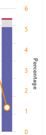

# <a name="turn-on-and-use-call-quality-dashboard-for-microsoft-teams-and-skype-for-business-online"></a><span data-ttu-id="3e87c-103">開啟並使用 Microsoft 團隊和商務用 Skype Online 的通話品質儀表板</span><span class="sxs-lookup"><span data-stu-id="3e87c-103">Turn on and use Call Quality Dashboard for Microsoft Teams and Skype for Business Online</span></span>

<span data-ttu-id="3e87c-104">瞭解如何設定您的 Office 365 組織，以使用通話品質儀表板來監控通話品質。</span><span class="sxs-lookup"><span data-stu-id="3e87c-104">Learn how to configure your Office 365 organization to use the Call Quality Dashboard to monitor call quality.</span></span>
  
<span data-ttu-id="3e87c-105">通話品質儀表板（CQD）可讓您深入瞭解使用 Microsoft 團隊和商務用 Skype Online 服務所進行的通話品質。</span><span class="sxs-lookup"><span data-stu-id="3e87c-105">Call Quality Dashboard (CQD) provides insight into the quality of calls made using Microsoft Teams and Skype for Business Online services.</span></span> <span data-ttu-id="3e87c-106">本主題描述開始收集資料的步驟，您可以用來疑難排解通話品質問題。</span><span class="sxs-lookup"><span data-stu-id="3e87c-106">This topic describes the steps to start collecting data you can use to troubleshoot call quality issues.</span></span>

<span data-ttu-id="3e87c-107">目前，CQD 版本3和 CQD 版本2都可供使用。</span><span class="sxs-lookup"><span data-stu-id="3e87c-107">Currently, CQD version 3 and CQD version 2 are both available for use.</span></span> <span data-ttu-id="3e87c-108">CQD v3 可在<span>https://cqd.teams.microsoft.com</span>。</span><span class="sxs-lookup"><span data-stu-id="3e87c-108">CQD v3 is available at <span>https://cqd.teams.microsoft.com</span>.</span></span> <span data-ttu-id="3e87c-109">使用您的 Microsoft 團隊管理員認證登入。</span><span class="sxs-lookup"><span data-stu-id="3e87c-109">Log in with your Microsoft Teams administrator credentials.</span></span>

## <a name="latest-changes-and-updates"></a><span data-ttu-id="3e87c-110">最新變更與更新</span><span class="sxs-lookup"><span data-stu-id="3e87c-110">Latest changes and updates</span></span>

<span data-ttu-id="3e87c-111">CQD 版本3會提供接近即時的 CQD 儀表板（延遲接近30分鐘），並使用使用者可辨識的資訊（EUII），讓系統管理員能夠放大至使用者層級。</span><span class="sxs-lookup"><span data-stu-id="3e87c-111">CQD version 3 delivers a near real-time CQD dashboard (latency close to 30 minutes), and uses End User Identifiable Information (EUII), giving admins the ability to zoom in to the user level.</span></span> <span data-ttu-id="3e87c-112">此外，也有可支援新案例的互動方式，例如：</span><span class="sxs-lookup"><span data-stu-id="3e87c-112">There is also and report interactivity to support new scenarios such as:</span></span>

- <span data-ttu-id="3e87c-113">依地區通話品質：</span><span class="sxs-lookup"><span data-stu-id="3e87c-113">Call Quality by Region:</span></span>
  - <span data-ttu-id="3e87c-114">依區域日期</span><span class="sxs-lookup"><span data-stu-id="3e87c-114">date-by-region</span></span>
  - <span data-ttu-id="3e87c-115">依區域匯總</span><span class="sxs-lookup"><span data-stu-id="3e87c-115">aggregated down to hour-by-region</span></span>
  - <span data-ttu-id="3e87c-116">特定位置</span><span class="sxs-lookup"><span data-stu-id="3e87c-116">specific locations</span></span>
  - <span data-ttu-id="3e87c-117">特定子網上</span><span class="sxs-lookup"><span data-stu-id="3e87c-117">specific subnet</span></span>
  - <span data-ttu-id="3e87c-118">受影響的使用者或使用者</span><span class="sxs-lookup"><span data-stu-id="3e87c-118">impacted user or users</span></span>

- <span data-ttu-id="3e87c-119">依地區撥打可靠性/失敗：</span><span class="sxs-lookup"><span data-stu-id="3e87c-119">Call Reliability/Failure by Region:</span></span>
  - <span data-ttu-id="3e87c-120">依區域日期</span><span class="sxs-lookup"><span data-stu-id="3e87c-120">date-by-region</span></span>
  - <span data-ttu-id="3e87c-121">依區域匯總</span><span class="sxs-lookup"><span data-stu-id="3e87c-121">aggregated down to hour-by-region</span></span>
  - <span data-ttu-id="3e87c-122">特定位置</span><span class="sxs-lookup"><span data-stu-id="3e87c-122">specific locations</span></span>
  - <span data-ttu-id="3e87c-123">特定子網上</span><span class="sxs-lookup"><span data-stu-id="3e87c-123">specific subnet</span></span>
  - <span data-ttu-id="3e87c-124">受影響的使用者或使用者</span><span class="sxs-lookup"><span data-stu-id="3e87c-124">impacted user or users</span></span>

- <span data-ttu-id="3e87c-125">依地區評定我的通話（RMC）：從 month 到特定位置，到提供低 RMC 等級的使用者。</span><span class="sxs-lookup"><span data-stu-id="3e87c-125">Rate My Call (RMC) by Region: from month-by-region aggregated down to specific locations to users who provide low RMC ratings.</span></span> <span data-ttu-id="3e87c-126">CQD v3 也包含原義的意見反應。</span><span class="sxs-lookup"><span data-stu-id="3e87c-126">CQD v3 also includes verbatim feedback.</span></span>
- <span data-ttu-id="3e87c-127">支援人員：針對 P2P 通話或會議的特定使用者提供，或針對所有參與者和通話詳細資料。</span><span class="sxs-lookup"><span data-stu-id="3e87c-127">Helpdesk: available for a specific user on P2P calls or Meetings, or for all participants and call details.</span></span> <span data-ttu-id="3e87c-128">根據網路位置、裝置或固件，協助找出可能的系統問題。</span><span class="sxs-lookup"><span data-stu-id="3e87c-128">Helps identify possible system issues based on network location, devices, or firmware.</span></span>  
- <span data-ttu-id="3e87c-129">用戶端版本：針對每個用戶端版本，查看會話與使用者計數，或向下切入至每個用戶端版本的使用者名稱。</span><span class="sxs-lookup"><span data-stu-id="3e87c-129">Client Versions: View the Session and Users counts for each Client Version, or drill down to User names for each client version.</span></span> <span data-ttu-id="3e87c-130">針對產品和用戶端類型預先建立的篩選，可協助將版本集中到特定的用戶端。</span><span class="sxs-lookup"><span data-stu-id="3e87c-130">Pre-built filters for Product and Client Type help focus the versions to specific clients.</span></span>
- <span data-ttu-id="3e87c-131">端點：顯示對應至電腦/Mac 的品牌/型號的電腦端點。</span><span class="sxs-lookup"><span data-stu-id="3e87c-131">Endpoints: Shows Machine Endpoints mapped to Make/Model of the PC/Mac.</span></span> <span data-ttu-id="3e87c-132">依 [品牌]/[模型] 顯示匯總品質。</span><span class="sxs-lookup"><span data-stu-id="3e87c-132">Shows aggregated quality by Make/Model.</span></span> <span data-ttu-id="3e87c-133">對應資料的上傳與建立資料類似。</span><span class="sxs-lookup"><span data-stu-id="3e87c-133">Mapping data is uploaded similar to Building data.</span></span>

<span data-ttu-id="3e87c-134">如果無法使用 EUII 存取，版本3也會提供 RBAC 支援。</span><span class="sxs-lookup"><span data-stu-id="3e87c-134">Version 3 also provides RBAC support, in case EUII access is not available.</span></span>  

<span data-ttu-id="3e87c-135">系統管理員可以透過 CQD 版本3管理商務用 Skype Server 2019 （不只是商務用 Skype Online 和 Microsoft 團隊）。</span><span class="sxs-lookup"><span data-stu-id="3e87c-135">An admin can manage Skype for Business Server 2019 (not just Skype for Business Online and Microsoft Teams) through CQD version 3.</span></span> <span data-ttu-id="3e87c-136">這需要混合式實現，以及使用通話資料連線器。</span><span class="sxs-lookup"><span data-stu-id="3e87c-136">This requires a hybrid implementation and the use of Call Data Connector.</span></span> <span data-ttu-id="3e87c-137">如需詳細資訊，請參閱[規劃通話資料連線器](/SkypeForBusiness/hybrid/plan-call-data-connector)。</span><span class="sxs-lookup"><span data-stu-id="3e87c-137">See [Plan Call Data Connector](/SkypeForBusiness/hybrid/plan-call-data-connector) for more information.</span></span>

<span data-ttu-id="3e87c-138">已新增 CQD 版本2：</span><span class="sxs-lookup"><span data-stu-id="3e87c-138">CQD version 2 added:</span></span>

- <span data-ttu-id="3e87c-139">Microsoft 團隊及商務用 Skype Online 的資料</span><span class="sxs-lookup"><span data-stu-id="3e87c-139">Data for Microsoft Teams and Skype for Business Online</span></span>
- <span data-ttu-id="3e87c-140">摘要報告包含產品篩選來選取 [所有資料]、[Microsoft 團隊資料] 或 [商務用 Skype Online] 資料</span><span class="sxs-lookup"><span data-stu-id="3e87c-140">Summary reports include a product filter to select all data, Microsoft Teams data, or Skype for Business Online data</span></span>
- <span data-ttu-id="3e87c-141">已更新的影片與 VBSS 資料流程品質分類邏輯。</span><span class="sxs-lookup"><span data-stu-id="3e87c-141">Updated Video and VBSS stream quality classification logic.</span></span> <span data-ttu-id="3e87c-142">請參閱[通話品質儀表板中](stream-classification-in-call-quality-dashboard.md)針對分類器定義的資料流程分類。</span><span class="sxs-lookup"><span data-stu-id="3e87c-142">Refer to [Stream Classification in Call Quality Dashboard](stream-classification-in-call-quality-dashboard.md) for the classifier definitions.</span></span>

<span data-ttu-id="3e87c-143">請參閱這篇文章，以取得[通話品質儀表板中提供的維度與量值](dimensions-and-measures-available-in-call-quality-dashboard.md)的清單。</span><span class="sxs-lookup"><span data-stu-id="3e87c-143">Refer to this article for a list of [Dimensions and measures available in Call Quality Dashboard](dimensions-and-measures-available-in-call-quality-dashboard.md).</span></span>
  
> [!NOTE]
> <span data-ttu-id="3e87c-144">若要查看儀表板更新及變更的相關資訊，請按一下 [**好消息**] 中的連結！</span><span class="sxs-lookup"><span data-stu-id="3e87c-144">To see information about updates and changes to the dashboard,  click the link in the **Good news!**</span></span> <span data-ttu-id="3e87c-145">[橫幅] 會顯示在儀表板上。</span><span class="sxs-lookup"><span data-stu-id="3e87c-145">banner when it displays on the dashboard.</span></span>

<span data-ttu-id="3e87c-146">CQD 版本1已供應商務用 Skype Server 2015 管理員下列功能：</span><span class="sxs-lookup"><span data-stu-id="3e87c-146">CQD version 1 provided Skype for Business Server 2015 admins the following features:</span></span>

- <span data-ttu-id="3e87c-147">存取可快速存取的快取報表資料</span><span class="sxs-lookup"><span data-stu-id="3e87c-147">Access to cached report data for fast access</span></span>
- <span data-ttu-id="3e87c-148">報告頁面的深層連結，以共用和發佈資訊</span><span class="sxs-lookup"><span data-stu-id="3e87c-148">Deep links to report pages for sharing and publishing information</span></span>
- <span data-ttu-id="3e87c-149">簡化報表的編輯與建立，以及報表描述的可編輯中繼資料</span><span class="sxs-lookup"><span data-stu-id="3e87c-149">Streamlined report editing and creation, and editable metadata for report descriptions</span></span>
- <span data-ttu-id="3e87c-150">提供對多維資料集資料進行程式設計存取的 Web Api，以便在自訂儀表板中使用</span><span class="sxs-lookup"><span data-stu-id="3e87c-150">Web APIs that give programmatic access to the cube data for use in custom dashboards</span></span>

## <a name="cqd-near-real-time-nrt-data"></a><span data-ttu-id="3e87c-151">CQD 近乎即時（NRT）資料</span><span class="sxs-lookup"><span data-stu-id="3e87c-151">CQD Near-Real-Time (NRT) Data</span></span>

<span data-ttu-id="3e87c-152">CQD v3 利用近乎即時的資料摘要。</span><span class="sxs-lookup"><span data-stu-id="3e87c-152">CQD v3 utilizes a near-real-time data feed.</span></span> <span data-ttu-id="3e87c-153">通話記錄可在通話結束後的30分鐘內，于 CQD 入口網站中取得。</span><span class="sxs-lookup"><span data-stu-id="3e87c-153">Call Records are available at the CQD portal within 30 minutes of the end of the call.</span></span> <span data-ttu-id="3e87c-154">從資料集移除 NRT 管線中的記錄前，只能有幾個月提供給它。</span><span class="sxs-lookup"><span data-stu-id="3e87c-154">Call Records from the NRT pipeline are only available for a few months before they are removed from the data set.</span></span> <span data-ttu-id="3e87c-155">CQD v3 會從來自 v3 管線的 NRT 資料合併目前 v2 管線的資料。</span><span class="sxs-lookup"><span data-stu-id="3e87c-155">CQD v3 merges data from the current v2 pipeline with NRT data from the v3 pipeline.</span></span> <span data-ttu-id="3e87c-156">在 v2 和 v3 入口網站上，來自存檔週期之資料的查詢會產生相同的結果。</span><span class="sxs-lookup"><span data-stu-id="3e87c-156">Queries on the v2 and v3 portals for the data from the Archival period produce the same results.</span></span> <span data-ttu-id="3e87c-157">NRT 資料的 V2 和 v3 資料查詢與 NRT Data + PII 期間會不同。</span><span class="sxs-lookup"><span data-stu-id="3e87c-157">V2 and v3 data queries for the NRT Data and NRT Data + PII periods will be different.</span></span>

### <a name="piieuii-data"></a><span data-ttu-id="3e87c-158">PII/EUII 資料</span><span class="sxs-lookup"><span data-stu-id="3e87c-158">PII/EUII Data</span></span>

<span data-ttu-id="3e87c-159">PII 或 EUII 資料只來自 v3 管線。</span><span class="sxs-lookup"><span data-stu-id="3e87c-159">PII or EUII data only comes from the v3 pipeline.</span></span> <span data-ttu-id="3e87c-160">出於合規性原因，PII/EUII 資料只會保留30天。</span><span class="sxs-lookup"><span data-stu-id="3e87c-160">Due to compliance reasons, PII/EUII data is only kept for 30 days.</span></span> <span data-ttu-id="3e87c-161">當 NRT 資料超過30日標記時，會清除 PII/EUII 欄位，從而產生 PII 免費 NRT 資料。</span><span class="sxs-lookup"><span data-stu-id="3e87c-161">As NRT data crosses the 30-day mark, the PII/EUII fields are cleared out, resulting in PII-free NRT data.</span></span> <span data-ttu-id="3e87c-162">PII/EUII 欄位包括：</span><span class="sxs-lookup"><span data-stu-id="3e87c-162">The PII/EUII fields are:</span></span>

- <span data-ttu-id="3e87c-163">完整 IP 位址</span><span class="sxs-lookup"><span data-stu-id="3e87c-163">Full IP address</span></span>
- <span data-ttu-id="3e87c-164">媒體存取控制（MAC）位址</span><span class="sxs-lookup"><span data-stu-id="3e87c-164">Media Access Control (MAC) Address</span></span>
- <span data-ttu-id="3e87c-165">基本服務組識別元（BSSID）</span><span class="sxs-lookup"><span data-stu-id="3e87c-165">Basic Service Set identifier (BSSID)</span></span>
- <span data-ttu-id="3e87c-166">會話初始通訊協定（SIP） URI （僅適用于商務用 Skype）</span><span class="sxs-lookup"><span data-stu-id="3e87c-166">Session Initiation Protocol (SIP) URI (Skype for Business only)</span></span>
- <span data-ttu-id="3e87c-167">使用者主體名稱（UPN）</span><span class="sxs-lookup"><span data-stu-id="3e87c-167">User Principal Name (UPN)</span></span>
- <span data-ttu-id="3e87c-168">電腦端點名稱</span><span class="sxs-lookup"><span data-stu-id="3e87c-168">Machine Endpoint Name</span></span>
- <span data-ttu-id="3e87c-169">使用者逐字的意見反應</span><span class="sxs-lookup"><span data-stu-id="3e87c-169">User Verbatim Feedback</span></span>
- <span data-ttu-id="3e87c-170">物件識別碼（端點使用者的 Active Directory 物件識別碼）</span><span class="sxs-lookup"><span data-stu-id="3e87c-170">Object ID (the Active Directory object ID of the endpoint's user)</span></span>

### <a name="date-controls"></a><span data-ttu-id="3e87c-171">日期控制項</span><span class="sxs-lookup"><span data-stu-id="3e87c-171">Date controls</span></span>

<span data-ttu-id="3e87c-172">CQD v3 會新增下列新的滾動趨勢類型：</span><span class="sxs-lookup"><span data-stu-id="3e87c-172">CQD v3 adds the following new Rolling Trend types:</span></span>

- <span data-ttu-id="3e87c-173">5天</span><span class="sxs-lookup"><span data-stu-id="3e87c-173">5-day</span></span>
- <span data-ttu-id="3e87c-174">7天</span><span class="sxs-lookup"><span data-stu-id="3e87c-174">7-day</span></span>
- <span data-ttu-id="3e87c-175">30天</span><span class="sxs-lookup"><span data-stu-id="3e87c-175">30-day</span></span>
- <span data-ttu-id="3e87c-176">60-日</span><span class="sxs-lookup"><span data-stu-id="3e87c-176">60-day</span></span>
- <span data-ttu-id="3e87c-177">90-日</span><span class="sxs-lookup"><span data-stu-id="3e87c-177">90-day</span></span>

<span data-ttu-id="3e87c-178">URL 日期參數現在可以接受 Day 欄位。</span><span class="sxs-lookup"><span data-stu-id="3e87c-178">The URL Date parameter can now accept a Day field.</span></span> <span data-ttu-id="3e87c-179">[日常報告] 使用 YYYY MM 格式中指定的日期做為趨勢的最後一天。</span><span class="sxs-lookup"><span data-stu-id="3e87c-179">Rolling-day reports use dates specified in the YYYY-MM-DD format as the last day of the trend.</span></span>  <span data-ttu-id="3e87c-180">URL 日期參數 "00" 代表 "today"。</span><span class="sxs-lookup"><span data-stu-id="3e87c-180">The URL Date parameter “00”  indicates “today”.</span></span>

|<span data-ttu-id="3e87c-181">網址</span><span class="sxs-lookup"><span data-stu-id="3e87c-181">URL</span></span>| <span data-ttu-id="3e87c-182">滾動日趨勢的結束日期</span><span class="sxs-lookup"><span data-stu-id="3e87c-182">End date of Rolling Day Trend</span></span>|
|:---|:---|
|<span data-ttu-id="3e87c-183"><span>HTTPs://<cqdv3>/Spd/#/Dashboard/<reportid>/2019-02/</span></span><span class="sxs-lookup"><span data-stu-id="3e87c-183"><span>https://<cqdv3>/spd/#/Dashboard/<reportid>/2019-02/</span></span></span>   |<span data-ttu-id="3e87c-184">2019年2月的目前日期</span><span class="sxs-lookup"><span data-stu-id="3e87c-184">Current Day of Feb 2019</span></span>|
|<span data-ttu-id="3e87c-185"><span>HTTPs://<cqdv3>/Spd/#/Dashboard/<reportid>/2019-02-15/</span></span><span class="sxs-lookup"><span data-stu-id="3e87c-185"><span>https://<cqdv3>/spd/#/Dashboard/<reportid>/2019-02-15/</span></span></span>|<span data-ttu-id="3e87c-186">2019年2月15日</span><span class="sxs-lookup"><span data-stu-id="3e87c-186">Feb 15, 2019</span></span>|
|<span data-ttu-id="3e87c-187"><span>HTTPs://<cqdv3>/Spd/#/Dashboard/<reportid>/00/</span></span><span class="sxs-lookup"><span data-stu-id="3e87c-187"><span>https://<cqdv3>/spd/#/Dashboard/<reportid>/00/</span></span></span>        |<span data-ttu-id="3e87c-188">當天</span><span class="sxs-lookup"><span data-stu-id="3e87c-188">Current Day</span></span>|
|||

<span data-ttu-id="3e87c-189">根據預設，每個月的當天是用來做為滾動日趨勢的最後一天。</span><span class="sxs-lookup"><span data-stu-id="3e87c-189">By default the current day of the month is used as the last day of the Rolling Day Trend.</span></span>

### <a name="drill-thru-functionality"></a><span data-ttu-id="3e87c-190">鑽取功能</span><span class="sxs-lookup"><span data-stu-id="3e87c-190">Drill Thru Functionality</span></span>

<span data-ttu-id="3e87c-191">CQD v3 支援在 SPD 報告中使用 [鑽取] 或 [向下切入] 欄位。</span><span class="sxs-lookup"><span data-stu-id="3e87c-191">CQD v3 supports the use of drill through or drill-down fields in SPD reports.</span></span> <span data-ttu-id="3e87c-192">如果選取這些維度欄位，報告會自動開啟不同的 [報表] 索引標籤，並篩選選取的值。</span><span class="sxs-lookup"><span data-stu-id="3e87c-192">If these dimension fields are selected,  the report automatically opens a different report tab and filters on the selected value.</span></span> <span data-ttu-id="3e87c-193">具有指定 [鑽取] 篩選的欄位會在您將游標移到它們上方時，以不同的游標圖示（指標）區分。</span><span class="sxs-lookup"><span data-stu-id="3e87c-193">Fields with an assigned drill through filter are distinguished by a different cursor icon (the pointer) when you hover over them.</span></span>

<span data-ttu-id="3e87c-194">選取 [鑽取] 欄位時，儀表板會自動流覽至新的指定索引標籤，並套用含所選值的篩選。</span><span class="sxs-lookup"><span data-stu-id="3e87c-194">When a drill through field is selected, the Dashboard automatically navigates to the new, specified tab and applies a filter with the selected value.</span></span> <span data-ttu-id="3e87c-195">如果該索引標籤有自己的 [鑽取] 欄位，而其中一個已選取，則前一個 [鑽取] 篩選與新的篩選。</span><span class="sxs-lookup"><span data-stu-id="3e87c-195">If that tab has its own drill through fields and one is selected, the previous drill through filters and the new one all propagate forward.</span></span> <span data-ttu-id="3e87c-196">這可讓您建立報告，以逐漸縮小產生的資料集。</span><span class="sxs-lookup"><span data-stu-id="3e87c-196">This allows you to build a report that progressively narrows the resulting data set.</span></span>

<span data-ttu-id="3e87c-197">例如，在通話品質的 [鑽取] 報表中，使用者可以按一下其想要「鑽取」的日期，這會產生 [位置] 索引標籤。</span><span class="sxs-lookup"><span data-stu-id="3e87c-197">For example, in a Call quality drill-through report, a user can click the date they would like to 'drill-through', which leads to the Location tab.</span></span>

    

<span data-ttu-id="3e87c-198">您可以從 [位置] 索引標籤新增多個日期，例如將2019-09-22 新增至日期：2019-09-24：</span><span class="sxs-lookup"><span data-stu-id="3e87c-198">You can add multiple dates from the location tab, such as adding 2019-09-22 to Date: 2019-09-24:</span></span> 

    

> [!NOTE]
> <span data-ttu-id="3e87c-199">不要直接跳到最後一個索引標籤。從先前的搜尋結果中選取的篩選不會太大，無法顯示在表格上。</span><span class="sxs-lookup"><span data-stu-id="3e87c-199">Don't jump directly to the last tab. Without filters selected from a previous drill-through the results would be too large to show on a table.</span></span>

## <a name="activate-microsoft-call-quality-dashboard-cqd-summary-reports"></a><span data-ttu-id="3e87c-200">啟動 Microsoft 通話品質儀表板（CQD）摘要報告</span><span class="sxs-lookup"><span data-stu-id="3e87c-200">Activate Microsoft Call Quality Dashboard (CQD) Summary Reports</span></span>

<span data-ttu-id="3e87c-201">在您開始使用 CQD 之前，請先為您的 Office 365 組織啟動它，如下所示：</span><span class="sxs-lookup"><span data-stu-id="3e87c-201">Before you can start using CQD, activate it for your Office 365 organization as follows:</span></span>

<span data-ttu-id="3e87c-202"> **使用 microsoft 團隊系統管理中心**顯示 microsoft 小組標誌的圖示</span><span class="sxs-lookup"><span data-stu-id="3e87c-202"> **Using the Microsoft Teams admin center**</span></span>

1. <span data-ttu-id="3e87c-203">使用 Microsoft 團隊服務系統管理員帳戶登入您的 Office 365 組織，然後選取 [系統**管理**] 磚以開啟系統管理中心。</span><span class="sxs-lookup"><span data-stu-id="3e87c-203">Sign in to your Office 365 organization using Microsoft Teams service admin account, and then select the **Admin** tile to open the Admin center.</span></span>
2. <span data-ttu-id="3e87c-204">在左窗格中的 [系統**管理中心**] 底下，選取 [ **microsoft 團隊**] 以開啟 microsoft 團隊系統管理中心。</span><span class="sxs-lookup"><span data-stu-id="3e87c-204">In the left pane, under **Admin centers**, select **Microsoft Teams** to open the Microsoft Teams admin center.</span></span>
3. <span data-ttu-id="3e87c-205">在 Microsoft [團隊管理中心] 中，選取左窗格中的 [**通話品質儀表板**]。</span><span class="sxs-lookup"><span data-stu-id="3e87c-205">In the Microsoft Teams admin center, select **Call quality dashboard** in the left pane.</span></span>
4. <span data-ttu-id="3e87c-206">\(在開啟 HTTPs://<span>cqd.teams.microsoft.com<span/>\)的頁面上，按一下 [登**入**]，然後輸入您的全域系統管理員帳戶或 microsoft 團隊服務系統管理員帳戶資訊。</span><span class="sxs-lookup"><span data-stu-id="3e87c-206">On the page that opens \(https://<span>cqd.teams.microsoft.com<span/>\), click **Sign in** and enter your Global Administrator account or Microsoft Teams Service Admin account information.</span></span>

    ![螢幕擷取畫面：顯示 [認證] 提示](media/ac4c1699-d8c1-4bda-af30-0fec35b5fd22.png)
  
<span data-ttu-id="3e87c-208">登入後，CQD 就會開始收集及處理資料。</span><span class="sxs-lookup"><span data-stu-id="3e87c-208">After you sign in, once activated, the CQD will begin collecting and processing data.</span></span>  
> [!NOTE]
> <span data-ttu-id="3e87c-209">在報告中，可能需要一或幾個小時的時間來處理足夠的資料，以顯示有意義的結果。</span><span class="sxs-lookup"><span data-stu-id="3e87c-209">It may take one or more hours to process enough data to display meaningful results in the reports.</span></span>

<span data-ttu-id="3e87c-210"> **使用商務用 skype 傳統版入口網站**的商務用 skype 標誌圖示</span><span class="sxs-lookup"><span data-stu-id="3e87c-210"> **Using the Skype for Business legacy portal**</span></span>

1. <span data-ttu-id="3e87c-211">使用系統管理員帳戶登入您的 Office 365 組織，然後選取 [系統**管理**] 磚以開啟系統管理中心。</span><span class="sxs-lookup"><span data-stu-id="3e87c-211">Sign in to your Office 365 organization using an admin account, and then select the **Admin** tile to open the Admin center.</span></span>
2. <span data-ttu-id="3e87c-212">在左窗格中的 [系統**管理中心**] 底下，選取 [ **microsoft 團隊**] 以開啟 microsoft 團隊系統管理中心。</span><span class="sxs-lookup"><span data-stu-id="3e87c-212">In the left pane, under **Admin centers**, select **Microsoft Teams** to open the Microsoft Teams admin center.</span></span>
3. <span data-ttu-id="3e87c-213">在 Microsoft [團隊管理中心] 中，選取左窗格中的 [**舊版入口網站**]，選取 [**工具**]，然後選取 [**商務用 Skype Online 通話品質儀表板**]。</span><span class="sxs-lookup"><span data-stu-id="3e87c-213">In the Microsoft Teams admin center, select **Legacy Portal** in the left pane, select **Tools**, and then select **Skype for Business Online Call Quality Dashboard**.</span></span>

     ![螢幕擷取畫面：選取 [通話品質] 儀表板](media/6cc7f80f-b8e2-4a9b-aab8-ac871d07a261.png)

4. <span data-ttu-id="3e87c-215">在開啟的頁面上，使用您的全域系統管理員帳戶登入，然後在出現提示時提供該帳戶的認證。</span><span class="sxs-lookup"><span data-stu-id="3e87c-215">On the page that opens, sign in with your Global Administrator account, and then provide the credentials for the account when prompted.</span></span>

<span data-ttu-id="3e87c-216">登入後，通話品質儀表板就會開始收集及處理資料。</span><span class="sxs-lookup"><span data-stu-id="3e87c-216">After you sign in, once activated, the Call Quality Dashboard will begin collecting and processing data.</span></span>

## <a name="features-of-the-call-quality-dashboard-for-microsoft-teams-and-skype-for-business-online"></a><span data-ttu-id="3e87c-217">Microsoft 團隊和商務用 Skype Online 的通話品質儀表板功能</span><span class="sxs-lookup"><span data-stu-id="3e87c-217">Features of the Call Quality Dashboard for Microsoft Teams and Skype for Business Online</span></span>

<span data-ttu-id="3e87c-218"><a name="BKMKFeaturesOfTheCQD"> </a></span><span class="sxs-lookup"><span data-stu-id="3e87c-218"></span></span>

<!-- Siunies, this isn't very clear, it doesn't call out v1 and v2. unsure how to elaborate for v3, please comment -->
<span data-ttu-id="3e87c-219">CQD 摘要報告提供規劃詳細報告之功能的子集。</span><span class="sxs-lookup"><span data-stu-id="3e87c-219">CQD Summary Reports provide a subset of the features planned for Detailed Reports.</span></span> <span data-ttu-id="3e87c-220">版本間的差異摘要如下：</span><span class="sxs-lookup"><span data-stu-id="3e87c-220">The differences between the editions are summarized here:</span></span>
  
|<span data-ttu-id="3e87c-221">功能</span><span class="sxs-lookup"><span data-stu-id="3e87c-221">Feature</span></span>|<span data-ttu-id="3e87c-222">摘要報告</span><span class="sxs-lookup"><span data-stu-id="3e87c-222">Summary Reports</span></span>|<span data-ttu-id="3e87c-223">詳細報告</span><span class="sxs-lookup"><span data-stu-id="3e87c-223">Detailed Reports</span></span>|
|:--- |:--- |:--- |
|<span data-ttu-id="3e87c-224">應用程式共用躍點數</span><span class="sxs-lookup"><span data-stu-id="3e87c-224">Application sharing metric</span></span> | <span data-ttu-id="3e87c-225">不</span><span class="sxs-lookup"><span data-stu-id="3e87c-225">No</span></span> | <span data-ttu-id="3e87c-226">是的</span><span class="sxs-lookup"><span data-stu-id="3e87c-226">Yes</span></span> |
|<span data-ttu-id="3e87c-227">客戶建立資訊支援</span><span class="sxs-lookup"><span data-stu-id="3e87c-227">Customer building information support</span></span> | <span data-ttu-id="3e87c-228">是的</span><span class="sxs-lookup"><span data-stu-id="3e87c-228">Yes</span></span> | <span data-ttu-id="3e87c-229">是的</span><span class="sxs-lookup"><span data-stu-id="3e87c-229">Yes</span></span> |
|<span data-ttu-id="3e87c-230">用戶端點資訊支援</span><span class="sxs-lookup"><span data-stu-id="3e87c-230">Customer endpoint information support</span></span> | <span data-ttu-id="3e87c-231">僅限<span>cqd.teams.microsoft.com<span/></span><span class="sxs-lookup"><span data-stu-id="3e87c-231">Only in <span>cqd.teams.microsoft.com<span/></span></span> | <span data-ttu-id="3e87c-232">僅限<span>cqd.teams.microsoft.com<span/></span><span class="sxs-lookup"><span data-stu-id="3e87c-232">Only in <span>cqd.teams.microsoft.com<span/></span></span> |
|<span data-ttu-id="3e87c-233">深化分析支援</span><span class="sxs-lookup"><span data-stu-id="3e87c-233">Drill down analysis support</span></span>   | <span data-ttu-id="3e87c-234">不</span><span class="sxs-lookup"><span data-stu-id="3e87c-234">No</span></span>   | <span data-ttu-id="3e87c-235">是的</span><span class="sxs-lookup"><span data-stu-id="3e87c-235">Yes</span></span>   |
|<span data-ttu-id="3e87c-236">媒體可靠性度量單位</span><span class="sxs-lookup"><span data-stu-id="3e87c-236">Media reliability metrics</span></span>   | <span data-ttu-id="3e87c-237">不</span><span class="sxs-lookup"><span data-stu-id="3e87c-237">No</span></span>   | <span data-ttu-id="3e87c-238">是的</span><span class="sxs-lookup"><span data-stu-id="3e87c-238">Yes</span></span>   |
|<span data-ttu-id="3e87c-239">外框報告</span><span class="sxs-lookup"><span data-stu-id="3e87c-239">Out-of-the-box reports</span></span>   | <span data-ttu-id="3e87c-240">是的</span><span class="sxs-lookup"><span data-stu-id="3e87c-240">Yes</span></span>   | <span data-ttu-id="3e87c-241">是的</span><span class="sxs-lookup"><span data-stu-id="3e87c-241">Yes</span></span>   |
|<span data-ttu-id="3e87c-242">[總覽] 報表</span><span class="sxs-lookup"><span data-stu-id="3e87c-242">Overview reports</span></span>   | <span data-ttu-id="3e87c-243">是的</span><span class="sxs-lookup"><span data-stu-id="3e87c-243">Yes</span></span>   | <span data-ttu-id="3e87c-244">是的</span><span class="sxs-lookup"><span data-stu-id="3e87c-244">Yes</span></span>   |
|<span data-ttu-id="3e87c-245">每個使用者的報表集</span><span class="sxs-lookup"><span data-stu-id="3e87c-245">Per-user report set</span></span>   | <span data-ttu-id="3e87c-246">不</span><span class="sxs-lookup"><span data-stu-id="3e87c-246">No</span></span>   | <span data-ttu-id="3e87c-247">是的</span><span class="sxs-lookup"><span data-stu-id="3e87c-247">Yes</span></span>   |
|<span data-ttu-id="3e87c-248">報表集自訂（新增、刪除、修改報告）</span><span class="sxs-lookup"><span data-stu-id="3e87c-248">Report set customization (add, delete, modify reports)</span></span>   | <span data-ttu-id="3e87c-249">不</span><span class="sxs-lookup"><span data-stu-id="3e87c-249">No</span></span>   | <span data-ttu-id="3e87c-250">是的</span><span class="sxs-lookup"><span data-stu-id="3e87c-250">Yes</span></span>   |
|<span data-ttu-id="3e87c-251">以影片為基礎的畫面共用規格</span><span class="sxs-lookup"><span data-stu-id="3e87c-251">Video-based screen sharing metrics</span></span>   | <span data-ttu-id="3e87c-252">不</span><span class="sxs-lookup"><span data-stu-id="3e87c-252">No</span></span>   | <span data-ttu-id="3e87c-253">是的</span><span class="sxs-lookup"><span data-stu-id="3e87c-253">Yes</span></span>   |
|<span data-ttu-id="3e87c-254">影片度量單位</span><span class="sxs-lookup"><span data-stu-id="3e87c-254">Video metrics</span></span>   | <span data-ttu-id="3e87c-255">不</span><span class="sxs-lookup"><span data-stu-id="3e87c-255">No</span></span>   | <span data-ttu-id="3e87c-256">是的</span><span class="sxs-lookup"><span data-stu-id="3e87c-256">Yes</span></span>   |
|<span data-ttu-id="3e87c-257">可用的資料量</span><span class="sxs-lookup"><span data-stu-id="3e87c-257">Amount of data available</span></span>   | <span data-ttu-id="3e87c-258">過去6個月</span><span class="sxs-lookup"><span data-stu-id="3e87c-258">Last 6 months</span></span>   | <span data-ttu-id="3e87c-259">過去6個月</span><span class="sxs-lookup"><span data-stu-id="3e87c-259">Last 6 months</span></span>   |
|<span data-ttu-id="3e87c-260">Microsoft 團隊資料</span><span class="sxs-lookup"><span data-stu-id="3e87c-260">Microsoft Teams data</span></span>   | <span data-ttu-id="3e87c-261">是的</span><span class="sxs-lookup"><span data-stu-id="3e87c-261">Yes</span></span>   | <span data-ttu-id="3e87c-262">是的</span><span class="sxs-lookup"><span data-stu-id="3e87c-262">Yes</span></span>   |
| | | |

### <a name="out-of-the-box-reports"></a><span data-ttu-id="3e87c-263">外框報告</span><span class="sxs-lookup"><span data-stu-id="3e87c-263">Out-of-the-box reports</span></span>

<span data-ttu-id="3e87c-264">所有版本的 CQD 都提供一種體驗，讓您能提供通話品質指標，而不需要建立新的報告。</span><span class="sxs-lookup"><span data-stu-id="3e87c-264">All editions of CQD provide an experience that gives you call quality metrics without the need to create new reports.</span></span> <span data-ttu-id="3e87c-265">在後端處理完資料之後，您會在報表中看到 [通話品質資料]。</span><span class="sxs-lookup"><span data-stu-id="3e87c-265">Once data is processed in the back-end, you see call quality data in the reports.</span></span>
  
### <a name="overview-reports"></a><span data-ttu-id="3e87c-266">[總覽] 報表</span><span class="sxs-lookup"><span data-stu-id="3e87c-266">Overview reports</span></span>

<span data-ttu-id="3e87c-267">CQD 的所有版本都提供了整體通話品質資訊的高層進入點，但資訊在摘要報告中呈現的方式與詳細報表不同。</span><span class="sxs-lookup"><span data-stu-id="3e87c-267">All editions of the CQD provide a high-level entry point to the overall call quality information, but the way information is presented in Summary Reports is different from Detailed Reports.</span></span>  
  
<span data-ttu-id="3e87c-268">[摘要報告] 提供簡化的索引標籤式頁面報表檢視，您可以快速流覽並瞭解整體通話品質狀態與趨勢。</span><span class="sxs-lookup"><span data-stu-id="3e87c-268">Summary Reports provide a simplified tabbed page report view so you can quickly browse and understand the overall call quality status and trends.</span></span>

<span data-ttu-id="3e87c-269">四個索引標籤包括：</span><span class="sxs-lookup"><span data-stu-id="3e87c-269">The four tabs include:</span></span>
  
- <span data-ttu-id="3e87c-270">**整體通話品質**-提供所有資料流程的相關資訊，這是一種匯總，顯示每月和每日趨勢：</span><span class="sxs-lookup"><span data-stu-id="3e87c-270">**Overall Call Quality** — provides information about all streams, which is an aggregation that shows monthly and daily trends for:</span></span>
  - <span data-ttu-id="3e87c-271">伺服器-用戶端資料流程</span><span class="sxs-lookup"><span data-stu-id="3e87c-271">Server-Client streams</span></span>
  - <span data-ttu-id="3e87c-272">用戶端-用戶端資料流程</span><span class="sxs-lookup"><span data-stu-id="3e87c-272">Client-Client streams</span></span>
  - <span data-ttu-id="3e87c-273">個別的伺服器-用戶端和用戶端資料流程</span><span class="sxs-lookup"><span data-stu-id="3e87c-273">Separate Server-Client and Client-Client streams</span></span>
- <span data-ttu-id="3e87c-274">**伺服器-用戶端**-提供伺服器與用戶端端點之間資料流程的詳細資料。</span><span class="sxs-lookup"><span data-stu-id="3e87c-274">**Server—Client** — provides details for the streams between Server and Client endpoints.</span></span>
- <span data-ttu-id="3e87c-275">**用戶端-用戶端**-提供兩個用戶端端點之間資料流程的詳細資料。</span><span class="sxs-lookup"><span data-stu-id="3e87c-275">**Client—Client** — provides details for the streams between two Client endpoints.</span></span>
- <span data-ttu-id="3e87c-276">**語音品質 SLA** -提供包含在商務用 Skype Online 語音品質 SLA 中之通話的相關資訊。</span><span class="sxs-lookup"><span data-stu-id="3e87c-276">**Voice Quality SLA** — provides information about calls that are included in the Skype for Business Online Voice Quality SLA.</span></span>

> [!NOTE]
> <span data-ttu-id="3e87c-277">CQD 版本3可與 Microsoft 團隊、商務用 Skype Online 和商務用 Skype 伺服器搭配使用。</span><span class="sxs-lookup"><span data-stu-id="3e87c-277">CQD Version 3 works with Microsoft Teams, Skype for Business Online, and Skype for Business Server.</span></span> <span data-ttu-id="3e87c-278">若要在商務用 Skype Server 2019 中使用 CQD，您必須[設定 [呼叫資料連線器](https://docs.microsoft.com/skypeforbusiness/hybrid/configure-call-data-connector)]。</span><span class="sxs-lookup"><span data-stu-id="3e87c-278">To use CQD with Skype for Business Server 2019, you will have to [Configure Call Data Connector](https://docs.microsoft.com/skypeforbusiness/hybrid/configure-call-data-connector).</span></span> <span data-ttu-id="3e87c-279">請參閱[規劃通話資料連線器](https://docs.microsoft.com/en-us/skypeforbusiness/hybrid/plan-call-data-connector)，然後再開始進行。</span><span class="sxs-lookup"><span data-stu-id="3e87c-279">See [Plan Call Data Connector](https://docs.microsoft.com/en-us/skypeforbusiness/hybrid/plan-call-data-connector) before you start.</span></span>

- <span data-ttu-id="3e87c-280">依地區通話品質：</span><span class="sxs-lookup"><span data-stu-id="3e87c-280">Call Quality by Region:</span></span>

  - <span data-ttu-id="3e87c-281">依區域日期</span><span class="sxs-lookup"><span data-stu-id="3e87c-281">date-by-region</span></span>
  - <span data-ttu-id="3e87c-282">依區域匯總</span><span class="sxs-lookup"><span data-stu-id="3e87c-282">aggregated down to hour-by-region</span></span>
  - <span data-ttu-id="3e87c-283">特定位置</span><span class="sxs-lookup"><span data-stu-id="3e87c-283">specific locations</span></span>
  - <span data-ttu-id="3e87c-284">特定子網上</span><span class="sxs-lookup"><span data-stu-id="3e87c-284">specific subnet</span></span>
  - <span data-ttu-id="3e87c-285">受影響的使用者或使用者</span><span class="sxs-lookup"><span data-stu-id="3e87c-285">impacted user or users</span></span>

- <span data-ttu-id="3e87c-286">依地區撥打可靠性/失敗：</span><span class="sxs-lookup"><span data-stu-id="3e87c-286">Call Reliability/Failure by Region:</span></span>
  - <span data-ttu-id="3e87c-287">依區域日期</span><span class="sxs-lookup"><span data-stu-id="3e87c-287">date-by-region</span></span>
  - <span data-ttu-id="3e87c-288">依區域匯總</span><span class="sxs-lookup"><span data-stu-id="3e87c-288">aggregated down to hour-by-region</span></span>
  - <span data-ttu-id="3e87c-289">特定位置</span><span class="sxs-lookup"><span data-stu-id="3e87c-289">specific locations</span></span>
  - <span data-ttu-id="3e87c-290">特定子網上</span><span class="sxs-lookup"><span data-stu-id="3e87c-290">specific subnet</span></span>
  - <span data-ttu-id="3e87c-291">受影響的使用者或使用者</span><span class="sxs-lookup"><span data-stu-id="3e87c-291">impacted user or users</span></span>

- <span data-ttu-id="3e87c-292">依地區評定我的通話（RMC）：從 month 到特定位置，到提供低 RMC 等級的使用者。</span><span class="sxs-lookup"><span data-stu-id="3e87c-292">Rate My Call (RMC) by Region: from month-by-region aggregated down to specific locations to users who provide low RMC ratings.</span></span> <span data-ttu-id="3e87c-293">CQD v3 也包含原義的意見反應。</span><span class="sxs-lookup"><span data-stu-id="3e87c-293">CQD v3 also includes verbatim feedback.</span></span>
- <span data-ttu-id="3e87c-294">支援人員：針對 P2P 通話或會議的特定使用者提供，或針對所有參與者和通話詳細資料。</span><span class="sxs-lookup"><span data-stu-id="3e87c-294">Helpdesk: available for a specific user on P2P calls or Meetings, or for all participants and call details.</span></span> <span data-ttu-id="3e87c-295">根據網路位置、裝置或固件，協助找出可能的系統問題。</span><span class="sxs-lookup"><span data-stu-id="3e87c-295">Helps identify possible system issues based on network location, devices, or firmware.</span></span>  
- <span data-ttu-id="3e87c-296">用戶端版本：針對每個用戶端版本，查看會話與使用者計數，或向下切入至每個用戶端版本的使用者名稱。</span><span class="sxs-lookup"><span data-stu-id="3e87c-296">Client Versions: View the Session and Users counts for each Client Version, or drill down to User names for each client version.</span></span> <span data-ttu-id="3e87c-297">針對產品和用戶端類型預先建立的篩選，可協助將版本集中到特定的用戶端。</span><span class="sxs-lookup"><span data-stu-id="3e87c-297">Pre-built filters for Product and Client Type help focus the versions to specific clients.</span></span>
- <span data-ttu-id="3e87c-298">端點：顯示對應至電腦/Mac 的品牌/型號的電腦端點。</span><span class="sxs-lookup"><span data-stu-id="3e87c-298">Endpoints: Shows Machine Endpoints mapped to Make/Model of the PC/Mac.</span></span> <span data-ttu-id="3e87c-299">依 [品牌]/[模型] 顯示匯總品質。</span><span class="sxs-lookup"><span data-stu-id="3e87c-299">Shows aggregated quality by Make/Model.</span></span> <span data-ttu-id="3e87c-300">對應資料的上傳與建立資料類似。</span><span class="sxs-lookup"><span data-stu-id="3e87c-300">Mapping data is uploaded similar to Building data.</span></span>

### <a name="overall-call-quality-tab"></a><span data-ttu-id="3e87c-301">[整體通話品質] 索引標籤</span><span class="sxs-lookup"><span data-stu-id="3e87c-301">Overall Call Quality tab</span></span>

<span data-ttu-id="3e87c-302">使用此索引標籤上的資料來評估通話品質狀態，以及根據串流數與較差百分比的趨勢。</span><span class="sxs-lookup"><span data-stu-id="3e87c-302">Use the data on this tab to evaluate call quality status and trends based on stream counts and poor percentages.</span></span> <span data-ttu-id="3e87c-303">右上角的圖例會顯示哪些色彩和視覺元素代表這些度量單位。</span><span class="sxs-lookup"><span data-stu-id="3e87c-303">The legend in the upper-right corner shows which color and visual elements represent these metrics.</span></span>
  
![螢幕擷取畫面：顯示 [通話品質] 索引標籤](media/c8d183b1-6592-49b0-a81d-35cc0568d5f0.png)
  
<span data-ttu-id="3e87c-305">串流分為三個群組： [完好]、[差] 和 [未分類]。</span><span class="sxs-lookup"><span data-stu-id="3e87c-305">Streams are classified in three groups: Good, Poor, and Unclassified.</span></span> <span data-ttu-id="3e87c-306">此外，也會計算出*較差的%* 值，可讓您將資料流程分類為不*佳*至總分類資料流程計數的比例。</span><span class="sxs-lookup"><span data-stu-id="3e87c-306">There are also calculated  *Poor %*  values that give you the ratio of streams classified as *Poor*  to the total classified stream count.</span></span> <span data-ttu-id="3e87c-307">由於*差% = 無法正常使用的資料流程/（資料流程 + 良好資料流程） \* 100*，*糟糕的%* 不會受到多個未*分類*資料流程的存在影響。</span><span class="sxs-lookup"><span data-stu-id="3e87c-307">Since *Poor % = Poor streams/ (Poor streams+ Good streams) \* 100*, the *Poor %*  is unaffected by the presence of multiple *Unclassified*  streams.</span></span> <span data-ttu-id="3e87c-308">若要查看如何將串流分類為不良或良好，請參閱[通話品質儀表板中的資料流程分類](stream-classification-in-call-quality-dashboard.md)。</span><span class="sxs-lookup"><span data-stu-id="3e87c-308">To see what classifies a stream as poor or good, refer to [Stream Classification in Call Quality Dashboard](stream-classification-in-call-quality-dashboard.md).</span></span>
  
<span data-ttu-id="3e87c-309">使用左邊的刻度來測量串流計數值。</span><span class="sxs-lookup"><span data-stu-id="3e87c-309">Use the scale on the left to measure the stream count values.</span></span>
  

  
<span data-ttu-id="3e87c-311">使用右側的刻度來測量較差的% 值。</span><span class="sxs-lookup"><span data-stu-id="3e87c-311">Use the scale on the right to measure the Poor % values.</span></span>
  

  
<span data-ttu-id="3e87c-313">您也可以將滑鼠游標停留在列上方，以取得實際數值。</span><span class="sxs-lookup"><span data-stu-id="3e87c-313">You can also obtain the actual numerical values by hovering the mouse over a bar.</span></span>
  
> [!NOTE]
> <span data-ttu-id="3e87c-314">下列範例是來自非常小的範例資料集，且這些值對於實際部署而言並不切合實際。</span><span class="sxs-lookup"><span data-stu-id="3e87c-314">The following example is from a very small sample data set, and the values aren't realistic for an actual deployment.</span></span>
  

  
<span data-ttu-id="3e87c-316">整個串流大量可協助判斷計算出的低百分比。</span><span class="sxs-lookup"><span data-stu-id="3e87c-316">The overall stream volume helps determine how relevant the calculated Poor percentages are.</span></span> <span data-ttu-id="3e87c-317">總體資料流程的數量越小，報告的低百分比值就越不可靠。</span><span class="sxs-lookup"><span data-stu-id="3e87c-317">The smaller the volume of overall streams, the less reliable the reported Poor percentage values are.</span></span>
  
### <a name="server-client-tab-and-client-client-tabs"></a><span data-ttu-id="3e87c-318">[伺服器-用戶端] 索引標籤和用戶端用戶端索引標籤</span><span class="sxs-lookup"><span data-stu-id="3e87c-318">Server-Client tab and Client-Client tabs</span></span>

<span data-ttu-id="3e87c-319">這兩個索引標籤提供在其端點對端點案例中所發生之資料流程的詳細資料。</span><span class="sxs-lookup"><span data-stu-id="3e87c-319">These two tabs provide details for the streams that took place in their endpoint-to-endpoint scenarios.</span></span> <span data-ttu-id="3e87c-320">[伺服器-用戶端] 索引標籤有四個可折迭的區段，分別代表媒體資料流程流向的四種案例。</span><span class="sxs-lookup"><span data-stu-id="3e87c-320">The Server-Client tab has four collapsible sections  that represent four scenarios under which media streams would flow.</span></span>
  
- <span data-ttu-id="3e87c-321">有線內</span><span class="sxs-lookup"><span data-stu-id="3e87c-321">Wired Inside</span></span>
- <span data-ttu-id="3e87c-322">外有線</span><span class="sxs-lookup"><span data-stu-id="3e87c-322">Wired Outside</span></span>
- <span data-ttu-id="3e87c-323">內部 Wifi</span><span class="sxs-lookup"><span data-stu-id="3e87c-323">Wifi Inside</span></span>
- <span data-ttu-id="3e87c-324">Wifi 外</span><span class="sxs-lookup"><span data-stu-id="3e87c-324">Wifi Outside</span></span>

<span data-ttu-id="3e87c-325">同樣地，[用戶端-用戶端] 索引標籤有五個可折疊區段：</span><span class="sxs-lookup"><span data-stu-id="3e87c-325">Similarly, the Client-Client tab has five collapsible sections:</span></span>

- <span data-ttu-id="3e87c-326">有線內-內側-有線</span><span class="sxs-lookup"><span data-stu-id="3e87c-326">Wired Inside — Wired Inside</span></span>
- <span data-ttu-id="3e87c-327">有線內-向外佈線</span><span class="sxs-lookup"><span data-stu-id="3e87c-327">Wired Inside — Wired Outside</span></span>
- <span data-ttu-id="3e87c-328">有線外-有線外側</span><span class="sxs-lookup"><span data-stu-id="3e87c-328">Wired Outside — Wired Outside</span></span>
- <span data-ttu-id="3e87c-329">內側無線內-Wifi 內側</span><span class="sxs-lookup"><span data-stu-id="3e87c-329">Wired Inside — Wifi Inside</span></span>
- <span data-ttu-id="3e87c-330">內側無線-Wifi 外</span><span class="sxs-lookup"><span data-stu-id="3e87c-330">Wired Inside — Wifi Outside</span></span>

#### <a name="inside-test"></a><span data-ttu-id="3e87c-331">內部測試</span><span class="sxs-lookup"><span data-stu-id="3e87c-331">Inside Test</span></span>

<span data-ttu-id="3e87c-332">在處理期間，CQD 後端會使用建築物資訊（如果有的話）將串流分類為*內部*或*外部*。</span><span class="sxs-lookup"><span data-stu-id="3e87c-332">During processing, the CQD back-end classifies a stream as  *Inside*  or *Outside*  using Building information, if it exists.</span></span> <span data-ttu-id="3e87c-333">每個串流的端點都會與子網位址產生關聯。</span><span class="sxs-lookup"><span data-stu-id="3e87c-333">Endpoints of each stream are associated with a subnet address.</span></span> <span data-ttu-id="3e87c-334">如果子網位於已上傳的建築物資訊中標示為 InsideCorp 的子網清單中，則會被視為*內部*。</span><span class="sxs-lookup"><span data-stu-id="3e87c-334">If the subnet is in the list of the subnets marked InsideCorp in the uploaded Building information, then it is considered *Inside*.</span></span> <span data-ttu-id="3e87c-335">如果建築物資訊尚未上傳，請在測試中永遠將串流分類為*外部*。</span><span class="sxs-lookup"><span data-stu-id="3e87c-335">If Building information has not yet been uploaded, then Inside Test  always classifies the streams as *Outside*.</span></span>  

> [!NOTE]
> <span data-ttu-id="3e87c-336">伺服器用戶端案例的內部測試只會考慮用戶端端點。</span><span class="sxs-lookup"><span data-stu-id="3e87c-336">The Inside Test for a Server-Client scenario only considers the client endpoint.</span></span> <span data-ttu-id="3e87c-337">因為伺服器永遠都不是從使用者的角度來看，所以在測試中並不考慮。</span><span class="sxs-lookup"><span data-stu-id="3e87c-337">Because servers are always outside from a user's perspective, this isn't accounted for in the test.</span></span>
  
#### <a name="wired-vs-wifi"></a><span data-ttu-id="3e87c-338">有線與 wifi</span><span class="sxs-lookup"><span data-stu-id="3e87c-338">Wired vs. wifi</span></span>

<span data-ttu-id="3e87c-339">如名稱所指出，分類準則是以用戶端連線的類型為基礎。</span><span class="sxs-lookup"><span data-stu-id="3e87c-339">As the names indicate, the classification criteria is based on the type of client connections.</span></span> <span data-ttu-id="3e87c-340">同樣地，伺服器總是是有線的，而且不會包含在計算中。</span><span class="sxs-lookup"><span data-stu-id="3e87c-340">Again, server is always wired and it isn't included in the calculation.</span></span>
  
> [!NOTE]
> <span data-ttu-id="3e87c-341">如果有一個資料流程，如果兩個端點中有一個連接至 Wifi 網路，則會在 CQD 中分類為 Wifi。</span><span class="sxs-lookup"><span data-stu-id="3e87c-341">Given a stream, if one of the two endpoints is connected to a Wifi network, then it is classified as Wifi in CQD.</span></span>
  
## <a name="selecting-product-data-to-see-in-reports"></a><span data-ttu-id="3e87c-342">選取要在報表中查看的產品資料</span><span class="sxs-lookup"><span data-stu-id="3e87c-342">Selecting product data to see in reports</span></span>

<a name="BKMKProductFilter"></a>

<span data-ttu-id="3e87c-343">您可以在 [摘要] 和 [位置] 增強式報表中，使用 [**產品篩選**] 下拉式清單來顯示所有產品資料、只顯示 Microsoft 團隊資料，或只顯示商務用 Skype Online 資料。</span><span class="sxs-lookup"><span data-stu-id="3e87c-343">In the Summary and Location Enhanced Reports, you can use the **Product Filter** drop-down to show all product data, only Microsoft Teams data, or only Skype for Business Online data.</span></span>
  
![螢幕擷取畫面：顯示 [產品] 篩選控制項選項](media/206ad818-0f72-4c8e-b25e-3cc8fcfbef05.png)
  
<span data-ttu-id="3e87c-345">在 [詳細報告] 中，您可以使用 [**成為團隊**維度] 來篩選資料至 Microsoft 團隊或商務用 Skype Online 資料。</span><span class="sxs-lookup"><span data-stu-id="3e87c-345">In Detailed reports, you can use the **Is Teams** dimension to filter the data to Microsoft Teams or Skype for Business Online data.</span></span>
  
## <a name="upload-tenant-data-information"></a><span data-ttu-id="3e87c-346">上傳租使用者資料資訊</span><span class="sxs-lookup"><span data-stu-id="3e87c-346">Upload Tenant Data information</span></span>

<a name="BKMKTenantDataInformationUpload"></a>

<span data-ttu-id="3e87c-347">CQD 摘要報告儀表板包含**租使用者資料上傳**頁面，方法是從右上角的 [設定] 功能表中選取 [**租使用者資料上傳**]。</span><span class="sxs-lookup"><span data-stu-id="3e87c-347">The CQD Summary Reports dashboard includes a **Tenant Data Upload** page, accessed by selecting **Tenant Data Upload** from the settings menu in the top-right corner.</span></span> <span data-ttu-id="3e87c-348">此頁面可供系統管理員上傳自己的資訊，例如：</span><span class="sxs-lookup"><span data-stu-id="3e87c-348">This page is used for admins to upload their own information, such as:</span></span>

- <span data-ttu-id="3e87c-349">IP 位址與地理位置資訊的地圖</span><span class="sxs-lookup"><span data-stu-id="3e87c-349">A map of IP address and geographical information</span></span>
- <span data-ttu-id="3e87c-350">每個無線 AP 及其 MAC 位址的地圖</span><span class="sxs-lookup"><span data-stu-id="3e87c-350">A map of each wireless AP and its MAC address</span></span>
- <span data-ttu-id="3e87c-351">端點和模型/類型等的端點地圖。</span><span class="sxs-lookup"><span data-stu-id="3e87c-351">A map of Endpoint to Endpoint Make/Model/Type, etc.</span></span>
  

  
1. <span data-ttu-id="3e87c-353">在 [**租使用者資料上傳**] 頁面上，使用下拉式功能表選擇要上傳的資料檔案類型。</span><span class="sxs-lookup"><span data-stu-id="3e87c-353">On the **Tenant Data Upload** page, use the drop-down menu to choose a data file type to upload.</span></span> <span data-ttu-id="3e87c-354">[檔案] 資料類型代表檔案的內容（例如，"建築物" 指的是 IP 位址與建築物及其他地理位置資訊，"端點" 是指將端點名稱對應到 Endpoint 產生/模型/類型資訊）。</span><span class="sxs-lookup"><span data-stu-id="3e87c-354">The file data type denotes the content of the file (for example, "Building" refers to mapping of IP address and building and other geographical information, “Endpoint” refers to mapping of Endpoint Name to Endpoint Make/Model/Type information).</span></span> <span data-ttu-id="3e87c-355">目前 CQD 支援 cqd.teams.microsoft.com 的 "建築物" 和 "Endpoint" 資料類型（在預覽階段中，尚未正式提供），cqd.lync.com 只支援 "建築物" 資料類型。</span><span class="sxs-lookup"><span data-stu-id="3e87c-355">Currently CQD supports “Building” and “Endpoint” data types for cqd.teams.microsoft.com (in preview stage and not officially available yet), cqd.lync.com only supports the "Building" data type.</span></span>
2. <span data-ttu-id="3e87c-356">選取 [檔案] 資料類型之後，按一下 **[流覽]** 以選擇資料檔案。</span><span class="sxs-lookup"><span data-stu-id="3e87c-356">After you select the file data type, click **Browse** to choose a data file.</span></span>

   - <span data-ttu-id="3e87c-357">資料檔案必須是. tsv （以定位字元分隔的值）檔案或 .csv （逗號分隔值）檔案。</span><span class="sxs-lookup"><span data-stu-id="3e87c-357">A data file must be a .tsv (Tab-separated values) file or a .csv (Comma-separated value) file.</span></span> <span data-ttu-id="3e87c-358">如果使用 .csv 檔案，任何包含逗號的欄位都必須以引號括住，或移除逗號。</span><span class="sxs-lookup"><span data-stu-id="3e87c-358">With a .csv file, any field that contains a comma must be surrounded by quotes or have the comma removed.</span></span> <span data-ttu-id="3e87c-359">例如，如果您的建築物名稱是 NY，NY，請在 .csv 檔案中輸入「NY，NY」。</span><span class="sxs-lookup"><span data-stu-id="3e87c-359">For example, if your building name is NY,NY,  enter  "NY,NY" in the .csv file.</span></span>
   - <span data-ttu-id="3e87c-360">資料檔案不能大於 50 MB。</span><span class="sxs-lookup"><span data-stu-id="3e87c-360">The data file must be no larger than 50 MB.</span></span>
   - <span data-ttu-id="3e87c-361">上傳到 cqd.teams.microsoft.com 的檔案的展開列限制為1000000，以讓查詢效能保持在快速。</span><span class="sxs-lookup"><span data-stu-id="3e87c-361">Files uploaded to cqd.teams.microsoft.com have an expanded row limit of 1,000,000 to keep query performance fast.</span></span> <span data-ttu-id="3e87c-362">這個限制也適用于 CQD<span></span><span></span>上的 CQD v2。</span><span class="sxs-lookup"><span data-stu-id="3e87c-362">This limit also applies to CQD v2  on cqd<span></span>.lync<span></span>.com.</span></span>
   - <span data-ttu-id="3e87c-363">針對每個資料檔案，檔案中的每一欄都必須符合預先定義的資料類型，本主題稍後將討論。</span><span class="sxs-lookup"><span data-stu-id="3e87c-363">For each data file, each column in the file must match a predefined data type, discussed later in this topic.</span></span>
3. <span data-ttu-id="3e87c-364">接下來，指定**開始日期**，並根據需要**指定結束日期**。</span><span class="sxs-lookup"><span data-stu-id="3e87c-364">Next, specify a **Start date** and, optionally, **Specify an end date**.</span></span>
4. <span data-ttu-id="3e87c-365">最後，選取 **[上傳**]，將檔案上傳到 CQD 伺服器。</span><span class="sxs-lookup"><span data-stu-id="3e87c-365">Finally, select **Upload** to upload the file to the CQD server.</span></span>
    <span data-ttu-id="3e87c-366">檔案上傳之前，先進行驗證。</span><span class="sxs-lookup"><span data-stu-id="3e87c-366">Before the file is uploaded, it is first validated.</span></span> <span data-ttu-id="3e87c-367">驗證之後，就會儲存在 Azure blob 中。</span><span class="sxs-lookup"><span data-stu-id="3e87c-367">Once validated, it is stored in an Azure blob.</span></span> <span data-ttu-id="3e87c-368">如果驗證失敗，或檔案無法儲存在 Azure blob 中，錯誤訊息會要求對檔案進行修正。</span><span class="sxs-lookup"><span data-stu-id="3e87c-368">If validation fails or the file fails to be stored in an Azure blob, an error message requests a correction to the file.</span></span> <span data-ttu-id="3e87c-369">下列圖像顯示的是資料檔中的欄數不正確的樣本錯誤。</span><span class="sxs-lookup"><span data-stu-id="3e87c-369">The following image shows a sample error with an incorrect number of columns in the data file.</span></span>

     
  
5. <span data-ttu-id="3e87c-371">如果驗證期間沒有發生任何錯誤，檔案上傳就會成功。</span><span class="sxs-lookup"><span data-stu-id="3e87c-371">If no errors occur during validation, the file upload succeeds.</span></span> <span data-ttu-id="3e87c-372">然後，您就可以在 [我的上**傳**] 資料表中看到上傳的資料檔案。</span><span class="sxs-lookup"><span data-stu-id="3e87c-372">You can then see the uploaded data file in the **My uploads** table.</span></span> <span data-ttu-id="3e87c-373">該頁面的底部也會顯示目前租使用者上傳之所有檔案的完整清單。</span><span class="sxs-lookup"><span data-stu-id="3e87c-373">The bottom of that page also shows a full list of all files uploaded for the current tenant.</span></span>
    <span data-ttu-id="3e87c-374">每個記錄會顯示一個上傳的租使用者資料檔，其中包含檔案類型、上次更新時間、時間段、描述、移除圖示及下載圖示。</span><span class="sxs-lookup"><span data-stu-id="3e87c-374">Each record shows one uploaded tenant data file, with file type, last update time, time period, description, a remove icon, and a download icon.</span></span> <span data-ttu-id="3e87c-375">若要移除檔案，請選取表格中的 [回收站] 圖示。</span><span class="sxs-lookup"><span data-stu-id="3e87c-375">To remove a file, select the trash bin icon in the table.</span></span> <span data-ttu-id="3e87c-376">若要下載檔案，請選取表格 [**下載**] 欄中的 [下載] 圖示。</span><span class="sxs-lookup"><span data-stu-id="3e87c-376">To download a file, select the download icon in the **Download** column of the table.</span></span>

     ![螢幕擷取畫面：顯示 [我的上傳] 表格](media/4168a883-bbea-461a-80b1-42eedf2e7732.png)

6. <span data-ttu-id="3e87c-378">如果您選擇使用多個建立資料檔案或多個端點資料檔，某些報告產生的速度會更慢。</span><span class="sxs-lookup"><span data-stu-id="3e87c-378">If you choose to use multiple building data files or multiple endpoint data files, some reports generate more slowly.</span></span>

### <a name="tenant-data-file-format-and-structure"></a><span data-ttu-id="3e87c-379">租使用者資料檔案格式與結構</span><span class="sxs-lookup"><span data-stu-id="3e87c-379">Tenant data file format and structure</span></span>

<span data-ttu-id="3e87c-380"><a name="BKMKTenantDataFile"> </a></span><span class="sxs-lookup"><span data-stu-id="3e87c-380"></span></span>

### <a name="building-data-file"></a><span data-ttu-id="3e87c-381">建立資料檔案</span><span class="sxs-lookup"><span data-stu-id="3e87c-381">Building data file</span></span>

<span data-ttu-id="3e87c-382">CQD 使用建築物資料檔，這可協助提供有用的通話詳細資料。</span><span class="sxs-lookup"><span data-stu-id="3e87c-382">CQD uses a Building data file, which helps provide useful call details.</span></span> <span data-ttu-id="3e87c-383">[子網] 欄是透過展開 [網路 + NetworkRange] 欄，然後將 [子網] 欄加入通話記錄的第一個子網或 [第二個子網] 欄，來顯示建築物、城市、國家或地區資訊。</span><span class="sxs-lookup"><span data-stu-id="3e87c-383">The Subnet column is derived by expanding the Network+NetworkRange column, then joining the Subnet column to the call record’s First Subnet or Second Subnet column to show Building, City, Country, or Region information.</span></span> <span data-ttu-id="3e87c-384">您上傳的資料檔案格式，必須符合下列準則，才能在上傳前進行驗證檢查：</span><span class="sxs-lookup"><span data-stu-id="3e87c-384">The format of the data file you upload must meet the following criteria to pass the validation check before upload:</span></span>
  
- <span data-ttu-id="3e87c-385">檔案必須是 tsv 檔案（由索引標籤分隔欄）或 .csv 檔案（欄以逗號分隔）。</span><span class="sxs-lookup"><span data-stu-id="3e87c-385">The file must be either a .tsv file (columns are separated by a TAB) or a .csv file (columns are separated by a comma).</span></span>
- <span data-ttu-id="3e87c-386">資料檔案不包含表格標題列。</span><span class="sxs-lookup"><span data-stu-id="3e87c-386">The data file doesn't include a table header row.</span></span> <span data-ttu-id="3e87c-387">資料檔案的第一行應該是真實資料，而不是標頭標籤（例如「網路」）。</span><span class="sxs-lookup"><span data-stu-id="3e87c-387">The first line of the data file is expected to be real data, not header labels like "Network".</span></span>
- <span data-ttu-id="3e87c-388">檔案中的資料類型只能是 String、Integer 或 Boolean。</span><span class="sxs-lookup"><span data-stu-id="3e87c-388">Data types in the file can only be String, Integer, or Boolean.</span></span> <span data-ttu-id="3e87c-389">針對整數資料類型，此值必須是一個數值。</span><span class="sxs-lookup"><span data-stu-id="3e87c-389">For the  Integer data type, the value must be a numeric value.</span></span> <span data-ttu-id="3e87c-390">布林值必須是0或1。</span><span class="sxs-lookup"><span data-stu-id="3e87c-390">Boolean values must be either 0 or 1.</span></span>
- <span data-ttu-id="3e87c-391">如果資料行使用 [字串] 資料類型，資料欄位可以是空的，但仍必須以 tab 或逗號分隔。</span><span class="sxs-lookup"><span data-stu-id="3e87c-391">If a column uses the String data type, a data field can be empty but must still be separated by a tab or comma.</span></span> <span data-ttu-id="3e87c-392">空白資料欄位只會指派空的字串值。</span><span class="sxs-lookup"><span data-stu-id="3e87c-392">An empty data field just assigns an empty String value.</span></span>
- <span data-ttu-id="3e87c-393">每個資料列都必須有14個數據行，每一欄都必須具有適當的資料類型，且欄必須按照下表所列的順序排列：</span><span class="sxs-lookup"><span data-stu-id="3e87c-393">There must be 14 columns for each row, each column must have the appropriate data type, and the columns must be in the order listed in the following table:</span></span>

||||||||||||||||
|:--- |:--- |:--- |:--- |:--- |:--- |:--- |:--- |:--- |:--- |:--- |:--- |:--- |:---  |:--- |:---|
|<span data-ttu-id="3e87c-394">**欄欄位名稱**</span><span class="sxs-lookup"><span data-stu-id="3e87c-394">**Column field name**</span></span>|<span data-ttu-id="3e87c-395">NetworkIP</span><span class="sxs-lookup"><span data-stu-id="3e87c-395">NetworkIP</span></span>  |<span data-ttu-id="3e87c-396">NetworkName</span><span class="sxs-lookup"><span data-stu-id="3e87c-396">NetworkName</span></span>              |<span data-ttu-id="3e87c-397">NetworkRange</span><span class="sxs-lookup"><span data-stu-id="3e87c-397">NetworkRange</span></span>|<span data-ttu-id="3e87c-398">BuildingName</span><span class="sxs-lookup"><span data-stu-id="3e87c-398">BuildingName</span></span>  |<span data-ttu-id="3e87c-399">OwnershipType</span><span class="sxs-lookup"><span data-stu-id="3e87c-399">OwnershipType</span></span>| <span data-ttu-id="3e87c-400">BuildingType</span><span class="sxs-lookup"><span data-stu-id="3e87c-400">BuildingType</span></span>  |<span data-ttu-id="3e87c-401">BuildingOfficeType</span><span class="sxs-lookup"><span data-stu-id="3e87c-401">BuildingOfficeType</span></span>|<span data-ttu-id="3e87c-402">座</span><span class="sxs-lookup"><span data-stu-id="3e87c-402">City</span></span>   |<span data-ttu-id="3e87c-403">郵遞區號</span><span class="sxs-lookup"><span data-stu-id="3e87c-403">ZipCode</span></span>|<span data-ttu-id="3e87c-404">國家</span><span class="sxs-lookup"><span data-stu-id="3e87c-404">Country</span></span>|<span data-ttu-id="3e87c-405">市</span><span class="sxs-lookup"><span data-stu-id="3e87c-405">State</span></span> |<span data-ttu-id="3e87c-406">國家</span><span class="sxs-lookup"><span data-stu-id="3e87c-406">Region</span></span>|<span data-ttu-id="3e87c-407">InsideCorp&dagger;</span><span class="sxs-lookup"><span data-stu-id="3e87c-407">InsideCorp&dagger;</span></span>|<span data-ttu-id="3e87c-408">ExpressRoute&Dagger;</span><span class="sxs-lookup"><span data-stu-id="3e87c-408">ExpressRoute&Dagger;</span></span>|<span data-ttu-id="3e87c-409">VPN （選用）</span><span class="sxs-lookup"><span data-stu-id="3e87c-409">VPN (optional)</span></span>|
|<span data-ttu-id="3e87c-410">**資料類型**</span><span class="sxs-lookup"><span data-stu-id="3e87c-410">**Data type**</span></span>        | <span data-ttu-id="3e87c-411">String</span><span class="sxs-lookup"><span data-stu-id="3e87c-411">String</span></span>    | <span data-ttu-id="3e87c-412">String</span><span class="sxs-lookup"><span data-stu-id="3e87c-412">String</span></span>                  |<span data-ttu-id="3e87c-413">電話</span><span class="sxs-lookup"><span data-stu-id="3e87c-413">Number</span></span>      | <span data-ttu-id="3e87c-414">String</span><span class="sxs-lookup"><span data-stu-id="3e87c-414">String</span></span>       | <span data-ttu-id="3e87c-415">String</span><span class="sxs-lookup"><span data-stu-id="3e87c-415">String</span></span>      | <span data-ttu-id="3e87c-416">String</span><span class="sxs-lookup"><span data-stu-id="3e87c-416">String</span></span>        |<span data-ttu-id="3e87c-417">String</span><span class="sxs-lookup"><span data-stu-id="3e87c-417">String</span></span>            |<span data-ttu-id="3e87c-418">String</span><span class="sxs-lookup"><span data-stu-id="3e87c-418">String</span></span> |<span data-ttu-id="3e87c-419">String</span><span class="sxs-lookup"><span data-stu-id="3e87c-419">String</span></span> |<span data-ttu-id="3e87c-420">String</span><span class="sxs-lookup"><span data-stu-id="3e87c-420">String</span></span> |<span data-ttu-id="3e87c-421">String</span><span class="sxs-lookup"><span data-stu-id="3e87c-421">String</span></span>|<span data-ttu-id="3e87c-422">String</span><span class="sxs-lookup"><span data-stu-id="3e87c-422">String</span></span>|<span data-ttu-id="3e87c-423">Boolean</span><span class="sxs-lookup"><span data-stu-id="3e87c-423">Boolean</span></span>   |<span data-ttu-id="3e87c-424">Boolean</span><span class="sxs-lookup"><span data-stu-id="3e87c-424">Boolean</span></span>     |<span data-ttu-id="3e87c-425">Boolean</span><span class="sxs-lookup"><span data-stu-id="3e87c-425">Boolean</span></span>|
|<span data-ttu-id="3e87c-426">**範例值**</span><span class="sxs-lookup"><span data-stu-id="3e87c-426">**Example value**</span></span>    |<span data-ttu-id="3e87c-427">192.168.1.0</span><span class="sxs-lookup"><span data-stu-id="3e87c-427">192.168.1.0</span></span>|<span data-ttu-id="3e87c-428">美國/西雅圖/西雅圖-海-1</span><span class="sxs-lookup"><span data-stu-id="3e87c-428">USA/Seattle/SEATTLE-SEA-1</span></span>| <span data-ttu-id="3e87c-429">26</span><span class="sxs-lookup"><span data-stu-id="3e87c-429">26</span></span>         | <span data-ttu-id="3e87c-430">北京-海-1</span><span class="sxs-lookup"><span data-stu-id="3e87c-430">SEATTLE-SEA-1</span></span>| <span data-ttu-id="3e87c-431">尚未</span><span class="sxs-lookup"><span data-stu-id="3e87c-431">Contoso</span></span>     | <span data-ttu-id="3e87c-432">終止</span><span class="sxs-lookup"><span data-stu-id="3e87c-432">IT Termination</span></span>|<span data-ttu-id="3e87c-433">工程學</span><span class="sxs-lookup"><span data-stu-id="3e87c-433">Engineering</span></span>       |<span data-ttu-id="3e87c-434">西雅圖</span><span class="sxs-lookup"><span data-stu-id="3e87c-434">Seattle</span></span>|<span data-ttu-id="3e87c-435">98001</span><span class="sxs-lookup"><span data-stu-id="3e87c-435">98001</span></span>  |<span data-ttu-id="3e87c-436">一下</span><span class="sxs-lookup"><span data-stu-id="3e87c-436">US</span></span>     |<span data-ttu-id="3e87c-437">華盛頓</span><span class="sxs-lookup"><span data-stu-id="3e87c-437">WA</span></span>    |<span data-ttu-id="3e87c-438">MSUS</span><span class="sxs-lookup"><span data-stu-id="3e87c-438">MSUS</span></span>  | <span data-ttu-id="3e87c-439">sr-1</span><span class="sxs-lookup"><span data-stu-id="3e87c-439">1</span></span>        |<span data-ttu-id="3e87c-440">0</span><span class="sxs-lookup"><span data-stu-id="3e87c-440">0</span></span>           | <span data-ttu-id="3e87c-441">0</span><span class="sxs-lookup"><span data-stu-id="3e87c-441">0</span></span>|
|||||||||||||||||

<span data-ttu-id="3e87c-442">&dagger;此設定可用於反映子網是否位於公司網路內。</span><span class="sxs-lookup"><span data-stu-id="3e87c-442">&dagger; This setting can be used to reflect whether or not the subnet is inside the corporate network.</span></span> <span data-ttu-id="3e87c-443">您可以根據自己的需求來自訂其他用途的使用方式。</span><span class="sxs-lookup"><span data-stu-id="3e87c-443">You can customize usage for other purposes if you decide to.</span></span>

<span data-ttu-id="3e87c-444">&Dagger;此設定可用於反映網路是否使用 Azure ExpressRoute。</span><span class="sxs-lookup"><span data-stu-id="3e87c-444">&Dagger; This setting can be used to reflect whether or not the network uses Azure ExpressRoute.</span></span> <span data-ttu-id="3e87c-445">您可以根據自己的需求來自訂其他用途的使用方式。</span><span class="sxs-lookup"><span data-stu-id="3e87c-445">You can customize usage for other purposes if you decide to.</span></span>  

<span data-ttu-id="3e87c-446">**範例列：**</span><span class="sxs-lookup"><span data-stu-id="3e87c-446">**Sample row:**</span></span>

```
192.168.1.0,USA/Seattle/SEATTLE-SEA-1,26,SEATTLE-SEA-1,Contoso,IT Termination,Engineering,Seattle,98001,US,WA,MSUS,1,0,0
```

> [!IMPORTANT]
> <span data-ttu-id="3e87c-447">網路範圍可用來代表 supernet （多個子網與單一路由前置詞的組合）。</span><span class="sxs-lookup"><span data-stu-id="3e87c-447">The network range can be used to represent a supernet (combination of several subnets with a single routing prefix).</span></span> <span data-ttu-id="3e87c-448">所有新的建築物上傳都會被檢查，以取得任何重迭的範圍。</span><span class="sxs-lookup"><span data-stu-id="3e87c-448">All new building uploads will be checked for any overlapping ranges.</span></span> <span data-ttu-id="3e87c-449">如果您先前上傳的是組建檔案，您應該下載目前的檔案，然後重新上傳以找出任何重疊，並修正問題，然後再重新上傳。</span><span class="sxs-lookup"><span data-stu-id="3e87c-449">If you have previously uploaded a building file, you should download the current file and re-upload it to identify any overlaps and fix the issue before uploading again.</span></span> <span data-ttu-id="3e87c-450">先前上傳的檔案中的任何交疊，可能會導致無法正確地將子網對應至報表中的建築物。</span><span class="sxs-lookup"><span data-stu-id="3e87c-450">Any overlap in previously uploaded files may result in the wrong mappings of subnets to buildings in the reports.</span></span> <span data-ttu-id="3e87c-451">某些 VPN 實現不會精確地報告子網資訊。</span><span class="sxs-lookup"><span data-stu-id="3e87c-451">Certain VPN implementations do not accurately report the subnet information.</span></span> <span data-ttu-id="3e87c-452">建議將 VPN 子網新增至組建檔案，而不是子網的一個專案時，會針對 VPN 子網中的每個位址，為個別的32位網路新增個別專案。</span><span class="sxs-lookup"><span data-stu-id="3e87c-452">It is recommended that when adding a VPN subnet to the building file, instead of one entry for the subnet, separate entries are added for each address in the VPN subnet as a separate 32-bit network.</span></span> <span data-ttu-id="3e87c-453">每個資料列都可以有相同的建築物中繼資料。</span><span class="sxs-lookup"><span data-stu-id="3e87c-453">Each row can have the same building metadata.</span></span> <span data-ttu-id="3e87c-454">例如，172.16.18.0/24 不只一列，您應該有256列，每個位址都有一個資料列，其中每個位址都在 172.16.18.0/32 和 172.16.18.255/32 之間（含）。</span><span class="sxs-lookup"><span data-stu-id="3e87c-454">For example, instead of one row for 172.16.18.0/24, you should have 256 rows, with one row for each address between 172.16.18.0/32 and 172.16.18.255/32, inclusive.</span></span>
>
> <span data-ttu-id="3e87c-455">[VPN] 欄是選擇性的，預設為0。</span><span class="sxs-lookup"><span data-stu-id="3e87c-455">The VPN column is optional and will default to 0.</span></span>  <span data-ttu-id="3e87c-456">如果 VPN 欄的值設為1，則該資料列所代表的子網將會完全展開，以符合子網中的所有 IP 位址。</span><span class="sxs-lookup"><span data-stu-id="3e87c-456">If the VPN column’s value is set to 1, the subnet represented by that row will be fully expanded to match all IP addresses within the subnet.</span></span>  <span data-ttu-id="3e87c-457">請謹慎使用這個方式，然後只針對 VPN 子網，因為完全擴充這些子網會對涉及建立資料之查詢的查詢時間造成負面影響。</span><span class="sxs-lookup"><span data-stu-id="3e87c-457">Please use this sparingly and only for VPN subnets since fully expanding these subnets will have a negative impact on query times for queries involving building data.</span></span>

### <a name="endpoint-data-file"></a><span data-ttu-id="3e87c-458">端點資料檔案</span><span class="sxs-lookup"><span data-stu-id="3e87c-458">Endpoint data file</span></span>

<span data-ttu-id="3e87c-459">CQD 會使用端點資料檔案。</span><span class="sxs-lookup"><span data-stu-id="3e87c-459">CQD uses an Endpoint data file.</span></span> <span data-ttu-id="3e87c-460">欄值會用於通話記錄的第一個用戶端端點名稱或第二個用戶端端點名稱欄，以顯示端點、模型或類型資訊。</span><span class="sxs-lookup"><span data-stu-id="3e87c-460">The column values are used in the call record’s First Client Endpoint Name or Second Client Endpoint Name column to show Endpoint Make, Model, or Type information.</span></span> <span data-ttu-id="3e87c-461">您上傳的資料檔案格式，必須符合下列準則，才能在上傳前進行驗證檢查：</span><span class="sxs-lookup"><span data-stu-id="3e87c-461">The format of the data file you upload must meet the following criteria to pass the validation check before upload:</span></span>

- <span data-ttu-id="3e87c-462">檔案必須是 tsv 檔案（由索引標籤分隔欄）或 .csv 檔案（欄以逗號分隔）。</span><span class="sxs-lookup"><span data-stu-id="3e87c-462">The file must be either a .tsv file (columns are separated by a TAB) or a .csv file (columns are separated by a comma).</span></span>
- <span data-ttu-id="3e87c-463">資料檔案的內容不會包含表格標題。</span><span class="sxs-lookup"><span data-stu-id="3e87c-463">The content of the data file doesn't include table headers.</span></span> <span data-ttu-id="3e87c-464">資料檔案的第一行應該是真實資料，而不是像是 "終結點" 這樣的標頭標籤。</span><span class="sxs-lookup"><span data-stu-id="3e87c-464">The first line of the data file is expected to be real data, not a header label like "EndpointName".</span></span>
- <span data-ttu-id="3e87c-465">所有七個數據列都只使用字串資料類型。</span><span class="sxs-lookup"><span data-stu-id="3e87c-465">All seven columns use the String data type only.</span></span> <span data-ttu-id="3e87c-466">允許的最大長度為64個字元。</span><span class="sxs-lookup"><span data-stu-id="3e87c-466">The maximum allowed length is 64 characters.</span></span>
- <span data-ttu-id="3e87c-467">資料欄位可以是空的，但仍須以 tab 或逗號分隔。</span><span class="sxs-lookup"><span data-stu-id="3e87c-467">A data field can be empty but must still be separated by a tab or comma.</span></span> <span data-ttu-id="3e87c-468">空白資料欄位只會指派空的字串值。</span><span class="sxs-lookup"><span data-stu-id="3e87c-468">An empty data field just assigns an empty String value.</span></span>
- <span data-ttu-id="3e87c-469">終結點必須是唯一的，否則上傳就會失敗。</span><span class="sxs-lookup"><span data-stu-id="3e87c-469">EndpointName must be unique, otherwise the upload fails.</span></span> <span data-ttu-id="3e87c-470">如果有重複的資料列，或是兩列使用相同的終結點，衝突將會導致不正確的聯接。</span><span class="sxs-lookup"><span data-stu-id="3e87c-470">If there is a duplicate row or two rows that use the same EndpointName the conflict will  cause incorrect joining.</span></span>
- <span data-ttu-id="3e87c-471">EndpointLabel1、EndpointLabel2 和 EndpointLabel3 是可自訂的標籤。</span><span class="sxs-lookup"><span data-stu-id="3e87c-471">EndpointLabel1, EndpointLabel2, and EndpointLabel3 are customizable labels.</span></span> <span data-ttu-id="3e87c-472">它們可以是空白字串或 "IT 部門指派2018膝上型電腦" 或 "資產標記 5678" 等值。</span><span class="sxs-lookup"><span data-stu-id="3e87c-472">They can be empty Strings or values such as “IT Department designated 2018 Laptop” or “Asset Tag 5678”.</span></span>
- <span data-ttu-id="3e87c-473">每個資料列必須有七個數據行，且欄必須以下列順序排列：</span><span class="sxs-lookup"><span data-stu-id="3e87c-473">There must be seven columns for each row and the columns must be in the following order:</span></span>

  <span data-ttu-id="3e87c-474">**欄位順序：**</span><span class="sxs-lookup"><span data-stu-id="3e87c-474">**Field order:**</span></span>

  <span data-ttu-id="3e87c-475">終結點、EndpointModel、EndpointType、EndpointLabel1、EndpointLabel2、EndpointLabel3</span><span class="sxs-lookup"><span data-stu-id="3e87c-475">EndpointName, EndpointModel, EndpointType, EndpointLabel1, EndpointLabel2,  EndpointLabel3</span></span>

  <span data-ttu-id="3e87c-476">**範例列：**</span><span class="sxs-lookup"><span data-stu-id="3e87c-476">**Sample row:**</span></span>

  `1409W3534, Fabrikam Model 123, Laptop, IT designated 2018 Laptop, Asset Tag 5678, Purchase 2018,`  

## <a name="create-custom-detailed-reports"></a><span data-ttu-id="3e87c-477">建立自訂的詳細報告</span><span class="sxs-lookup"><span data-stu-id="3e87c-477">Create custom detailed reports</span></span>

<span data-ttu-id="3e87c-478">如果您發現想要以提供的詳細報告以外的方式來建立焦點在資料維度上的特定報表，請建立自訂報表。</span><span class="sxs-lookup"><span data-stu-id="3e87c-478">If you find you want to create a specific report that focuses on a dimension of the data in a way the provided detailed reports do not, create a custom report.</span></span>

<span data-ttu-id="3e87c-479">\(從 [登入**摘要報告**]\)畫面所顯示之畫面頂端的 [報告] 下拉式清單中，選取 [**詳細報告**] **，然後在**報告的 [動作] 功能表中，按一下 [編輯]，以查看 [查詢編輯器]。</span><span class="sxs-lookup"><span data-stu-id="3e87c-479">From the pull-down list of reports at the top of the screen displayed at login \(the **Summary Reports** screen\) Select **Detailed Reports**  and then **New** d Click "Edit" in the action menu of a report to see the Query Editor.</span></span> <span data-ttu-id="3e87c-480">每個報告都會以查詢的方式支援到立方體中。</span><span class="sxs-lookup"><span data-stu-id="3e87c-480">Each report is backed by a query into the cube.</span></span> <span data-ttu-id="3e87c-481">報表是其查詢所傳回資料的視覺效果。</span><span class="sxs-lookup"><span data-stu-id="3e87c-481">A report is a visualization of the data returned by its query.</span></span> <span data-ttu-id="3e87c-482">[查詢編輯器] 可協助您編輯這些查詢和報表的顯示選項。</span><span class="sxs-lookup"><span data-stu-id="3e87c-482">The Query Editor helps you edit these queries and the display options of the report.</span></span> <span data-ttu-id="3e87c-483">當您開啟新報表的 [查詢編輯器] 時，您會看到類似此螢幕擷取畫面的內容：</span><span class="sxs-lookup"><span data-stu-id="3e87c-483">When you open the Query Editor for a new report, you see something similar to this screenshot:</span></span>


1. <span data-ttu-id="3e87c-485">在左窗格中選取 [維度]、[量值] 和 [篩選]。</span><span class="sxs-lookup"><span data-stu-id="3e87c-485">Dimensions, measures, and filters are chosen in the left pane.</span></span> <span data-ttu-id="3e87c-486">按一下標題旁邊的 [加號] 按鈕，以開啟對話方塊，您可以在其中新增維度、測量或篩選，並核取對應的方塊。</span><span class="sxs-lookup"><span data-stu-id="3e87c-486">Click the "plus" button next to a heading to open the dialog where you can add a  dimension, measure, or filter and check the corresponding box.</span></span> <span data-ttu-id="3e87c-487">如果您編輯現有的報表，您可以取消核取現有的值以將其移除。</span><span class="sxs-lookup"><span data-stu-id="3e87c-487">If you edit an existing report, you can uncheck existing values to remove them.</span></span> <span data-ttu-id="3e87c-488">如需詳細資訊，請參閱[通話品質儀表板中提供的維度與量值](dimensions-and-measures-available-in-call-quality-dashboard.md)。</span><span class="sxs-lookup"><span data-stu-id="3e87c-488">For details, see [Dimensions and measures available in Call Quality Dashboard](dimensions-and-measures-available-in-call-quality-dashboard.md).</span></span>
2. <span data-ttu-id="3e87c-489">圖表自訂的選項會顯示在頂端。</span><span class="sxs-lookup"><span data-stu-id="3e87c-489">Options for chart customization are displayed at the top.</span></span>
3. <span data-ttu-id="3e87c-490">報表的預覽可在 [查詢編輯器] 中取得。</span><span class="sxs-lookup"><span data-stu-id="3e87c-490">A preview of the report is available in the Query Editor.</span></span>
4. <span data-ttu-id="3e87c-491">您可以在底部的 [編輯] 方塊中建立詳細的報表名稱和描述。</span><span class="sxs-lookup"><span data-stu-id="3e87c-491">A detailed report name and description can be created with the edit box at the bottom.</span></span>

## <a name="frequently-asked-questions"></a><span data-ttu-id="3e87c-492">常見問題</span><span class="sxs-lookup"><span data-stu-id="3e87c-492">Frequently Asked Questions</span></span>

### <a name="why-does-my-cqd-v2-report-data-look-different-than-the-cqd-v3-report-data"></a><span data-ttu-id="3e87c-493">為什麼 CQD v2 報告資料看起來與 CQD v3 報告資料不同？</span><span class="sxs-lookup"><span data-stu-id="3e87c-493">Why does my CQD v2 report data look different than the CQD v3 report data?</span></span> 

<span data-ttu-id="3e87c-494">如果您看到 CQD v2 與 v3 之間的資料差異，請確定資料比較或驗證是在 "蘋果" 和 [窄] 層級完成，而不是 [匯總層級]。</span><span class="sxs-lookup"><span data-stu-id="3e87c-494">If you see data differences between CQD v2 and v3, make sure that data comparison or validation is done on an 'apples-to-apples'  and narrow level, not an aggregated level.</span></span> <span data-ttu-id="3e87c-495">例如，如果您篩選兩個報告以進行 MSIT ' 建築物 30 ' WiFi 小組桌面用戶端資料，那麼在 v2 與 v3 之間，品質較差的百分比應該相同。</span><span class="sxs-lookup"><span data-stu-id="3e87c-495">For example, if you filter both reports for MSIT ‘Building 30' WiFi Teams Desktop client data, the Percentage of Poor Quality should be the same between v2 and v3.</span></span>

<span data-ttu-id="3e87c-496">CQD v2 和 CQD v3 具有不同的總計數，因為 CQD v3 有新的案例不在 CQD v2 中。</span><span class="sxs-lookup"><span data-stu-id="3e87c-496">CQD v2 and CQD v3 have different total counts since CQD v3 has new scenarios not present in CQD v2.</span></span> <span data-ttu-id="3e87c-497">[摘要總計] 或 [匯總] 不含篩選的所有數位，都應該是不同的。</span><span class="sxs-lookup"><span data-stu-id="3e87c-497">Summary Total or Aggregated all-up numbers with no filters are expected to be different.</span></span>  

<span data-ttu-id="3e87c-498">如果使用案例包含商務用 Skype Server 2019 通話，CQD v3 資料包括 Skype Bot 呼叫（自動語音應答、CVI、虛擬桌面介面）、即時事件和 PSTN 通話。</span><span class="sxs-lookup"><span data-stu-id="3e87c-498">If the usage scenario includes Skype for Business Server 2019 calls, CQD v3 data includes Skype Bot calls (auto attendant, CVI, Virtual Desktop Interface), Live Events, and PSTN calls.</span></span> <span data-ttu-id="3e87c-499">CQD v2 不使用此資料。</span><span class="sxs-lookup"><span data-stu-id="3e87c-499">CQD v2 does not use this data.</span></span> <span data-ttu-id="3e87c-500">（CQD v3 需要已設定雲端資料連線器的商務用 Skype Server 2019。）</span><span class="sxs-lookup"><span data-stu-id="3e87c-500">(CQD v3 requires Skype for Business Server 2019 with cloud data connector configured.)</span></span>

<span data-ttu-id="3e87c-501">例如，如果您在 CQD v2 摘要報告中看到200000音訊串流，5000且出現5500失敗的300000音訊資料流程（差別可能是由於商務用 Skype Server 2019 通話、CVI 通話、PSTN 通話等等），在 CQD v3 摘要報告中。</span><span class="sxs-lookup"><span data-stu-id="3e87c-501">For instance, if you see 200,000 audio streams with 5000 failures in a CQD v2 Summary Report it would not be unusual to see 300,000 audio streams with 5500 failures (the difference can be due to Skype for Business Server 2019 calls, CVI calls, PSTN calls, and so on) in a CQD v3 Summary report.</span></span>

<span data-ttu-id="3e87c-502">若要消除不預期的差異，請查看整個資料的多個細目分類。</span><span class="sxs-lookup"><span data-stu-id="3e87c-502">To disambiguate unexpected differences, look at more than one breakdown of the overall data.</span></span> <span data-ttu-id="3e87c-503">根據下列一個或多個參數篩選資料：</span><span class="sxs-lookup"><span data-stu-id="3e87c-503">Filter the data by one or more of the following parameters:</span></span>

- <span data-ttu-id="3e87c-504">使用者代理類別對</span><span class="sxs-lookup"><span data-stu-id="3e87c-504">User Agent Category Pair</span></span>
- <span data-ttu-id="3e87c-505">第一個產品</span><span class="sxs-lookup"><span data-stu-id="3e87c-505">First Product</span></span>
- <span data-ttu-id="3e87c-506">第二個產品</span><span class="sxs-lookup"><span data-stu-id="3e87c-506">Second Product</span></span>

### <a name="other-expected-differences-between-cqd-v2-and-cqd-v3"></a><span data-ttu-id="3e87c-507">CQD v2 與 CQD v3 之間的其他預期差異</span><span class="sxs-lookup"><span data-stu-id="3e87c-507">Other expected differences between CQD v2 and CQD v3</span></span>

<span data-ttu-id="3e87c-508">團隊中有幾項品質與可靠性改善功能，但在商務用 Skype Online 中則不會有這些改進：</span><span class="sxs-lookup"><span data-stu-id="3e87c-508">There are several Quality and Reliability improvements in Teams but not Skype for Business Online:</span></span>

- <span data-ttu-id="3e87c-509">自動重新連線</span><span class="sxs-lookup"><span data-stu-id="3e87c-509">Auto-reconnect</span></span>
- <span data-ttu-id="3e87c-510">快速漫遊</span><span class="sxs-lookup"><span data-stu-id="3e87c-510">Fast roaming</span></span>
- <span data-ttu-id="3e87c-511">改良的 BW 管理</span><span class="sxs-lookup"><span data-stu-id="3e87c-511">Improved BW management</span></span>

<span data-ttu-id="3e87c-512">當您比較這兩個服務的資料時：</span><span class="sxs-lookup"><span data-stu-id="3e87c-512">When you compare data for these two services:</span></span>

- <span data-ttu-id="3e87c-513">挑選一個具有緊密焦點的案例，例如公司有線連線、Windows 桌面或單一區域或組建。</span><span class="sxs-lookup"><span data-stu-id="3e87c-513">Pick a scenario with a tight focus, such as corporate wired connections, Windows Desktops, or a single region or building.</span></span>
- <span data-ttu-id="3e87c-514">檢查 [團隊 MR]、[TR] 或 [MP IP 範圍]。</span><span class="sxs-lookup"><span data-stu-id="3e87c-514">Check the Teams MR, TR, or MP IP ranges.</span></span> <span data-ttu-id="3e87c-515">團隊範圍比商務用 Skype Online 還新，可能會導致防火牆產生連線問題</span><span class="sxs-lookup"><span data-stu-id="3e87c-515">The Teams ranges are newer than Skype for Business Online, and that can cause connectivity issues involving firewalls</span></span>
- <span data-ttu-id="3e87c-516">不要比較摘要或最上層的數位。</span><span class="sxs-lookup"><span data-stu-id="3e87c-516">Don't compare summary or top-level numbers.</span></span> <span data-ttu-id="3e87c-517">這些比較將會使您能夠將公司有線連線的大型通話量與商務用 Skype Online 通話數與 LTE 或私人網路上的大量小組通話進行比較。</span><span class="sxs-lookup"><span data-stu-id="3e87c-517">These comparisons will lead you to compare a large call volume of Skype for Business Online calls on a corporate wired connection to a small volume of Teams calls on an LTE or private network.</span></span>
- <span data-ttu-id="3e87c-518">請注意，位置偏向及人口差異：有許多比較過於不同的比較都很有用：</span><span class="sxs-lookup"><span data-stu-id="3e87c-518">Beware of location bias and population differences: There are many comparisons that are too dissimilar to be useful:</span></span>
  - <span data-ttu-id="3e87c-519">NOAM： APAC</span><span class="sxs-lookup"><span data-stu-id="3e87c-519">NOAM : APAC</span></span>
  - <span data-ttu-id="3e87c-520">紐約州： Goa</span><span class="sxs-lookup"><span data-stu-id="3e87c-520">NY : Goa</span></span>
  - <span data-ttu-id="3e87c-521">有線： wifi</span><span class="sxs-lookup"><span data-stu-id="3e87c-521">Wired : wifi</span></span>
  - <span data-ttu-id="3e87c-522">公司網路：家用網路</span><span class="sxs-lookup"><span data-stu-id="3e87c-522">Corporate network : home network</span></span>
  


## <a name="related-topics"></a><span data-ttu-id="3e87c-523">相關主題</span><span class="sxs-lookup"><span data-stu-id="3e87c-523">Related topics</span></span>

[<span data-ttu-id="3e87c-524">通話品質儀表板中提供的維度與量值</span><span class="sxs-lookup"><span data-stu-id="3e87c-524">Dimensions and measures available in Call Quality Dashboard</span></span>](dimensions-and-measures-available-in-call-quality-dashboard.md)

[<span data-ttu-id="3e87c-525">通話品質儀表板中的資料流程分類</span><span class="sxs-lookup"><span data-stu-id="3e87c-525">Stream Classification in Call Quality Dashboard</span></span>](stream-classification-in-call-quality-dashboard.md)

[<span data-ttu-id="3e87c-526">設定商務用 Skype 通話分析</span><span class="sxs-lookup"><span data-stu-id="3e87c-526">Set up Skype for Business Call Analytics</span></span>](set-up-call-analytics.md)

[<span data-ttu-id="3e87c-527">使用呼叫分析來排查不佳的通話品質問題</span><span class="sxs-lookup"><span data-stu-id="3e87c-527">Use Call Analytics to troubleshoot poor call quality</span></span>](use-call-analytics-to-troubleshoot-poor-call-quality.md)

<span data-ttu-id="3e87c-528">[[通話分析] 和 [通話品質儀表板]](difference-between-call-analytics-and-call-quality-dashboard.md)</span><span class="sxs-lookup"><span data-stu-id="3e87c-528">[Call Analytics and Call Quality Dashboard](difference-between-call-analytics-and-call-quality-dashboard.md)</span></span>
